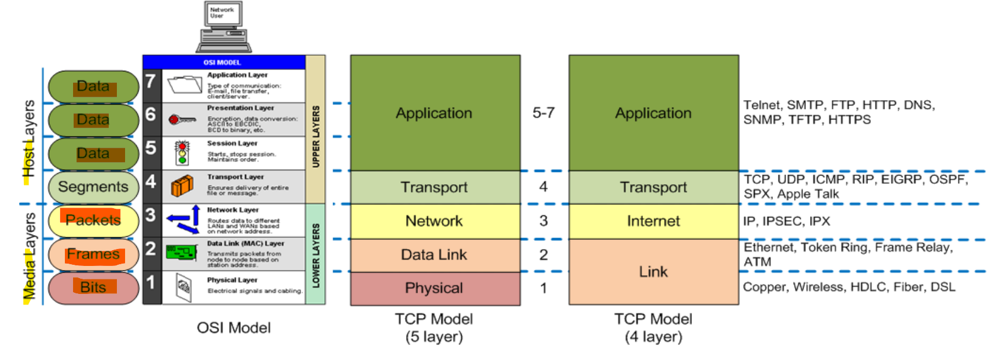

# Network - OSI Model

[Back](../index.md)

- [Network - OSI Model](#network---osi-model)
  - [OSI and TCP Models](#osi-and-tcp-models)
    - [L1 Physical](#l1-physical)
    - [L2 Data Link](#l2-data-link)
    - [L3 Network](#l3-network)
    - [L4 Transport](#l4-transport)
    - [L5 Session](#l5-session)
    - [L6 Presentation](#l6-presentation)
    - [L7 Application](#l7-application)
  - [Summary](#summary)

---

## OSI and TCP Models

- `OSI Model`

  - `Open System Interconnect Model`
  - Layered and abstract description for communications and network protocol design.
  - Each layer has its **own** set of **functions**.
  - Each layer **only communicate** with the layers **directly above or below**.

- `TCP Model`
  - `TCP/IP model` is based on standard protocols around which the Internet has developed.
  - It is a communication protocol, which **allows connection of hosts** over a network.
  - TCP/IP model is, in a way **implementation** of the `OSI model`.
  - In TCP/IP, services, **interfaces and protocols** are **not** clearly **separated**. It is also **protocol dependent**.

---

- Communication between 2 devices
  - Data is **passed** to the `application layer`.
  - Each layer is **encapsulated** into the layer below.
    - **Headers** and possibly **footers** are added as the encapsulation process takes place.
  - Until it is passed out as **1s and 0s** at the `Physical Layer`.

---

### L1 Physical

- **Defines specifications to access the physical** communication medium.
  - Transmission **mode**: `full duplex`, `half duplex`…
  - Transmission **encoding**: `Manchest`, `QAM`...
  - Network **topology** used: `mesh`, `bus`, `ring`...
- Example of the most common medium.
  - **Copper**
  - **Fiber** Optic
  - **Radio** Frequency

---

### L2 Data Link

- Use of `frames` and `physical addresses` (Ex: `MAC` address)
- **Purposes** of the data link layer

  - **Organize** the physical layer’s bits into **logical groups of information** (`Frames`).
  - Detect and correct **errors** that might happen on the `physical layer`.
  - Control **data flow**.
  - **Identifies devices** on the network.

- Example of the most common L2 protocols
  - IEEE 802.3 (Ethernet)
  - IEEE 802.11 (Wi-Fi).

---

### L3 Network

- **Translate** `logical address` into `physical machine address`

  - **Establish** logical connections to **other networks** to **send larger data sequences** (`datagrams`).
  - A large amount of data can be **fragmented** and sent via multiple **packets**.
  - Introduction of **routing**.

- Example of the most common L3 **protocols**
  - `Internet Protocol (IP)`,
  - `Routing protocols (RIP, OSPF, BGP)`,
  - `Internet Control Message Protocol (ICMP)`,
  - `Internet Protocol Security (IPsec)`.

---

### L4 Transport

- Use of `segments` and `ports`

  - Data is broken down into **packets** that are the **maximum size** that the network layer can handle.
  - Controls the reliability of a link using **flow control**, **sequencing** and **error control** (**Last** chance for error recovery).

- Example of most common L4 protocols
  - `Transmission Control Protocol (TCP)`
  - `User Datagram Protocol (UDP)`

---

### L5 Session

- `Session`

  - refers to a **connection for data exchange**

- Responsible for **establishing and maintaining communication** between 2 stations on a network.
- Control which station **talk** first.
- Play a key part in connection **recovery**.
- Helps the upper layers to **connect to the services available** on the network.

- Example of most common L5 protocols.
  - `Remote Procedure Call Protocol (RPC)`
  - `Session Control Protocol (SCP)`,
  - `SOCKS`,
  - `sockets`

---

### L6 Presentation

- Data gets **formatted** in a way that the **network can understand**
- Some data **encryption/decryption** is taking place (Ex: system password scrambling)

- Sometimes called the `syntax layer`

- Example of most common L6 protocols
  - `Secure Sockets Layer (SSL)`
  - `Multipurpose Internet Mail Extensions (MIME)`

---

### L7 Application

- Provides an **interface to the software** that need to use network services

  - Everything is application oriented
  - Quality of service
  - User **authentication** and privacy
  - Identify communication partners

- Example of the most common L7 protocols
  - `Hypertext Transfer Protocol (HTTP)`,
  - `Domain Name System (DNS)`,
  - `Dynamic Host Configuration Protocol (DHCP)`,
  - `Simple Mail Transfer Protocol (SMTP)`

---

- Example of a **routed** communication

1. Any information about the **media** (`Layer 1`) and the **MAC addresses** (`layer 2`) are striped out 删除
2. The router looks up the **destination IP address** in its table, and passes the datagram back to `Layer 2`
3. The router encapsulate **the L3** `datagram` into a **Layer 2** `frame` (adds the new MAC addresses) to send it back Layer 1 where and media information is added back the on the packed goes to the next router of computer

---

## Summary

- `OSI Model`
  - Connection between 2 systems
- Physical:
  - Medium
  - 1s and 0s
  - mode: full duplex, half duplex
- Data link:
  - `Frame`: logical groups of information
  - to Identifies devices: physical addresses(Mac)
- Network
  - `IP`: logical address
  - `Datagrams`: larger data sequences
  - fragmented data
  - `routing`
- Transport
  - `segments`, Packets, MTU
  - Ports
  - Control: flow, sequecing, error
- Session
  - sockets
- Presentation
  - formatted
  - encryption/decryption
- App
  - interface
  - User authentication

---

| L   | Protocols                                                                                                                                      |
| --- | ---------------------------------------------------------------------------------------------------------------------------------------------- |
| P   | -                                                                                                                                              |
| D   | IEEE 802.3 (Ethernet), IEEE 802.11 (Wi-Fi) , ARP                                                                                               |
| N   | Internet Protocol (IP), Internet Protocol Security (IPsec), Internet Control Message Protocol (ICMP), Routing protocols (RIP, OSPF, BGP)       |
| T   | Transmission Control Protocol (TCP), User Datagram Protocol (UDP)                                                                              |
| S   | Remote Procedure Call Protocol (RPC), Session Control Protocol (SCP), SOCKS, sockets                                                           |
| P   | Secure Sockets Layer (SSL), Multipurpose Internet Mail Extensions (MIME)                                                                       |
| A   | Hypertext Transfer Protocol (HTTP), Domain Name System (DNS), Dynamic Host Configuration Protocol (DHCP), Simple Mail Transfer Protocol (SMTP) |

---

- TCP/IP model
  - Connection between hosts
  - Pdnta
  - lita
