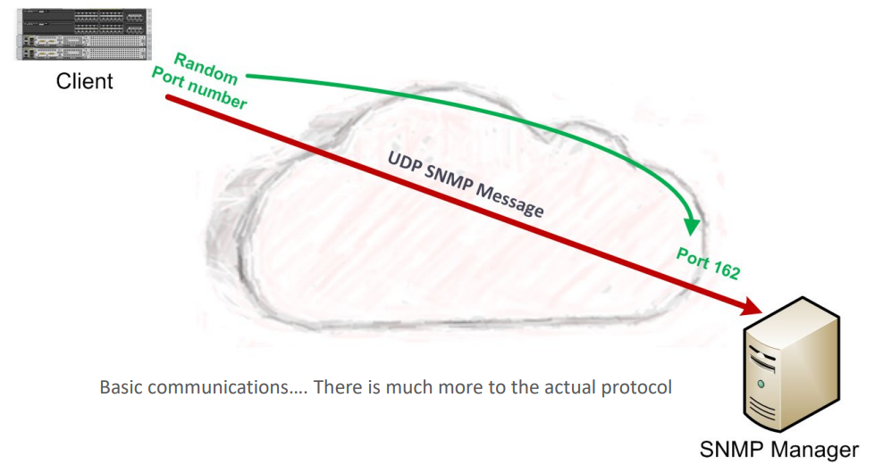
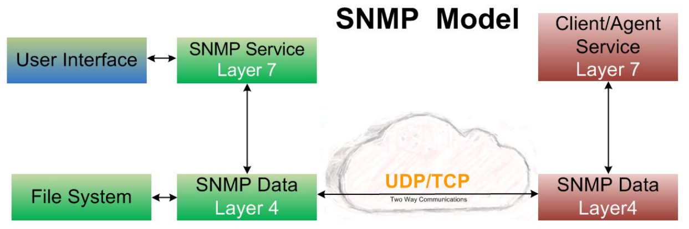
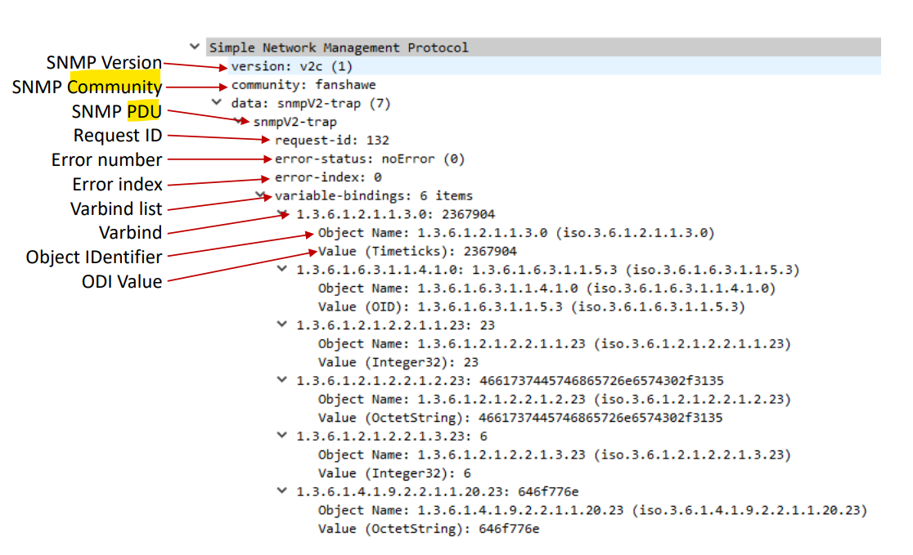

# Network - SNMP

[Back]

- [Network - SNMP](#network---snmp)
  - [snmp](#snmp)
  - [SNMP Model](#snmp-model)
  - [Communication Methods](#communication-methods)
  - [SNMP PDU Classes](#snmp-pdu-classes)
  - [Message](#message)
    - [`Syslog` vs `SNMP`](#syslog-vs-snmp)

---

## snmp

- `snmp(Simple Network Management Protocol)`
  - a standard protocol used in networking for **monitoring and managing devices** on IP networks.
  - It enables network administrators to collect information, configure devices, and receive alerts about various aspects of network performance and device status.
  - This permits the **consolidation** of logging data from different types of systems **in a central repository**

- Features:

  - Implementations of SNMP **exist for many operating systems**.

- `Syslog` vs `SNMP`

  - SNMP can **read & write** values on the client as well as **sent traps** to manager / `syslog server`

- Ports:

  - **Normally**:
    - a `UDP` protocol on port `161` (default)
    - Can be a `TCP` protocol on port `161/162`

- HIstory
  - `Simple Gateway Monitoring Protocol`
  - `SNMPv1`
  - `SNMPv2`
  - `SNMPv3`

---

## SNMP Model

- `Client/Agent`
  - usually part of the **OS**, but **can** be an **application** that is added on at a later time
  - **Generates** the messages
  - Types of devices
    - a Router, Switch, Server, Printer, Firewall, VOIP Phone, Time Clock, and many more
    - Problem… many types of Client/Agents, and many different Manufactures!!
- `Server/Service (Manager)`
  - **can** be part of the **OS**, but is usually a **application** added to a system
  - **Receives** and possibly **stores** the messages
  - Appplication:
    - `Net-SNMP`, `NetFlow`, `Nigios`, `HP OpenView`, `Zabbix`, `WhatUPGold`, and many more
    - Problem… many types of management software
- `User Interface`

  - For configuration / setup / changes

- `MIB(Management Information Base)`
  - A standardized structure for different devices
  - Installed on the Management side
  - uaed to handle how to communicate with the agent by the hierarchical **name space structure** of the agent containing `Object IDentifiers(OID)`
    - Each `OID` Identifies a **variable** that can be read and sometimes written to via SNMP

---

## Communication Methods

- 2 communication methods are available
- `Poll-Driven`
  - The one who wants the information ask for it
  - The `Network Management Station` would **poll** the `SNMP agents` for information
  - Using `UDP` port `161` (`SNMP`)
- `Interrupt-Driven`
  - A device decide to send an information that the other one need
  - A `SNMP agent` would **send** information to the `Network Management Station` without being asked
  - Using `UDP` port `162` (`SNMPTRAP`)
- Both can be (and are often) used **simultaneously**
- `Syslog` is only `interrupt-driven`, it waits for messages from the clients.

---

## SNMP PDU Classes

- `Read`
  - Messages that **read** management information from a managed device using a **polling mechanism**.
  - SNMPv1 PDU
    - `GetRequest-PDU`
    - `GetNextRequest-PDU`
  - SNMPv2/3 PDU
    - `GetRequest-PDU`
    - `GetNextRequest-PDU`
    - `GetBulkRequest-PDU`
- `Write`
  - Messages that **change** management information **on a managed device** to affect the device's operation.
  - SNMPv1 PDU
    - `SetRequest-PDU`
  - SNMPv2/3 PDU
    - `SetRequest-PDU`
- `Response`
  - Messages sent in **response to a previous request**.
  - SNMPv1 PDU
    - `GetResponse-PDU`
  - SNMPv2/3 PDU
    - `Response-PDU`
- `Notification`

  - Messages used by a device to **send an interrupt-like notification** to an SNMP manager.
  - SNMPv1 PDU
    - `Trap-PDU`
  - SNMPv2/3 PDU
    - `Trapv2-PDU`
    - `InformRequest-PDU`

- Because of the 1st class (`Read`) SNMP can **read variables** from the MIB hierarchical structure.
  - This allows SNMP to do something that `Syslog` **can't**, which is get statistical data from a device.
- Because of the 4th class (`Notification`) SNMP can be setup to trap messages and log them the **same way** `Syslog` functions.

---

## Message

- `protocol data unit (PDU)`

  - Each SNMP message contains a PDU.
  - These SNMP PDUs are used for communication between SNMP managers and SNMP agents.

- A signal SNMP Message will have
  - SNMP **version**
  - SNMP **Community String**(Octet String)
  - One or more SNMP `PDU(s)`
    - `Request` or `Response ID`
    - **Error** number
    - **Error** index number
    - **Varbind** List
      - One or more **Varbind(s)**
      - `VarBind(Variable Binding)`
        - a **key-value pair** that contains alert data in an SNMP trap that is sent to an SNMP manager.
        - Can have one or more `Object Identifier(s)` and `OID` values

---

### `Syslog` vs `SNMP`

- `Syslog`
  - **Simpler** to **setup**
  - **Logs** messages, alerts, errors, and notifications only
  - Can **analyze** the messages and **send** appropriate responses to administrators with some setup
- `SNMP`
  - Much more **time consuming to setup**
  - Can do the **same** as `Syslog` with some configuration
  - Can monitor much more than just errors and notifications
  - Because it can **query variables** from the client/agent it can get statistics from the agent
  - Allowing the building of complex databases of historical data which can do things like:
