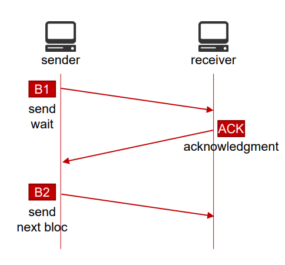
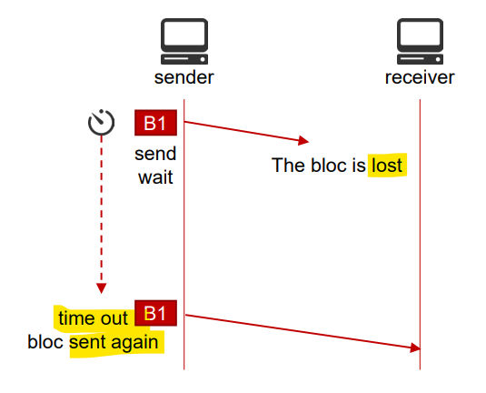
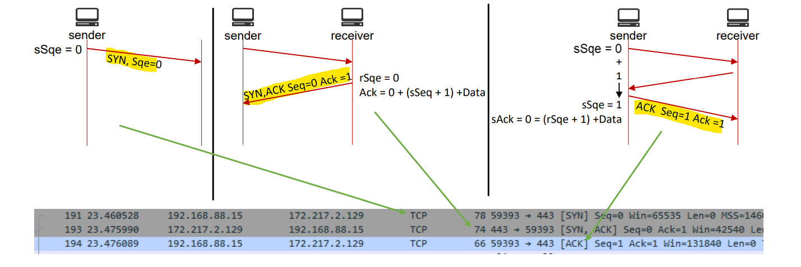
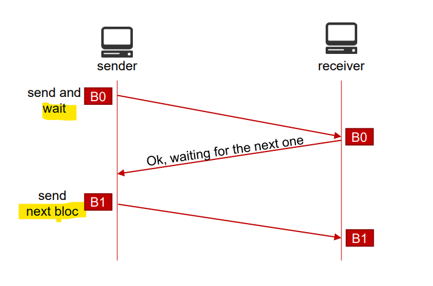
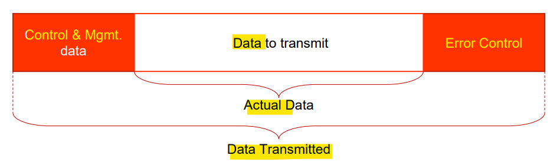
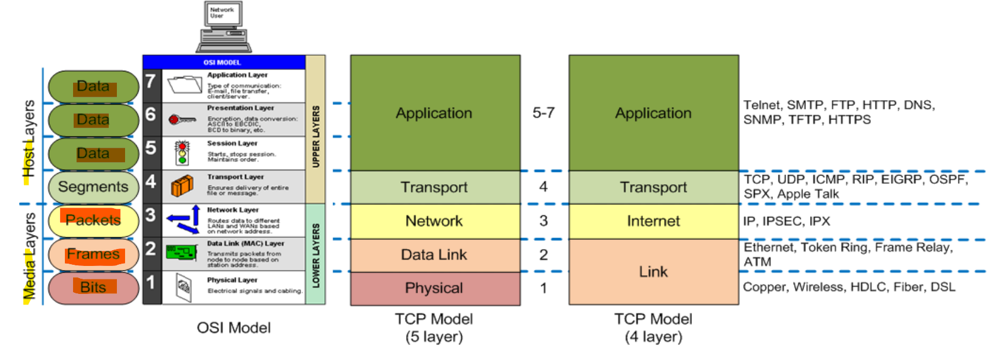
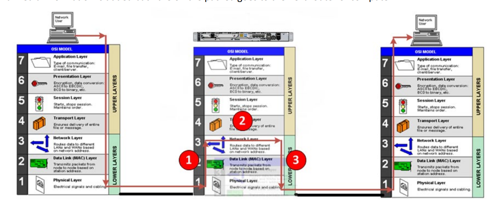

# Network Mgnt - WK01 Network protocols

[Back](../index.md)

- [Network Mgnt - WK01 Network protocols](#network-mgnt---wk01-network-protocols)
  - [Protocol](#protocol)
    - [Integrity Control](#integrity-control)
      - [Error Detection](#error-detection)
    - [Exchange Control](#exchange-control)
    - [Flow Control](#flow-control)
  - [Signaling](#signaling)
  - [Measure the efficiency of a protocol](#measure-the-efficiency-of-a-protocol)
  - [Standards](#standards)
    - [Network Protocols](#network-protocols)
    - [Organizations Defining Network Protocols](#organizations-defining-network-protocols)
  - [OSI and TCP Models](#osi-and-tcp-models)
    - [L1 Physical](#l1-physical)
    - [L2 Data Link](#l2-data-link)
    - [L3 Network](#l3-network)
    - [L4 Transport](#l4-transport)
    - [L5 Session](#l5-session)
    - [L6 Presentation](#l6-presentation)
    - [L7 Application](#l7-application)

---

- What is a protocol?
- Why do we use network protocols?
- Basic features of a network protocol
- Measure the efficiency of a network protocol
- Standards and organizations
- OSI and TCP Models
- Encapsulation

---

## Protocol

- `Protocol`

  - A set of **rules governing the exchange** or transmission of data between devices

- Roles of a protocol
  - While data is being exchanged over a network, the transfer protocol must:
    - Ensure that data **blocks** are being **delimited**;
    - Ensure the **integrity control** of the received data;
    - Ensure the **organization** and control of the exchange.
- We distinguish 2 main types of network protoc ols:
  - `Connection-oriented protocols`. (TCP)
  - `Connectionless protocols`. (UDP)

---

### Integrity Control

- Check if the data has not been **altered** during the transmission.

  - Data can be altered **by human**.
    - **Attacks** (man-in-the-middle,…)
  - Data can be altered by **physics**.
    - Electromagnetic **radiation**.
    - **Noise**
    - Bit **synchronization**.

- `Bit Error Rate (BER)`.
  - Ratio of **errors** bits to **total** bits received.
  - **High** BER = **lots** of interference on the transmission link

---

#### Error Detection

- Multiple **error detections techniques** exists:

  - **Repetition code**:
    - the data is **transmitted twice**, if both sequences don’t match on the receiver end, the sequence is retransmitted.
  - **Parity Check**:奇偶检验
    - a **parity (even or odd)** is set between the sender and receiver.
    - The number of **“1” is counted by the receiver** and compared to the parity set.
  - **Checksums**:校验和
    - the **sender** **calculate the checksum** (using algorithm) of the data and transmits the checksum along the data.
    - The **receiver** calculate the checksum from the data received and **compare it to the checksum** received from sender.
  - **Cyclic Redundancy Check (CRC):**

    - **Binary division** of the data sent and calculation of the **remainder** (or CRC).
    - The **remainder** is added to the data bits before transmission (Actual data + remainder = codewords).
    - codewords = Actual Data + CRC

---

- Error correction can be done in 2 ways.
  - `Backward Error Correction`
    - When the receiver detects an error, it requests a **retransmission**.
  - `Forward Error Correction`
    - When the receiver detects an error, it **executes error-correcting code** to try to recover some of the error.
    - Sparse Codes.
    - **Horizontal** and **vertical** parity check.
    - Hamming code.
    - Reed-Solomon Code.

---

### Exchange Control

- Use of `acknowledgment (ACK)`
- **Receiver** `ACKnowledgment` of the data and the **next** packet is sent.

- **No** `ACKnowledgment` of the data, there is a **time out** and a **re-transmission** of the data.

---

- Use of counters to avoid data duplication
  - `Seq` and, `Ack` **Numbers**.
  - Keep **track of the order** of the packets.
  - Uses the **amount** o data sent to help with the checking that correct data has been received

---

### Flow Control

- Adaptive 自适应 flow of data according to the **receiver capabilities**.
  - The sender doesn’t send more data than what the receiver can accept.

---

- The capacity of data sent can **dynamically be adjusted** using `windows`
  - The receiver **informs** the sender about **its receiving capabilities**
  - The sender **adjusts the amount** of data that it sends

---

## Signaling

- `Signaling`
  - Used to manage and **control a transmission**
    - `In-band signaling`
      - Using the **same** channel used to transfer the actual data
      - Signaling information are usually sent using **same sequence format**.
    - `Out-band signaling`
      - The signaling information is sent using **another** channel
        - 1 channel is used to send data
        - 1 channel is used for signaling

---

## Measure the efficiency of a protocol

- `Overhead`:
  - data transmitted that is **not actual** data.
  - The **less** overhead a protocol has, the **more** efficient it is

---

## Standards

- Why do we need standards
  - **Interoperability** 互操作性 between devices from **different vendors**.
  - Provide a **guidance** and **simplifies** product **development**.
  - Ensure that the protocol is **secured**.
  - Make it **easier to compare** products/devices.

---

### Network Protocols

- Most network protocols are defined by **formal standards**.
  - Developed by an **official standard organization** or **government** body.
    - Example: `Ethernet IEEE 802.3`, IP, TCP, HTTP, OSPF, RIP.
  - Can be used by **different vendors** as long as they respect the standards (Ensure interoperability).
- Some network protocols are **proprietary**.
  - Developed by **a specific vendor**.
    - Example: Cisco’s IGRP, and EIGRP, or IBM’s SNA, SAA.
  - Can **only** be used by this specific vendor’s products.

---

- Life Cycle
  - **Draft**
    - The protocol is **submitted** to a group of engineer **for validation**.
  - **Standard**
    - The protocol has been **approved** and is **published** as a standard.
  - **Amendment**
    - Some features are **added** to the standard.

---

### Organizations Defining Network Protocols

- `Internet Engineering Task Force (IETF)`

  - Open community of engineers working on the evolution of Internet.
  - Issues Request For Comments (RFC) to publish standards related to the a protocol.

- `Institute of Electrical and Electronics Engineers (IEEE)`
  - Professional society developing standards.
  - Known for its standards for LANs.

---

## OSI and TCP Models

- `OSI Model`

  - `Open System Interconnect Model`
  - Layered and abstract description for communications and network protocol design.
  - Each layer has its **own** set of **functions**.
  - Each layer **only communicate** with the layers **directly above or below**.

- `TCP Model`
  - `TCP/IP model` is based on standard protocols around which the Internet has developed.
  - It is a communication protocol, which **allows connection of hosts** over a network.
  - TCP/IP model is, in a way **implementation** of the `OSI model`.
  - In TCP/IP, services, **interfaces and protocols** are **not** clearly **separated**. It is also **protocol dependent**.

---

- Communication between 2 devices
  - Data is **passed** to the `application layer`.
  - Each layer is **encapsulated** into the layer below.
    - **Headers** and possibly **footers** are added as the encapsulation process takes place.
  - Until it is passed out as **1s and 0s** at the `Physical Layer`.

---

### L1 Physical

- **Defines specifications to access the physical** communication medium.
  - Transmission **mode**: `full duplex`, `half duplex`…
  - Transmission **encoding**: `Manchest`, `QAM`...
  - Network **topology** used: `mesh`, `bus`, `ring`...
- Example of the most common medium.
  - **Copper**
  - **Fiber** Optic
  - **Radio** Frequency

---

### L2 Data Link

- Use of `frames` and `physical addresses` (Ex: `MAC` address)
- **Purposes** of the data link layer

  - **Organize** the physical layer’s bits into **logical groups of information** (`Frames`).
  - Detect and correct **errors** that might happen on the `physical layer`.
  - Control **data flow**.
  - **Identifies devices** on the network.

- Example of the most common L2 protocols
  - IEEE 802.3 (Ethernet)
  - IEEE 802.11 (Wi-Fi).

---

### L3 Network

- **Translate** `logical address` into `physical machine address`

  - **Establish** logical connections to **other networks** to **send larger data sequences** (`datagrams`).
  - A large amount of data can be **fragmented** and sent via multiple **packets**.
  - Introduction of **routing**.

- Example of the most common L3 **protocols**
  - `Internet Protocol (IP)`,
  - `Routing protocols (RIP, OSPF, BGP)`,
  - `Internet Control Message Protocol (ICMP)`,
  - `Internet Protocol Security (IPsec)`.

---

### L4 Transport

- Use of `segments` and `ports`

  - Data is broken down into **packets** that are the **maximum size** that the network layer can handle.
  - Controls the reliability of a link using **flow control**, **sequencing** and **error control** (**Last** chance for error recovery).

- Example of most common L4 protocols
  - `Transmission Control Protocol (TCP)`
  - `User Datagram Protocol (UDP)`

---

### L5 Session

- `Session`

  - refers to a **connection for data exchange**

- Responsible for **establishing and maintaining communication** between 2 stations on a network.
- Control which station **talk** first.
- Play a key part in connection **recovery**.
- Helps the upper layers to **connect to the services available** on the network.

- Example of most common L5 protocols.
  - `Remote Procedure Call Protocol (RPC)`
  - `Session Control Protocol (SCP)`,
  - `SOCKS`,
  - `sockets`

---

### L6 Presentation

- Data gets **formatted** in a way that the **network can understand**
- Some data **encryption/decryption** is taking place (Ex: system password scrambling)

- Sometimes called the `syntax layer`

- Example of most common L6 protocols
  - `Secure Sockets Layer (SSL)`
  - `Multipurpose Internet Mail Extensions (MIME)`

---

### L7 Application

- Provides an **interface to the software** that need to use network services

  - Everything is application oriented
  - Quality of service
  - User **authentication** and privacy
  - Identify communication partners

- Example of the most common L7 protocols
  - `Hypertext Transfer Protocol (HTTP)`,
  - `Domain Name System (DNS)`,
  - `Dynamic Host Configuration Protocol (DHCP)`,
  - `Simple Mail Transfer Protocol (SMTP)`

---

- Example of a **routed** communication

1. Any information about the **media** (`Layer 1`) and the **MAC addresses** (`layer 2`) are striped out 删除
2. The router looks up the **destination IP address** in its table, and passes the datagram back to `Layer 2`
3. The router encapsulate **the L3** `datagram` into a **Layer 2** `frame` (adds the new MAC addresses) to send it back Layer 1 where and media information is added back the on the packed goes to the next router of computer

---

[TOP](#network-mgnt---wk01-network-protocols)
