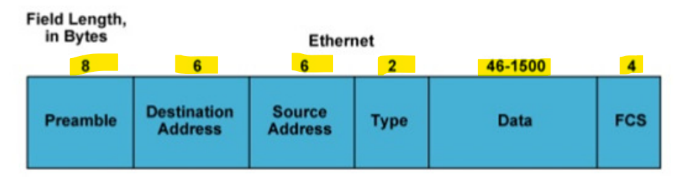
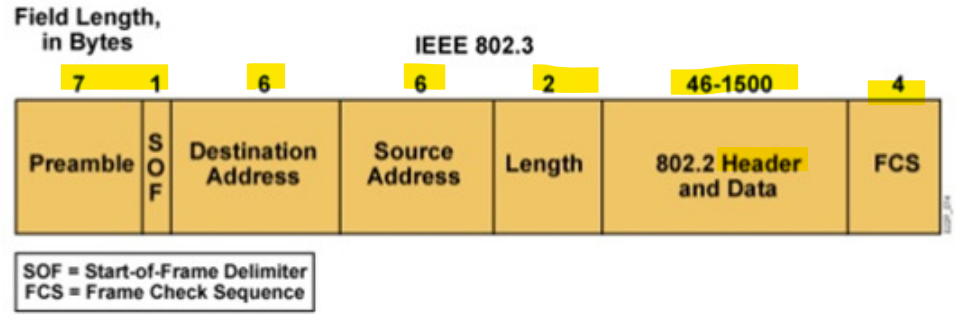
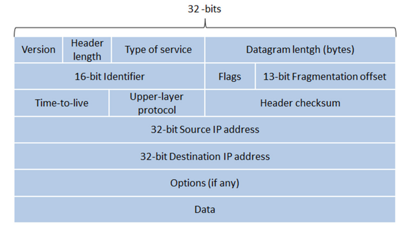
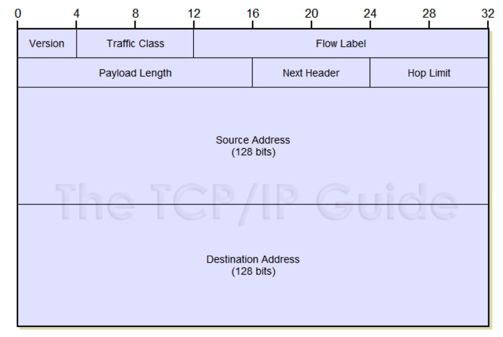
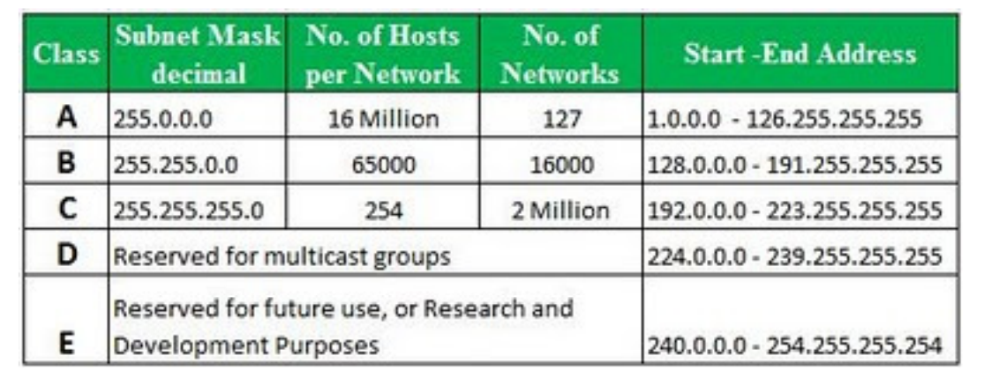
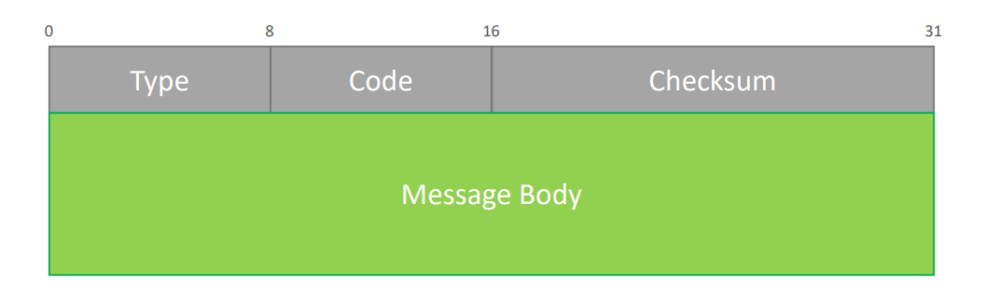
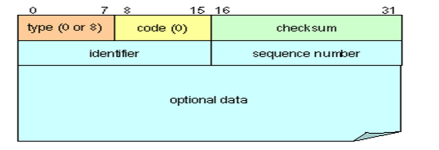

# Network Mgnt - WK02 Common protocol

[Back](../index.md)

- [Network Mgnt - WK02 Common protocol](#network-mgnt---wk02-common-protocol)
  - [Protocol](#protocol)
  - [Layer 2 most common protocols](#layer-2-most-common-protocols)
    - [IEEE 802.3 (Ethernet)](#ieee-8023-ethernet)
      - [Access Method](#access-method)
    - [Ethernet frame](#ethernet-frame)
  - [IEEE 802.11 (Wi-Fi)](#ieee-80211-wi-fi)
    - [Access Method](#access-method-1)
      - [OSI model](#osi-model)
    - [Type of Frames](#type-of-frames)
  - [Layer 3](#layer-3)
    - [Internet Protocol (IP)](#internet-protocol-ip)
      - [IPv4 Datagram](#ipv4-datagram)
      - [IPv6 Datagram](#ipv6-datagram)
      - [IP Services](#ip-services)
      - [Address](#address)
      - [IPv4 Address (4 billion addresses)](#ipv4-address-4-billion-addresses)
      - [IPv6 Address](#ipv6-address)
    - [Routing Protocols](#routing-protocols)
      - [Routing](#routing)
      - [Routing Protocols](#routing-protocols-1)
        - [Interior Gateway Protocol](#interior-gateway-protocol)
        - [Routing Information Protocol (RIP)](#routing-information-protocol-rip)
      - [IGP - Open Shortest Path First (OSPF)](#igp---open-shortest-path-first-ospf)
      - [IGP - Enhanced / Interior Gateway Routing Protocol (IGRP/EIGRP)](#igp---enhanced--interior-gateway-routing-protocol-igrpeigrp)
  - [Border Gateway protocol](#border-gateway-protocol)
  - [Internet Control Message Protocol](#internet-control-message-protocol)
    - [Message Format](#message-format)
    - [Echo Request/Reply Message - 8/0](#echo-requestreply-message---80)
      - [Destination Unreachable Message - 6](#destination-unreachable-message---6)
      - [Time Exceeded Message - 11](#time-exceeded-message---11)

---

## Protocol

- Layer 2 most common protocols

  - IEEE 802.3 (Ethernet)
    - Ethernet - Access Method
    - CSMA/CD
    - Ethernet frame
  - IEEE 802.11 (Wi-Fi)
    - History
    - Access Method
    - OSI Model

- Layer 3 most common protocols
  - Internet Protocol (IP)
    - Datagram
    - IP Services
    - Address
  - Routing
  - Routing Protocols
    - Interior Gateway Protocol
    - Exterior Gateway Protocol
  - IETF Internet Message Control Protocol (ICMP)
    - History
    - Message Format
    - ICMP used

---

## Layer 2 most common protocols

### IEEE 802.3 (Ethernet)

#### Access Method

- `Carrier Sense Multiple Access / Collision Detection (CSMA/CD)`

  - Collision: two or more stations **transmitting at the same time** on the medium
  - `CSMA/CD` prevents and control collision when they occur

- Method of **collision detection** has been put in place
  - Tell the other stations to **hold off** transmission until the problem is sorted
  - If a collision is detected, a **jamming signal** is sent to all stations connected to the medium so they won't send data for a random amount of time

---

### Ethernet frame

- There are several **types** of `Ethernet frames` but the most commonly used are the:

- Ethernet Type II

- IEEE 802.3

---

- Frame structure
- **Preamble**前言
  - 7 bytes sequence of 10101010
  - Used by the received to establish **bit synchronization**
- **Start Frame Delimiter (SFD)**
  - 1 byte sequence of 10101011
  - Flag indicating the **start** of a frame
- **MAC Addresses**
  - 6 bytes
  - Unique address per Network **Interface Card**
  - Frames are received by **all adapters**
  - are **dropped** if **destination** address does **not** match
- **Type (Ethernet Type II)**
  - Indicates the **upper layer protocol** used in the payload (Ex: "0x0800" for IP)
- **Length (IEEE 802.3)**

  - Indicates the **number of bytes** of data carried in the Pavload / Data

- **Data / Payload**
  - Minimum of **`64` bytes** and maximum of **1500** bytes
  - If data is < 64 bytes, padding is added
- **Frame Control Sequence**
  - Uses a CRC-32 polynomial code
  - If **error** is detected, the frame is **dropped**

---

## IEEE 802.11 (Wi-Fi)

### Access Method

- **Radio Frequency** is the **medium** used for `802.11` communications

- `Half Duplex` communications

  - **Only 1** station **can transmit** at a time
  - No way to know if another station is about to transmit
  - No way to know if a collision occurred

- `Carrier Sense Multiple Access / Collision Detection (CSMA/CD)`
  - Avoid collision making sure that the **medium is free before transmitting**
  - 3 methods are used before accessing the medium
    - **Network Allocation Vector**
    - and **Back-off timer**
    - **Clear Channel Assessment**

---

#### OSI model

- Layer 1 PPDU Frame

  - `PPDU`
    - `PLCP Protocol Data Unit`
    - Layer 1 frame
    - Composed of a **Preamble**, a **header** and a **PSDU** (payload)

- Layer 2 MPDU
  - `MPDU`
    - `MAC Protocol Data Unit`
    - Layer 2 frame
    - Composed of a **header**, a **MSDU (payload)** and a **Frame Check Sequence**

---

### Type of Frames

- **Management Frames (Type = 0)**

  - Used to **manage** the Wi-Fi network (**Connections**, **disconnections**, **broadcast** ...)
  - Management MPDU does **not** carry any MSDU
  - Management frames are **not encrypted**

- **Control Frames (Type = 1)**
  - Used to **control** the **medium access** and data **transmission**
  - Control frames do not have any payload and are not encrypted
- **Data Frames (Type = 2)**
  - Used to **carry data**
  - Can have a **encrypted** MSDU (payload)

---

## Layer 3

### Internet Protocol (IP)

- `IP`

  - a layer 3 protocol
  - IP contains **addressing information** and some control information that enables packets to be **routed**

- IP has 2 main **responsibilities**
  - Providing **connectionless**, best-effort delivery of `datagrams` through an internetwork **without acknowledgment**
  - Providing **fragmentation and reassembly** of `datagrams` to support data links with different maximum transmission unit (MTU) sizes

---

#### IPv4 Datagram

- **Version**:
  - IP version used (0100)
- **Type of service:**
  - how an **upper layer protocol** would like the current datagram to be handle
- **Datagram length**:
  - total length of the datagram (**header + payload**)
- **16-bit Identifier**:
  - **Identify the current** datagram
- **Flags**:
  - used to **control fragmentation**
- **Fragmentation offset**:
  - indicates the position of a fragment related to the beginning of the data
- **Time-to-live**:
  - counter to **avoid looping**
- **Protocol**:
  - indicates which **upper layer** protocol is used
- **Options**:
  - allows IP to support options such as **security**
- **Source IP address**:
  - **32-bit** address
- **Destination IP address**:
  - **32-bit** address
- **Data**:
  - payload and data received from upper-layer protocol

---

#### IPv6 Datagram

- **Version**:
  - IP version used (0110)
- **Fixed length**:
  - 40 bytes Minimized and simple approach
- **Traffic Class**:
  - used for QoS
- **Flow Label**:
  - identify a **group of datagram**
- **Payload Length**:
  - Only **size** of the payload
- **Next Header**:
  - Identify the type of following data (other IP header or L4 protocol)
- **Hop Limit**:
  - Same as the **Time to live** field in IPv4
- **Source IP address**:
  - **128-bit** address
- **Destination IP address**:
  - **128-bit** address
- **Data**:
  - **payload** and data received from upper-layer protoc

---

#### IP Services

- IP Supports 3 Services
  - `Unicast`:one to one
  - `Multicast`: one to many & many to many
  - `Broadcast`: one to many (**IPv4** only)
  - `Anycast`: one to the closet one (**IPv6** only)

---

#### Address

- Networks with in the class can be **broken down** in to `subnets`, or **built up** into `supernets`.
  - Two appropriate 24bit subnet can be put together to make a 23bit supernet, where as a 24bit network can be broken down to, up to 64, 30bit networks

#### IPv4 Address (4 billion addresses)

- **Public** IPv4 Address
  - IP address that are routable on the **internet**
  - IP address you **get from the ISP**
    **Private** IPv4 Address
  - Addresses used in a `Local Area Network (LAN)`
  - **Not routable** on the internet
    - 10.0.0.0 - 10.255.255.255 (10/8 prefix) - Class A
    - 172.16.0.0 - 172.31.255.255 (172.16/12 prefix) - Class B
    - 192.168.0.0 - 192.168.255.255 (192.168/16 prefix) - Class C

---

#### IPv6 Address

---

### Routing Protocols

#### Routing

- `Routing` is the process of **finding a path to transfer** an IP `datagram` from the source to the destination
- Routing is done **by routers** which uses **routing tables** to route the traffic
- Routers always route according to the **destination IP address** located in the `IP datagram`

---

#### Routing Protocols

- `Routing protocols` learn about available routes, **build routing tables** and help taking routing decision
- Routing protocols are used to help to **dynamically update routing information** among multiple routers

- 2 main types of routing protocols

  - **Interior Gateway Protocols**
    - `Interior Gateway Routing Protocols (IGRP)`
    - `Routing Information Protocol (RIP & RIP2)`
    - `Open Shortest path First (OSPF)`
    - `Enhanced Interior Gateway Routing Protocols (EIGRP)`
  - **Exterior Gateway Protocols**
    - `Border Gateway Protocol (BGP)`
    - `Multiprotocol Extensions for BGP (MBGP)`

- `Autonomous Systems`
  - a collection of **networks** under a **common administration**
    - IGP: Intra-AS routing protocol
    - EGP: Inter-AS routing protocol

---

##### Interior Gateway Protocol

- There are multiple types of IGP
- **Distance-vector routing protocol**

  - Use of Bellman-Ford algorithm to calculate the shortest path
  - Each routers populates its **routing table** until the network **converge to stable values**
  - Example:
    - `Routing Information Protocol (RIP)`,
    - `Interior Gateway Routing Protocol(IGRP)`

- **Link-state routing protocol**

  - Each router posses information about the **entire** network topology
  - Each router **independently calculate the best** next hop
  - Information about the links are **shared** among the routers
  - Example:
    - `Open Shortest Path First (OSPF)`,
    - `Intermediate system to intermediate system (IS-IS)`

- **Hybrid routing protocol**
  - **Both** features of a distance-vector and link-state routing protocols
  - Examples:
    - `Enhanced Interior Gateway Routing Protocol (EIGRP)`

---

##### Routing Information Protocol (RIP)

- RIP uses **distance vectors (DV)** to identify the **best path** to a given destination address
- `Routing tables` gets **updated and shared** dynamically when the topology changes
  - `RIPv2` defined in RFC 2453 is used for IPv4 networks
  - `RIP-NG` defined in RFC 2080 is used for IPv6 networks

---

#### IGP - Open Shortest Path First (OSPF)

- `OSPF` is a **link-state** protocol - Link-state information is **shared** among the routers of a **same area**
- The SPF algorithm is used to calculate the shortest path to each node
- OSPF versions
  - `OSPF v2` defined in RFC 2328 is used for IPv4 networks
  - `OSPF v3` defined in RFC 5340 is used for IPv6 networks
- Routers are organized in **different Areas**

- Once router is **initialized**, it uses OSPF **Hello packet** to acquire neighbors- Neighbor routers send an **Hello packet back**; Hello packets also act as keep alive
- Following the **Hello process**, a **designated router** is elected
- SPF places each routers at a top of a tree and calculate the shortest path to each destination based on the link costs
- **Link State Advertisements (LSA)** are exchanged between routers to share topology updates

---

#### IGP - Enhanced / Interior Gateway Routing Protocol (IGRP/EIGRP)

- Until recently a Cisco proprietary protocol
- Fast at maintaining routing tables (when changes are made) but not as chatty as RIP. - It sends routing updates only **when network topology changes** instead of its entire routing table at regular intervals.
- Maintains multiple tables like OSPF
  - Neighbor Tables
  - Topology Tables
  - Routing Tables
- Has multiple parameters for finding the best route such as:
  - Speed
  - Reliability
  - Hop count
  - Metric
- It supports `classless interdomain routing (CIDR)` and `variable-length subnet masks (VLSM)`
- It is **less CPU** intensive.
- It supports IPX and AppleTalk. OSPF supports only IP.
- EIGRP supports unequal-cost load balancing.
- OSPF propagates network changes to all routers in an area. EIGRP has much better convergence time than OSPF/ISIS

---

## Border Gateway protocol

略 p30

---

## Internet Control Message Protocol

- The `Internet Control Message Protocol (ICMP)` was created at the **same time** as the `Internet Protocol (IP)`
- Why was ICMP created?
  - Since `IP` uses a **connectionless**, **unreliable** and **unacknowledged** method to deliver datagram, a protocol was needed to assist in case of problems
- What is the main responsibility of ICMP
  - Provides support to IP in the form of ICMP message allowing different type of **communication to occur between IP devices**
- ICMP is a **layer 3** protocol encapsulated in IP datagrams

---

### Message Format

- ICMP **header** is `32 bits` long (`4 bytes`)
- ICMP message is encapsulated into a IP datagram

- Each ICMP message has a **Type**
  - Defined in the **header** by a `8-bit` field
  - A separate set of type values is maintained for each ICMPv4 and ICMPv6
- Each ICMP message has a **Code**
  - Identifies the "**subtype**" of message within each IMCP message Type value
  - General **purpose** of each kind of ICMP message

---

### Echo Request/Reply Message - 8/0

- **Type**

  - Echo **request** type is `8`
  - Echo **reply** type is `0`

- **Code**

  - Is always set to **0**

- **Identifier**

  - Set in the request and echoed back in the reply to be able to keep different set of requests and replies together

- **Sequence Number**

  - Sequence number for each host. Start at 1 and gets incremented by 1 for each packet

- **Data**
  - The data fields is generally **empty**

---

#### Destination Unreachable Message - 6

- Type is always `6`
- There are 16 different codes used (from 0 to 15). Some examples bellow:
  - Code 0: Network unreachable
  - Code 1: Host unreachable
  - Code 2: Protocol unreachable
  - Code 3: Port unreachable
  - Code 4: Fragmentation needed and DF set
  - Code 5: Source route failed
  - Code 6: Destination network unknown
  - Code 7: Destination host unknown
- **Data**
  - Contains the **full IP header** and 64bits of the **original IP data datagram**

---

#### Time Exceeded Message - 11

- If the `TTL` of an IP packet reaches **0**, it must be **discarded** and an Time Exceeded ICMP message is sent back to the source
- Time Exceeded Message details
  - Type is always **11**
  - There is 2 code available
    - Code 0: TTL = 0 during transit
    - Code 1: TTL = 0 during reassembly
- Data
  - Contains the **full IP header** and 64bits of the **original IP data datagram**

---

- When is ICMP used?

- The ICMP protocol is usually used to **troubleshoot IP network connectivity**

- Applications that uses ICMP
  - `Ping`
    - Uses the "Echo request" and "Echo reply" ICMP messages
  - `Traceroute`
    - Uses the "Echo request", "ICMP Time Exceeded" and "Echo reply" ICMP messages
    - Use for `Denial of Service`
  - **Ping of death or PoD**
    - Sending millions of **oversized echo** request to a host causing it to crash
  - **Smurf attack**
    - Send a lot of ICMP echo requests to the **broadcast address** and all stations will answer with ICMP echo request bringing the station down Used for Network Scan Find out if ports are opened or closed without scanning ports
  - **Man-in-the-middle attack**
  - **ICMP Redirect**
    - Send messages to various gateway to **redirect** traffic

---

[TOP](#network-mgnt---wk02-common-protocol)
