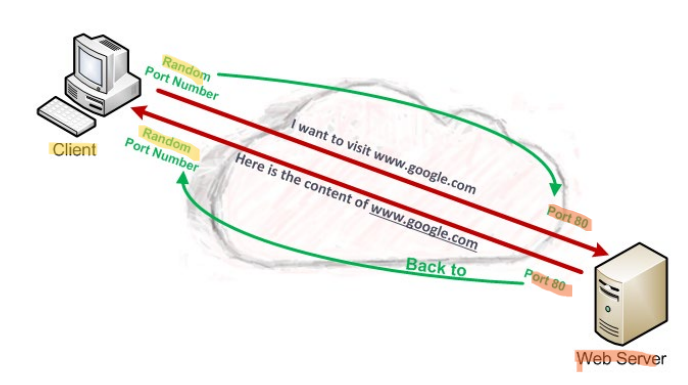
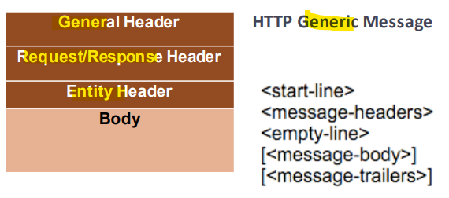
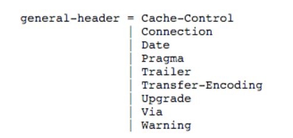
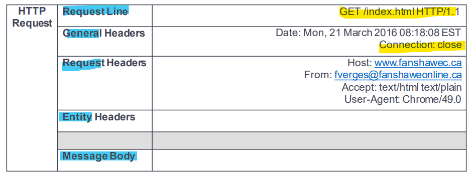
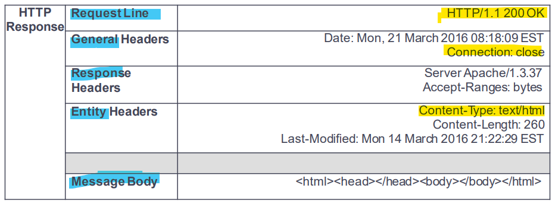
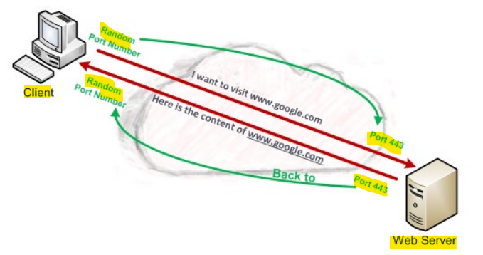
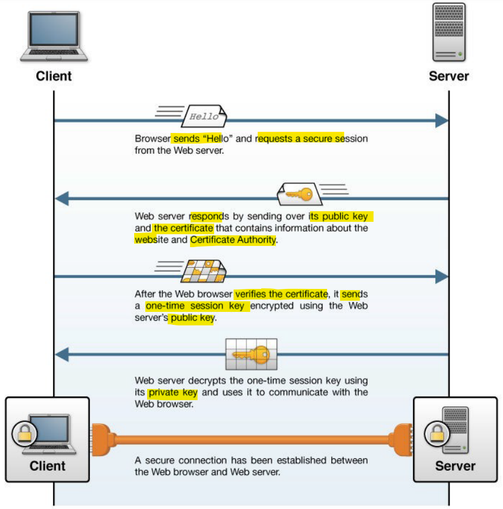

# Network Mgnt - WK08 HTTP/HTTPS

[Back](../index.md)

- [Network Mgnt - WK08 HTTP/HTTPS](#network-mgnt---wk08-httphttps)
  - [HTTP Overview](#http-overview)
    - [Operations](#operations)
    - [HTTP vs. HTML](#http-vs-html)
    - [Message Type](#message-type)
      - [General Message Format](#general-message-format)
      - [General Header](#general-header)
      - [Request Header](#request-header)
      - [Response Header](#response-header)
      - [– Entity](#-entity)
    - [Request Message](#request-message)
    - [Response Message](#response-message)
    - [Methods](#methods)
    - [Status](#status)
    - [Wireshark](#wireshark)
  - [HTTPS - Overview](#https---overview)
    - [HTTP Vs HTTPS](#http-vs-https)
    - [Operations](#operations-1)
    - [Transport Layer Security](#transport-layer-security)
      - [Handshake](#handshake)
      - [Initiation](#initiation)
      - [Closure](#closure)
    - [Wireshark](#wireshark-1)

---

## HTTP Overview

- **Web Browsers** use the `Application Layer(Layer 7)` the protocol is used for transferring various forms of data between a server and clients (plaintext, images, video, and sound)
- `HTTP` operates **over** `TCP` on port `80` as a **default**, (this **port number** **can be changed** in the server configuration file).

---

### Operations

- Server / Client architecture
  - **Client program**: usually a web browser (Chrome, Fierfox, IE, Opera, Safari, ect…)
  - **Server program**: web server (Apache, IIS, NGINX, LightTPD, Cherokee, ect…)
- The client **establish a TCP connection** to the server on **port 80** (The server is listening on port 80)
  - Once the **TCP connection is established**, the client and the server **start exchanging** HTTP messages through their **socket interfaces**
- The connection will remain in tact until the **web page is exited** or the **session times out** in the `session layer(Layer 5)`.
  - If there is a time out, as soon a there is a change or a new request, the connection is **reestablished automatically**.

---

### HTTP vs. HTML

- `HTTP`
  - the **protocol** used to carry data between a **web server** and the **web client**
  - the means of **transporting the `HTML` content** from server to client
- `HTML`
  - the **language** used to built web pages
  - part of the data
- If you open **Wireshark** and look at an `HTTP packet`, you will see the `HTML code` (language) in the data part of the datagram.

---

### Message Type

- 2 main types of messages
  - `HTTP Request` **from the client** to the server
  - `HTTP Response` **from the server** to the client
- An HTTP message is composed of **both** the **request** and the **response**

#### General Message Format

- The `HTTP header` is divided into 3 parts
  - **General** Header
  - **Request/Response** Header
  - **Entity** Header
- The `HTTP Body` **follows** the header (optional)
  - This may contain a **file** being transferred between the server and a client (called `entity`)
- HTTP is using a **text-based format** instead of a binary format

---

#### General Header

- Fields used for **both** `request` an `response`
- Carry **information about the message itself** (not the content)
- Provide **general information** and **control** how the message is **processed** and handled
- Do not apply to the entity being transferred

---

#### Request Header

- **Only** used in HTTP **request messages**
- Allow a **client** to **provide information about itself** to the server
- Provide more **details about a request** and **control** how it is **carried out**
- There are **19** different types/fields that can be used in a Request Header

---

#### Response Header

- **Only** used in HTTP **request messages**
- **Status line** at the beginning of each response header
- Response header provide more information about this status line
- There are **9** response headers defined in `HTTPv1.1`
  - Accept-Ranges
  - Age
  - ETag
  - Location
  - Proxy-Authenticate
  - Retry-After
  - Server
  - Vary
  - WWW-Authenticate

---

#### – Entity

- **Request** and **Response** messages MAY transfer an entity if not otherwise **restricted** by the `request method` or `response status code`
- An entity consists of `entity-header fields` and an `entity-body`, although some responses will only include the `entity-headers`
- There are **11** fields in an Entity header
  - Allow
  - Content-**Encoding**
  - Content-**Language**
  - Content-**Length**
  - Content-**Location**
  - Content-**MD5**
  - Content-**Range**
  - Content-**Type**
  - Expires
  - Last-Modified
  - extension-header

---

### Request Message

- format of a HTTP Request Message

---

### Response Message

- the format of a HTTP Response Message

---

### Methods

- Allow the client to specify a particular **type of action** to be **taken by the server**
- Method names are **always in upper case letters**
- The most important methods are:
  - `GET`: **retrieve** source for a specific URL
  - `HEAD`: **same as GET** but **only the headers are sent**
  - `POST`: allow the client to **send arbitrary information to the server**
  - `PUT`: allow a client to **send a file** to the server (should be used with caution)

---

### Status

- Communicate quickly if the request was successful or not
- The `status code` is **present at the beginning** of every HTTP response message

| Status Code | Meaning       |
| ----------- | ------------- | --------------------------------------------------------------------------------------------------------------- |
| `1xx`       | Informational | Provides **general** information; does **not indicate success or failure** of a request.                        |
| `2xx`       | Success       | The method was received, understood and **accepted by the server**.                                             |
| `3xx`       | Redirection   | The request did not fail outright, but **additional action** is needed before it can be successfully completed. |
| `4xx`       | Client        | Error The request was invalid, contained bad syntax or could not be completed for some other reason             |
| `5xx`       | Server Error  | The request was **valid** but the **server was unable to complete** it due to a problem of its own              |

---

### Wireshark

- You will see **TCP 3 step-handshake before the first HTTP message** (TCP connection protocol)
- The **details** of the HTTP message are displayed **in plain text**

---

## HTTPS - Overview

- **Web Browsers** use the `Application Layer (Layer 7)` the protocol is used for **transferring various forms of data** between a server and clients (plaintext, images, video and sounds).
- Information is **encrypted** at `Layer 7` using `TLS(Transport Layer Security)`
- `HTTPS` operates **over** `TCP` on `port 443` as a **default**, (this port number **can be changed in the server configuration file**)

---

### HTTP Vs HTTPS

- HTTPS Packet
  - Encapsulation ofHTTP into TLS

---

### Operations

- The **HTTP message** is **encrypted** at the **`application layer` before being sent**
- HTTPS uses `TCP` port `443` (by **default**) as opposed to `80` for `HTTP`
- HTTPS URLS **begins with** `https://` as opposed to `http://`
- HTTPS messages are based on HTTP message and **have the same structure**
  - The **only difference** is that the HTTP message is **encrypted before being sent** over the network

---

### Transport Layer Security

- `TLS` provides
  - **Authentication**
    - Who am I talking to?
  - **Integrity**
    - Is this really what I said?
  - **Confidentiality**
    - Nobody else can see what’s said
- TLS uses a **handshake to establish secure connection**
  - **Cipher suite negotiation**
  - **Authentication** of the server (using a `certificate`)
  - **Exchange** of `session key` information (`symmetric encryption`) 使用对称加密来交换 session key

---

#### Handshake

- 1. Browser **sends** "Hello" and **requests** a `secure session` from the Web server.
- 2. Web server responds by **sending** over its `public key` and the `certificate` that contains information about the **website** and `Certificate Authority`.
- 3. After the Web browser **verifies** the `certificate`, it sends a `one-time session key` **encrypted** using the Web server's `public key`.
- 4. Web server **decrypts** the `one-time session key` using its `private key` and uses it to **communicate** with the Web browser.
- 5. A **secure connection has been established** between the Web browser and Web server.

- **Cipher Suite Negotiation**
  - The client and the server **exchange information** so they **know what cipher suite they will be using**
- **Authentication**
  - The server provides its **identity** to the client using a `certificate`
- **Key exchange**
  - The client and the server **exchange random numbers** and then a **special number** called the `Pre-Master Secret`.
  - These data is used to **create the pre-shared key** called the `Master Secret`
  - The `Master Secret` is used to **generate** the `MAC Secret` which is the `session key` used for hashing and the `write key`, which is the **session key** used for encryption

---

#### Initiation

- `HTTP client` should also act as the `TLS client`
  - Send the TLS `Client Hello` to **begin** the TLS **handshake**
  - When the TLS **handshake has finished**. The client may then **initiate the first** `HTTP request`.
- All **HTTP data** MUST be sent as `TLS "application data”`
- **Normal HTTP behavior**, including retained connections should be **followed**

---

#### Closure

- When a valid `closure alert` is **received**, **no** further data will be **received** on that connection
- **Exchange** of `closure alert`s **before** closing a connection
- TLS may **close** the connection **without waiting for the peer** to send its `closure alert`
- In this case, the `TLS` connection **can be reused**

---

### Wireshark

- HTTP message are **not displayed**
  - because **encrypted**, but now say `“Application Data”`
- The TCP **3 step handshake** (the red box)
- The TLS 1.2 connection being establishment is displayed (the green box)
