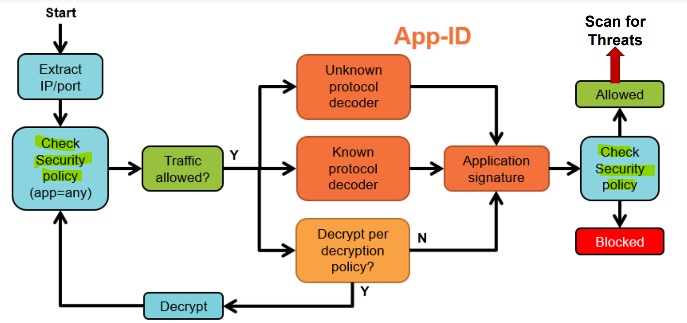
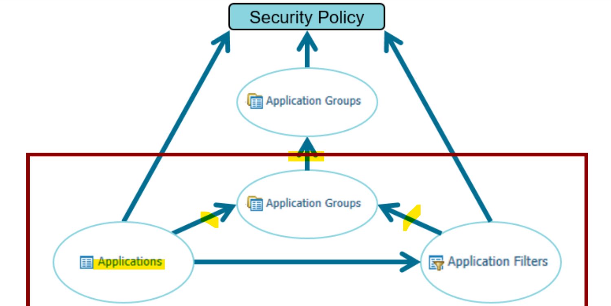

# Edge - Wk03

[Back](../index.md)

- [Edge - Wk03](#edge---wk03)
  - [Using App-ID in a Security Policy](#using-app-id-in-a-security-policy)
    - [Application identification (App-ID)](#application-identification-app-id)
    - [Application Shifts/Changes During a Session](#application-shiftschanges-during-a-session)
      - [Dependent Applications](#dependent-applications)
      - [Implicit Applications](#implicit-applications)
    - [Application Filters](#application-filters)
    - [Application Groups](#application-groups)
    - [Applications and Security Policy Rules](#applications-and-security-policy-rules)
    - [Identifying Unknown Application Traffic](#identifying-unknown-application-traffic)
    - [Policy Optimizer](#policy-optimizer)
      - [Migrating from port-based to Application-Based Policies](#migrating-from-port-based-to-application-based-policies)
    - [Ways to update App-ID](#ways-to-update-app-id)
  - [Security Policies](#security-policies)
    - [Sessions and Flows](#sessions-and-flows)
    - [Three Types of Rules](#three-types-of-rules)
    - [Implicit and Explicit Rules](#implicit-and-explicit-rules)
    - [Rule Match](#rule-match)
    - [Policy Rule Hit Count](#policy-rule-hit-count)
    - [Scheduling Security Policy Rules](#scheduling-security-policy-rules)
    - [Policy Ruleset](#policy-ruleset)
  - [Network Address Translation (NAT) Policies](#network-address-translation-nat-policies)
    - [`Source NAT`](#source-nat)
    - [`Destination NAT`](#destination-nat)

---

- Flow Logic of the NGFW

---

## Using App-ID in a Security Policy

### Application identification (App-ID)

- “Application”

- `App-ID`

  - Accurate **traffic classification** is the primary function of any firewall, with the result becoming the basis of the `Security Policy`
  - Multiple techniques to **label traffic by application** rather than just port and protocol

- `Port-Based` Versus `Next-Generation Firewalls`

  - Port-Based: allow DNS and port 53
  - NGFW: allow DNS but not port 53

- UDP & TCP

  - address + port + application data
  - `App data` is required to identify traffic to be processed by `Security Policy`

- PA: ways to Identify App ID

  - DB: app **signation**
  - Known decoder:
    - A set of application decoders that understand the **syntax and commands of common applications**.
  - Unkown decoder: An app-ID **heuristics engine** used to look at **patterns** of communication.
    - It attempts to identify and application **based on its network behaviour**.
  - decryption procotol: **SSL** and **SSH** decryption capabilities

- App -ID Operation
  

---

### Application Shifts/Changes During a Session

#### Dependent Applications

- Important to **know and identify dependencies**
- require to add security policy rule.
- e.g.: office-on-demand dependent on 365base and sharepoint
- configuration: "denpends on"

#### Implicit Applications

- Many common applications implicitly **allow parent applications**.
- **No explicit Security policy rule is required** for a parent application.
- Implicit permissions for a parent application are processed **only** if you have **not added an explicit** security policy rule for the parent application.
- configuration: "Implicitly users"

---

### Application Filters

- `application filter`

  - an **object** that dynamically **groups applications** based on application **attributes** that you select from the `App-ID database`.

- The selectable attributes are category, subcategory, technology, risk, and characteristic.
- `App filters` are an alternative to specifically **identifying each application**.

  - Rather, you **allow/deny** based on **attributes** common to those applications.
  - Ex. Category could be “Business Systems” and subcategory “Office Programs”.
    - Allow any traffic that falls within this filter as it is related to office software.

- Dynamic grouping of applications
- Created by selecting filters in the App-ID database
- Used to simplify Security, QoS, and PBF policy rulebases

---

### Application Groups

- `Application Groups`

  - used to Facilitates and expedites creation and management of the policy rules

- Nesting Application Groups and Filters

---

### Applications and Security Policy Rules

- `Application filters` and `groups` are added to the `Security policy` rules just as **single applications** are.

  - They can be used to either allow or deny applications.

- Application Block Page
  - For blocked web-based applications, a response page can be displayed in the user’s browser.

---

### Identifying Unknown Application Traffic

- Unknown Network Traffic

  - Firewalls identify traffic by **port** or **application**.
  - Let’s look at application.

- Iterative process: 如何设置

  - Create rules to allow or block **applications known** to be traversing the firewall
  - Create a **temporary rule** to detect **unidentified** applications traversing the firewall
  - As applications are identified, create **specific** rules to allow or block them

- What to do with “Unknown” Traffic?

  - create a custome app with custom signature 添加 App
  - create application overrride policy: Overrides App-ID and Security policies 添加覆盖
  - block

---

### Policy Optimizer

- **Migrate** port-based rules **to App-ID-based rules**
- Help **reduce** attack surface and provide information about application usage
- **Prevent** evasive applications from running on **non-standard ports**
- Identify **over-provisioned** application-based rules

---

#### Migrating from port-based to Application-Based Policies

- 3 Phases

  - 1. Identify and “clone” the existing port-based rule
  - 2. add app-based rule above port based rules
    - Ensure that traffic matches the application based rule before it can match the legacy port based rule
  - 3. remove port based
    - Review the Traffic logs and Security policies to determine if traffic is continuing to match any legacy port-based rule.
    - If no legitimate traffic has matched a legacy rule, then that legacy rule can be removed

- Phase 1:

  - Viewing Data of Port-Based Rules.`No app Specified`
  - Discovering **Applications** Matching a Port-Based Rule

- Phase 2:

  - Prioritizing Port-Based Rules to Convert
  - A **gradual** conversion is safer than migration of a large rule-base at one time

- Phase 3:
  - **Reviewing** Port-Based Rules
    - After **60 days**, review the Policy Optimizer columns in the Security policy.
    - Look for port-based rules with zero hits.
  - **Disabling** Port-Based Rules
    - Disable port-based rules that have not matched to any new traffic.
    - Disabled rules are rendered in gray italic font.
    - Tag rules that must be removed later (optional).
  - **Removing** Port-Based Rules
  - After **90 day**s, delete port-based rules that have not matched to any new traffic.
    - At least 80% application-based rules
    - No inbound or outbound **unknown** applications (internal is acceptable)

---

### Ways to update App-ID

- Dynamic Content Updates: App-ID
- **Scheduled** App-ID **Updates**
- Content Update Absorption
  - **Review** Apps for list of modified applications and details for each application
  - **Review** Policies to see policy rules that may enforce traffic differently

---

## Security Policies

- Security Policy Fundamentals: Controlling Network Traffic

### Sessions and Flows

- Traffic passing through the firewall is matched **against a session** and each session is then **matched against a `Security policy` rule**.

### Three Types of Rules

- Three Types of Rules
  - intrazone (within a zone)
  - interzone (between a zone)
  - universal (both a zone)
    - universal rule applies to all matching `interzone` and `intrazone` traffic in the specified source and destination zones

---

### Implicit and Explicit Rules

- Implicitly
  - **no** logged
  - default:
    - allows **intrazone** (within)
    - deny **interzone** (between)
- Explicit rule
  - control all other traffic
  - **logged**

---

### Rule Match

- From top to bottom
- further rules not eveluted after a rule match
- 2 个可以 combine

---

### Policy Rule Hit Count

- Identify rules that are **frequently** or seldom used
- Determine the **first** time and **last** time a rule was used
- View number of **applications** seen by a rule
- Can be used to **verify config changes**

### Scheduling Security Policy Rules

- Policy rules may be enforced on only specific days and time periods.
- Use 24-hour time format
- Can specify:
  - Daily
  - Days of week
  - Calendar days

---

### Policy Ruleset

- Add, Delete, Clone, Override, Revert, Enable, Disable, Move options
- Rules can be **re-ordered** to match requirements (use Move or drag-and-drop).
- **Disablement** of a rule allows you to retain the entry while making it non-operative.

---

- `Universally Unique Identifiers (UUIDs)`

  - Creates a unique identifier for every Security policy rule
  - Provides a complete history of a Security policy rule, **even if the rule name is changed**
  - Must add column to display UUIDs

- Finding **Unused** Security Policy Rules

  - Remove unused rules to:
    - Increase firewall operational efficiency
    - Simplify rule management
  - Firewall tracks rules unused **since last time the data plane restarted**.

- `Address Objects`

  - Represents one or **more** **IP addresses**
  - Used in policy rule **source and destination address** fields

- Tags

  - Use tags to visually **search** or use tag **filters** to find objects.
  - Rules and objects can have **multiple** tags.

- Tag-Based Rule Groups

  - Visually **groups** rules based on **tagging** structure
  - Can perform operational **procedures** within the selected tag group
  - Before you can assign a group tag to a rule, you **must first create the tag** and assign it to the Security policy rule.

- Creating a New `Service Definition`

  - `Service definition`s are **assigned ports**.
  - Services **limit ports that applications can use.**
  - `service-http` and `service-https` are the only **predefined** services.
  - You can confine an application type to a specific port, BUT the **default port** is `“any”`.

- Using Global Find

  - In general, you can search only content that the firewall writes to the candidate configuration.
  - Can search for
    - an **IP** address
    - an **object** name
    - a policy **rule** name
    - a **threat** ID
    - an **application** name
  - Global Find will not search dynamic content such as **logs**, address **ranges**, or allocated **DHCP** addresses.
  - Does **not** search for individual **username** or **group** names

- Enabling Intrazone and Interzone Logging

  - To configure logging on the **implicit rules**, select a rule and click **Override**.

- Rule Changes Archive

  - Often done to meet regulatory compliance requirements

- “Test Security Policy Match

  - Enables you to **enter a set of test criteria** directly from the web interface rather than from the CLI.

- Traffic Log
  - Each Security policy rule can log the start and/or end of each session.
  - **Default** is to **log session end**.
  - Temporarily add **session start** for **troubleshooting**

---

## Network Address Translation (NAT) Policies

- NAT configuration can take two forms: SNAT and DNAT

### `Source NAT`

- `Source NAT`

  - commonly is used for **private (internal) users** to access the **public** internet (outbound traffic). 内向外, 用户对公
  - translates the **private** address and makes the traffic **routable** across the **internet**.
  - translates an **original** source IP address to an **alternate** source IP address.

- Source NAT Types

  - **Static IP**:
    - 1-to-1 **fixed** translations
    - **Changes** the source IP **address** while leaving the source **port unchanged**
    - Supports the implicit `bidirectional` rule feature

- **Dynamic IP:**
  - 1-to-1 translations of a source IP address only (no port number)
  - Private source address translates to the **next available address** in the range
- **Dynamic IP and port (DIPP):**
  -Allows multiple clients to use the **same public IP** addresses with **different** source **port** numbers.
  - The assigned address can be set to the interface address or to a translated address.
  - an available address in the specified range can be used multiple times because each time the address is **paired with a different** `port` number.

---

### `Destination NAT`

- `Destination NAT`

  - often is used to provide hosts on the **public (external) network** access to **private (internal) servers**. 外向内, 公对服务器
  - DMZ 属于外部, 使用 DNAT

- Attributes

  - Static IP:

    - 1-to-1 **fixed** translations
    - Changes the destination IP address while leaving the destination **port unchanged**
    - Also enabled by Static Source NAT with the `Bi-directional` option set

  - Dynamic IP Address:
    - Translates original IP address to destination host with a **DHCP-assigned IP address**
    - Translated address can be an **FQDN**, address **object**, or address **group**.

---

[TOP](#edge---wk03)
