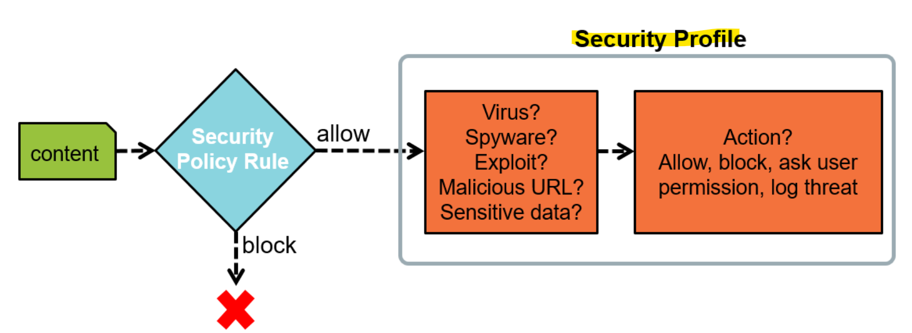
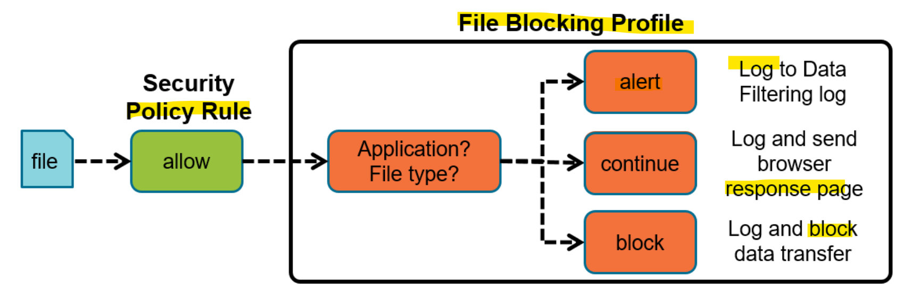
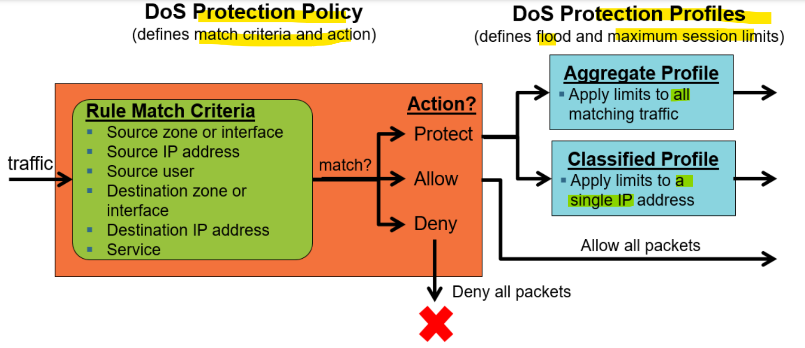
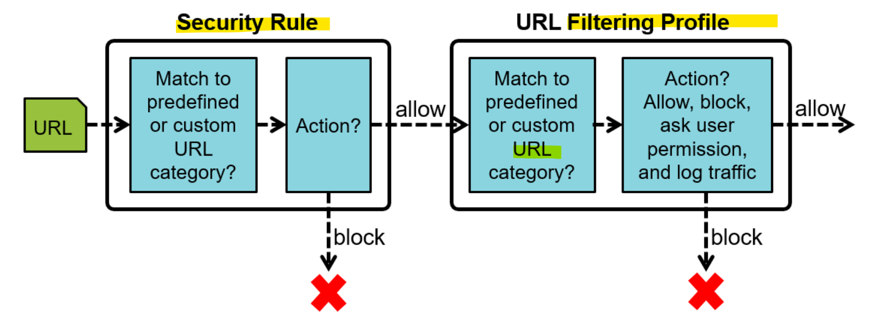
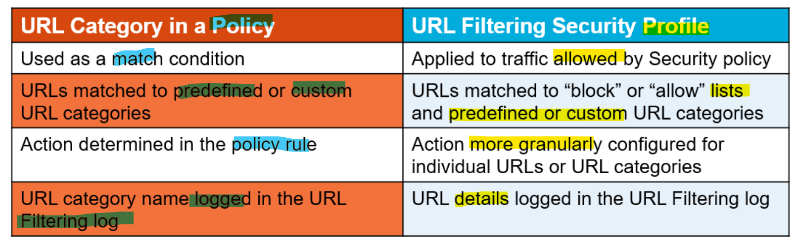

# Edge - Wk04`

[Back](../index.md)

- [Edge - Wk04\`](#edge---wk04)
  - [Content-ID](#content-id)
  - [Security Profiles](#security-profiles)
    - [Vulnerability Protection Profile](#vulnerability-protection-profile)
    - [Antivirus Security Profile](#antivirus-security-profile)
    - [File Blocking Profile](#file-blocking-profile)
    - [Data Filtering Profile](#data-filtering-profile)
    - [Security Profile Groups](#security-profile-groups)
    - [Telemetry and Threat Intelligence](#telemetry-and-threat-intelligence)
  - [Denial-of-Service Protection](#denial-of-service-protection)
    - [Zone Protection](#zone-protection)
      - [Flood Protection](#flood-protection)
      - [Reconnaissance Protection](#reconnaissance-protection)
      - [Packet-Based Attack Protection](#packet-based-attack-protection)
      - [Protocol Protection](#protocol-protection)
    - [DoS Protection Profiles and Policies](#dos-protection-profiles-and-policies)
  - [URL Filtering Profiles](#url-filtering-profiles)
    - [URL Category: Policy Versus Profile](#url-category-policy-versus-profile)
    - [URL Filtering Security Profile](#url-filtering-security-profile)
    - [Handling Unknown URLs](#handling-unknown-urls)
    - [Handling Not-Resolved URLs](#handling-not-resolved-urls)
    - [Downloading the URL Seed Database](#downloading-the-url-seed-database)

---

- Flow Logic of the NGFW

---

## Content-ID

- Threat prevention engine and policies to **inspect and control content** traversing the firewall
- Scans network traffic for:
  - Software **vulnerability** exploits
  - **Viruses**
  - **Spyware**
  - Malicious **URLs**
  - **Restricted** files and data

---

## Security Profiles

- `Security Profiles`
  - implement **additional security checks** on allowed traffic

- Security Profile Types:
  - Anti**virus**
  - Anti-**Spyware**
  - **Vulnerability** Protection
  - **WildFire** Analysis
  - **URL** Filtering
  - **File** Blocking
  - **Data** Filtering
  - Security Profile **Group**

---

- Threat Log log events:
  - Anti**virus**,
  - and Anti-**spyware**.
  - **Vulnerability** Protection,

---

### Vulnerability Protection Profile

- Default: strict
- add
- exception

### Antivirus Security Profile

- default
- To create **customized** profile actions:
  - **Clone** the default read-only profile and edit the clone, or
  - **Add** a brand new profile
- Configuring Anti-Spyware Profile Rules
- Exceptions

  - DNS Signatures

- Sinkhole Operation

---

### File Blocking Profile

- Prevent introduction of **malicious** data
- Prevent exfiltration of **sensitive** data
- **Logs** to Data Filtering log

- Data Filtering Log
  - Data Filtering log records **name** and **file type** of blocked files
  - **Source** is the system that sent the file.
  - **Destination** is the system that received the file

---

- add
  - A **“continue”** action **requires user permission** to complete the file transfer.
  - Operates only when paired with the application web-browsing

---

- Blocking Multi-level Encoded Files
  - max of 4 leveles decodes.

---

### Data Filtering Profile

- Data Pattern
- add

---

### Security Profile Groups

- Assigning Security Profiles to `Security Rules`

  - Assign individual Security Profiles to a Security policy rule, or
  - Assign a **Security Profile Group** to a Security policy rule

- Add
  - Add Security Profiles that are commonly used together
  - Security Profile Groups simplify Security policy rule administration

---

### Telemetry and Threat Intelligence

- Opt-in feature; nothing selected by default
- Globally enhances threat protection
- Can preview data sent to Palo Alto Networks
- `Global WildFire Cloud`

---

## Denial-of-Service Protection

- Packet-based (**not signature-based**) and **not linked to Security policy**
- Two-pronged approach :
  - `Zone Protection Profile` protects **ingress zone**
  - `DoS` policy plus DoS Profile protects **destination zone** or **specific hosts**

---

### Zone Protection

- Add
- Enabling Zone Protection
  - Profiles applied one per zone

#### Flood Protection

- Protects against most **common** flood attacks
- Alarm Rate:
  - Threshold to trigger **log** events
- Activate:
  - Threshold to activate **mitigation response**
- Maximum:
  - Threshold after which all further packets dropped

#### Reconnaissance Protection

- Alerts or protects against **port scans and host sweeps**

#### Packet-Based Attack Protection

- Blocks packets based on **protocol options** or packet **malformation**

#### Protocol Protection

- Applies only to **Layer 2** and **Virtual Wire zones**:
  - Firewall normally allows **non-IP traffic** in these zone types.
  - Block non-IP traffic using **Ethertype codes**

---

### DoS Protection Profiles and Policies

- DoS Protection Policy

  - Match:
    - Source **zone** or **interface**
    - Source **IP** address
    - Source **user**
    - Destination **zone** or **interface**
    - Destination **IP** address
    - **Service**

- DoS Protection Profile

  - help mitigate **Layer 3 and 4** protocol-based attacks

---

## URL Filtering Profiles

- URL Filtering Profiles
  - implement **additional** security checks on allowed traffic.

---

### URL Category: Policy Versus Profile

- URL Filtering Log
  - Attachment of a URL Filtering Profile to a Security rule generates log entries:
    - "**alert**,” **“block**,” **“continue**,” and **“override”** actions trigger log entries.

### URL Filtering Security Profile

- To create customized profiles:

  - **Clone** the default read-only profile and edit the clone, or
  - **Add** a brand new profile

- Multi-Category and Risk-Based
  - PAN-DB URL Filtering **cloud** assigns websites to multiple categories.
  - Categories indicate how **risky** the site is, the website’s content, and the website’s purpose or function.
  - The security-related risk categories demonstrate levels of suspicious activity.
- Websites that have been registered for **fewer than 32 days** are considered **newregistered-domains**.

- Per-URL Category Actions

  - URL matching order:
    - 1. **Block** list\*
    - 2. **Allow** list\*
    - 3. **Custom** URL categories\*
    - 4. **External** Dynamic Lists\*
    - 5. PAN-DB firewall **cache**
    - 6. **Downloaded** PAN-DB file
    - 7. PAN-DB **cloud**

- Custom URL Category

  - Define URL categories enforcement separate from category defaults
  - Create URL filtering based on **URL** or **category**
  - Replaces URL filtering **overrides**

- URL Admin Settings

  - Configure a URL Admin Override **password** that a user must enter to access a URL configured with an **“override”** action.

- HTTP Header Insertion and Modification
  - Enable access to only enterprise versions of **SaaS** applications
  - Inserts header if missing or overwrites existing header
  - **Four** predefined SaaS applications:
    - Dropbox
    - Google
    - Office 365
    - YouTube

---

### Handling Unknown URLs

- Category column in URL Filtering log lists **unknown**.

- Recommendation: Set **unknown URL category action** to support your security requirements

- use DB

---

### Handling Not-Resolved URLs

- Category column in URL Filtering log lists **not-resolved.**
- Recommendation:
  - Set not-resolved URL category **match action** to **“alert”**

---

### Downloading the URL Seed Database

- Download an initial seed database to use the URL Filtering feature

---

[TOP](#edge---wk04)
