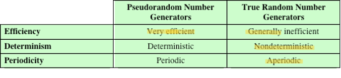

# Securing Network - WK04

[Back](../index.md)

- [Securing Network - WK04](#securing-network---wk04)
  - [Block Cipher Operation](#block-cipher-operation)
    - [3DES with two keys](#3des-with-two-keys)
    - [three-key 3DES](#three-key-3des)
    - [Modes of Operation](#modes-of-operation)
  - [Electronic CodeBook (ECB)](#electronic-codebook-ecb)
    - [cipher block chaining (CBC )](#cipher-block-chaining-cbc-)
      - [cipher feedback (CFB) mode](#cipher-feedback-cfb-mode)
      - [output feedback (OFB) mode,](#output-feedback-ofb-mode)
      - [counter (CTR) mode](#counter-ctr-mode)
      - [XTS-AES Mode for Block-Oriented Storage Devices](#xts-aes-mode-for-block-oriented-storage-devices)
    - [Format-Preserving Encryption (FPE)](#format-preserving-encryption-fpe)
      - [Motivation](#motivation)
      - [Difficulties in designing](#difficulties-in-designing)
      - [Feistel structure](#feistel-structure)
  - [Random Bit Generation](#random-bit-generation)
    - [Random Numbers](#random-numbers)
    - [Pseudorandom Numbers](#pseudorandom-numbers)
    - [True Random Number Generator (TRNG)](#true-random-number-generator-trng)
    - [Pseudorandom Number Generator (PRNG)](#pseudorandom-number-generator-prng)
      - [Randomness](#randomness)
      - [Unpredictability](#unpredictability)
      - [Seed Requirements](#seed-requirements)
    - [Pseudorandom number generators](#pseudorandom-number-generators)
    - [block cipher](#block-cipher)
      - [PRNG Using Block Cipher Modes of Operation](#prng-using-block-cipher-modes-of-operation)
      - [ANSI X9.17 PRNG](#ansi-x917-prng)
      - [NIST CTR\_DRBG](#nist-ctr_drbg)
    - [Stream Cipher Design Considerations](#stream-cipher-design-considerations)
    - [RC4](#rc4)
    - [TRNGs](#trngs)
      - [Entropy Sources](#entropy-sources)
      - [PRNGs vs TRNGs](#prngs-vs-trngs)
      - [Conditioning](#conditioning)
    - [Health Tests on the Noise Source](#health-tests-on-the-noise-source)
      - [Intel Digital Random Number Generator](#intel-digital-random-number-generator)
  - [Summary](#summary)
  - [Summary](#summary-1)

---

## Block Cipher Operation

- stronger encryption schemes to replace DES:

  - completely new algorithm, e.g.: AES
  - **multiple** encryption with DES and **multiple** keys.

---

- the use of **double DES** results in a **mapping** that is not equivalent to a single DES encryption.
- `meet-in-the-middle attack`
  - a way to attack this scheme, one that does **not** depend on any particular **property** of DES but that will work against **any block encryption cipher**.

---

### 3DES with two keys

- An obvious counter to the `meet-in-the-middle attack` is to use **three stages** of encryption with **three different keys**.

  - This raises the cost of the meet-in-the-middle attack to 2^112 , which is beyond what is practical now and far into the future.
  - However, it has the **drawback** of requiring a **key length** of 56 \* 3 = `168 bits`, which may be somewhat unwieldy.

- An alternative: a **triple encryption** method that uses **only two keys**
  - `3DES with two keys` is a relatively popular **alternative to DES** and has been adopted for use in the key management standards ANSI X9.17 and ISO 8732.1

---

### three-key 3DES

- Three-key 3DES has an effective key length of `168 bits`

---

### Modes of Operation

- A technique for **enhancing** the effect of a cryptographic **algorithm** or adapting the algorithm for an application
- To apply a block cipher in a variety of applications, **five modes** of operation have been defined by NIST
- The five modes are intended to cover a wide variety of applications of encryption for which a block cipher could be used
- These modes are intended for use with any symmetric block cipher, including triple DES and AES

---

## Electronic CodeBook (ECB)

- `Electronic CodeBook  (ECB)`

  - plaintext is handled **one block at a time** and each block of plaintext is encrypted using the **same key**
    - there is a **unique ciphertext** for every b -bit block of plaintext.

- The ECB method is ideal for a **short amount of data**, such as an encryption key.

  - Thus, if you want to **transmit** a DES or AES **key** securely, `ECB` is the **appropriate mode** to use.

- The most significant **characteristic** of ECB is that if the same b -bit block of plaintext **appears more than once** in the message, it always produces the **same ciphertext**.

- For **lengthy messages**, the `ECB` mode may **not be secure**.
  - If the message is **highly structured**, it may be possible for a cryptanalyst to **exploit** these regularities.
  - If the message has **repetitive elements** with a period of repetition a **multiple of b bits**, then these elements can be **identified** by the analyst.

---

- Criteria and properties for evaluating and constructing block cipher modes of operation that are superior to ECB:
  - Overhead
  - Error recovery
  - Error propagation
  - Diffusion
  - Security

---

### cipher block chaining (CBC )

- `cipher block chaining (CBC)` mode
  - the **same** plaintext block, if repeated, produces **different** ciphertext blocks
  - **repeating** patterns of b bits are **not exposed**
  - XORed
- appropriate for encrypting messages of length **greater** than b bits.
- CBC mode can be used for **authentication**

---

#### cipher feedback (CFB) mode

- For AES, DES, or any block cipher, encryption is performed on a **block of b bits**

  - In the case of DES b = `64`
  - In the case of AES b = `128`

- convert a block cipher into a stream cipher:
- a character-oriented stream cipher.

---

#### output feedback (OFB) mode,

- convert a block cipher into a stream cipher:
- a character-oriented stream cipher.
- advantage:
  - bit **errors** in transmission do **not** propagate.
- disadvantage:
  - **more vulnerable** to a message stream modification attack than is `CFB`.

---

#### counter (CTR) mode

- convert a block cipher into a stream cipher:
- a character-oriented stream cipher.
- advantages
  - Hardware **efficiency**
  - Software **efficiency**
  - **Preprocessing**
  - **Random** access
  - **Provable** security
  - **Simplicity**

---

#### XTS-AES Mode for Block-Oriented Storage Devices

- Mode is also an `IEEE Standard`, IEEE Std 1619-2007
- Standard describes a method of encryption for data stored in **sector-based devices** where the threat model includes possible access to stored data by the adversary

- `XTS-AES mode` is based on the concept of a **tweakable block cipher**

---

- Storage Encryption Requirements

- The requirements for encrypting stored data, also referred to as **“data at rest”**, **differ** somewhat from those for **transmitted data**
- The P1619 standard was designed to have the following **characteristics**:
  - The **ciphertext** is freely **available** for an attacker
  - The data **layout is not changed** on the storage medium and in transit
  - Data are accessed in **fixed sized** blocks, **independently** from each other
  - **Encryption** is performed in `16-byte` blocks, **independently** from each other
  - There are **no other metadata** used, except the location of the data blocks within the whole data set
  - The same plaintext is encrypted to **different ciphertexts** at **different locations**, but always to the same ciphertext when written to the same location again
  - A standard conformant device can be constructed for decryption of data encrypted by another standard conformant device

---

### Format-Preserving Encryption (FPE)

- `Format-Preserving Encryption (FPE)`
  - any encryption technique that takes a **plaintext in a given format** and produces a ciphertext in the **same format**.

---

#### Motivation

- facilitates the retrofitting of encryption technology to **legacy** applications
- benefit:
  - enables protection of particular data elements in a **legacy database** that did not provide encryption of those data elements,

---

#### Difficulties in designing

- A general-purpose standardized FPE should meet a number of requirements:
  - The ciphertext is of the **same length** and **format** as the plaintext
  - It should be **adaptable** to work with a variety of **character** and number **types**
  - It should work with **variable plaintext length**
  - Security strength should be **comparable** to that achieved with **AES**
  - Security should be **strong** even for very **small** plaintext lengths

---

#### Feistel structure

- The NIST algorithms, and the other FPE algorithms that have
  been proposed, are used with plaintext consisting of a **string of elements**, called `characters`.
  - Specifically, a **finite set** of two or more symbols is called an `alphabet` , and the **elements** of an alphabet are called `characters` .
  - A `character string` is a finite sequence of characters from an alphabet.
  - Individual characters may **repeat** in the string.
  - The **number of different characters** in an alphabet is called the `base` , also referred to as the `radix of the alphabet`.

---

- Multiple encryption and triple DES
  - **Double** DES
  - **Triple** DES with **two** keys
  - **Triple** DES with **three** keys
- Electronic codebook
- Cipher block **chaining mode**
- Format-preserving encryption
  - Motivation
  - Difficulties in designing
  - **Feistel** structure
  - NIST methods

---

## Random Bit Generation

### Random Numbers

- A number of network security algorithms and protocols based on cryptography make use of **random binary numbers**:
  - **Key** distribution and reciprocal **authentication schemes**
  - **Session key** generation
  - Generation of keys for the `RSA public-key` encryption algorithm
  - Generation of a **bit stream** for symmetric **stream** encryption

---

- **Randomness**

  - The generation of a sequence of allegedly random numbers being random in some well-defined statistical sense has been a concern

- **Two criteria** are used to validate that a sequence of numbers is random:
  - **Uniform distribution**
    - The frequency of occurrence of ones and zeros should be approximately equal
  - **Independence**
    - No one subsequence in the sequence can be inferred from the others

---

- **Unpredictability**
  - the successive members of the sequence are unpredictable
    - With “true” random sequences each number is statistically independent of other numbers in the sequence and therefore **unpredictable**
  - True random numbers have their **limitations**, such as inefficiency, so it is more common to implement algorithms that generate sequences of numbers that appear to be random
  - Care must be taken that an opponent not be able to predict future elements of the sequence on the basis of earlier elements

---

### Pseudorandom Numbers

- Cryptographic applications typically make use of algorithmic techniques for random number generation
- These algorithms are **deterministic** and therefore produce sequences of numbers that are **not statistically random**
- If the algorithm is good, the resulting sequences will **pass many tests** of randomness and are referred to as `pseudorandom numbers`

---

### True Random Number Generator (TRNG)

- Takes as input a **source** that is effectively random
- The source is referred to as an entropy source and is **drawn from the physical environment** of the computer
  - Includes things such as keystroke timing patterns, disk electrical activity, mouse movements, and instantaneous values of the system clock
- The source, or combination of sources, serve as **input** to an algorithm that produces random binary output
- The TRNG may simply involve **conversion of an analog source** to a **binary output**
- The TRNG may involve additional processing to overcome any bias in the source

---

### Pseudorandom Number Generator (PRNG)

- Takes as **input** a **fixed value**, called the `seed`, and produces a sequence of output bits using a deterministic algorithm
- Quite often the **seed** is generated by a `TRNG`
- The output bit stream is determined solely by the input value or values, so an adversary who knows the algorithm and the seed can reproduce the entire bit stream
- Other than the number of bits produced there is no difference between a PRNG and a PRF

- Two different forms of PRNG

  - **Pseudorandom number generator**
    - An algorithm that is used to produce an open-ended sequence of bits
    - Input to a symmetric stream cipher is a common application for an open-ended sequence of bits
  - **Pseudorandom function (PRF)**
    - Used to produce a pseudorandom string of bits of some fixed length
    - Examples are symmetric encryption keys and nonces

---

- The basic **requirement** when a `PRNG` or `PRF` is used for a cryptographic application is that an adversary who does **not** know the **seed** is **unable** to determine the pseudorandom **string**
- The requirement for secrecy of the output of a PRNG or PRF leads to specific requirements in the areas of:
  - Randomness
  - Unpredictability
  - Characteristics of the seed

---

#### Randomness

- The generated **bit stream** needs to appear **random** even though it is deterministic
- There is **no single test** that can determine if a PRNG generates numbers that have the characteristic of randomness
- If the PRNG exhibits randomness on the basis of multiple tests, then it can be assumed to satisfy the randomness requirement

- Randomness Tests
  - Frequency test
  - Runs test
  - Maurer’s universal statistical test

---

#### Unpredictability

- Forward unpredictability : next
- Backward unpredictability

---

#### Seed Requirements

- The **seed** that serves as **input** to the `PRNG` must be **secure** and **unpredictable**
- The seed itself must be a **random** or pseudorandom number
- Typically the seed is generated by `TRNG`

---

### Pseudorandom number generators

- Linear Congruential Generator
- Blum Blum Shub (BBS) Generator

---

### block cipher

#### PRNG Using Block Cipher Modes of Operation

- Two approaches that use a block cipher to build a PNRG have gained widespread acceptance:
  - `CTR` mode
    - Recommended in NIST SP 800-90, ANSI standard X.82, and RFC 4086
  - `OFB` mode
    - Recommended in `X9.82` and `RFC 4086`

---

#### ANSI X9.17 PRNG

- One of the strongest PRNGs is specified in ANSI X9.17
- A number of applications employ this technique including financial security applications and PGP

- Input
  - **Two** pseudorandom inputs drive the generator.
    - One is a `64-bit` representation of the **current date and time**.
    - The other is a `64-bit` **seed** value; this is initialized to some arbitrary value and is updated during the generation process.
- Keys
  - The generator makes use of three triple DES encryption modules. All three make use of the same pair of `56-bit keys`, which must be kept secret and are used only for pseudorandom number generation.
- Output
  - The output consists of a `64-bit` **pseudorandom number** and a 64-bit **seed value**.

---

#### NIST CTR_DRBG

- `Counter mode`-`deterministic random bit generator`
- Is widely implemented and is part of the **hardware random number** generator implemented on all recent Intel processor chips
- The encryption algorithm used in the `DRBG` may be `3DES with three keys` or `AES` with a key size of 128, 192, or 256 bits

---

### Stream Cipher Design Considerations

- The encryption sequence should have a **large period**
  - A pseudorandom number generator uses a function that produces a deterministic stream of bits that eventually repeats; the **longer** the period of repeat the more **difficult** it will be to do cryptanalysis
- The **keystream** should approximate the properties of a **true random** number stream as close as possible
- A k**ey length** of at least `128` bits is desirable
  - The output of the pseudorandom number generator is conditioned on the value of the input key
- With a properly designed pseudorandom number generator a stream cipher can be as **secure** as a block cipher of comparable key length
  - A potential advantage is that **stream ciphers** that do not use block ciphers as a building block are typically **faster** and use far **less code** than block ciphers

---

### RC4

- `RC4`
  - is a **stream** cipher
- Designed in 1987 by Ron Rivest for `RSA` Security
- **Variable key size** streama cipher with byte-oriented operations
- Based on the use of a **random permutation**
  - Eight to sixteen machine operations are required per output byte and the cipher can be expected to run very quickly in software
- Used in the `Secure Sockets Layer/Transport Layer Security (SSL/TLS)` standards that have been defined for communication between Web browsers and servers
- Is also used in the `Wired Equivalent Privacy (WEP)` protocol and the newer `WiFi Protected Access (WPA)` protocol that are part of the IEEE 802.11 wireless LAN standard

- advantage:
  - 目前没有有效攻击手段

---

### TRNGs

#### Entropy Sources

- (TRNG) uses a nondeterministic source to produce randomness.
- Most operate by measuring **unpredictable natural processes** such as pulse detectors of ionizing radiation events, gas discharge tubes, and leaky capacitors
- Intel has developed a commercially available chip that samples thermal noise by amplifying the voltage measured across undriven resistors
- `LavaRnd` is an open source project for creating truly random numbers using inexpensive cameras, open source code, and inexpensive hardware
- The system uses a saturated CCD in a light-tight can as a chaotic source to produce the seed; software processes the result into truly random numbers in a variety of formats

---

#### PRNGs vs TRNGs

---

#### Conditioning

- A `TRNG` may produce an output that is **biased in some way** (such as having more ones than zeros or vice versa)
- Biased
  - NIST SP 800-90B defines a random process as biased with respect to an assumed discrete set of potential outcomes if some of those outcomes have a **greater probability of occurring** than do others
- Entropy rate
  - NIST 800-90B defines entropy rate as the rate at which a **digitized noise source provides entropy**
- Is a measure of the randomness or unpredictability of a bit string
- Will be a value between 0 (no entropy) and 1 (full entropy)
- `Conditioning algorithms/deskewing algorithms`
  - Methods of modifying a bit stream to further randomize the bits
  - Typically conditioning is done by using a cryptographic algorithm to scramble the random bits so as to eliminate bias and increase entropy
  - The two most common approaches are the use of a **hash function** or a **symmetric block cipher**

---

### Health Tests on the Noise Source

- The nature of the **health testing of the noise source** depends strongly on the technology used to produce noise
- In general, the assumption can be made that the digitized output of the noise source will exhibit some bias
- Thus, **traditional** statistical tests are **not useful** for monitoring the noise source, because the noise source is likely to always fail
- The tests on the noise source **need to be tailored** to the expected statistical behavior of the correctly operating noise source
- The goal is not to determine if the source is unbiased, but **if it is operating as expected**

---

#### Intel Digital Random Number Generator

- `TRNGs` have traditionally been used only for **key generation** and other applications where only a small number of random bits were required
  - This is because TRNGs have generally been **inefficient** with a **low bit rate** of random bit production
- The first commercially available TRNG that achieves bit production rates comparable with that of PRNGs is the `Intel digital random number generator` offered on new multicore chips since May 2012
  It is implemented entirely in hardware
- The entire DRNG is on the same multicore chip as the processors

---

## Summary

- **Principles** of pseudorandom number **generation**
  - The use of random numbers
  - `TRNGs`, `PRNGs`, and `PRFs`
  - `PRNG` requirements
  - Algorithm design
- Pseudorandom number generators
  - **Linear congruential** generators
  - **Blum Blum Shub** generator
- Pseudorandom number generation **using a block cipher**
  - `PRNG` using **block cipher modes** of operation
  - ANSI **X9.17** `PRNG`
  - NIST **CTR_DRBG**
- Stream ciphers
- RC4
  - Initialization of S
  - Stream generation
  - Strength of RC4
- True random number generators
  - Entropy sources
  - Comparison of PRNGs and TRNGs
  - Conditioning
  - Health Testing
  - Intel digital random number generator

---

## Summary

- Multiple encryption for DES

| Alternative              | counter                                        | con        |
| ------------------------ | ---------------------------------------------- | ---------- |
| **3DES with 2 keys**     | meet-in-the-middle attack                      | key length |
| **3DES with 3 keys key** | meet-in-the-middle attack,key length 168 bits, | key length |

- Modes of Operation

  | mode                            | feature                                          | best for             | Con                 |
  | ------------------------------- | ------------------------------------------------ | -------------------- | ------------------- |
  | **Electronic CodeBook (ECB)**   | same key, unique ciphertext per                  | short amount of data | repeated not secure |
  | **cipher block chaining (CBC)** | same plaintext block different ciphertext blocks | authentication       |                     |
  | **cipher feedback (CFB)**       | a character-oriented stream cipher               | stream cipher        |                     |
  | **output feedback (OFB)**       | a character-oriented stream cipher               | stream cipher        | vulnerable than CFB |
  | **counter (CTR)**               | a character-oriented stream cipher               | stream cipher        |                     |

- **Storage Encryption:data at rest**
- XTS-AES Mode:

  - sector-based devices,
  - tweakable block cipher

- **Format-Preserving Encryption (FPE)**
  - same format

---

- Random
- `True Random Number Generator (TRNG)`
  - source :physical, Entropy Sources
    - Conditioning: bias
    - Health Tests
  - Intel Digital Random Number Generator
- `Pseudorandom Number Generator (PRNG)`

  - seed;
  - `Pseudorandom function (PRF)`
  - `Linear Congruential Generator`
  - `Blum Blum Shub (BBS) Generator`

- block cipher

  - mode: ctr, ofb
  - ANSI X9.17 PRNG
  - NIST CTR_DRBG

- stream cipher
  - RC4
    - SSL/TLS
    - WEP, WPA

---

[TOP](#securing-network---wk04)
