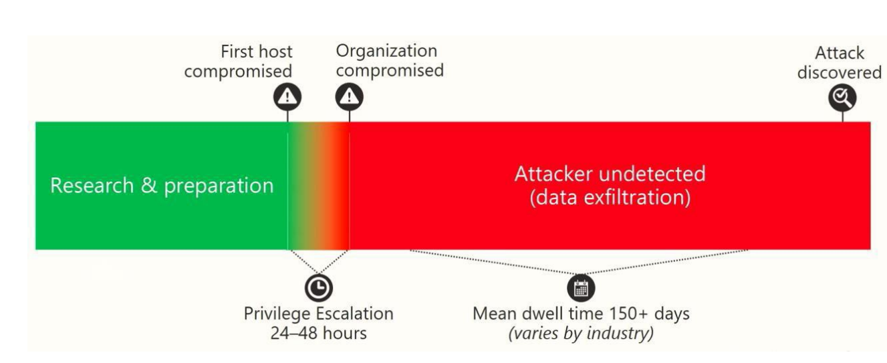

# Wk05 - Access Management

[Back](../index.md)

- [Wk05 - Access Management](#wk05---access-management)
  - [Access Management](#access-management)
    - [Overview](#overview)
    - [Threat Protection](#threat-protection)
    - [Response:](#response)
    - [Methods:](#methods)
    - [Protect Privileged Identities](#protect-privileged-identities)
      - [How do privileged identities get compromised?](#how-do-privileged-identities-get-compromised)
      - [How to prevent attackers from gaining access to privileged identities](#how-to-prevent-attackers-from-gaining-access-to-privileged-identities)
  - [BitLocker](#bitlocker)
    - [New Features](#new-features)
    - [System Requirements](#system-requirements)
    - [Deployment](#deployment)
    - [BitLocker Group Policy settings](#bitlocker-group-policy-settings)

---

## Access Management

### Overview

- `Access Security` affects **everyone** in the organization, from upper-level management (such as CEO-level) to the information worker.
  - A security breach can potentially disrupt all normal business and bring the organization to a halt. It is imperative for organizations to detect and prevent security breaches.
- Three broad categories of **data vulnerability**:
  - Data in **Creation** (e.g. Client Systems & Applications)
  - Data in **Transit** (e.g. Network &Access Control)
  - Data in **Storage** (e.g.Application & Data Retention)
- Almost all administrative security measures are addressing one or more of these categories.

- **Primary Server operations** impact in **all** 3 areas due to many functions and roles, such as:
  - **BCM(Business continuity management)** functions:
    - Data Center, Hardware, Physical access, Backups
  - **Storage** Management
    - Drives, arrays, volumes, encryption
  - **Database** repository & distribution
  - **Distributed system** & data control
    - Domain Admin, Virtual Machines & Desktops, LAN/WAN, RMS
  - **User Directory** Management
    - Active Directory, Object Management
  - Group **Policy** & Permissions
  - **User Access** Control
    - Privileges, Applications, Networks, Objects

---

- In the Client / Server distributed computing model,`Access Assurance & Control` are the key to balancing **User needs** and **Threat Protection** requirements.
- Services are not delivered unless all requests for **application**, **network** and **data access** are vetted for compliance.
- Required
  - **“Detect and Deny” malicious entities** from stealing data and/or impeding the organizational information systems

---

### Threat Protection

- Common Attack scenario:
  - The **sooner** that you can **detect** a potential attack, the **more** that you can **mitigate** any compromise in security.
  - After an attacker breaches an environment (through phishing or vulnerable entry points), they proceed to **escalate their privileges** through **lateral movement** within the environment until they take control over systems within a short period, typically **24 to 48 hours** from the first compromise. (as shown in the following figure).
  - Attacker is now Free to steal data and/or causing denial of service.

---

### Response:

- extend the time it takes an attacker to take control:
  - **detect** the attack by improving the various warning signals
  - **block** their lateral movement
  - **removing** compromised identities and systems

---

### Methods:

- Stay current on Windows Server **security updates**

  - Windows **Update** only
  - Windows Server Update Services (**WSUS**)
  - **System Center Configuration Manager**
  - **Operations Management Suite Update Management** service

- Configure Windows Server **security settings**

  - Microsoft, NIST, ISO27000 - published security **baselines**
  - **Recommended settings** for Windows Firewall & Defender
  - Import **baseline** GPOs & deploy to domain-joined servers
  - **Local Script tools** to configure **standalone** (non domain-joined) servers.

- **Back up** your information and systems

  - **Offsite Backups** of the Windows Server operating system, including the applications and data
  - **On-premises** by using solutions such as `System Center Data Protection Manager`
  - **Cloud-based backups** like `Microsoft Azure Backup Server`.
  - Restore to a point-in-time prior to a ransomware attack.
    - Benefit of such restore is debatable – it is not risk-free
    - Hackers hit Ontario hospitals with ransomware

- Management and monitoring software

  - `System Center Operations Manager` – Local application
  - `Operations Management Suite` - cloud-based IT management solution
  - **Both** together to provide a full **hybrid** management

- `Windows PowerShell Desired State Configuration (DSC)`
  - enforce your configuration settings **on-premises** and in the **cloud**.
  - DSC is an industry-wide **baseline method** used by other vendors and Linux Server implementations.

---

### Protect Privileged Identities

- `Privileged Identities` are any accounts that **have elevated privileges**, such as user accounts that are members of the Domain Admins, Enterprise Admins, Local Admins, or even Backup Operators and Power Users groups.
- `Privileged Identities` can be accounts that have **been granted privileges directly**, such as performing backups, shutting down the system, or other rights listed in the `User Rights Assignment` node in the `Local Security Policy` console.
- Organizations need to protect these privileged identities from compromise by potential attackers.

---

#### How do privileged identities get compromised?

- Granting **more privileges than** are necessary.

  - Failure to configure different administration levels.
    - Remember PoLP?

- **Staying signed** in with elevated privileges all the time.

  - **Limit session time** to only complete typical IT work job functions
  - **Disallow email and web browsing** when elevated

- Allowing **social engineering research**:

  - Poor containment of publicly available information
  - **Lack of user security awareness training** leads to successful email phishing attacks that compromise legitimate accounts
    - Whose responsibility is that?
  - Poor user account monitoring opens valid accounts to having additional research performed.

- **Failure to address exploits** that allow granting of elevated privileges.
  - Opens up vulnerability to `Pass-the-Hash` or `Pass-the-Token` attacks.

---

#### How to prevent attackers from gaining access to privileged identities

- Do **not grant more privileges** than are necessary
  - Implement `Just Enough Administration (JEA)`
- Do **not stay signed in** with elevated privileges all the time.
  - Implement `Just in Time Administration (JIT)`
- **Address exploits** that allow granting of elevated privileges.
  - Use the `Local Administrator Password Solution (LAPS)` as a JIT administration mechanism for their server and client systems.
- Scan & **remove Compromised** Identities
  - Implement `Microsoft Advanced Threat Analytics (ATA)` to help detect compromised identities in on-premises workloads and servers.
- **Deny** `Pass-The-Hash attacks`
  - Implement `Credential Guard` to help protect credentials and credential derivates from attacks such as Pass-the-Hash or Pass-the-Token.
  - Implement `Remote Credential Guard` to protect Credentials on servers that host **Remote Desktop connections**.

---

## BitLocker

- `BitLocker Drive Encryption` is a data protection feature that integrates with the operating system and **addresses the threats of data theft or exposure from lost**, stolen, or inappropriately decommissioned computers.
- BitLocker provides the most protection when used with a `Trusted Platform Module (TPM)` version 1.2 or later.
  - The TPM is a **hardware component** installed in many newer computers by the computer manufacturers.
  - It **works with** `BitLocker` to help protect user data and to ensure that a computer has not been tampered with **while the system was offline**.防止离线被篡改
- On computers that do not have a TPM version 1.2 or later, you can still use BitLocker to **encrypt** the Windows operating system drive by enabling the virtual TPM feature.
- `BitLocker` offers the option to **lock the normal startup process** until the user supplies a `personal identification number (PIN)` or inserts a removable device, such as a USB flash drive, that contains a startup key

---

- BitLocker – `Remote Server Administration Tools`, has two applications for utilizing **drive encryption**:

- **BitLocker Recovery Password Viewer.**

  - Enables you to **locate** and **view** `BitLocker Drive Encryption` **recovery passwords** that have been backed up to `Active Directory Domain Services (AD DS)`.
  - Recover data that is stored on a drive that has been encrypted by using `BitLocker`. The tool is an extension for the `Active Directory Users and Computers Microsoft Management Console (MMC)` snap-in.
  - Examine a computer object's Properties dialog box to view the corresponding BitLocker recovery passwords.
  - Additionally, you can right-click a domain container and then search for a B**itLocker recovery password across all the domains** in the Active Directory forest.

- **BitLocker Drive Encryption Tools.**
  - `BitLocker Drive Encryption Tools` include the command-line tools, manage-bde and repair-bde, and the BitLocker **cmdlets** for Windows **PowerShell**.
  - These are used to perform any task that can be accomplished through the BitLocker control panel, for automated deployments and other scripting scenarios.
  - `Repair-bde` is provided for **disaster recovery scenarios** in which a BitLocker protected drive cannot be unlocked normally or by using the recovery console.

---

### New Features

- **XTS-AES encryption algorithm.**
  - provides additional **protection from** a class of **attacks on encryption** that rely on manipulating cipher text to cause predictable changes in plain text.
  - Drives **encrypted** with `XTS-AES` 128-bit or 256-bit keys will not be accessible on older version of Windows.
- **Encrypt and recover your device with Azure Active Directory.**
  - In addition to using a MicrosoftAccount, **automatic Device Encryption** can now **encrypt your devices** that are joined to anAzureActive Directory domain.
  - The recovery key is **automatically escrowed 托管** to `AzureActive Directory`.
- **DMA port protection.**

  - You can use the **DataProtection/AllowDirectMemoryAccess MDM policy** to **block DMA ports** when the device is starting up.
  - Also, when a device is locked, all unused **DMAports** are **turned off**, but any devices that are already plugged into a DMAport will continue to work.
  - When the device is unlocked, all DMAports are turned back on.

- **New Group Policy for configuring pre-boot recovery.**
  - You can now configure the pre-boot recovery message and recovery URL that is **shown on the pre-boot recovery screen**.
- **BitLocker Network Unlock**
  - Systems using the TPM+PIN protection method in a domain environment have a local state unlock feature.
  - When a computer that is connected to a wired corporate network is rebooted, Network **Unlock allows the PIN entry prompt to be bypassed**.
  - If disconnected, PIN entry is required again.

---

### System Requirements

- For BitLocker to **use the system integrity check** provided by a `Trusted Platform Module (TPM)`, the computer must have TPM 1.2 or later.
  - **Without** TPM, enabling BitLocker requires that you **save a startup key** on a removable device, such as a USB flash drive.
- A computer with a TPM must also have a `Trusted Computing Group (TCG)-compliant BIOS or UEFI firmware`.
  - This establishes a chain of trust for the re-operating system startup, and it must include support for TCG-specified Static Root of Trust Measurement.
- `The system BIOS or UEFI firmware (for TPM and non-TPM computers)` must **support** the USB mass storage device class, including reading small files on a USB flash drive in the pre- operating system environment

---

### Deployment

- `BitLocker encryption` can be done using the following methods:
  - BitLocker control panel
  - Windows Explorer
  - manage-bde(BitLocker Drive Encryption) command line interface
  - BitLocker Windows PowerShell cmdlets
- Upon launch, the BitLocker Drive Encryption Wizard **verifies** the computer meets the BitLocker system **requirements** for encrypting an operating system volume.
- Upon passing the initial configuration, users are required to enter a **password** for the volume and a **recovery key** will be **generated**.

---

- When the recovery key has been properly stored, the BitLocker Drive Encryption Wizard will prompt the user to **choose how to encrypt** the drive.

  - There are two encryption options:
    - Encrypt **used disk space only** - Encrypts **only disk space that contains data**
    - Encrypt **entire drive** - Encrypts the entire volume **including free space**

- It is recommended that
  - drives with **little** to no data or **Virtual Machines** with dynamic drives utilize the **used disk space only** encryption option
  - **physical drives** with data or an operating system utilize the encrypt **entire drive** option.
- There is a new option for storing the BitLocker recovery key **using the OneDrive**.
  - This option requires that computers are **not members of a domain** and that the user is using a Microsoft Account.
  - **Local** accounts do **not** give the option to utilize OneDrive.

---

### BitLocker Group Policy settings

skip

---

[TOP](#wk05---access-management)
