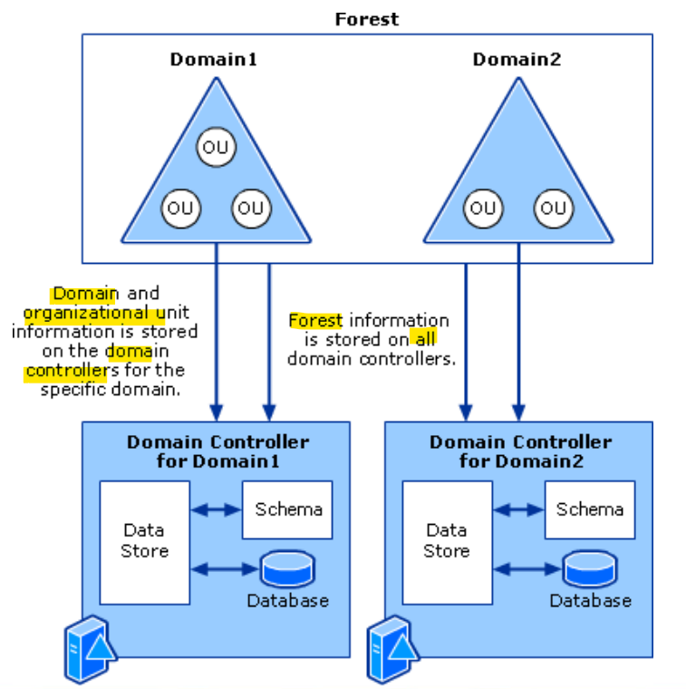
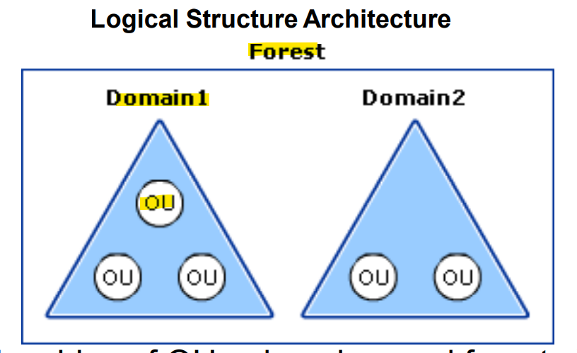
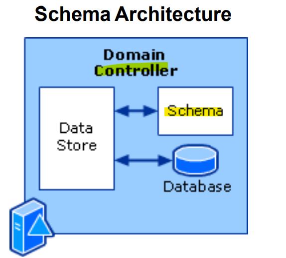
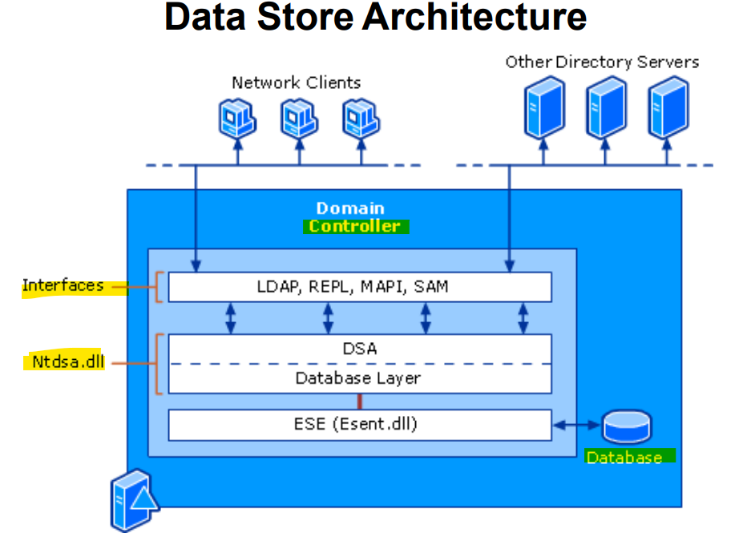
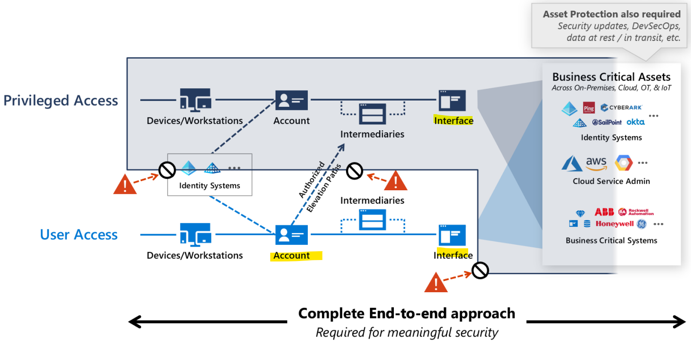

# Wk06 - Identity Management

[Back](../index.md)

- [Wk06 - Identity Management](#wk06---identity-management)
  - [Principle of Least Privilege](#principle-of-least-privilege)
  - [User Credentials](#user-credentials)
  - [Active Directory - Domain Services](#active-directory---domain-services)
  - [Active Directory Structure and Storage Architecture](#active-directory-structure-and-storage-architecture)
    - [Logical Structure Architecture](#logical-structure-architecture)
    - [Schema Architecture](#schema-architecture)
    - [Data Store](#data-store)
    - [Active Directory Structure and Storage Components](#active-directory-structure-and-storage-components)
    - [Active Directory Domains and Forests](#active-directory-domains-and-forests)
  - [Active Directory Security](#active-directory-security)
    - [Avenues to CompromiseAD](#avenues-to-compromisead)
    - [Reducing the Active Directory Attack Surface](#reducing-the-active-directory-attack-surface)
    - [The Implementing Secure Administrative Hosts](#the-implementing-secure-administrative-hosts)
    - [Securing Domain Controllers Against Attack](#securing-domain-controllers-against-attack)
  - [Federated Identity Management (FIM)](#federated-identity-management-fim)
  - [Securing Privileged Access](#securing-privileged-access)
    - [Public Network Access](#public-network-access)
    - [Private Network Access](#private-network-access)

---

## Principle of Least Privilege

- The `Principle of Least Privilege` – All users are included.
  - Especially applies to Systems and Security **Administrators**!
- 70% of Class A outages can be traced to **Human Error**
  - Much less is usually “identified” as an **error by IS/IT staff.**

---

## User Credentials

- Credentials refer to the verification of identity or tools for authentication. They may be part of a certificate or other authentication process that helps confirm a user’s identity in relation to a network address or other system ID.
- An increasing number of information systems use **other forms of documentation of credentials**.
  - such as biometrics, fingerprints, voice recognition, retinal scans, X.509 public key certificates.
- Active Directory supports a number of secure Internet-standard protocols and authentication mechanisms **used to prove identity** upon logon, including
  - **Kerberos V5**,
  - **X.509 v3 certificates**,
  - **smart cards**,
  - **public key infrastructure (PKI)**
  - and **Lightweight Directory Access Protocol (LDAP)** using Secure Sockets Layer (SSL)

---

## Active Directory - Domain Services

- A `directory` is a **hierarchical structure that stores information** about objects on the network.
- `Active Directory` **uses a structured data store** as the basis for a logical, hierarchical organization of directory information.
  - This data store, also known as “the directory”, contains information about all **Active Directory objects**.
- **Security** is integrated with Active Directory through **logon authentication** and **access control** to objects in the directory.
  - **With a single network logon**, administrators can manage directory data and organization throughout their network, and authorized network users can access resources anywhere on the network.
- **Policy-based administration** eases the management of even the most complex network.

---

- A `directory service`, such as `Active Directory Domain Services (AD DS)`, provides the **methods** for storing directory data and making this data available to network users and administrators.
  - `Active Directory` stores information about other objects on the network and makes this information easy for administrators and users to find and use.
  - Active Directory can be installed on servers running Microsoft® **Windows Server**® 2003 through to 2019 (excluding Web Editions)
- `AD DS(Active Directory Domain Services)` stores information about **user accounts**, such as names, passwords, phone numbers.
  - These objects typically include **shared resources** such as servers, volumes, printers, and the network user and **computer accounts**, etc., and **enables other authorized users** on the same network to access this information.

---

- Active Directory also includes:
  - A **set of rules**, the `schema`, that **defines the classes of objects and attributes** contained in the directory, the constraints and limits on instances of these objects, and the format of their names.
  - A `global catalog` that contains information about **every object in the directory**.
    - This allows users and administrators to find directory information regardless of which domain in the directory actually contains the data.
  - A **query and index mechanism**, so that objects and their properties can be published and found by network users or applications.
  - A **replication service** that distributes directory data across a network.
    - All `domain controllers` in a domain participate in replication and **contain a complete copy of all directory information** for their domain.
    - Any change to directory data is **replicated** to all domain controllers in the domain.

---

## Active Directory Structure and Storage Architecture

- The Active Directory structure and storage architecture consists of **four parts**:
  - `Active Directory domains and forests`.
    - **Forests**, **domains**, and **organizational units (OUs)** make up the core elements of the Active Directory logical structure.
    - A `forest` defines **a single directory** and represents a security boundary.
    - Forests contain `domains`.
  - `Domain Name System (DNS) support for Active Directory.`
    - DNS provides a name resolution service for domain controller location and a hierarchical design that Active Directory can use to provide a naming convention that can reflect organizational structure.
  - `Schema.`
    - The schema **provides object definitions** that are used to create the objects that are stored in the directory.
  - `Data store.`
    - The data store is the portion of the directory that manages the storage and retrieval of data on each domain controller.

---

### Logical Structure Architecture

- Domains partition the directory into **smaller sections** within a single forest.
  - This partitioning results in more control over how data is replicated so that an **efficient replication topology** can be established and **network** bandwidth is not wasted by replicating data where it is not required.
- `OUs` make it possible to **group resources** in a domain for management purposes, such as applying **Group Policy** or **delegating control** to administrators.

- The relationships of OUs, domains, and forests in the logical structure architecture.:

---

### Schema Architecture

- The `Active Directory schema` **contains definitions for all the objects** that are used to store information in the directory.
  - There is **one** `schema` **per** `forest`.
  - However, a **copy** of the schema **exists** on **every** `domain controller` in the forest.
    - This way, every domain controller has **quick access to any** object definition that it might need, and very domain controller uses the **same definition** when it **creates** a given object.
- The data store **relies on** the `schema` to provide object definitions, and the data store uses those efinitions to enforce data integrity.
  - The result is that all objects are **created uniformly**, and it does not matter which domain controller creates or modifies an object

---

### Data Store

- The Active Directory data store is made up of several components that together provide directory services to directory clients.
- These **components** include the following:
  - Four **interfaces**:
    1. `Lightweight Directory Access Protocol (LDAP)`
    2. `Replication (REPL)` and **domain controller** management interface
    3. `Messaging API (MAPI)`
    4. `Security Accounts Manager (SAM)`
  - Three **service** components:
    1. `Directory System Agent (DSA)`
    2. The **database** layer
    3. `Extensible Storage Engine (ESE)`
- The **directory database** where the data is **actually stored**
- The following figure illustrates the relationships of these components in the data store architecture.

---

### Active Directory Structure and Storage Components

- You **can define some components** for structure and storage in Active Directory, while others are defined by the system and cannot be modified.
- `Forests`, `domains`, and `OUs` are components that constitute the logical structure of Active Directory.
  - You **define** them **during the installation** of Active Directory.
- `DNS` support for Active Directory includes components that are **used to locate domain controllers** and that use DNS naming schemes.
  - Each domain in a forest **must adhere** to DNS **naming schemes**, and domains are organized in a root and subordinate domain hierarchy.
- The `schema` is a single component that **exists inside** the directory.
  - The schema contains definitions of the objects that are used to store information in the directory.
  - These object definitions include two primary components: `classSchema objects` and `attributeSchema objects`.

---

- The data store consists of **three layers** of components.
  - The first layer provides the **interfaces that clients need to access** the directory.
  - The second layer provides the **services that perform the operations** that are associated with reading data from and writing data to the directory database.
  - The third layer is the **database** itself, which **exists as a single file** on the hard disk of **each** `domain controller`.
  - 接口，执行， DB

---

### Active Directory Domains and Forests

- The logical structure of Active Directory is a **hierarchical structure** of Active Directory **domains and OUs** in a forest.
  - The **relationships** of the components in the logical structure **control access** to stored **data**, and they control how information is replicated between the various domain controllers in the forest.

---

## Active Directory Security

- The only sure way to **recover** in the event of a complete compromise of Active Directory is to be **prepared** for the compromise **before** it happens.
- The most common attacks against Active Directory can be avoided by focusing on the major areas of AD security:
  - **Avenues** to Compromise
  - **Reducing** the Active Directory Attack **Surface**
  - **Monitoring** Active Directory for Signs of Compromise
  - **Planning** for Compromise

---

### Avenues to CompromiseAD

- **Initial** breach targets :
  - Gaps in antivirus and antimalware deployments
  - Incomplete patching
  - Outdated applications and operating systems
  - Misconfiguration
  - Lack of secure application development practices
- **Attractive Accounts** for Credential Theft:
  - **Activities that Increase the Likelihood** of Compromise –
    - Logging on to unsecured computers with privileged accounts
    - Browsing the Internet with a highly privileged account
    - Configuring local privileged accounts with the same credentials across systems
    - Overpopulation and overuse of privileged domain groups
    - Insufficient management of the security of domain controllers.
  - **Privilege Elevation and Propagation** - Specific accounts, servers, and infrastructure components are usually the primary targets of attacks against Active Directory.
    - These accounts are:
      - Permanently privileged accounts
      - VIP accounts
      - "Privilege-Attached" Active Directory accounts
      - Domain controllers
      - Other infrastructure services that affect identity, access, and configuration management, such as public key infrastructure (PKI) servers and systems management servers

---

### Reducing the Active Directory Attack Surface

- **Privileged Accounts and Groups in Active Directory**

  - **Three built-in groups** are the highest privilege groups in the directory (`Enterprise Admins`, `Domain Admins`, and `Administrators`), although a number of additional groups and accounts should also be protected.

- **Implementing Least-Privilege Administrative Models**
  - The habit of granting more privilege than is required is typically found throughout the infrastructure:
  - In Active Directory
  - On member servers
  - On workstations
  - In applications
  - In data repositories

---

### The Implementing Secure Administrative Hosts

- The **hosts** that are **dedicated to administrative functionality**
- Principles for Creating Secure Administrative Hosts - The general principles to keep in mind are:
  - **Never** administer a trusted system **from a less-trusted host**.
  - Do **not** rely on a **single authentication factor** when performing privileged activities.
  - Do not forget **physical security** when designing and implementing secure administrative hosts.

---

### Securing Domain Controllers Against Attack

- **Malicious access** to a domain controller can allow modify, corrupt, and destroy the Active Directory database
- **Physical Security** for Domain Controllers Domain Controller Operating Systems
- **Secure Configuration** of Domain Controllers

---

## Federated Identity Management (FIM)

- `AD FS` provides simplified, secured identity federation and Web `single sign-on (SSO)` capabilities.
- `AD FS` enables users to authenticate **using on-premises** credentials and **access** all resources in **cloud**.

  - This achieves the high **availability** required with minimal efforts.

- The **advantages** of deploying `AD FS`:
  - **High Availability**
    - With the power of Azure Availability Sets, you ensure a highly available infrastructure.
  - **Easy to Scale**
    - Need more performance? Easily migrate to more powerful machines by just a few clicks inAzure
  - **Cross-Geo Redundancy**
    - WithAzure Geo Redundancy you can be assured that your infrastructure is highly available across the globe
  - **Easy to Manage**
    - With highly simplified management options in Azure portal, managing your infrastructure is very easy and hassle-free

---

- Authentication methods for `Multi-Factor Authentication` and `self-service password reset (SSPR)` it is recommended that you require users to register multiple authentication methods.
- Administrators **can define in policy** which authentication methods are available to users of SSPR and MFA.
  - Microsoft highly recommends Administrators enable users to select **more than the minimum** required number of authentication methods in case they do not have access to one.

---

## Securing Privileged Access

### Public Network Access

### Private Network Access

- `PAM(Privileged Access Management)` builds on the principle of `just-in-time administration`, which relates to `just enough administration (JEA)`.
  - `JEA` is a **Windows PowerShell toolkit** that defines a set of commands for performing privileged activities.
  - It is an endpoint where administrators can get authorization to run commands.
- In JEA, an administrator **decides** that users with a certain **privilege** can perform a certain **task**.
  - Every time an **eligible** user needs to perform that task, they **enable that permission**.
  - The permissions **expire** after a specified time period, so that a malicious user can't steal the access.
- PAM setup and operation has **four** steps.
  - prepare
  - protect
  - Operate
  - Monitor

---

[TOP](#wk06---identity-management)
