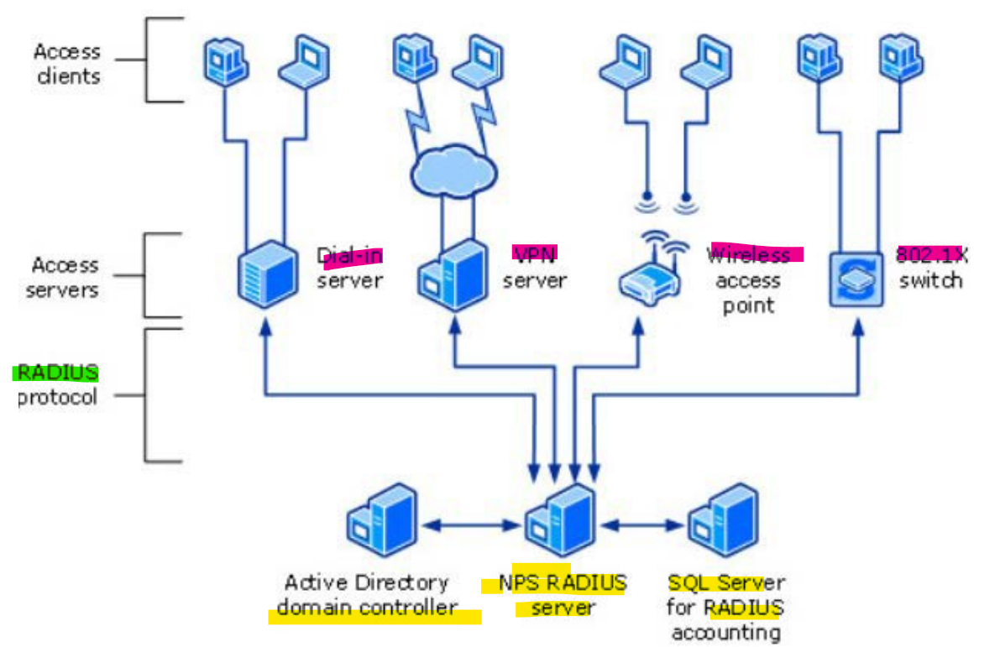

# Wk08 - Identity Management

[Back](../index.md)

- [Wk08 - Identity Management](#wk08---identity-management)
  - [Authentication Servers](#authentication-servers)
    - [NTLM (NT LAN Manager)](#ntlm-nt-lan-manager)
    - [Kerberos](#kerberos)
  - [SPN – Service Principal Names](#spn--service-principal-names)
    - [Kerberos Delegated Authentication](#kerberos-delegated-authentication)
    - [Service Accounts](#service-accounts)
    - [MSA (Managed Service Accounts)](#msa-managed-service-accounts)
      - [Group Managed Service Accounts](#group-managed-service-accounts)
  - [NETWORK POLICY SERVICES](#network-policy-services)
    - [RADIUS Server / Client](#radius-server--client)
    - [RADIUS ACCOUNTING:](#radius-accounting)
    - [NPS Authentication Methods](#nps-authentication-methods)
    - [NPS Policies:](#nps-policies)
      - [3 NPS Policy Types:](#3-nps-policy-types)
        - [Connection Request Policies:](#connection-request-policies)
        - [Network Policies:](#network-policies)
        - [Health Policies :](#health-policies-)

---

## Authentication Servers

- `AAA–Authentication,Authorization,Accounting server`

  - “the act of confirming the identity of a user or system”
  - We need to trust the process we use to confirm the identity of a user or system.

- `RADIUS AAA Server`
  - `Remote Authentication Dial-in User Service` (an old name!)

---

- Types of Windows Authentication Services

1. `Kerberos` (**Default**)
2. `NTLM` (Fallback if Kerberos is unavailable)
3. `TLS/SSL` and `Digest`

---

### NTLM (NT LAN Manager)

- `NT (New Technology) LAN Manager (NTLM)`

  - a suite of Microsoft security protocols intended to provide authentication, integrity, and confidentiality to users.

- Used in an Active Directory environment **only when Kerberos is not available** or when applications do not support it.
- Provides **Backward Compatibility** to workgroup members
- Application must connect to DC for every service.
- Uses Challenged Response

1. Server Sends an 8-byte Challenge Message to Client
2. Client uses the password as a key to encrypt the 8-Byte Message using **Hash** and `DES`.
3. Server knows what the clients key should be.
   if the server can successfully decrypt the message using the password
   **and**
   check the hash value matches the hash value of the 8-Byte Message originally sent, user is then **authenticated**.

---

### Kerberos

- There are **three** components to Kerberos:
  - the **client**,
  - a **service**
  - and a **third-party** that both client and service trust.
- Kerberos is "… an **authentication protocol** for trusted clients on untrusted networks.“ (F. Ricardi)
- Similar in scope to `SSL/TLS` – Encryption, Hashing and Authentication **using a shared secret key** and a **certificate authority** for verification of untrusted clients and servers.
- Kerberos is then very effective on a trusted corporate network with trusted clients.
- A shared secret key is generated from credentials and a **ticket** is issued for verification and authentication.

---

- **Default** method used in an Active Directory Environment
- More efficient authentication to servers.
  - **Renewable session tickets** replace pass-through authentication
  - No DC request required (unless it needs to validate a Privilege Attribute Certificate (PAC))
  - `Single Sign On` in a forest set through a GPO.
  - Interoperability with Linux and others, IETF compliant.
- **Mutual authentication** – both client and server authenticate the identity of each other.
- Uses **Ticketing** to authenticate client/server.
- Clients re-use credential for entire session

---

- **After Authentication**

- The `client` **retains the Ticket** and uses it for each sub-sequential authentication request to that particular service.
  - Which ticket are we referring to here? Review last week lecture notes for ticketgranting ticket and service-granting ticket.
- This means – you do not need to continue to authenticate with the DC each time.
- For this reason, the ticket must have an **expiration** – set in **GPO**, default is **10** Hours.
- Kerberos requires the system time to be within (by default) **5 minutes** of each other – default can be changed in Group Policy.

---

## SPN – Service Principal Names

- Kerberos uses `SPN` to **identify a service**.
  - e.g., `HTTP/intranet.fanco.com`
  - Contains the **service class** (such as HTTP)
  - Contains the **host name** (intranet.fanco.com in this case)
  - Contains the **Port** (if port 80 is not being used)
- An SPN should be created for the `NetBIOS` and the `FQDN` host name.
- SPN are **attributes** of objects in Active Directory
  - Can useADSIEdit
  - Or Active Directory Users and Computers

---

### Kerberos Delegated Authentication

- Allow a **ticket to be created** for **another** service **on the user’s behalf**.
- Delegation is configured in AD Users & Computers (MMC Snap-in)

- Kerberos Delegation
  - Configuring Delegation in ADUC
    - Trust can be set as **unconstrained** or **constrained**.

---

### Service Accounts

- Set-up like a **user** account **plus** a `SPN` for the account
- **Dependent** on `Kerberos` encryption types
- Most Services can run under one of the default accounts (Local Service, NetworkService or LocalSystem).

  - This way, a **compromised** service can do only **limited damage**.

- If you need / or would like a service to run under **different credentials** so it can access specific resources you can:

  1. Create an Active Directory **User Object** with a Password
  2. **Authorize** the User Account as Necessary
  3. **Configure the Service** to run as this newly created user
  4. **Restart** the Service

---

- **Drawbacks** with Creating ServiceAccounts

  - Either Passwords are set to **never expire** (Which is not recommended) or the **service will stop** working when the password expires.
  - Resetting Service Account passwords must be in tandem with setting the password on the service.
  - For best security, Services should not be run on DCs and avoid multiple services on a DC or single server.

---

### MSA (Managed Service Accounts)

- MSAs are **stored** in `Active Directory` and have **passwords**.
  - However, a random, complex 240 character passwords and regenerates the password every **30 days**.
- Services do **not need to be updated** when these passwords change.
- MSAs **cannot login** interactively
- **Drawbacks**:

  - **Cannot** be locked **out** – mitigated by complex password changing every 30 days.
  - MSA’s **cannot span** multiple computers
  - The MSA Object is a “user” & “computer” at once, but is **not** an AD **“person”**
  - An MSA must be **created** for **each server**, cannot use the same MSA for more than one server – so **clustered servers** cannot use MSAs.

---

#### Group Managed Service Accounts

- **Since** Server **2012 R2**, Grouped MSAcan be used.
- Using `Grouped MSAs`, you can create MSAs and **install them on multiple computer objects** and they will **work over multiple servers**

  - This **solves the problem for server clusters** provided the DC is running Server 2012 R2 or newer.
  - **Windows** now **manages the passwords**, not the Administrator.

- As of Server **2012**, `Microsoft Key Distribution Services` provides the key for the **domain controller** to **compute the passwords** in addition to other attributes of the group.
  - `gMSAprovides` a single identity **solution** for servers deployed on a **server farm**, or behind `Network Load Balancing (NLB)`
  - **Failover clusters** do **not support** `gMSA’s`, but a service running **on top of a cluster** can use a `gMSA` if it has native support.

---

## NETWORK POLICY SERVICES

- `Network Policy Server (NPS)` allows you to create and enforce **organization-wide network access policies** for **connection request authentication and authorization**.

  - You can also configure `NPS` as a `RemoteAuthentication Dial-In User Service (RADIUS)` server or proxy.
  - `RADIUS` server will **forward** connection requests to **remote** `NPS` or other `RADIUS` servers to load balance and forward connection requests to the correct domain for AAA.
  - NPS **performs centralized AAA** for wireless, Remote Dial-in, and other authenticating switch connections.
  - `NPS as a RADIUS server` allows **configuration** of network access servers, VPN concentrators and servers as `RADIUS` clients in NPS.
  - **Accounting** is logged to local disk or SQL database.

---

- `NPS as RADIUS proxy` will **pass** connection request policies to other `RADIUS servers` and `NPS` will **forward** **accounting data to be logged on** a computer disk in a remote `RADIUS server` group..
- `Routing and Remote Access Service (RRAS)` is a Microsoft **API** and **server application** that can be configured to use `NPS` for **AAA purposes**.
- Uses connecting to the `RRAS VPN`, RRAS uses `NPS` to:
  - **Authenticate** the User (NPS Determines who can authenticate/when etc.)
  - **Authorize** the User (NPS Determines what a user has access to)
  - **Accounting** (NPS Determines if accounting is required and will **log** necessary information)

- **Multiple** `NPS` systems can be configured for **load balancing** and **resilient** reasons.
- `NPS Servers` are **placed** in a `Server Group` and are given a **Priority** and **Weight**

---

### RADIUS Server / Client

- `Radius Server`

  - A **Server** such as NPS **Accepting Radius Requests**

- `Radius Client`
  - A **system** such as an RRAS server or Wireless AP that **sends the RADIUS Request** to the Server
- `Radius Clients` must be **configured on** the `RADIUS Server` and must include an **IP** and **Shared Secrete**.
  - `Radius clients` not radius end users
  - The **Shared Secret** is configured on the `RADIUS Clien`

---

### RADIUS ACCOUNTING:

- NPS can be configured to support `RADIUS Accounting`.
- `RADIUS Clients` **send** messages to the `RADIUS Server` for the RADIUS Server to **log** based on client activity.
- NPS can **save these logs** to a text file or SQL Server
- Accounting can be used for **auditing** and or **billing** purposes

---

### NPS Authentication Methods

- **Password**-based Credentials
  - Such as `MS-CHAPv2`
  - To even – **open no security**
  - `CHAP` can be used and even `PAP` although not recommended
- **Certificate**-based Credentials
  - Use certificates to identify the client
  - Protocols such as:
    - Protected Extensible Authentication Protocol Microsoft Challenge-Handshake Authentication Protocol v2 (`PEAP-MS- CHAPv2`)
    - Protected Extensible Authentication Protocol Transport Layer Security (PEAP-TLS) OR Extensible Authentication Protocol Transport Layer Security (`EAP-TLS`) (EAP encapsulated in a TLS tunnel)
  - Typical Certificates are used for **Computer** or **Smart Card** Authentication.

---

### NPS Policies:

- Permissions/Restrictions used to determine:

  1. Who – can connect
  2. When – can they connect
  3. How – can they connect

- Authorization can be granted or denied based on:
  1. User **Attributes** (Dial-in properties)
  2. **Group** Membership
  3. **Time** of Day
  4. Type of **Connection**
  5. Many more…

---

#### 3 NPS Policy Types:

1. **Connection Request** Policies
   - Determines which `RADIUS Servers` are to perform the **AAA**.
2. **Network** Policies

   - **Conditions, Constraints and Settings** specifying Who is authorized to connect and under which circumstances.

3. **Health** Policies
   - `Check system health validators (SHVs)` to determine if the computer is **in a healthy state to connect**.

---

##### Connection Request Policies:

- These policies are applied to the `NPS as a RADIUS Server`
- Factors include:
  - **Time** of day
  - **Connection** Type
  - **IP** Address of the RADIUS Client
- Define the following:
  - **Type** of network access Server (such as Remote Access Server VPN Dial Up or Wireless etc…)

---

##### Network Policies:

- Evaluates remote connections based on the following:
  1. **Conditions** – such as group **memberships** etc.
  2. **Constraints** – Such as **day/time** restrictions, authentication type etc.
  3. **Settings** – Such as **IP** Filters etc.
- You can have multiple network policies, these are processed in order.
  - Once a **match occurs**, **no** more network policies are **checked**.

---

##### Health Policies :

- `NPS` is also a `health evaluator server` for `NetworkAccess Protection (NAP)`.
- NPS performs authentication and authorization of network connection attempts and, based on configured system health policies, **evaluates computer health compliance** and determines how to **limit a noncompliant computer's network access** or communication.
