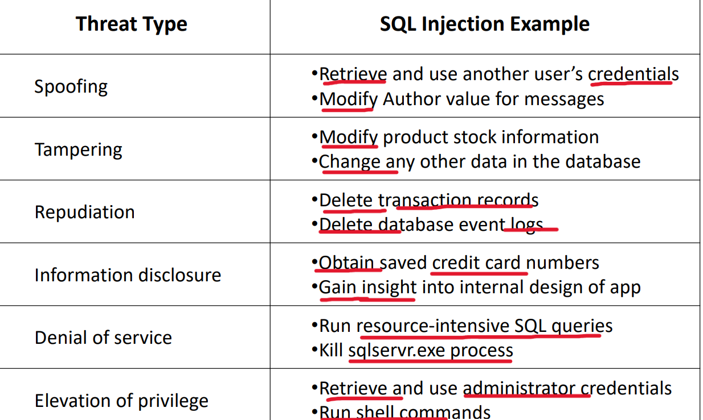

# Web Security - Classification & Prioritization

[Back](../index.md)

- [Web Security - Classification \& Prioritization](#web-security---classification--prioritization)
  - [Classification \& Prioritization](#classification--prioritization)
    - [Classification](#classification)
    - [CWE](#cwe)
    - [CVE](#cve)
    - [CPE](#cpe)
    - [`CWE` vs `CVE` vs `CPE`](#cwe-vs-cve-vs-cpe)
  - [Classification \& Prioritization of Threats](#classification--prioritization-of-threats)
    - [STRIDE](#stride)
  - [CVSS](#cvss)
  - [OWASP](#owasp)
  - [Threat Agents](#threat-agents)
  - [Exploitability](#exploitability)
  - [Web Application Security Risks](#web-application-security-risks)
    - [Technical Impacts](#technical-impacts)
    - [Business Impacts](#business-impacts)
  - [The OWASP Risk Rating Methodology](#the-owasp-risk-rating-methodology)
  - [Defense Approaches](#defense-approaches)
    - [Input Validation](#input-validation)
    - [Attack Surface Reduction](#attack-surface-reduction)
    - [Logging and Detection](#logging-and-detection)

---

## Classification & Prioritization

### Classification

- There are more threat vectors than time or money to protect against them
  - **Tools** like the `OWASP` Top Ten help with this
- Other threat classification and ranking systems:
  - `STRIDE`
    - useful for the **classification of general threats**
  - `CWE (Common Weakness Enumeration)`
    - useful for the **classification of specific threats**
  - `CVE (Common Vulnerabilities and Exposures)`
    - useful for the **classification of specific instances** of a CWE
  - `CVSS (Common Vulnerability Scoring System)`
    - useful for **ranking threats**

---

### CWE

- `CWE`:
  - `Common Weakness Enumeration`
  - A **generic flaw** that can lead to a unique vulnerability or exposure
  - **Formal list** of software weaknesses 列表
  - This is more of a **general classification**

---

### CVE

- `CVE`:

  - `Common Vulnerabilities and Exposures`
  - A **unique instance of a weakness** (flaw) that can be used to access a system or network
  - Provides **unique identifiers** for publicly known information security vulnerabilities 唯一标记
  - Each CVE contains
    - CVE **Identifier Number**
    - Brief **description** of the security vulnerability or exposure
    - Pertinent **references**

- `Vulnerabilities`

  - To be considered a Vulnerability it must:
    - Allow an attacker to **execute a command** as another user
    - Allow an attacker **access to data** that is contrary to the specified access restrictions
    - Allow an attacker to **pose** as another **entry**
    - Allow an attacker to conduct a **DoS attack**

- `Exposures`
  - An exposure is a configuration **issue or mistake** in software that **allows access** to information or capabilities that can be used by a hacker as a **stepping-stone** into a system or network
    - **Doesn’t directly allow** compromise, but could be an important component of an attack
    - Exposures can be considered violations of a reasonable security policy
    - Is a primary point of entry that an attacker may attempt to use to gain access to the system or data
    - Allows attacker to conduct **information gathering** activities
    - Allows an attacker to hide their activities

---

### CPE

- `CPE`
  - `Common Platform Enumeration`
  - Maintained by `NIST`, `National Institute of Standards and Technology`
  - Structured naming scheme for information technology **systems, software and packages**
  - Allows researchers to know that they are talking about the same platform

---

### `CWE` vs `CVE` vs `CPE`

- `CWE`
  - a standard for classifying and describing the **types** of weaknesses that can lead to vulnerabilities.
- `CVE`:

  - a standard for **identifying and naming** **specific** vulnerabilities

- A `CWE` will have many `CVEs`
- `CVEs` relate to a specific vulnerability under the same `CWE` umbrella
- `CPEs` are there to ensure the **correct platform** is listed in the `CVE` information

- 总结
  - CVE 类别
    - CVE 类下特定项
    - CPE 类下特定平台

---

## Classification & Prioritization of Threats

- A `Threat Model` is a view of the **application** and its **environment** through **security glasses**
- There are many Threat Models: `STRIDE`, `PASTA`, `OCTAVE`, `CVSS`, etc.
- We focus on:
  - `STRIDE`
    - Useful for the classification of **general threats**
  - `CVSS` (Common Vulnerability Scoring System)
    - Useful for **ranking threats**

---

### STRIDE

- `STRIDE` is another example of a threat classification system originally developed by `Microsoft`

  - Spoofing
  - Tampering
  - Repudiation
  - Information Disclosure
  - Denial of Service
  - Elevation of Privilege 提升权限

- `Spoofing` Vulnerabilities 模仿欺骗
  - Allows an attacker to impersonate(扮演; 模仿) another user
- `Tampering` Vulnerabilities 篡改
  - Involves an attacker **changing data** they shouldn’t have access to
- `Repudiation` Vulnerabilities 拒绝

  - Allows the attacker to deny they performed a given action 不能跟踪
  - Who did the damage?

- `Information Disclosure` Vulnerabilities 信息披露
  - Involves an attacker being able to **read data** they shouldn’t have access to
- `Denial of Service Attack` Vulnerabilities 拒绝服务
  - **Prevents valid users** from accessing the application
- `Elevation of Privilege` Vulnerabilities 提升权限

  - Allows attackers to **perform actions** they shouldn’t be able to perform
  - Actions with **higher privileges**, such as those of an administrator

- e.g.:
  - STRIDE Threat Model: SQL Injection

---

## CVSS

- `CVSS`:

  - `Common Vulnerability Scoring System`

- Current version 3.1 is maintained by `FIRST (Forum of Incident Response and Security Teams)`:
- Ranks vulnerabilities on a scale of 1 to 10, **ten** being the **highest risk**
- Severity Ratings:

  - None (0)
  - Low (0.1-3.9)
  - Medium (4.0-6.9)
  - High (7.0-8.9)
  - Critical (9.0-10.0)

- Uses **three main factors** to determine score:
  - `Base Score`: **inherent characteristics** of vulnerability
  - `Temporal Score`: **characteristics** that **change over time** (new exploits, mitigation available)
  - `Environmental Score`: characteristics specific to your **organization** (use of SQL databases)

---

## OWASP

- `Open Web Application Security Project`
  - Non-for-profit charitable organization
- OWASP Top Ten Project

  - Identifies the **top 10** most critical **web application security risks** at the time of release

- **Web Application Vulnerabilities**

  - Web applications are **uniquely vulnerable**
  - It is estimated that up to **70 percent of attacks** come through web applications
  - This stems from the fact that user traffic needs to pass through the firewall to the web application

- Firewalls alone are an **ineffective defense** for attacks against web applications

  - Unfortunately, most companies spend much more resources on **network defense**, than on building or **configuring** their web applications properly

- **Web Application Security Risks**
  - Attacker can use **many paths** through a web application to harm an organization
  - Each of these paths represents a risk
- The `OWASP` top 10 project attempts to identify the most dangerous risks

  - Serious enough to warrant attention

- Each risk has detailed information
  - **Threat Agents**
    - Where will these attacks **originate**?
  - **Exploitability**
    - How easy is it to perform the attack?
  - **Weakness Prevalence**
    - How **Common** is the weakness?
  - **Weakness Detectability**
    - How easy is it to **detect** the weakness?

---

## Threat Agents

- `Threat agents`, also known as `threat actors`,

  - are individuals or entities that possess the capability to exploit vulnerabilities and engage in **malicious activities** with the intent to compromise the security of an organization's information assets or critical infrastructure.

- How **technically skilled** is this group of threat agents?

  - Security **penetration** skills
  - Network and **programming** skills
  - Advanced **computer** user
  - Some **technical** skills
  - **No** technical skills

- How **motivated** is this group of threat agents to find and exploit this vulnerability?

  - Low or no reward
  - Possible reward
  - High reward

- What **resources and opportunities** are required for this group of threat agents to find and exploit this vulnerability?

  - Full access or expensive resources required
  - Special access or resources required
  - Some access or resources required
  - No access or resources required

- How **large** is this group of threat agents?
  - Developers
  - System administrators
  - Intranet users
  - Partners
  - Authenticated users
  - Anonymous Internet users

---

## Exploitability

- `Exploitability`

  - the **possibility** of a vulnerability actively being used by malicious actors to compromise systems, applications, or networks.

- **How easy** is it for a group of threat agents to **discover** this vulnerability?

  - Practically impossible
  - Difficult
  - Easy
  - Automated tools available

- **Ease of Exploit**

- **How easy** is it for a group of threat agents to actively **exploit** this vulnerability?

  - Theoretical
  - Difficult
  - Easy
  - Automated tools available

- How **well known** is this vulnerability to this group of threat agents?

  - Unknown
  - Hidden
  - Obvious
  - Public knowledge

- **Exploit Detection**

- How likely is an exploit to be detected?
  - Active detection in application
  - Logged and reviewed
  - Logged without review
  - Not logged

---

## Web Application Security Risks

- **Technical Impacts**
  - How **severe** will the attack be on the infrastructure?
- **Business Impacts**
  - What will be the varied **costs to the business** if a successful attack takes place

---

### Technical Impacts

- **Loss of confidentiality**
  - How much data could be **disclosed** and how **sensitive** is it?
- **Loss of integrity**
  - How much data could be **corrupted** and how **damaged** is it?
- **Loss of availability**
  - How much **service** could be **lost** and how **vital** is it?
- **Loss of accountability** 可追踪
  - Are the threat agents' actions **traceable** to an individual?

---

### Business Impacts

- **Financial damage**
  - How much **financial damage** will result from an exploit?
- **Reputation damage**
  - Would an exploit result in **reputation** damage that would harm the business?
- **Non-compliance**
  - How much exposure does **non-compliance** introduce?
- **Privacy violation**
  - How much personally identifiable **information** could be **disclosed**?

---

## The OWASP Risk Rating Methodology

- Vulnerability that is critical to one organization may not be very important to another.
- `OWASP Risk Rating Methodology` is a **basic framework** that should be **customized** for the particular organization

- Threat agent factors + Vulnerability factors

- Risk Severity = Likelihood \* Impact
- The **more skills** required the **less** the risk.
- The **more exploits** available, the **greater** the risk.

---

## Defense Approaches

- There are three primary defense approaches when it comes to most web application security issues:
  - **Input Validation**
    - Never **trust** the user
  - **Access / Attack Surface Reduction**
    - Don’t give users access to functionality they **don’t need**, or even better, don’t enable functionality that isn’t needed
  - **Classification and Prioritization of Threats**
    - Know which risks are most relevant to your organization of focus your attention on them

---

### Input Validation

There are two primary types of input validation:

- **Blacklist Validation**
  - Involves listing out all the **input** that should **not** come from a user, then blocking it
- **Whitelist Validation**

  - Involves listing out the **input** that **should** come from a user, then allowing it

- Difficulties with **blacklist validation**:

  - It is extremely **difficult to anticipate** everything that should be blocked
  - This is especially true when you take character encoding into account
  - All the following inputs reference the same page:
    - my page.html
    - My Page.html
    - MY PAGE.html
    - my%20PAGE.htm

- Difficulties with **whitelist validation**:
  - You need to make sure you have whitelisted **any potentially** valid inputs
  - Not all valid inputs are **easy to define**
    - Usernames, email addresses, etc.
  - **Regular expressions** can be used to handle more complicated input validation
    - Can be difficult to write
    - You can use tools such as Regex Buddy or Regex Magic

---

### Attack Surface Reduction

- Involves controlling the code and functionality **users can access**
  - If a user doesn’t need access to a feature don’t give it to them
  - You can allow users to opt into additional functionality as they need it
- A non web application example of this would be current versions of Windows Server
  - You add roles and features as needed

---

### Logging and Detection

- Is there a central log server?
- Do the logs get **reviewed** for suspicious activity?
  - Network Intrusion Detection Systems
    - Firewall / Network Security Appliance
  - Host-Based Intrusion Detection Systems
    - OSSEC
- Are logs kept for a minimum of 90 days?

---

[TOP](#web-security---classification--prioritization)
