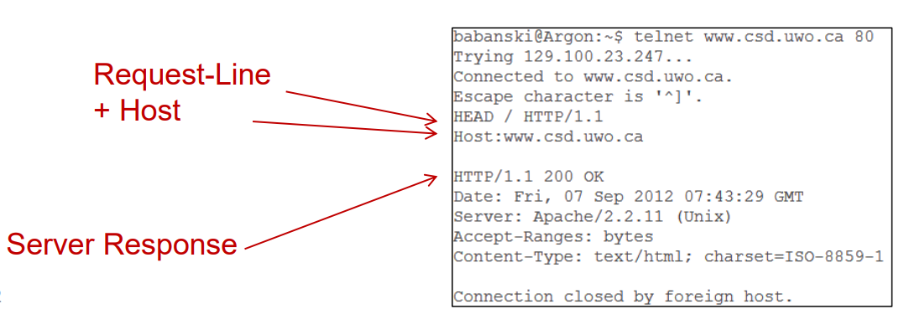

# Wk05

[Back](../index.md)

- [Wk05](#wk05)
  - [Enumeration](#enumeration)
    - [Server Enumeration](#server-enumeration)
    - [Web App Enumeration](#web-app-enumeration)
  - [Identifying Technologies](#identifying-technologies)
  - [Mapping Out Web Applications](#mapping-out-web-applications)
    - [Spiders](#spiders)
  - [Discovering Content](#discovering-content)
  - [Discovering Functions](#discovering-functions)
  - [Brute Force Attacks](#brute-force-attacks)
    - [Brute Force Attack methods](#brute-force-attack-methods)
  - [HTTP: HyperText Transfer Protocol](#http-hypertext-transfer-protocol)
    - [HTTP/2](#http2)
    - [HTTP/3](#http3)
    - [HTTP: Parameters](#http-parameters)
  - [HTTP Requests](#http-requests)
    - [Host header](#host-header)
    - [Request Method](#request-method)
    - [Requests Header Fields:](#requests-header-fields)
    - [Tool](#tool)
  - [HTTP Responses](#http-responses)
    - [Status Codes](#status-codes)
    - [Response Header Fields](#response-header-fields)
    - [Server Header](#server-header)

---

## Enumeration

- Enumeration can be performed in two main ways
  - Web **servers**
  - Web **applications**
- Depending on the goal, one method may be beneficial over the other
- Most Web App **penetration tests** will involve just the Web **App enumeration** since it can be hosted on different platforms/servers

---

### Server Enumeration

- `Server enumeration` involves trying to find out what **type of platform** the web application is being
  **hosted** on
  - What services are running on the server
  - What O/S is the server running
  - What versions of software are being used
  - Etc.

---

### Web App Enumeration

- `Web App enumeration` involves trying to find out what web **technologies** are being used
  - What **functionality** and what content is the application using?
  - How does the application **behave**?
  - What security **mechanisms** is it using?
  - Focuses on **classes of vulnerabilities** as opposed to instances

---

## Identifying Technologies

- Banner grabbing 抢横幅
  - HTTP Server **Header**
  - **Templates** used to build the HTML response
  - URL query **string parameters**
- The server banner can be changed by the administrator / developer
- There are tools available to attempt and discover the server technologies being used

---

- `HTTPrecon` is a tool that does fingerprinting

---

- **File extensions** also offer insight into what technologies are being used
  - ASP – MS Active Server Pages
  - PHP – PHP
  - PY – Python
  - JSP – Java Server Pages
  - PL – Perl
  - DLL – C or C++
  - Etc.
- **Fake file extensions** can be used to observe the server’s response to discover what technologies are used when extensions are not normally shown
  - The server may respond with a customised message depending on the extension provided

---

- Other methods of identifying technologies include:
  - **Directory names**
    - `Servlet` – Java Servlets
    - `Rails` – Ruby on Rails
  - **Session Tokens**
    - `JSESSIONID` – Java Platform
    - `PHPSESSID` – PHP

---

- **Third party components** are often used by developers to speed up productivity
- These can include things such as:
  - Content Management Systems (CMS)
  - Forums
  - Shopping Carts
  - Chat Bots
  - Etc.

---

## Mapping Out Web Applications

- This stage involves **mapping out the attack surface** of a web application
- Things to consider:

  - **URL** strings and parameters used
  - **Parameters** used with the POST method
  - **Cookies**
  - **Session** handling
  - HTTP **Headers**

- If an application is using **REST-style URLs**, it may contain **parameters** in the URL

  - These can be tested as if they were queries
  - Example:
    - http://artspizza/order/large/3topping
  - This URL can use large and 3topping as parameters
  - These parameters can be **changed** and there is no predefined standard on how these are structured so manual testing may have to be performed

- `Mapping out the web application` will **help** when it comes to focusing on **potential vulnerabilities** within the application

---

### Spiders

- `Spiders` can be used to **assist** in `mapping out a web application`

  - Spiders attempt to map an application out by going through web pages and **following** any links found
  - Can also go through **forms**, **entering** specified or random data
    - Pull down menus, etc.

- Web servers may include a `robots.txt` file to tell web spiders which URLs they do not want indexed

  - This file contains URLs that attackers will follow

- Kali Linux contains several tools pre-installed for web app enumeration

  - `Burp Suite`
  - `dirb`
  - `Dirbuster`

- Automated spiders can have **drawbacks**

  - They may **not** be able to **navigate every link** (if they cannot fill out the required information to
    move forward)
  - They work on **URLs**
  - May **miss data** found at the same URL
  - May **keep going** if the URL is randomly created

- Exercise **caution** when using spiders to `map out a web application`
- Can parse links to **unprotected critical functions** and begin **sending data** to them
- Could potentially:

  - Bring an application **offline**
  - **Delete** valuable data
  - **Deface** a web site

- A proper test will involve **manual user spidering** in combination with a **tool** such as Burp Suite or WebScarab in order to map out an application with content and functionality 手动+自动
  - User controls the **data** being submitted in forms
  - **Authentication** can take place and links like logout can be avoided

---

## Discovering Content

- Web developers may keep content that is either obsolete, in testing, or a back up of the live web application
- Sometimes these are kept in the **root folder** of the live web application
- These will include the content and functionality that is not currently “live“
- This **hidden content** may include things like:
  - Back up copies of files
  - Back up archives of the application
  - Default 3rd party code (WordPress, Drupal, etc.)
  - Old versions with vulnerabilities
  - Configuration and include files
  - Comment files
  - Log files

---

## Discovering Functions

- `Enumerating dynamic web content` is a little different than static pages
- Requests to the server may all point to the **same URL** but have different functions
- Examples:

  - /orders.php?page=login
  - /orders.php?page=logout
  - /orders.jsp?action=placeorder
  - /orders.jsp?action=additem

- Sometimes developers **add functionality that is not displayed** by default
- You can test these parameters by using a **wordlist for the parameter** names and values
- Examples:

  - Debug=true
  - Test=true
  - `Burp Intruder` has options for this purpose such as `cluster bomb`

- Test both the `GET` and `POST` methods
  - For `GET` methods, test the **parameters in the URL**
  - For `POST` methods, test the **parameters** included in the **body** of the message
- Focus on the functions where debugging would have been used **by the developers**

---

## Brute Force Attacks

- `Web App Penetration Testing`
  - Ideally, penetration testing will be done on a test environment/server so that if anything goes wrong, it does not affect the production machine and/or the web application
- Database content can be replaced with **dummy data** so that private information is not disclosed to the testers
- A duplicate environment is ideal

- Once you have the web application mapped out, you can use **tools** such as `Burp Suite’s Intruder` function to enumerate common **directories** such as:

  - About Us
  - Accounts
  - Images
  - Contact Us
  - Etc.

- Check the results from the spider for valid directories or paths on the server
- **Send requests** for valid and invalid resources and note down the responses from the server
- Create a **wordlist** of common files and directories and use them against the discovered **directories** on the server
- Manually review the responses for valid resources

---

### Brute Force Attack methods

- Check to see if there are any resources available in directories where authentication is required
- Note down the way the web application treats **error** responses

  - `401` **Unauthorized**
  - `403` **Forbidden**
  - `404` **Not found**
  - `500` **Internal Server Error**
  - Etc.

- Developers typically have a specific **naming scheme** and stick to it

  - For Example:
    - http://website/ForgotPassword.php
    - http://website/ResetPassword.php
    - http://website/UpdatePassword.php
  - Based on this, you may use **wildcards** to test for similar pages such as RetrievePassword.php

- Search for **temporary files** and **source files** depending on the technology used to create the web application
- Examples of extensions to check for:

  - .DS_Store
  - .php~1
  - .tmp
  - .old

- Searching the web application through **Google** may reveal some interesting information that can be used to attack it
  - **Cached** content and functionality
  - **Groups** and **news**
  - Specific **Queries**:
    - Site: www.example.com
    - Link: www.example.com
    - Related: www.example.com

---

## HTTP: HyperText Transfer Protocol

- `HTTP`

  - A set of rules for **exchanging files** such as text, graphic images, sound, video, and other multimedia files on the Web
  - `Client-Server Model`
    - Web **browsers** send HTTP **requests** for web pages and any associated files
    - Web **servers** send HTTP **responses** back to the web browsers

- HTTP is a **stateless** protocol because each **command is executed independently**, without any knowledge of the commands that came before it. It was originally designed with the sole purpose of retrieving static HTML pages

  - This is the main reason that it is difficult to implement Web sites that react intelligently to user input
  - This shortcoming of HTTP is being addressed in several technologies, including `ActiveX`, `Java`, `JavaScript` and `cookies`

- The standards development of HTTP was coordinated by the `Internet Engineering Task Force (IETF)` and the `World Wide Web Consortium (W3C)`, culminating in the publication of a series of `Requests for Comments (RFCs)`

---

### HTTP/2

- Based on a project created by Google called SPDY
- SPDY has now been deprecated
- **Compresses headers** to increase transfer speed
- Compatible with HTTP/1.1
- Main goal is **speed**

- `Head of the line blocking` can be an **issue** as it relies on TCP to reconstruct the entire transmission before it sends the received bytes to the Application layer

---

### HTTP/3

- Most recent standard
- Based on a project created by the QUIC group
  ✓ Originally called `HTTP-over-QUIC`
- **Encodes headers** and maintains **session states**
  ✓ **Loss recover** and **flow control** included
- Loads up to 3x **faster** than HTTP/1.1
- Uses `UDP` and `TLS` 1.3
- Capable of 0-RTT (zero round trip time resumption)

---

### HTTP: Parameters

- HTTP: Parameters
- `URI` = `Uniform Resource Identifier`

  - Unique identifier for a resource

- `http_URL` = `http: // host : port [ abs_path [?query ]]`

---

## HTTP Requests

- A request message from a **client** to a **server** includes, within the first line of that message, the **method** to be applied to the resource, the **identifier** of the resource, and the **protocol version** in use.

---

### Host header

- The `Host header` is **optional** in `HTTP/1.0`, but it is **mandatory** in `HTTP/1.1`
- The `Host header` **distinguishes between various DNS names** sharing a single IP address, allowing name-based virtual hosting.
- Shared hosting companies:
  - BlueHost.com, GoDaddy.com, midphase.com, etc.

- HTTP Request Consist of one or more headers

  - Each header is on a **separate line**
  - Each header is separated by a **blank line**
  - The headers are followed by an **optional message body**

- First line of every HTTP request consists of three items separated by spaces
  - `Method`, `URL` and `HTTP Version`
  - `Method`
    - Indicates the HTTP method (GET, POST, HEAD, etc.)
  - `URL`
    - This is the requested URL and is typically made up of the **name of the resource** and an **optional query string**
  - `HTTP Version`
    - Identifies the HTTP version
    - 1.0 or 1.1 or 2.0
    - `2.0` being the current standard

---

### Request Method

- The two of most interest are `GET` and `POST`

  - `GET` Method
    - Designed to **retrieve resources**
    - Can be used to send parameter in the URL **query string**
  - `POST` Method
    - Designed to **perform actions**
    - Parameters can be sent in the **query string** of the URL or the **message body**
    - Generally, **won’t be reissued** when user hits the back button
      - Prevents **repeating** actions

- `PUT` Method
  - Used to **upload** resources to the server
  - Resources are contained in the body of the request
- `HEAD Method`
  - Can be used to **check** whether a resource is **present before** making a GET request
  - Shouldn’t contain anything in the message body
- `TRACE` Method
  - Used for **diagnostic** purposes (what is received on the other end)
  - Server should return the **exact body contents** from the message it received
  - Alterations can indicate changes made by a proxy
- `OPTIONS` Method
  - Requests a list of the HTTP **methods** supported by a resource

---

### Requests Header Fields:

- `Accept`
  - Content-Types that are acceptable.
  - e.g.: `Accept: text/plain`
- `Accept-Charset`
  - **Character sets** that are acceptable.
  - e.g.: `Accept-Charset: utf-8`
- `Accept-Encoding`
  - Acceptable encodings (HTTP Compression).
  - `Accept-Encoding: gzip, deflate`
- `Host`

  - The **requested domain** name of the server (for virtual hosting)

- `Cache-Control`
  - Allows a client or server to transmit a variety of directives, typically to override the default caching algorithms.
  - Freshness (max-age directive), Validation (If-Modified-Since directive).
  - `Cache-Control: no-cache`
- `Cookie`
  - An HTTP cookie previously sent by the server with Set-Cookie.
  - `Cookie: $Version=1; Skin=new;`
- `Referer` (notice that it's not Referrer!)
  - The address of the **previous web page** from which a link to the currently requested page was followed.
  - `Referer: http://en.wikipedia.org/wiki/Main_Page`
- `User-Agent`
  - The user agent string of the user agent.
  - `User-Agent: Mozilla/5.0 (X11; Linux x86_64; rv:12.0) Gecko/20100101 Firefox/12.0`

---

### Tool

- `NetCat` / `nc`
  - Retrieve information from the web server
  - HEAD HTTP/1.1
  - Server O/S
  - Apache Version

---

## HTTP Responses

- As with the HTTP Request the first line consists of three items separated with spaces
  - `HTTP Version`, `Numeric Status Code`, `Textual Reason Phrase`
  - e.g.: `HTTP/1.1 200 OK`

### Status Codes

- `1xx`: Informational (Request received, continuing process)
- `2xx`: Success (The action was successfully received, understood, and accepted)
  - `200 OK`
- `3xx`: Redirection (Further action must be taken in order to complete the request)
  - `301 Moved Permanently`
  - `302 Moved Temporarily` (conflict with "Found" in browsers)
- `4xx`: Client Error (The request contains bad syntax or cannot be fulfilled)
  - `403 Forbidden`
  - `404 Not Found`
- `5xx`: Server Error (The server failed to fulfill an apparently valid request)
  - `500 Internal Server Error`
  - `502 Bad Gateway`

---

### Response Header Fields

- `Cache-Control`
  - Tells all caching mechanisms from server to client whether they may cache this object.
  - `Cache-Control: max-age=3600`
- `Connection`
  - Connections state.
  - `Connection: close` (vs `Connection: keep-alive`)
- `Location`
  - Used in **redirection**, or when a new resource has been created.
  - `Location: http://www.fanshaweonline.com`
- `Content-Disposition`

  - Opportunity to **enforce "File Download" procedure**. (RFC 1806 and RFC 2183)
  - `Content-Disposition: attachment; filename="somefile.ext"`

- `Content-Type`
  - The MIME type of this content.
  - `Content-Type: text/html; charset=utf-8`
- `Expires`
  - Gives the date/time after which the response is considered stale
  - `Expires: Thu, 02 Feb 2023 16:00:00 GMT`
- `Last-Modified`
  - The last modified date for the requested object.
  - `Last-Modified: Thu, 02 Feb 2023 12:45:26 GMT`
- `Set-Cookie`
  - Server requests that browser creates a cookie.
  - `Set-Cookie: UserID=RyanGinger; Max-Age=3600; Version=1`

---

### Server Header

- Contains a **banner** indicating the web **server software** that is being used
  - Apache/2.4.3 (Win32)
- May also contain installed modules

  - OpenSSL/1.0.1c
  - PHP/5.4.7

- e.g. `Server: Apache/2.4.3 (Win32) OpenSSL/1.0.1c PHP/5.4.7`
- Frequently minimal or false information is given!

---

- You can dynamically modify the HTTP response header to:
  - **Redirect** the web client to another URL
  - **Send** a different HTTP status code
  - Tell the web client whether to **cache** the current document or not
  - Tell the web client what **language** is used in the current document
  - Change the **content type** of the current document
  - You can use PHP to dynamically create a text file, CSV file, image, etc.
  - Requesting the web client to **download** another file
  - **Set cookies** (but in PHP, cookies should be set through `$_COOKIE` instead)

---

[TOP](#wk05)
