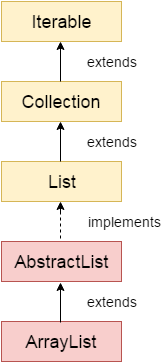

# Java - ArrayList

[Back](../index.md)

---

## ArrayList

- `Java ArrayList` class uses a **dynamic array** for storing the elements.
- It is like an array, but there is **no size limit**. We can add or remove elements anytime. So, it is much more flexible than the traditional array.
- In the `java.util` package.
- It **inherits** the `AbstractList` class and **implements** `List` interface.



- Features of ArrayList:

  - can contain **duplicate** elements.
  - maintains **insertion order**.
  - is **non synchronized**.
  - **allows random access** because the array works on an index basis.
  - manipulation is a little bit slower than the LinkedList in Java because a lot of shifting needs to occur if any element is removed from the array list.
  - required to use the required **wrapper class**.
    - can not create an array list of the primitive types, such as int, float, char, etc.
  - gets initialized by the size. The size is dynamic in the array list, which varies according to the elements getting added or removed from the list.

- Class declaration:
  - `public class ArrayList<E> extends AbstractList<E> implements List<E>, RandomAccess, Cloneable, Serializable`

---

## Java Non-generic Vs. Generic Collection

- `Java generic collection` allows you to have **only one type** of object in a collection.
  - it is type-safe, so **typecasting is not required** at runtime.
  - If you try to add another type of object, it gives a `compile-time error`.

```java
ArrayList list=new ArrayList();//creating old non-generic arraylist
ArrayList<String> list=new ArrayList<String>();//creating new generic arraylist
```

---

## Methods

- Constructors of ArrayList

| Constructor                            | Description                                                                                  |
| -------------------------------------- | -------------------------------------------------------------------------------------------- |
| `ArrayList()`                          | It is used to build an empty array list.                                                     |
| `ArrayList(Collection<? extends E> c)` | It is used to build an array list that is initialized with the elements of the collection c. |
| `ArrayList(int capacity)`              | It is used to build an array list that has the specified initial capacity.                   |

- CRUD Methods

| Method                                                   | Description                                                                                                                                                               |
| -------------------------------------------------------- | ------------------------------------------------------------------------------------------------------------------------------------------------------------------------- |
| `void add(int index, E element)`                         | It is used to insert the specified element at the specified position in a list.                                                                                           |
| `boolean add(E e)`                                       | It is used to append the specified element at the end of a list.                                                                                                          |
| `boolean addAll(Collection<? extends E> c)`              | It is used to append all of the elements in the specified collection to the end of this list, in the order that they are returned by the specified collection's iterator. |
| `boolean addAll(int index, Collection<? extends E> c)`   | It is used to append all the elements in the specified collection, starting at the specified position of the list.                                                        |
| `E remove(int index)`                                    | It is used to remove the element present at the specified position in the list.                                                                                           |
| `boolean remove(Object o)`                               | It is used to remove the first occurrence of the specified element.                                                                                                       |
| `boolean removeAll(Collection<?> c)`                     | It is used to remove all the elements from the list.                                                                                                                      |
| `boolean removeIf(Predicate<? super E> filter)`          | It is used to remove all the elements from the list that satisfies the given predicate.                                                                                   |
| `protected void removeRange(int fromIndex, int toIndex)` | It is used to remove all the elements lies within the given range.                                                                                                        |
| `void clear()`                                           | It is used to remove all of the elements from this list.                                                                                                                  |
| `E get(int index)`                                       | It is used to fetch the element from the particular position of the list.                                                                                                 |
| `E set(int index, E element)`                            | It is used to replace the specified element in the list, present at the specified position.                                                                               |
| `void replaceAll(UnaryOperator<E> operator)`             | It is used to replace all the elements from the list with the specified element.                                                                                          |
| `void retainAll(Collection<?> c)`                        | It is used to retain all the elements in the list that are present in the specified collection.                                                                           |
| `Object clone()`                                         | It is used to return a shallow copy of an ArrayList.                                                                                                                      |
| `Object[] toArray()`                                     | It is used to return an array containing all of the elements in this list in the correct order.                                                                           |
| `<T> T[] toArray(T[] a)`                                 | It is used to return an array containing all of the elements in this list in the correct order.                                                                           |
| `List<E> subList(int fromIndex, int toIndex)`            | It is used to fetch all the elements that lies within the given range.                                                                                                    |
| `Spliterator<E> spliterator()`                           | It is used to create a spliterator over the elements in a list.                                                                                                           |

- Info Methods

| Method                                      | Description                                                                                                                                    |
| ------------------------------------------- | ---------------------------------------------------------------------------------------------------------------------------------------------- |
| `int size()`                                | It is used to return the number of elements present in the list.                                                                               |
| `void trimToSize()`                         | It is used to trim the capacity of this ArrayList instance to be the list's current size.                                                      |
| `boolean contains(Object o)`                | It returns true if the list contains the specified element.                                                                                    |
| `int lastIndexOf(Object o)`                 | It is used to return the index in this list of the last occurrence of the specified element, or -1 if the list does not contain this element.  |
| `int indexOf(Object o)`                     | It is used to return the index in this list of the first occurrence of the specified element, or -1 if the List does not contain this element. |
| `void ensureCapacity(int requiredCapacity)` | It is used to enhance the capacity of an ArrayList instance.                                                                                   |
| `boolean isEmpty()`                         | It returns true if the list is empty, otherwise false.                                                                                         |
| `void sort(Comparator<? super E> c)`        | It is used to sort the elements of the list on the basis of the specified comparator.                                                          |
| `Iterator<E> Iterator()`                    | Returns an iterator over the elements in this list in proper sequence.                                                                         |
| `ListIterator<E> listIterator()`            | Returns a list iterator over the elements in this list (in proper sequence).                                                                   |

---

## Example

[ArrayList Code](./arraylist_code.md)

---

[Top](#java---arraylist)
