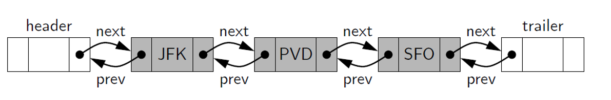
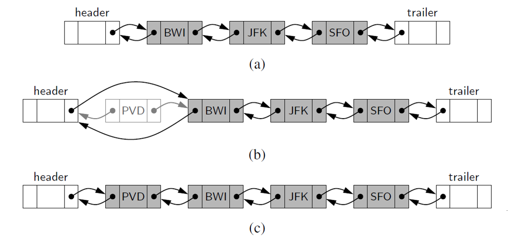
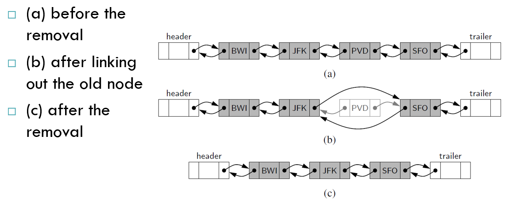

# DSA - Doubly Linked Lists

[Back](../index.md)

- [DSA - Doubly Linked Lists](#dsa---doubly-linked-lists)
  - [Doubly Linked Lists](#doubly-linked-lists)
    - [Append(): `O(1)`](#append-o1)
    - [Prepend(): `O(1)`](#prepend-o1)
    - [Pop():`O(1)`](#popo1)
    - [Pop\_first(): `O(1)`](#pop_first-o1)
    - [Get(): `O(n)`](#get-on)
    - [Set\_value(): `O(n)`](#set_value-on)
    - [Insert(): `O(n)`](#insert-on)
    - [Remove(): `O(n)`](#remove-on)

---

## Doubly Linked Lists

- `Doubly linked list`

  - a linked list in which each node keeps an explicit **reference to the node before** it and a **reference to the node after** it.

  - allow a greater **variety** of `O(1)`-time update operations, including insertions and deletions.

- `next`:

  - the reference to the node that **follows** another.

- `prev`:

  - the reference to the node that **precedes** it.

- `sentinels (or guards)`
  - special nodes are added at both ends of the list.
  - a `header node` at the **beginning** of the list
  - a `trailer node` at the **end** of the list.



```sql
class Node:
    def __init__(self, value):
        self.value = value
        self.next = None
        self.prev = None


class DoublyLinkedList:
    def __init__(self, value) -> None:
        new_node = Node(value)
        self.head = new_node
        self.tail = new_node
        self.length = 1
```

---

### Append(): `O(1)`

```py
def append(self, value):
    new_node = Node(value)
    if self.head is None:
        self.head = new_node
        self.tail = new_node
    else:
        self.tail.next = new_node
        new_node.prev = self.tail
        self.tail = new_node
    self.length += 1
    return True
```

---

### Prepend(): `O(1)`

```py
def prepend(self, value):
  new_node = Node(value)
  # When dll has only one node, head=tail=node
  if self.length == 0:
      self.head = new_node
      self.tail = new_node
  # when dll has more than one node
  else:
      new_node.next = self.head
      self.head.prev = new_node
      self.head = new_node
  self.length += 1
  return True
```

---

### Pop():`O(1)`

```py
def pop(self):
  if self.length == 0:
      return None

  temp = self.tail
  # When dll has only one node, then head=tail=None
  if self.length == 1:
      self.head = self.tail = None
  # When dll has more than one node
  else:
      self.tail = self.tail.prev
      self.tail.next = None
      temp.prev = None
  self.length -= 1
  return temp
```

---

### Pop_first(): `O(1)`

```py
def pop_first(self):

  if self.length == 0:
      return None

  temp = self.head
  # when dll has only one node, then head=tail=none
  if self.length == 1:
      self.head = self.tail = None
  # when dll has more than one node
  else:
      self.head = self.head.next
      self.head.prev = None
      temp.next = None
  self.length -= 1
  return temp
```

---

### Get(): `O(n)`

```py
def get(self, index):
    if index < 0 or index >= self.length:
        return None
    temp = self.head
    # if index is on the first half, traverse from the head
    if index < self.length/2:
        for _ in range(index):
            temp = temp.next
    # if index is on the second half, traverse from the tail
    else:
        temp = self.tail
        for _ in range(self.length - 1, index, -1):
            temp = temp.prev
    return temp
```

---

### Set_value(): `O(n)`

```py
def set_value(self, index, value):
    temp = self.get(index)
    if temp:
        temp.value = value
        return True
    return False
```

---

### Insert(): `O(n)`

- Every **insertion** into our doubly linked list representation will take place between a pair of existing nodes

- When a new element is **inserted at the front of** the sequence, we will simply add the new node between the **header** and the **node that is currently after** the header.




```py
def insert(self, index, value):
    if index < 0 or index > self.length:
        return False
    if index == 0:
        return self.prepend(value)
    if index == self.length:
        return self.append(value)

    new_node = Node(value)
    before = self.get(index - 1)
    after = before.next

    new_node.prev = before
    new_node.next = after
    before.next = new_node
    after.prev = new_node

    self.length += 1
    return True
```

---

### Remove(): `O(n)`

- The **two neighbors** of the node to be deleted are linked directly to each other

- As a result, that node will no longer be considered part of the list and it can be reclaimed by the system.

- Because of sentinels, the same implementation can be used when deleting the first or the last element of a sequence.



```py
def remove(self, index):
    if index < 0 or index >= self.length:
        return None
    if index == 0:
        return self.pop_first()
    if index == self.length - 1:
        return self.pop()

    temp = self.get(index)

    temp.next.prev = temp.prev
    temp.prev.next = temp.next
    temp.next = None
    temp.prev = None

    self.length -= 1
    return temp
```

---

[TOP](#dsa---doubly-linked-lists)
