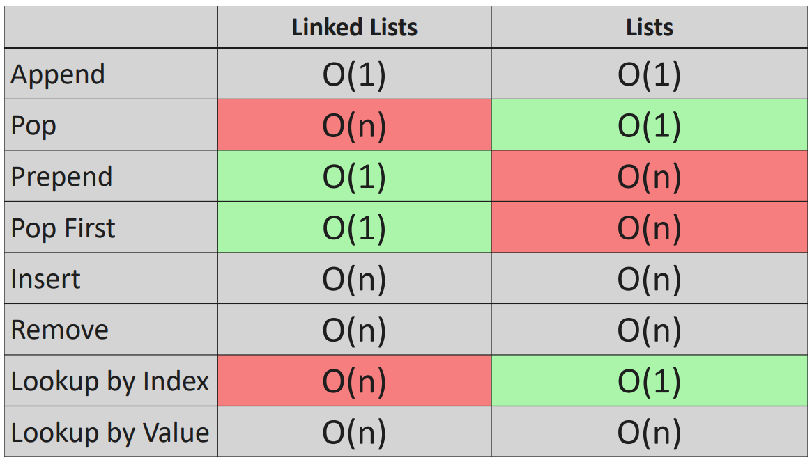
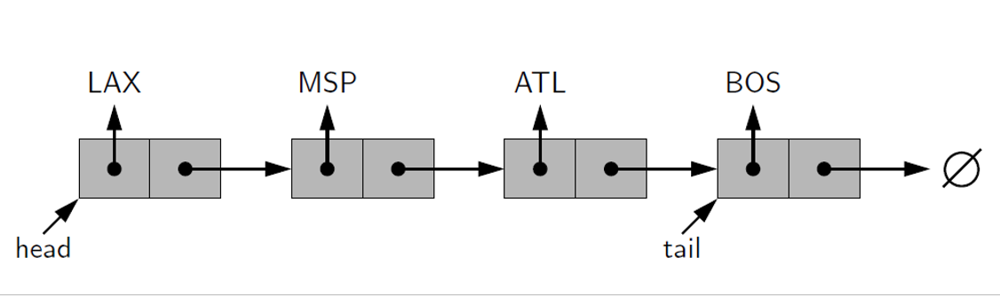
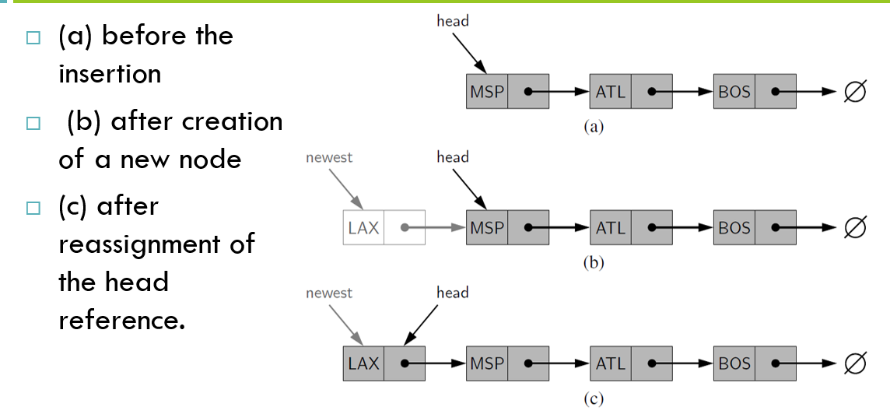
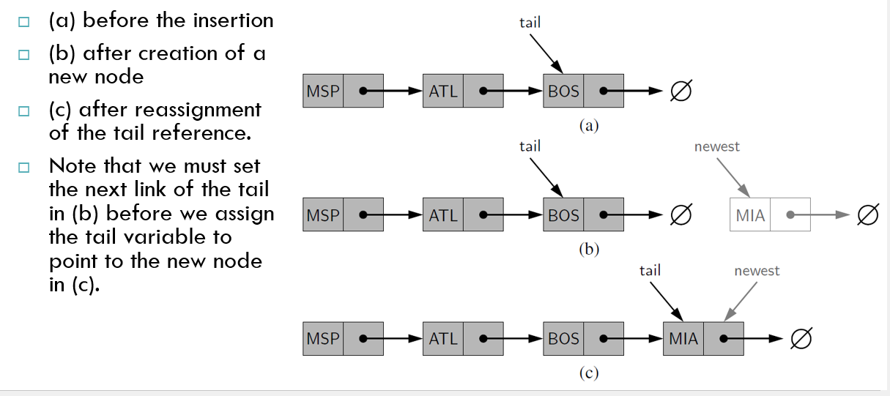
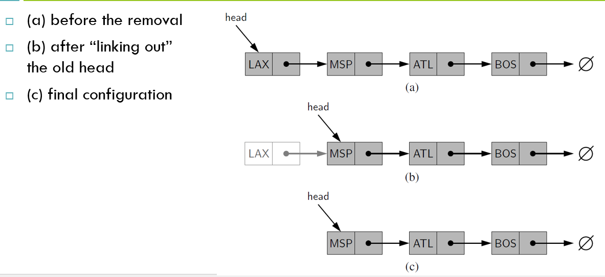
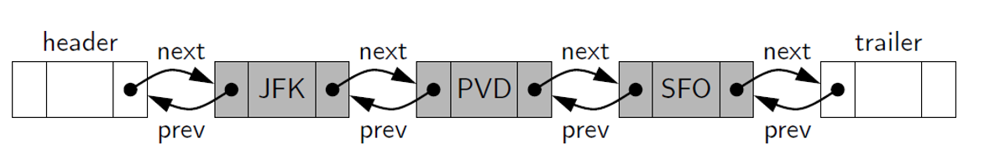
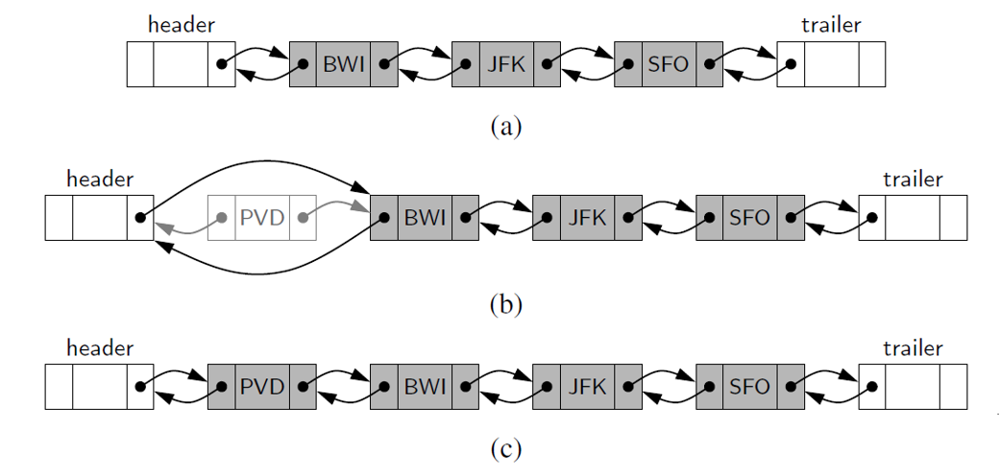
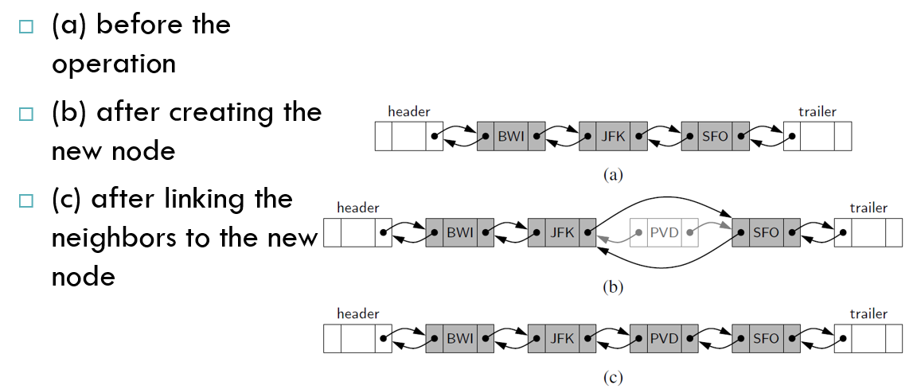
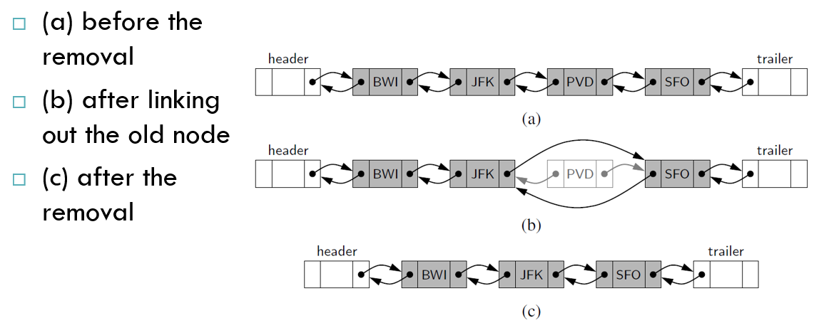

# DSA - Linked List

[Back](../index.md)

- [DSA - Linked List](#dsa---linked-list)
  - [Big O: Linked List vs List](#big-o-linked-list-vs-list)
  - [Singly Linked List](#singly-linked-list)
    - [Prepend:](#prepend)
    - [Append(): `O(1)`](#append-o1)
    - [Prepend():`O(1)`](#prependo1)
    - [Pop(): `O(n)`](#pop-on)
    - [Pop\_first(): `O(1)`](#pop_first-o1)
    - [Get(): `O(n)`](#get-on)
    - [Insert(): `O(n)`](#insert-on)
    - [Remove(): `O(n)`](#remove-on)
    - [Reverse(): `O(n)`](#reverse-on)
    - [Print a Linked List](#print-a-linked-list)
    - [Problem: Singly Linked List](#problem-singly-linked-list)
      - [Implement Singly Linked List](#implement-singly-linked-list)
      - [Singly Linked List Cycle Check](#singly-linked-list-cycle-check)
      - [Nth to Last Node](#nth-to-last-node)
      - [Linked List Reversal](#linked-list-reversal)
  - [Doubly Linked Lists](#doubly-linked-lists)
    - [Inserting and Deleting with a Doubly Linked List](#inserting-and-deleting-with-a-doubly-linked-list)
    - [Deletion of a Node](#deletion-of-a-node)
    - [Problem: Doubly Linked Lists](#problem-doubly-linked-lists)
      - [Implement a Doubly Linked List](#implement-a-doubly-linked-list)

---

## Big O: Linked List vs List



---

## Singly Linked List

- `Singly linked list`

  - is a **collection of nodes** that collectively form a **linear sequence**.

- Each `node` **stores a reference to an object** that is an element of the sequence, as well as a **reference to the next node** of the list.

- `head`

  - the head of the list
  - the first node of a linked list

- `tail`

  - the tail of the list
  - the last node of a linked list

- Because **the next reference of a node** can be viewed as a `link` or `pointer` to another node, the process of `traversing` a list is also known as `link hopping` or `pointer hopping`.



- An important property of a linked list is that it does **not have a predetermined fixed size**没有固定长度

```py
class Node(object):
  def __init__(self, value):
    self.value = value
    self.next = None    # the pointer to the next node


class Linked_list(object):
  def __init__(self,value):
    new_node = Node(value)
    # By default, the head and tail of a LL is the first the node
    self.head = new_node
    self.tail = new_node

    self.length = 1

```

---

### Prepend:

- **Prepend**:

  - Inserting an Element at the Head of a Singly Linked List

- It uses space proportionally to its current number of elements.
- To insert a new element at the head of the list:
  - 1. We create a new node
  - 2. Set its element to the new element
  - 3. set its next link to refer to the current head
  - 4. then set the list’s head to point to the new node.



```py

new_head = Node()

new_head.value = value
new_head.next = linked_list.head

linked_list.head = new_head

```

---

### Append(): `O(1)`

- **Append**

  - Inserting an Element at the Tail of a Singly Linked List

- We can also easily insert an element at the tail of the list, provided we keep a reference to the tail node
  - Create a new node
  - Assign its next reference to None
  - Set the next reference of the tail to point to this new node
  - Then update the tail reference itself to this new node.



```py

def append(self, value):
    new_node = Node(value)

    # situation:
    # when the current linked list is empty, then update head and tail
    if self.head is None:
        self.head = new_node
        self.tail = new_node

    # situation:
    # when the current linked list is not empty, then update tail pointer
    else:
        self.tail.next = new_node   # update the next point of current tail node
        self.tail = new_node        # set the tail point as the new node

    self.length += 1    # update length of linked list

    return True

```

---

### Prepend():`O(1)`

- **Prepend**

  - Inserting an Element at the **head** of a Singly Linked List

```py
def prepend(self, value):

    new_node = Node(value)

    # when LL is empty, then set head and tail both as new node
    if self.length == 0:
        self.head = new_node
        self.tail = new_node
    # when LL is not empty, then update head
    else:
        new_node.next = self.head
        self.head = new_node

    self.length += 1

    return True
```

---

### Pop(): `O(n)`

- Removing the last Element from a Singly Linked List

- Removing an element from the `head` of a singly linked list is essentially the reverse operation of inserting a new element at the head.

  

- We cannot easily delete the **last node** of a singly linked list.
- Even if we maintain a tail reference directly to the last node of the list, we must be able to access the node before the last node in order to remove the last node.
- But we cannot reach the node before the tail by following next links from the tail.
- If we want to support such an operation efficiently, we will need to make our list `doubly linked`

```py
def pop(self):

    # when LL is empty
    if self.length == 0:
        return None

    # when LL is not empty
    # initialize helping variables
    current = pre = self.head

    # loop LL until the current is the tail, whose next is None
    # when LL has only one node, that is head equal to tail, loop wont run
    while current.next:
        pre = current
        current = current.next

    self.tail = pre
    self.tail.next = None
    self.length -= 1     # update length

    # when LL has only one node, the length is 0, then set both head and tail as None
    if self.length == 0:
        self.head = None
        self.tail = None

    return current
```

---

### Pop_first(): `O(1)`

- Removing the first Element from a Singly Linked List

```py
def pop_first(self):
    # when LL is empty, then return None
    if self.length == 0:
        return None

    # when LL is not empty, then update head
    temp = self.head
    self.head = self.head.next  # when LL has only one node, head next = None
    temp.next = None
    self.length -= 1

    # when LL is empty after pop, set tail as None
    if self.length == 0:
        self.tail = None

    return temp
```

---

### Get(): `O(n)`

- Get the node at the specific index

```py
def get(self, index):

    if index < 0:
        raise Exception("invalid index")

    if index >= self.length:
        raise Exception("index out of bound")

    current = self.head
    # 该处使用for loop, 是因为以上代码已经排除了非法index, 所以只需循环指定次数即可
    # 该处使用下划线, 是因为循环中不需要for loop的标记; 如果需要使用, 一般使用for i in range()
    for _ in range(index):
        current = current.next      # 因为range是exclusive, 所以最后的current所在的是index node的前一个node
    return current
```

---

### Insert(): `O(n)`

- Insert a new node with a value into a specific index

```py
def insert(self, index, value):

    # when index is invalid
    if index < 0 or index > self.length:
        return False

    # when value is added at the beginning
    if index == 0:
        return self.prepend(value)

    # when value is added at the end
    if index == self.length:
        return self.append(value)

    # when value is added at neither the beginning nor the end
    new_node = Node(value)

    # get the previous node
    pre_node = self.get(index-1)

    new_node.next = pre_node.next        # set new node next
    pre_node.next = new_node            # set pre node next

    self.length +=1
    return True
```

---

### Remove(): `O(n)`

- remove a node at a specific index

```py
def remove(self, index):

    # when index is invalid
    if index < 0  or index >= self.length:
        return None

    # when value is added at the beginning
    if index == 0:
        return self.pop_first()

    # when value is added at the end
    if index == self.length-1:
        return self.pop()

    # the invalid index will trigger exception in the get() method
    # get the previous node
    pre_node = self.get(index-1)
    current = pre_node.next

    pre_node.next = current.next        # set pre node next
    current.next = None                 # set current node next

    self.length -=1

    return current
```

---

### Reverse(): `O(n)`

- Reverse the order of items in a linked list.

```py
def reverse(self):

    current = self.head
    prev = None
    while current is not None:

        temp_next = current.next
        current.next = prev

        prev = current
        current = temp_next

    self.head, self.tail = self.tail, self.head
```

---

### Print a Linked List

```py
class Node(object):
    def __init__(self, value):
        self.value = value
        self.next = None    # the pointer to the next node


class Linked_list(object):
    def __init__(self, value):
        new_node = Node(value)
        # By default, the head and tail of a LL is the first the node
        self.head = new_node
        self.tail = new_node

        self.length = 1

    def print_linked_list(self):

        # craete a temporary pointer and initiate by pointing to the head.
        temp = self.head

        # loop until the tail, whose next node is None.
        while temp is not None:
            print(temp.value)
            # update the temporary pointer by pointing to the next node.
            temp = temp.next


ll = Linked_list(4)
ll.print_linked_list()

```

---

### Problem: Singly Linked List

#### Implement Singly Linked List

For this interview problem, create a node class and show how it can be used to create a Singly Linked List

[Implement singly linked list](./problem_implement_singly_linked_list.ipynb)

---

#### Singly Linked List Cycle Check

Given a singly linked list, write a function which takes in the first node in a singly linked list and returns a boolean indicating if the linked list contains a "cycle".

A cycle is when a node's next point actually points back to a previous node in the list. This is also sometimes known as a circularly linked list.

[Singly Linked List Cycle Check](./problem_singly_linked_list_cycle_check.ipynb)

---

#### Nth to Last Node

Write a function that takes a head node and an integer value **n** and then returns the nth to last node in the linked list.

[Nth to Last Node](./problem_singly_linked_list_Nth_to_last_node.ipynb)

---

#### Linked List Reversal

Write a function to reverse a Linked List in place. The function will take in the head of the list as input and return the new head of the list.

[Linked List Reversal](./problem_singly_linked_list_reversal.ipynb)

---

## Doubly Linked Lists

- `Doubly linked list`

  - a linked list in which each node keeps an explicit **reference to the node before** it and a **reference to the node after** it.

  - allow a greater **variety** of `O(1)`-time update operations, including insertions and deletions.

- `next`:

  - the reference to the node that **follows** another.

- `prev`:

  - the reference to the node that **precedes** it.

- `sentinels (or guards)`
  - special nodes are added at both ends of the list.
  - a `header node` at the **beginning** of the list
  - a `trailer node` at the **end** of the list.



---

### Inserting and Deleting with a Doubly Linked List

- Every **insertion** into our doubly linked list representation will take place between a pair of existing nodes

- When a new element is **inserted at the front of** the sequence, we will simply add the new node between the **header** and the **node that is currently after** the header.





---

### Deletion of a Node

- The **two neighbors** of the node to be deleted are linked directly to each other

- As a result, that node will no longer be considered part of the list and it can be reclaimed by the system.

- Because of sentinels, the same implementation can be used when deleting the first or the last element of a sequence.



---

### Problem: Doubly Linked Lists

#### Implement a Doubly Linked List

For this interview problem, implement a node class and show how it can be used to create a doubly linked list.

[Implement a Doubly Linked List](./problem_implement_doubly_linked_list.ipynb)

---

[TOP](#dsa---linked-list)
