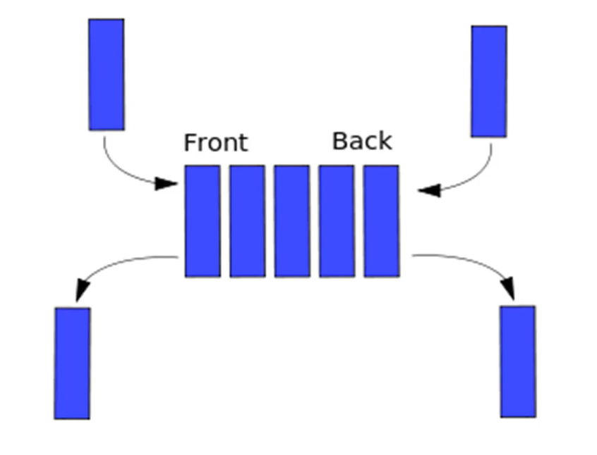

# DSA - Deque

[Back](../../index.md)

- [DSA - Deque](#dsa---deque)
  - [Deque](#deque)
  - [Implement Deque in Python](#implement-deque-in-python)
  - [Problem: Deque](#problem-deque)
    - [Implement a Deque](#implement-a-deque)

---

## Deque

- `Deque`

  - a double-ended queue
  - an ordered collection of items similiar to the queue.
  - has two ends, a `front` and a `rear`, and the items remain **positioned** in the collection.

- A hybrid linear structure provides all the capabilities of `stacks` and `queue` in a single data structure.
  - The nature of adding and removing items is **unrestrictive**.
    - New items can be **added at either the front or the rear.**
    - Existing items can be removed from either end.
  - does **not require** the `LIFO` and `FIFO` orderings.



---

## Implement Deque in Python

```py
class Deque(object):
    def __init__(self):
        self.items = []

    def isEmpty(self):
        return self.items == []

    def size(self):
        return len(self.items)

    def AddFront(self, obj):
        self.items.insert(0, obj)

    def addRear(self, obj):
        self.items.append(obj)

    def removeFront(self):
        return self.items.pop(0)

    def removeRear(self):
        return self.items.pop()


print("\n--------Create--------\n")
d = Deque()

print("isEmpty\t", d.isEmpty())         # isEmpty  True


print("\n--------Add--------\n")

d.addRear(1)
d.AddFront("two")

print("size\t", d.size())               # size     2
print("isEmpty\t", d.isEmpty())         # isEmpty  False


print("\n--------Remove--------\n")

print("removeFront\t", d.removeFront())     # removeFront      two
print("removeRear\t", d.removeRear())       # removeRear       1

print("size\t", d.size())                   # size     0
print("isEmpty\t", d.isEmpty())             # isEmpty  True

```

---

## Problem: Deque

### Implement a Deque

Finally, implement a Deque class! It should be able to do the following:

- Check if its empty
- Add to both front and rear
- Remove from Front and Rear
- Check the Size

[Implement a Deque](./problem_implement_deque.ipynb)

---

[TOP](#dsa---deque)
