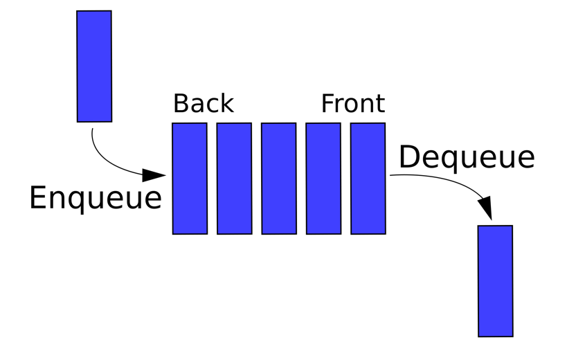

# DSA - Queue

[Back](../index.md)

- [DSA - Queue](#dsa---queue)
  - [Queue](#queue)
  - [Implement Queue in Python: Using Linked list](#implement-queue-in-python-using-linked-list)
    - [Constructor](#constructor)
    - [Enqueue():`O(1)`](#enqueueo1)
    - [Dequeue():`O(1)`](#dequeueo1)
  - [Implement Queue in Python: Using a list](#implement-queue-in-python-using-a-list)

---

## Queue

- `Queue`

  - an ordered collection of items where the addition of new items happens at one end, called the `rear`, and the removal of existing items occurs at the other end, commonly called the `front`.
  - As an element **enters** the queue it starts **at the rear** and makes its way toward the front, waiting until that time when it is the next element to be removed.

- The **most recently added item** in the queue must **wait at the end** of the collection. The item that has been in the collection **the longest** is **at the front**.

- `First-in first-out (FIFO)`
  - **first-come first-served**



- `Enqueue`

  - The term describes when a new item is **added to the rear** of the queue.

- `Dequeue`
  - The term describes removing the front item from the queue.

---

## Implement Queue in Python: Using Linked list

### Constructor

```py
class Node:
    def __init__(self, value):
        self.value = value
        self.next = None

class Queue:
    def __init__(self, value):
        new_node = Node(value)
        self.first = new_node
        self.last = new_node
        self.length = 1

    def print_queue(self):
        temp = self.first
        while temp is not None:
            print(temp.value)
            temp = temp.next
```

---

### Enqueue():`O(1)`

```py
def enqueue(self, value):
    new_node = Node(value)
    if self.first is None:
        self.first = new_node
        self.last = new_node
    else:
        self.last.next = new_node
        self.last = new_node
    self.length += 1
```

---

### Dequeue():`O(1)`

```py
def dequeue(self):
    if self.length == 0:
        return None
    temp = self.first
    if self.length == 1:
        self.first = None
        self.last = None
    else:
        self.first = self.first.next
        temp.next = None
    self.length -= 1
    return temp
```

---

## Implement Queue in Python: Using a list

```py
class Queue(object):
    def __init__(self):
        self.items = []

    def isEmpty(self):
        return self.items == []

    def size(self):
        return len(self.items)

    def peek(self):
        return self.items[0]

    def push(self, obj):
        self.items.append(obj)

    def pop(self):
        return self.items.pop(0)


print("\n--------Create--------\n")
s = Queue()

print("isEmpty\t", s.isEmpty())         # isEmpty  True


print("\n--------Add--------\n")

s.push(1)
s.push("two")

print("peek\t", s.peek())               # peek     1
print("size\t", s.size())               # size     2
print("isEmpty\t", s.isEmpty())         # isEmpty  False


print("\n--------Remove--------\n")

print("pop\t", s.pop())                 # pop      1
print("pop\t", s.pop())                 # pop      two

print("size\t", s.size())               # size     0
print("isEmpty\t", s.isEmpty())         # isEmpty  True

```

---

[TOP](#dsa---queue)
