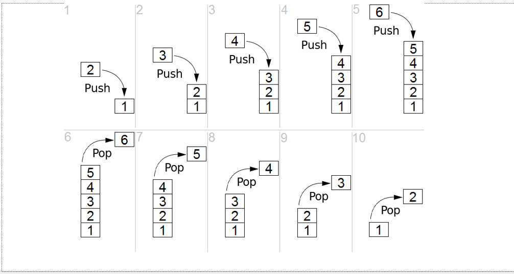

# DSA - Stack

[Back](../index.md)

- [DSA - Stack](#dsa---stack)
  - [Stack](#stack)
  - [Implement Stack: Using Linked List](#implement-stack-using-linked-list)
    - [Constructor](#constructor)
    - [Push(): `O(1)`](#push-o1)
    - [Pop(): `O(1)`](#pop-o1)
  - [Implement Stack in Python: Using list](#implement-stack-in-python-using-list)
  - [Trick: Implement a Queue - Using Two Stacks](#trick-implement-a-queue---using-two-stacks)

---

## Stack

- `stack`

  - an **ordered collection** of items where the addition of new items and the removal of existing items always takes place at the same end.
  - This end is commonly referred to as the `top`.
  - The end opposite the top is known as the `base`.

- The `base` of the stack is significant since items stored in the stack that are closer to the base represent those that have been in the stack **the longest**.
- **The most recently added** item is the one that is in position to be **removed first**.

- `Last-in first-out,(LIFO)`
  - the ordering principle of stack
  - an ordering **based on length of time** in the collection.
  - **Newer** items are near the **top**, while **older** items are near the **base**.



- The order of **insertion** is the **reverse** of the order of **removal**.

- For example, every web browser has a Back button.

---

## Implement Stack: Using Linked List

### Constructor

```py
class Node:
    def __init__(self, value):
        self.value = value
        self.next = None


class Stack:
    def __init__(self, value):
        new_node = Node(value)
        self.height = 1
        self.top = new_node
```

---

### Push(): `O(1)`

```py
def push(self, value):
    new_node = Node(value)
    if self.height == 0:
        self.top = new_node
    else:
        new_node.next = self.top
        self.top = new_node
    self.height += 1
```

---

### Pop(): `O(1)`

```py
def pop(self):
    if self.height == 0:
        return None
    temp = self.top
    self.top = self.top.next
    temp.next = None
    self.height -= 1
    return temp
```

---

## Implement Stack in Python: Using list

```py
class Stack(object):
    def __init__(self):
        self.items = []

    def push(self, obj):
        self.items.append(obj)

    def pop(self):
        return self.items.pop()

    def peek(self):
        return self.items[len(self.items)-1]

    def isEmpty(self):
        return self.items == []

    def size(self):
        return len(self.items)


print("\n--------Create--------\n")
s = Stack()

print("isEmpty\t", s.isEmpty())     # isEmpty  True


print("\n--------Add--------\n")

s.push(1)
s.push("two")

print("peek\t", s.peek())               # peek     two
print("size\t", s.size())               # size     2
print("isEmpty\t", s.isEmpty())         # isEmpty  False


print("\n--------Remove--------\n")

print("pop\t", s.pop())                 # pop      two
print("pop\t", s.pop())                 # pop      1

print("size\t", s.size())               # size     0
print("isEmpty\t", s.isEmpty())         # isEmpty  True

```

---

## Trick: Implement a Queue - Using Two Stacks

Given the Stack class below, implement a Queue class using **two** stacks! Note, this is a "classic" interview problem. Use a Python list data structure as your Stack.

```py
class Queue2Stacks(object):

    def __init__(self):

        # Two Stacks
        self.instack = []
        self.outstack = []

    def enqueue(self, element):

        # Add an enqueue with the "IN" stack
        self.instack.append(element)

    def dequeue(self):
        if not self.outstack:
            while self.instack:
                # Add the elements to the outstack to reverse the order when called
                self.outstack.append(self.instack.pop())
        return self.outstack.pop()

'''
## Summary

- 效率:

  - 最好: `O(1)`
  - 最坏: `O(N)`

- 思路:
  - 图解:
    - 结构:|inStack| external |outStack|
    - 插入时: |1,2,3| external | |
    - 取出(目标值是 1): | | external <-1 | 2,3 |
    - 插入 4: |4 | external |2,3|
    - 取出(目标值是 2): | 4 | external <-2 | 3 |
  - 利用进入 stack 可以颠倒顺序
    - 插入的新元素 stack 在 inStack 中
    - 从 inStack 提取时, 即颠倒了顺序, 并将颠倒顺序的元素存储在 outStack
    - outStack 作用是 buffer
    - pop 时, 直接从 outStack pop 即可.
  - 只有当 outStack 为空时才需要颠倒顺序; 如果不为空, 则直接从 outStack 中 pop. 提高效率.
'''
```

---

[TOP](#dsa---stack)
