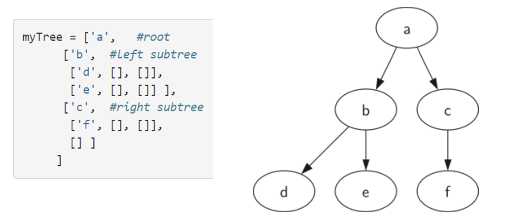

# DSA - Tree

[Back](../index.md)

- [DSA - Tree](#dsa---tree)
  - [Tree](#tree)
    - [Terminology](#terminology)
    - [Recursive Definition](#recursive-definition)
  - [Tree Traversals](#tree-traversals)
    - [Preorder](#preorder)
    - [Inorder](#inorder)
    - [Postorder](#postorder)
  - [Binary Tree](#binary-tree)
  - [Implement a Binary Tree: Using linked list](#implement-a-binary-tree-using-linked-list)
    - [Implement a Binary Tree in Python: Using List](#implement-a-binary-tree-in-python-using-list)
    - [Implement a Binary Tree in Python: Using OOP](#implement-a-binary-tree-in-python-using-oop)
  - [Practice](#practice)

---

## Tree

- `Tree`

  - a tree consists of a set of nodes and set of edges that connect pairs of nodes.

- Properties:

  - One node of the tree is designated as the root node.根唯一性
  - Each node, except the root node, is connected by an edge from **exactly one parent node**. 父节唯一.
  - A **unique path** traverses from the root to each node.根路径唯一.

- `Binary tree`
  - a tree has a maximum of two children.

---

### Terminology

- `Node`

  - a fundamental part of a tree.
  - `key`: the name of a node
  - A node may have additional information, aka `payload`

- `Edge`

  - connects two nodes to show relationship between them.
  - Each node, except the root, is connected by exactly **one incoming edge** from another node.
  - Each node may have **several outgoing edges**.

- `Root`

  - the only node in the tree that has no **incoming edges**.

- `Path`

  - an **ordered list of nodes** that are connected by edges.

- `Children` of a node

  - the set of nodes "c" that have **incoming edges** from the that node.

- `Parent` of a node

  - the node that connects to another nodes **with outgoing edges**.

- `Sibling`

  - the children of the same parent.

- `Leaf Node`

  - a node that has **no children**.

- `Subtree`

  - a set of **nodes and edges** comprised of a parent and its all the descendants.

- `Level`

  - the **number of edges on the path from the root node** to a specific node.

- `Height`
  - the **maximum level** of any node in the tree.

---

### Recursive Definition

- A tree is either empty or consists of a root and zero or **more subtrees**, each of which is **also a tree**.

- The root of each subtree is connected to the root of the parent tree by an edge.

---

## Tree Traversals

- Three commonly used patterns to visit all the nodes in a tree:

  - preorder,
  - inorder,
  - and postorder.

- The difference between these patterns is **the orde**r in which each node is visited (a `traversal`)

- Best Implementation

  - Implementing preorder as **an external function** is probably better in this case.
  - The reason is that you very rarely want to just traverse the tree.
  - In most cases you are going to want to **accomplish something** else while using one of the basic traversal patterns.
  - We will write the rest of the traversals as external functions.

---

### Preorder

- In a `preorder traversal`, we visit the **root node** first, then recursively do a preorder traversal of the **left subtree**, followed by a recursive preorder traversal of the **right subtree**.

- root node >> left subtree >> right subtree

```py
class Binary_Tree(object):

    def __init__(self, node_name):
        self.name = node_name
        self.left_child = None
        self.right_child = None

    def get_rootName(self):
        return self.name

    def set_rootName(self, new_rootName):
        self.name = new_rootName

    def get_leftChild(self):
        return self.left_child

    def get_rightChild(self):
        return self.right_child

    def insert_leftChild(self, leftChild_name):

        # when left_child has an existing node
        if self.left_child != None:
            # create a new child
            new_node = Binary_Tree(leftChild_name)

            # copy the existing child to the left child of the new node
            new_node.left_child = self.left_child

            # insert the new child to this node
            self.left_child = new_node

        else:
            self.left_child = Binary_Tree(leftChild_name)

    def insert_rightChild(self, rightChild_name):

        # when right_child has an existing node
        if self.right_child != None:
            # create a new child
            new_node = Binary_Tree(rightChild_name)

            # copy the existing child to the right child of the new node
            new_node.right_child = self.right_child

            # insert the new child to this node
            self.right_child = new_node

        else:
            self.right_child = Binary_Tree(rightChild_name)


def preorder(tree):

    acc = []

    if tree:
        acc.append(tree.name)
        acc.extend(preorder(tree.left_child))
        acc.extend(preorder(tree.right_child))

    return acc


print("\n--------Tree (list)--------\n")
bi_tree = Binary_Tree("root")

bi_tree.insert_leftChild("leftChild")
bi_tree.insert_rightChild("rightChild")

l_ch = bi_tree.get_leftChild()
l_ch.insert_rightChild("Child_child")

# preoder:         ['root', 'leftChild', 'Child_child', 'rightChild']
print("preoder:\t", preorder(bi_tree))
```

---

### Inorder

- In an `inorder traversal`, we recursively do an inorder traversal on the **left subtree**, visit the **root node**, and finally do a recursive inorder traversal of the **right subtree**.

- 在 bst 排序中使用

```py
def inorder(tree):
  if tree:
    preorder(tree.getLeftChild())
    print(tree.getRootVal())
    preorder(tree.getRightChild())
```

---

### Postorder

- In a `postorder traversal`, we recursively do a postorder traversal of the **left subtree** and the **right subtree** followed by a visit to the **root node**.

- 在 bst 的 trim 问题中使用

```py
def postorder(tree):
  if tree:
    preorder(tree.getLeftChild())
    preorder(tree.getRightChild())
    print(tree.getRootVal())
```

---

## Binary Tree

- `binary tree`

  - a data structure in which **each node has at most two children**, which are referred to as the **left child** and the **right child**.

- `full binary tree`

  - 对每个字节, 要么没有子节, 要么有两个字节

- `perfect binary tree`

  - a binary tree in which **all interior nodes have two children** and all **leaves** have the same depth or **same level**. 每层都填满

- `complete binary tree`

  - a binary tree in which every level, except possibly the last, is **completely filled**, and all nodes in the last level are **as far left as possible**.从左到右填充

- `balanced binary tree`

  - a binary tree structure in which the **left and right subtrees** of every node **differ in height by no more than 1**.

- Use case:
  - used to implement `binary search trees` and `binary heaps`
  - used for efficient **searching and sorting**.
    In computing, binary trees are used in two very different ways:

---

## Implement a Binary Tree: Using linked list

```

```

---

### Implement a Binary Tree in Python: Using List

- store the **value of the root node** as the **first element** of the list.
- The **second element** of the list will itself be a **list** that represents the **left subtree**.
- The **third element** of the list will be another **list** that represents the **right subtree**.



```py
def binary_tree(root_value):
    return [root_value, [], []]


def get_root(b_tree):
    return b_tree[0]


def set_root(b_tree, new_root_value):
    b_tree[0] = new_root_value


def get_leftChild(b_tree):
    return b_tree[1]


def get_rightChild(b_tree):
    return b_tree[2]


def insert_leftChild(b_tree, branch_value):

    # remove the left child
    t = b_tree.pop(1)

    # when left child is not empty
    # condition: length over 1.
    # It can be 1, means the left child has a name but no subchild.
    # Over 1, means the left child has subchildren.
    if len(t) > 1:
        b_tree.insert(1, [branch_value, t, []])

    # when left child is empty
    else:
        b_tree.insert(1, [branch_value, [], []])

    return b_tree


def insert_rightChild(b_tree, branch_value):

    # remove the right child
    t = b_tree.pop(2)

    # when right child is not empty
    # condition: length over 1.
    # It can be 1, means the right child has a name but no subchild.
    # Over 1, means the right child has subchildren.
    if len(t) > 1:
        b_tree.insert(2, [branch_value, [], t])

    # when right child is empty
    else:
        b_tree.insert(2, [branch_value, [], []])


print("\n--------Tree (list)--------\n")
bi_tree = binary_tree("root")

insert_leftChild(bi_tree, "leftChild")
insert_rightChild(bi_tree, "rightChild")


print("get root\t", get_root(bi_tree))

set_root(bi_tree, "newRoot")
print("get new root\t", get_root(bi_tree))

l_child = get_leftChild(bi_tree)
r_child = get_rightChild(bi_tree)
print("left child:\t", l_child)
print("right child:\t", r_child)

set_root(l_child, "newLeftChild")

print("new left child\t", get_root(bi_tree))
print("new left child:\t", l_child)

```

---

### Implement a Binary Tree in Python: Using OOP

- define a **class** that has **attributes for the root value**, as well as the **left and right subtrees**.

```py
class Binary_Tree(object):

    def __init__(self, node_name):
        self.name = node_name
        self.left_child = None
        self.right_child = None

    def get_rootName(self):
        return self.name

    def set_rootName(self, new_rootName):
        self.name = new_rootName

    def get_leftChild(self):
        return self.left_child

    def get_rightChild(self):
        return self.right_child

    def insert_leftChild(self, leftChild_name):

        # when left_child has an existing node
        if self.left_child != None:
            # create a new child
            new_node = Binary_Tree(leftChild_name)

            # copy the existing child to the left child of the new node
            new_node.left_child = self.left_child

            # insert the new child to this node
            self.left_child = new_node

        else:
            self.left_child = Binary_Tree(leftChild_name)

    def insert_rightChild(self, rightChild_name):

        # when right_child has an existing node
        if self.right_child != None:
            # create a new child
            new_node = Binary_Tree(rightChild_name)

            # copy the existing child to the right child of the new node
            new_node.right_child = self.right_child

            # insert the new child to this node
            self.right_child = new_node

        else:
            self.right_child = Binary_Tree(rightChild_name)


print("\n--------Tree (Class)--------\n")
bi_tree = Binary_Tree("root")

bi_tree.insert_leftChild("leftChild")
bi_tree.insert_rightChild("rightChild")


print("get root\t", bi_tree.get_rootName())

bi_tree.set_rootName("newRoot")
print("get new root\t", bi_tree.get_rootName())

l_child = bi_tree.get_leftChild()
r_child = bi_tree.get_rightChild()
print("left child:\t", l_child)
print("left child name:\t", l_child.get_rootName())
print("right child:\t", r_child)
print("right child name:\t", r_child.get_rootName())

l_child.set_rootName("newLeftChild")

print("new left child name:\t", l_child.get_rootName())

```

---

## Practice

[problem](./problem_tree.ipynb)

---

[TOP](#dsa---tree)
