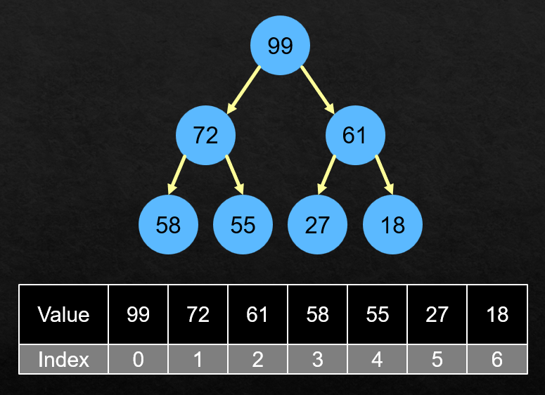
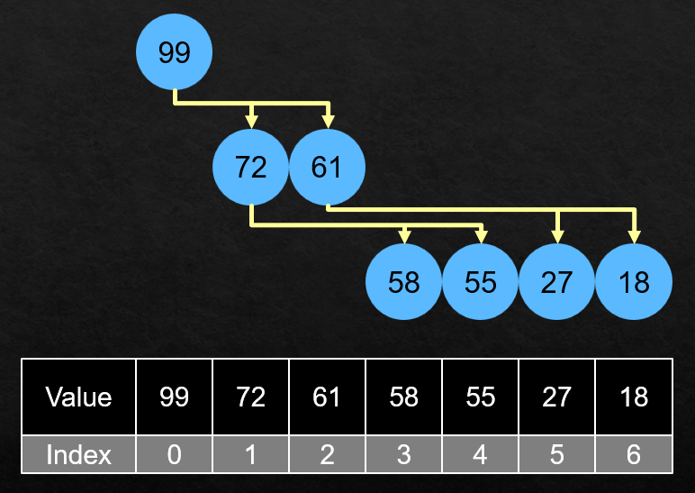

# DSA - Heap

[Back](../../index.md)

- [DSA - Heap](#dsa---heap)
  - [Heap](#heap)
  - [Implementation: Max Heap](#implementation-max-heap)
    - [Children and parent nodes](#children-and-parent-nodes)
    - [Insert method](#insert-method)

---

## Heap

- `Heap`

- Properties:

---

## Implementation: Max Heap

- use a list

### Children and parent nodes

- Diagram





```py

class MaxHeap:
    def __init__(self):
        self.heap = []

    def _left_child_index(self, index):
        '''
        Get the index of left child
        index: the index of the current node
        '''
        return 2 * index + 1

    def _right_child_index(self, index):
        '''
        Get the index of right child
        index: the index of the current node
        '''
        return 2 * index + 2

    def _parent(self, index)
        '''
        Get the index of parent node
        index: the index of the current node
        '''
        return (index -1) // 2
```

---

### Insert method

```py

# helping methods
def _swap(self, index1, index2):
    '''
    Swap two values of given indices
    index1: the first index
    index2: the second index
    '''

    self.heap[index1], self.heap[index2] = self.heap[index2], self.heap[index1]


```

---

[TOP](#dsa---heap)
