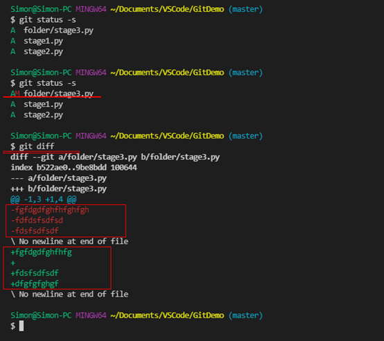
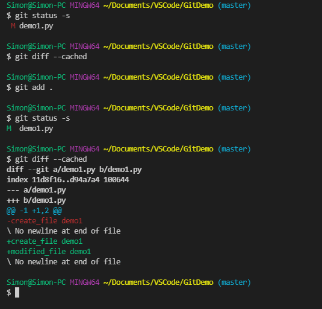
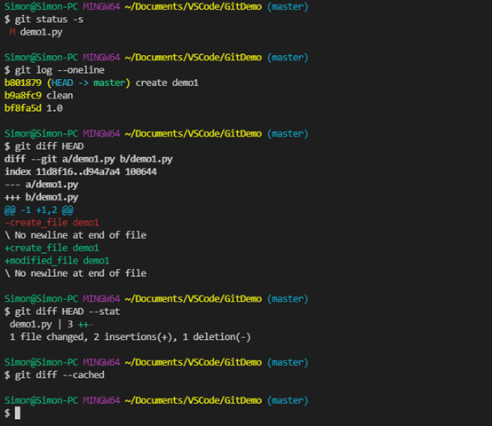
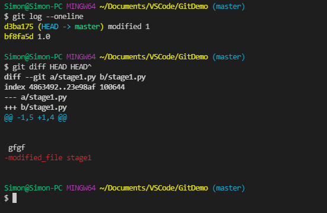
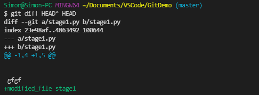
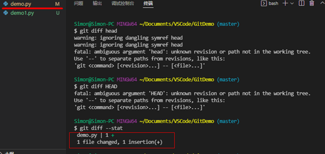

# Git - 比较差异 git diff

## 目录
- [Git - 比较差异 git diff](#git---比较差异-git-diff)
  - [目录](#目录)
  - [总结](#总结)
  - [无参数： 比较工作区与缓存区差异](#无参数-比较工作区与缓存区差异)
  - [参数cached: 比较缓存区与HEAD的差异](#参数cached-比较缓存区与head的差异)
  - [参数HEAD: 比较工作区与指定HEAD的差异](#参数head-比较工作区与指定head的差异)
  - [参数HEAD1 HEAD2：比较两个版本](#参数head1-head2比较两个版本)
  - [参数\<filename>: 查看指定文件的差别](#参数filename-查看指定文件的差别)
  - [参数stat：以简短的形式返回差异](#参数stat以简短的形式返回差异)

## 总结

- 比较所有文件
  - **工作区**和**缓存区**的差异： `git diff`
  - **缓存区**和**仓库**差异： `git diff --cached`
  - **工作区**和**HEAD**差异: `git diff HEAD`
  - **HEAD1**和**HEAD2**差异: `git diff HEAD1 HEAD2`

- 比较<指定文件>
  - **工作区**和**缓存区**的差异： `git diff <filename>`
  - **缓存区**和**仓库**差异： `git diff --cached <filename>`
  - **工作区**和**HEAD**差异: `git diff HEAD <filename> `
  - **HEAD1**和**HEAD2**差异: `git diff HEAD1 HEAD2 <filename> `

- **简短显示**差异：`git diff --stat 其他参数`


## 无参数： 比较工作区与缓存区差异

命令
```git
git diff
```

- 注意：是**工作区**与**缓存区**的比较。

>代码说明:
>1. 查询状态, 返回所有文件状态是A,即已缓存;
>2. 修改stage3_py;
>3. 查询状态，返回stage3_py的状态是AM，即已缓存被修改；
>4. 比较差异，返回工作区与缓存区差异。



[回到目录](#目录)

***

## 参数cached: 比较缓存区与HEAD的差异

命令

```git
git diff --cached
```


>代码说明:
>1.	查询状态，显示当前工作区有修改，但未缓存；
>2.	使用cached，返回为空。即缓存区=HEAD；
>3.	Add缓存到缓存区；
>4.	查询状态，显示修改已缓存；
>5.	使用cached，显示缓存区与HEAD的差异。



[回到目录](#目录)

***

## 参数HEAD: 比较工作区与指定HEAD的差异

命令

```git
git diff <HEAD>
```

- HEAD: 可以是过往的版本。

>代码说明：
>1.	查询状态，当前工作区有修改；
>2.	查询log，显示当前的HEAD；
>3.	适用参数HEAD，显示工作区与当前HEAD的差异。
>4.	最后适用cached，返回为空。即**当前工作区>缓存区=HEAD**。



[回到目录](#目录)

***

## 参数HEAD1 HEAD2：比较两个版本

命令

```git
git diff <HEAD1> <HEAD2>
```

- 注意：比较是以**HEAD1**为参照系。
  - 减号-：表示HEAD2比HEAD1少的内容；
  - 加号+：表示HEAD2比HEAD1多的内容；

>代码说明：比较**最新版本**和**次新版本**。
>减号表示次新版比最新版少。即最新版本比次新版本多。



>将参数调换，则显示为加号；



[回到目录](#目录)

***

## 参数\<filename>: 查看指定文件的差别

命令

```git
git diff <filename>
```

- 比较<指定文件>在**工作区**和**缓存区**差异： `git diff <filename>`
- 比较<指定文件>在**缓存区**和**仓库**差异： `git diff --cached <filename>`
- 比较<指定文件>在**工作区**和**HEAD**差异: `git diff HEAD <filename> `
- 比较<指定文件>在**HEAD1**和**HEAD2**差异: `git diff HEAD1 HEAD2 <filename> `

>- 注意: \<filename>放在其他参数后。

[回到目录](#目录)

***

## 参数stat：以简短的形式返回差异

命令

```git
git diff --stat
```
- 注意：--stat一般放在git diff 后。



[回到目录](#目录)

***


[返回Git首页](../git_index.md)
