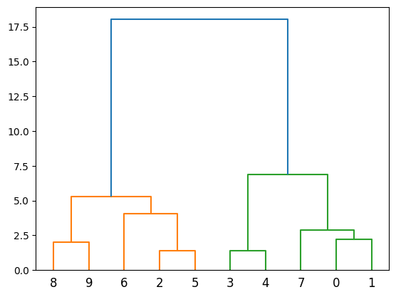
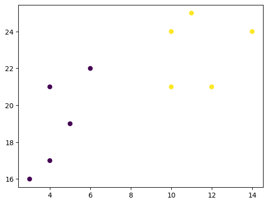

# Machine Learning - Hierarchical Clustering

[Back](./index.md)

- [Machine Learning - Hierarchical Clustering](#machine-learning---hierarchical-clustering)
  - [Hierarchical Clustering 分层群聚](#hierarchical-clustering-分层群聚)
    - [Create Dataset](#create-dataset)
    - [Method1: Scipy Library](#method1-scipy-library)
    - [Method2: Scikit-Learn Library](#method2-scikit-learn-library)

---

## Hierarchical Clustering 分层群聚

- `Hierarchical clustering`: an **unsupervised learning method** for clustering data points.
  - The algorithm builds clusters by **measuring the dissimilarities between data**.
  -
- `Unsupervised learning`: a model does **not have to be trained**, and a "target" variable is not need.

  - This method can be used on any data to visualize and interpret the **relationship between individual data points**.

- `Agglomerative Clustering`, a type of hierarchical clustering that follows a bottom up approach.

  - 凝聚（Agglomerative clustering）：一种自底向上方法，从小集群开始，逐渐将其合并，形成更大的集群.

    - 1. treat each data point as its own cluster
    - 2. join clusters together that have the shortest distance between them to create larger clusters.
      - This step is repeated until one large cluster is formed containing all of the data points.

- `Hierarchical clustering` requires to decide on both a distance and linkage method.
  - use `euclidean distance`(欧氏距离) and the `Ward linkage` method, which attempts to minimize the variance between clusters.

---

### Create Dataset

- `zip()`: returns a zip object
  - Turn the data into a set of points 将两个数据列组合成坐标

```py
x_list = [4, 5, 10, 4, 3, 11, 14, 6, 10, 12]
y_list = [21, 19, 24, 17, 16, 25, 24, 22, 21, 21]

# zip() function returns a zip object
# Turn the data into a set of points 将两个数据列组合成坐标
data = list(zip(x_list, y_list))

print(data)
# [(4, 21), (5, 19), (10, 24), (4, 17), (3, 16), (11, 25), (14, 24), (6, 22), (10, 21), (12, 21)]
```

---

### Method1: Scipy Library

- Compute the linkage between all of the different points.

  - using a simple euclidean distance measure and Ward's linkage, which seeks to minimize the variance between clusters.

  - `scipy.cluster.hierarchy.linkage()`: Perform hierarchical/agglomerative clustering.
    - `method='ward'`
    - `metric='euclidean'`

- Finally, plot the results in a dendrogram. This plot will show the hierarchy of clusters from the bottom (individual points) to the top (a single cluster consisting of all data points).

  - `scipy.cluster.hierarchy.dendrogram()`: Plot the hierarchical clustering as a dendrogram(系统树图（一种表示亲缘关系的树状图解）).

```py
import numpy as np
import matplotlib.pyplot as plt
from scipy.cluster.hierarchy import dendrogram, linkage

# scipy.cluster.hierarchy.linkage():
# Perform hierarchical/agglomerative clustering.
#   Method: method=’ward’ uses the Ward variance minimization algorithm.
#   metric: The distance metric to use in the case that y is a collection of observation vectors;
# return: ndarray, The hierarchical clustering encoded as a linkage matrix.
linkage_data = linkage(data, method='ward', metric='euclidean')

# dendrogram(): Plot the hierarchical clustering as a dendrogram(系统树图（一种表示亲缘关系的树状图解）).
dendrogram(linkage_data)

plt.show()
```



---

### Method2: Scikit-Learn Library

- First, initialize the AgglomerativeClustering class with 2 clusters, using the same euclidean distance and Ward linkage.

  - `sklearn.cluster.AgglomerativeClustering()`: Agglomerative Clustering.
    - Recursively merges pair of clusters of sample data; uses linkage distance.

- The `.fit_predict` method can be called on data to compute the clusters using the defined parameters across our chosen number of clusters.

- `sklearn.cluster.AgglomerativeClustering().fit_predict()`: Fit and return the result of each sample’s clustering assignment.
  - Return the result of the clustering assignment for each sample in the training set.

```py
import matplotlib.pyplot as plt
from sklearn.cluster import AgglomerativeClustering

# AgglomerativeClustering()
#   n_clustersint: The number of clusters to find.
#   affinity: The metric to use when calculating distance between instances in a feature array.
#   linkage: Which linkage criterion to use.
# return: object
hierarchical_cluster = AgglomerativeClustering(
    n_clusters=2, affinity='euclidean', linkage='ward')

# Fit and return the result of each sample’s clustering assignment.
labels = hierarchical_cluster.fit_predict(data)     # [0 0 1 0 0 1 1 0 1 1]

plt.scatter(x_list, y_list, c=labels)
plt.show()
```



---

[TOP](#machine-learning---hierarchical-clustering)
