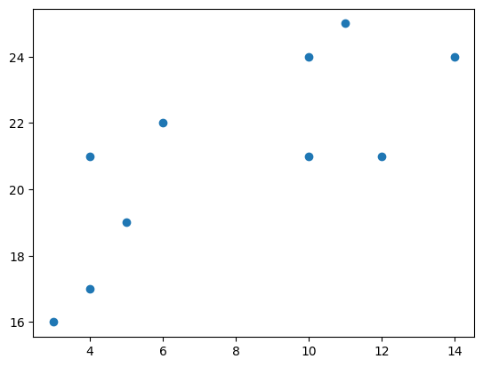
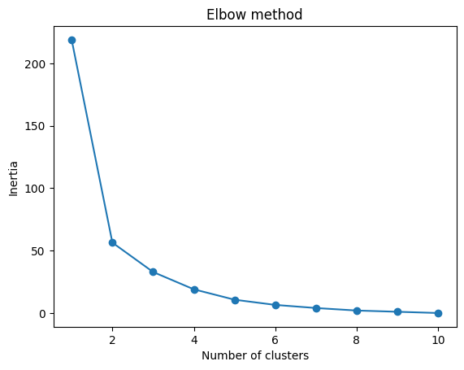
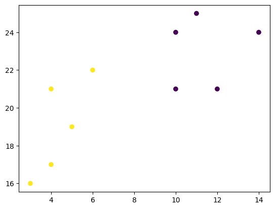

# Machine Learning - K-Means

[Back](./index.md)

- [Machine Learning - K-Means](#machine-learning---k-means)
  - [K-Means](#k-means)
  - [Process](#process)
  - [Example](#example)

---

## K-Means

- `K-means`: an **unsupervised learning method** for clustering data points.
  - The algorithm iteratively divides data points into K clusters **by minimizing the variance in each cluster**.

---

## Process

1. Each data point is randomly assigned to one of the K clusters.
2. Compute the centroid 质心 (functionally the center) of each cluster.
3. reassign each data point to the cluster with the closest centroid.
4. repeat this process until the cluster assignments for each data point are no longer changing.

- `K-means clustering` requires us to select K, the number of clusters we want to group the data into.
- The `elbow method` lets us graph the inertia 惯性 (a distance-based metric) and visualize the point at which it starts decreasing linearly. This point is referred to as the "eblow" and is a good estimate for the best value for K based on our data.

---

## Example

- 1. Visualize data points

  ```py
  import matplotlib.pyplot as plt

  x = [4, 5, 10, 4, 3, 11, 14, 6, 10, 12]
  y = [21, 19, 24, 17, 16, 25, 24, 22, 21, 21]

  plt.scatter(x, y)
  plt.show()

  ```

  

- 2. utilize the elbow method to visualize the intertia for different values of K

  - In order to find the best value for K, we need to run K-means across our data for a range of possible values. We only have 10 data points, so the maximum number of clusters is 10. So for each value K in range(1,11), we train a K-means model and plot the intertia at that number of clusters

  - The elbow method shows that 2 is a good value for K

    - the "elbow" on the graph below (where the interia becomes more linear) is at K=2.

  - `sklearn.cluster.KMeans`: K-Means clustering.

    - n_clustersint: default=8, The number of clusters to form as well as the number of centroids to generate.

  - `KMeans.inertia_` : float, Sum of squared distances of samples to their closest cluster center, weighted by the sample weights if provided.

  - `KMeans.fit()`: Compute k-means clustering.

    - return: object, Fitted estimator.

  ```py
  from sklearn.cluster import KMeans

  data = list(zip(x, y)) # Turn the data into a set of points:
  inertias = []

  for i in range(1, 11):
  kmeans = KMeans(n*clusters=i)
  kmeans.fit(data)
  inertias.append(kmeans.inertia_)

  plt.plot(range(1, 11), inertias, marker='o')
  plt.title('Elbow method')
  plt.xlabel('Number of clusters')
  plt.ylabel('Inertia')
  plt.show() 3. retrain and visualize the result
  ```

  

- 3. fit our K-means algorithm one more time and plot the different clusters assigned to the data

  - `KMeans.labels_`: ndarray of shape, Labels of each point

  ```py
  kmeans = KMeans(n_clusters=2)
  kmeans.fit(data)

  plt.scatter(x, y, c=kmeans.labels_)
  plt.show()
  ```

  

---

[TOP](#machine-learning---k-means)
