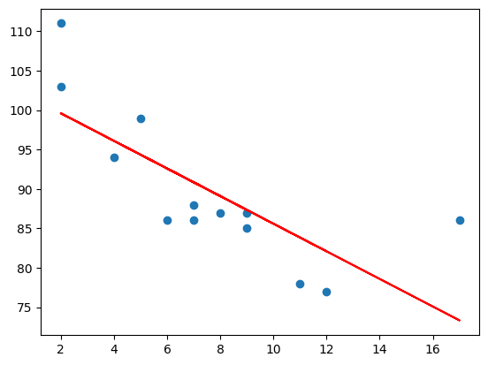
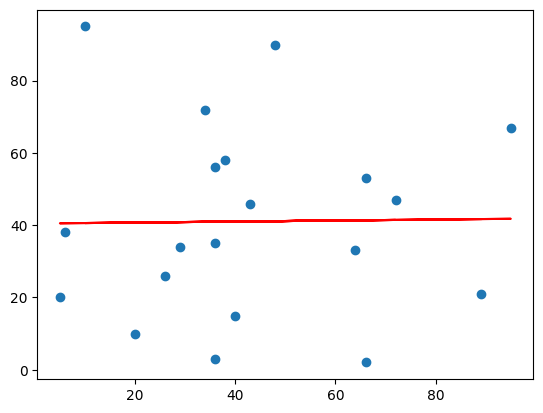
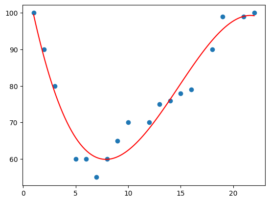
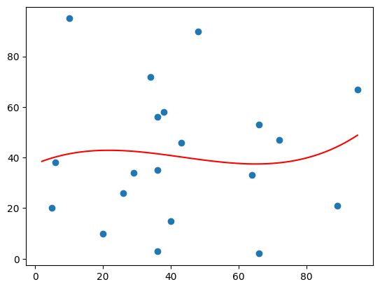

# Machine Learning - Regression

[back](./index.md)

- [Machine Learning - Regression](#machine-learning---regression)
  - [Regression](#regression)
  - [Linear Regression](#linear-regression)
    - [Example: Predict car age and speed](#example-predict-car-age-and-speed)
    - [Example: Bad Fit](#example-bad-fit)
  - [Polynomial Regression 多项式回归](#polynomial-regression-多项式回归)
    - [Example: Predict car age and speed](#example-predict-car-age-and-speed-1)
    - [Exmaple: Bad Fit](#exmaple-bad-fit)
  - [Multiple Regression](#multiple-regression)
    - [Example: Predict CO2 emission with Weight and Volume](#example-predict-co2-emission-with-weight-and-volume)
  - [Scale Standardization](#scale-standardization)

---

## Regression

- `regression`: try to find the relationship between variables.

  - In Machine Learning, and in statistical modeling, that relationship is used to **predict the outcome of future events**.

---

## Linear Regression

- `Linear regression` to find <u>relationship</u> between **data-points** and to **draw a line of linear regression**.

  - This line can be used to predict future values.

- Import `SciPy` module

  - `stats.linregress()`: Calculate a linear least-squares regression for two sets of measurements.
    - Parameters:
      - x, y: Two sets of measurements.
    - result:
      - slope: Slope of the regression line.
      - intercept: Intercept of the regression line.
      - rvalue: The square of rvalue is equal to the coefficient 系数 of determination.
      - pvalue: The p-value for a hypothesis test whose null hypothesis is that the slope is zero
      - stderr: Standard error of the estimated slope (gradient)
      - intercept_stderr: Standard error of the estimated intercept

- **R for Relationship**

- **the coefficient of correlation**: `r`

  - the **relationship** between <u>the values of the x-axis</u> and <u>the values of the y-axis</u>

  - if there are no relationship the linear regression can not be used to predict anything.

  - The `r` value ranges from `-1` to `1`

    - `0`: no relationship
    - `1` and `-1`: 100% related

- **Predict Future Values**

  - use the gathered information to **predict future values**.
  - use the slope and intercept
  - in the folowing example, the function predict_speed return predict future value.

---

### Example: Predict car age and speed

```py
import matplotlib.pyplot as plt
from scipy import stats

age_list = [5, 7, 8, 7, 2, 17, 2, 9, 4, 11, 12, 9, 6]
speed_list = [99, 86, 87, 88, 111, 86, 103, 87, 94, 78, 77, 85, 86]

slope, intercept, r, p, std_err = stats.linregress(age_list, speed_list)

print("slope", slope)
print("intercept", intercept)
print("rvalue", r)
print("pvalue", p)
print("Standard error", std_err)

# slope -1.7512877115526118
# intercept 103.10596026490066
# rvalue -0.758591524376155
# pvalue 0.002646873922456106
# Standard error 0.453536157607742

# Create a function that uses the slope and intercept values to return a new value.
# This new value represents where on the y-axis the corresponding x value will be placed
# Predict Future Values

def predict_speed(x_age):
    return slope * x_age + intercept


# Run each value of the x array through the function.
# This will result in a new array with new values for the y-axis
predict_speed_list = list(map(predict_speed, age_list))

# Draw the original scatter plot:
plt.scatter(age_list, speed_list)
# Draw the line of linear regression
plt.plot(age_list, predict_speed_list, color='red')

plt.show()  # Display the diagram
```



- Note: The result `-0.76` shows that there is a relationship, not perfect, but it indicates that we could use linear regression in future predictions.

---

### Example: Bad Fit

- linear regression would not be the best method to predict future values

```py
# Bad Fit
import matplotlib.pyplot as plt
from scipy import stats

age_list = [89,43,36,36,95,10,66,34,38,20,26,29,48,64,6,5,36,66,72,40]
speed_list = [21,46,3,35,67,95,53,72,58,10,26,34,90,33,38,20,56,2,47,15]

slope, intercept, r, p, std_err = stats.linregress(age_list, speed_list)

print("slope", slope)
print("intercept", intercept)
print("rvalue", r)
print("pvalue", p)
print("Standard error", std_err)

# slope 0.01391658139845263
# intercept 40.452282828936454
# rvalue 0.01331814154297491
# pvalue 0.955558800440106
# Standard error 0.24627150586388075

def predict_speed(x_age):
    return slope * x_age + intercept


predict_speed_list = list(map(predict_speed, age_list))

plt.scatter(age_list, speed_list)
plt.plot(age_list, predict_speed_list, color='red')

plt.show()

```



- The result: `0.013` indicates a very **bad** relationship, and tells us that this data set is not suitable for linear regression.

---

## Polynomial Regression 多项式回归

- `Polynomial regression`: to find a **relationship** between <u>data-points</u> and to draw a line of polynomial regression.

- `numpy.poly1d()`:

  - A one-dimensional polynomial class.
  - Parameters:
    - c: The polynomial’s coefficients, in decreasing powers. 多项式系数, 从高次项到低次项.
  - Return:
    - a polynomial model object.

- `numpy.polyfit()`:

  - Least squares polynomial fit.
  - Parameters:
    - x: x-coordinates
    - y: y-coordinates of the sample points.
    - deg: Degree of the fitting polynomial 多项式项数. 二次项是 3.
  - Return:
    - Polynomial coefficients, highest power first.多项式系数

- `numpy.linspace()`:

  - create an evenly spaced sequence in a specified interval. 等差数列
  - Parameter:
    - start: The starting value of the sequence.
    - stop: The end value of the sequence
    - num: Number of samples to generate.
  - Return:
    - num equally spaced samples in the closed interval.

- **R-Squared**:
  - the **relationship** between the values of the x- and y-axis
  - The relationship is measured with a value called the `r-squared`.
  - The `r-squared` value ranges from `0` to `1`, where `0` means **no relationship**, and `1` means **100% related**.
  - `Sklearn` module will compute this value.

```py
# How well does my data fit in a polynomial regression?
import numpy
from sklearn.metrics import r2_score

age_list = [1, 2, 3, 5, 6, 7, 8, 9, 10, 12, 13, 14, 15, 16, 18, 19, 21, 22]
speed_list = [100, 90, 80, 60, 60, 55, 60, 65,
              70, 70, 75, 76, 78, 79, 90, 99, 99, 100]

predict_model = numpy.poly1d(numpy.polyfit(age_list, speed_list, 3))

# compute r-squared
print(r2_score(speed_list, predict_model(age_list)))
# 0.9432150416451026

# The result 0.94 shows that there is a very good relationship, and we can use polynomial regression in future predictions.


```

---

### Example: Predict car age and speed

```py
import numpy
import matplotlib.pyplot as plt

age_list = [1, 2, 3, 5, 6, 7, 8, 9, 10, 12, 13, 14, 15, 16, 18, 19, 21, 22]
speed_list = [100, 90, 80, 60, 60, 55, 60, 65,
              70, 70, 75, 76, 78, 79, 90, 99, 99, 100]

# make a polynomial model, 假设是3项,即最高次是2.
predict_model = numpy.poly1d(numpy.polyfit(age_list, speed_list, 3))

# specify how the line will display, we start at position 1, and end at position 22:
hypothesized_age = numpy.linspace(1, 22, 100)
# get a list of predict speed
predict_speed_list = predict_model(hypothesized_age)

# Draw the scatter plot of train dataset
plt.scatter(age_list, speed_list)

# Draw the line of polynomial regression
plt.plot(hypothesized_age, predict_speed_list, color='red')

plt.show()      # Display the diagram

```



---

### Exmaple: Bad Fit

```py
import numpy
import matplotlib.pyplot as plt

age_list = [89, 43, 36, 36, 95, 10, 66, 34, 38, 20,
            26, 29, 48, 64, 6, 5, 36, 66, 72, 40]
speed_list = [21, 46, 3, 35, 67, 95, 53, 72, 58, 10,
              26, 34, 90, 33, 38, 20, 56, 2, 47, 15]

predict_model = numpy.poly1d(numpy.polyfit(age_list, speed_list, 3))

assum_age_list = numpy.linspace(2, 95, 100)

plt.scatter(age_list, speed_list)
plt.plot(assum_age_list, predict_model(assum_age_list))
plt.show()


print(r2_score(speed_list, predict_model(age_list)))
# 0.009952707566680541
```



- The result: `0.00995` indicates a very bad relationship, and tells us that this data set is not suitable for polynomial regression.

---

## Multiple Regression

- `Multiple regression`

  - the regression with **more than one independent value** to predict a value based on two or more variables.

  - 多元回归分析（Multiple Regression Analysis）是指在相关变量中将一个变量视为因变量，其他一个或多个变量视为自变量，建立多个变量之间线性或非线性数学模型数量关系式并利用样本数据进行分析的统计分析方法。

- Using `Pandas` module

  - load data
  - cleaning data

- Using `sklearn.linear_model`
  - create model
  - fit training data
  - predict value

---

### Example: Predict CO2 emission with Weight and Volume

```py
# Example: Predict CO2 emission with Weight and Volume

import pandas as pd
import matplotlib.pyplot as plt
from sklearn import linear_model

FILE_PATH = "./data.csv"
data = pd.read_csv(FILE_PATH)

# print(data.info)        # Print a concise summary of a DataFrame.
# print(data.columns)        # Print columns' names
# data.shape              # 36 rows(heading included) and 5 columns

# values: exclude heading
x_list = data[["Weight", "Volume"]].values

y_list = data[["CO2"]].values
# print(x_list)
# print(y_list)

# 普通最小二乘法（OLS）是一种用于在线性回归模型中估计未知参数的线性最小二乘法
# return an object of the class Ordinary least squares Linear Regression
predict_model = linear_model.LinearRegression()

# print(type(predict_model))       # <class 'sklearn.linear_model._base.LinearRegression'>
# print(isinstance(predict_model, linear_model.LinearRegression))     # True

# Fit linear model.
# x: Training data.
# y: Target values.
predict_model.fit(x_list, y_list)

# Estimated coefficients for the linear regression problem.
coefficients_list = predict_model.coef_

print("Coefficients: ",coefficients_list)        # [[0.00755095 0.00780526]]
# if the weight increase by 1kg, the CO2 emission increases by 0.00755095g.
print("Weight coefficient: ",coefficients_list[0][0])
#  if the engine size (Volume) increases by 1 cm3, the CO2 emission increases by 0.00780526 g.
print("Volume coefficient: ",coefficients_list[0][1])

# predict(): Predict using the linear model.
# X: array-like
# Returns: Returns predicted values.
predict_value = predict_model.predict([[3300, 1300]])
# print("predict_value",predict_value)            #  [[114.75968007]]

# get predict values based on the training data
predict_list = predict_model.predict(x_list)
print("predict_list: ",predict_list)

```

---

## Scale Standardization

- 在上例中, weight, volume, co2 使用不同的单位, 难以衡量数据特征
- 标准化（Standardization）

  - 标准化需要缩放数据，以适应标准的正态分布。
  - 标准正态分布（standard normal distribution）定义是一个均值为 0，标准差为 1 的分布。

- Formula:

  - `z = (x - u) / s`
  - `z`: the scaled value
  - `x`: the original value
  - `u`: the mean
  - `s`: the standard deviation

- Example:

  - take the **weight** column from the data set above, the first value is 790, and the scaled value will be
    - `(790 - 1292.23) / 238.74 = -2.1`
  - take the **volume** column from the data set above, the first value is 1.0 liters(1000 cm3), and the scaled value will be
    - `(1.0 - 1.61) / 0.38 = -1.59`
  - compare -2.1 with -1.59 instead of comparing 790 with 1.0.
    - 即使用一个标准化的数字代替实际数字, 以描述数据

- `sklearn.preprocessing.StandardScaler()`
  - 计算每点的标准化值

```py
# Scale Standardization

import pandas
from sklearn import linear_model
from sklearn.preprocessing import StandardScaler
stdScale = StandardScaler()

df = pandas.read_csv("data.csv")

x_list = df[['Weight', 'Volume']].values

scaled_xlist = stdScale.fit_transform(x_list)

print("scaled_xlist:", scaled_xlist)
print("first_scaled:", scaled_xlist[0])
```

---

[TOP](#linear-regression)
