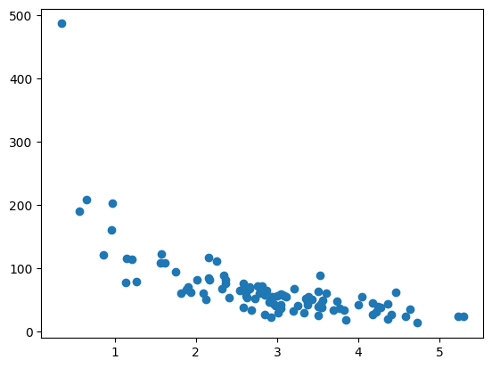
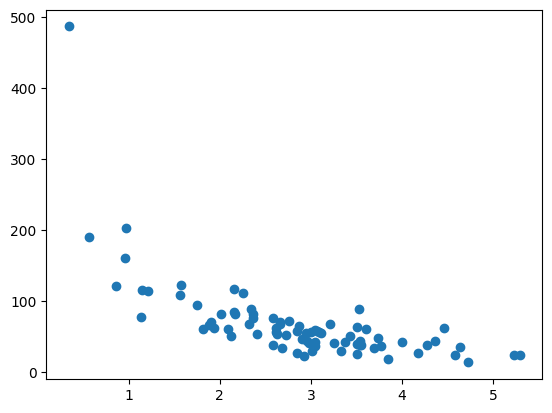
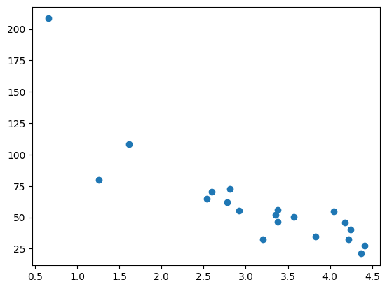
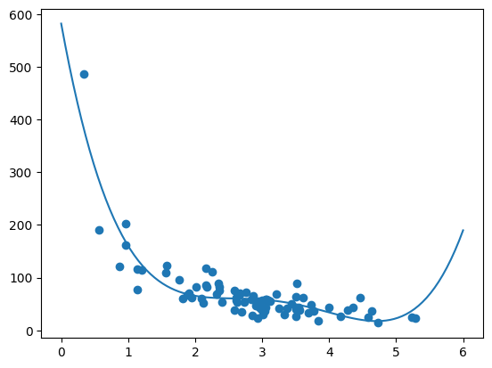

# Machine Learning - Train/Test

[Back](./index.md)

- [Machine Learning - Train/Test](#machine-learning---traintest)
  - [Train/Test](#traintest)
  - [Example:](#example)
    - [1. Prepare Dataset](#1-prepare-dataset)
    - [2. Split Into Train/Test](#2-split-into-traintest)
    - [3.Create a model and fit the Data Set](#3create-a-model-and-fit-the-data-set)
    - [4. Measure of Fit: `R2`](#4-measure-of-fit-r2)
      - [4.1 Using Trainning Dataset](#41-using-trainning-dataset)
      - [4.2 Using Testing Dataset](#42-using-testing-dataset)
    - [5. Predict Values](#5-predict-values)

---

## Train/Test

- `Train/Test` is a method to measure the **accuracy** of your model.

- split the data set into two sets:

  - a training set: the dataset to train the model (create the model)
  - a testing set: the dataset to test the model (test the accuracy of the model)

- `80%` for training, and `20%` for testing

---

## Example:

A study of relationship between the time spent on making a purchase and the money spent on the purchase.

### 1. Prepare Dataset

```py
import numpy
import matplotlib.pyplot as plt

# numpy.random.seed(): Reseed the singleton RandomState instance.
# 参数是整数, 当使用random返回两组随机数时, 如果都使用相同的seed, 则两种随机数是相同的.
# 如果不设置或使用不同的seed, 则两个随机数是不相同的.
# 即,seed是用来确保使用相同的seed返回的多个随机数数组相同.

numpy.random.seed(2)

# numpy.random.normal(): Draw random samples from a normal (Gaussian) distribution.
# parameter:
#   Mean of the distribution.
#   Standard deviation
#   size
# return: ndarray, Drawn samples from the parameterized normal distribution.
xlist = numpy.random.normal(3, 1, 100)

ylist = numpy.random.normal(150, 40, 100) / xlist       # 每个item对应相除

plt.scatter(xlist, ylist)
plt.show()
```



---

### 2. Split Into Train/Test

- The `training set` should be a **random selection** of `80%` of the original data.
- The `testing set` should be the remaining `20%`.

- Display the Training and Testing Set

```py
train_x = xlist[:80]
train_y = ylist[:80]

test_x = xlist[80:]
test_y = ylist[80:]

plt.scatter(train_x, train_y)
plt.show()

plt.scatter(test_x, test_y)
plt.show()
```





---

### 3.Create a model and fit the Data Set

- Using polynomial regression 多项式回归, based on the scatter

```py

# polyfit(): 生成多项式系数 多项式项数. 4表示最高次是3.
predict_model = numpy.poly1d(numpy.polyfit(train_x, train_y, 4))

# linspace(): Return evenly spaced numbers over a specified interval.
# 生成一个等差数列, 起始项是0(因为从原点开始), 末项是6(因为上图散点图x轴分布是0-6之间), 长度是100个.
# 代表为x轴的数组, 用于以下画图
xline = numpy.linspace(0, 6, 100)

# 根据x轴, 使用模型画出估计的y数值
predict_line = predict_model(xline)

plt.scatter(train_x, train_y)       # 画出训练数据的分布
plt.plot(xline, predict_line)       # 画出模型的线
plt.show()
```



---

### 4. Measure of Fit: `R2`

#### 4.1 Using Trainning Dataset

- `R2` (R-squared): coefficient of determination, measures the relationship between the x axis and the y axis

  - 判定系数, 在统计学中用于度量應變數的变异中可由自变量解释部分所占的比例，以此来判断迴歸模型的解释力。
  - the value ranges from 0 to 1,
  - `0`: no relationship
  - `1`: totally related

- `sklearn.metrics.r2_scorer2_score()`: return the R2 score

```py
from sklearn.metrics import r2_score
r2_train = r2_score(train_y, predict_model(train_x))

print(r2_train)       # 0.798

# Note: The result 0.799 shows that there is a OK relationship.

```

---

#### 4.2 Using Testing Dataset

```py
r2_test = r2_score(test_y, predict_model(test_x))

print(r2_test)       # 0.8086

# Note: The result 0.809 shows that the model fits the testing set as well,
# and we are confident that we can use the model to predict future values.

```

---

### 5. Predict Values

- Use the predict model to predict the amount of money spent by customer who stays in the shop for 5 minutes.

```py
shop_time = 5

predict_amount = predict_model(shop_time)

print(predict_amount)           # 22.87
```

---

[TOP](#machine-learning---traintest)
