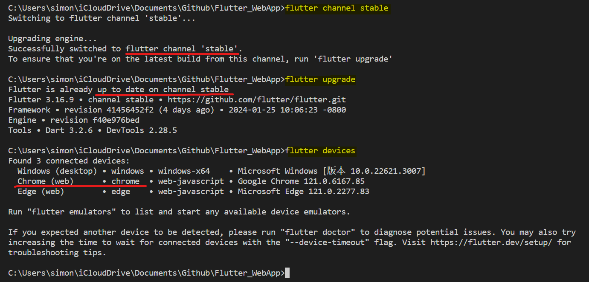
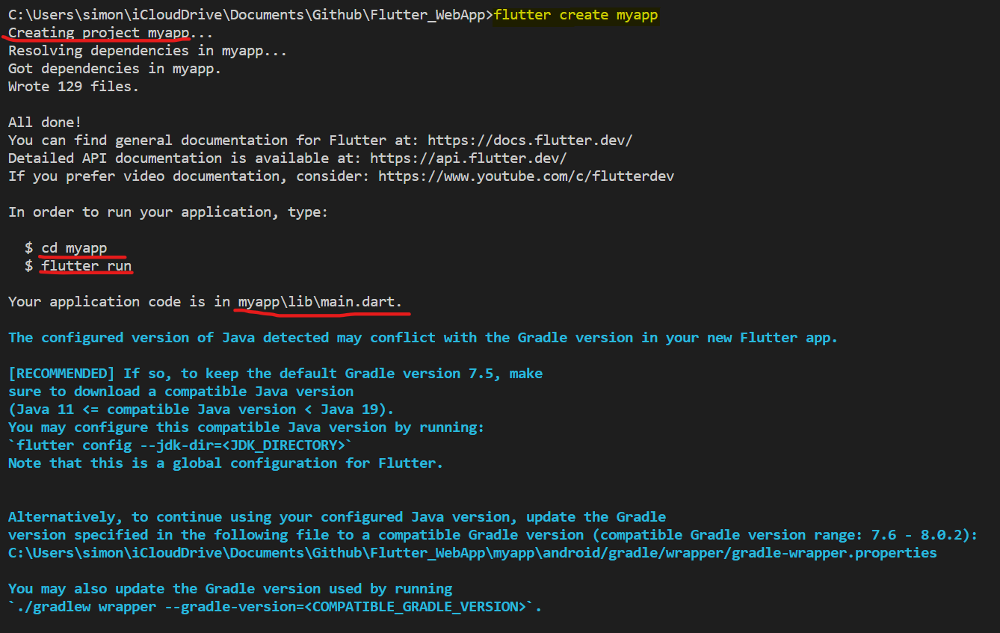
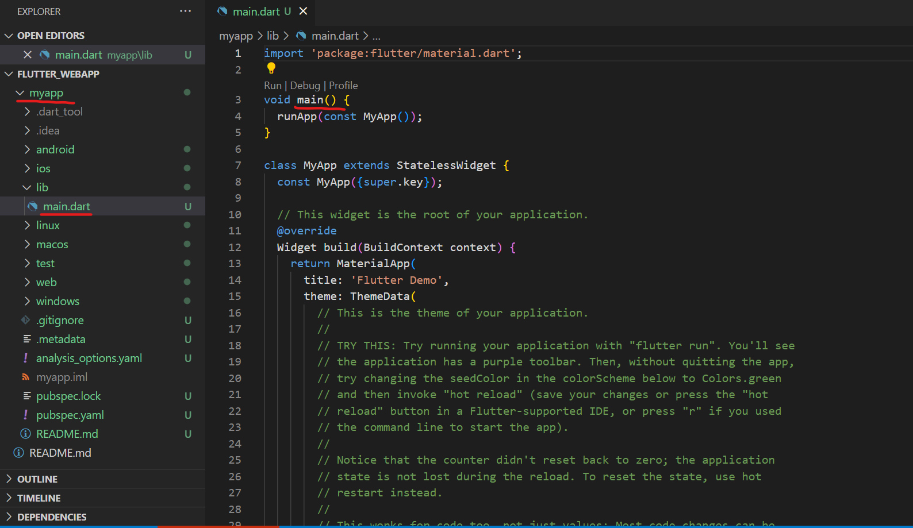
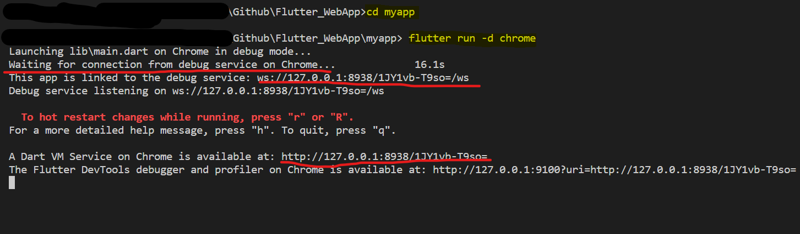
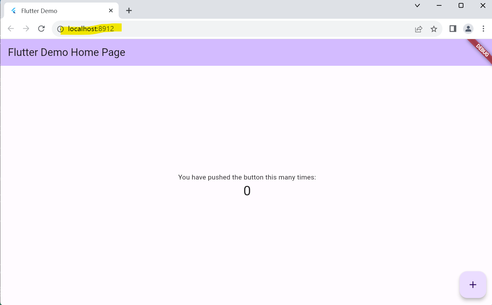

# Flutter - First App

[Back](../index.md)

- [Flutter - First App](#flutter---first-app)
  - [Set up](#set-up)
    - [Channel](#channel)
  - [Create a new project](#create-a-new-project)
  - [Run the new project locally](#run-the-new-project-locally)

---

- ref:
  - https://docs.flutter.dev/platform-integration/web/building

## Set up

- Terminal:

```sh
# replaces your current version of Flutter with the stable version
flutter channel stable

# update the Flutter SDK
flutter upgrade

# List all connected devices.
flutter devices

# optional
# Enable web app
flutter config --enable-web
```



---

### Channel

| Command                          | Description        |
| -------------------------------- | ------------------ |
| `flutter channel`                | Current channel    |
| `flutter channel <channel_name>` | change the channel |

- `master`

  - The current tip-of-tree, absolute **latest cutting edge build**. Usually functional, though sometimes we accidentally break things.

- `dev` (The dev channel was retired as of Flutter 2.8)

  - The **latest fully-tested build**. Usually functional, but see Bad Builds for a list of known "bad" dev builds. We continually try to roll master to dev. Doing so involves running many more tests than those that we run during master development, which is why this is not actually the same to master.

- `beta`

  - Every month, we pick the "best" dev build of the previous month or so, and promote it to beta. These builds have been tested with our codelabs.

- `stable`
  - When we believe we have a particularly **good build**, we promote it to the stable channel. We intend to do this more or less every quarter, but this may vary. We recommend that you use this channel for all production app releases. We may ship hotfixes to the stable channel for high-priority bugs, although our intent is to do this rarely.

---

## Create a new project

- Creating a new project using CLI

```sh
flutter create <project_name>
```





---

## Run the new project locally

```sh
cd <project_name>
flutter run -d chrome
```





---

[TOP](#flutter---first-app)
