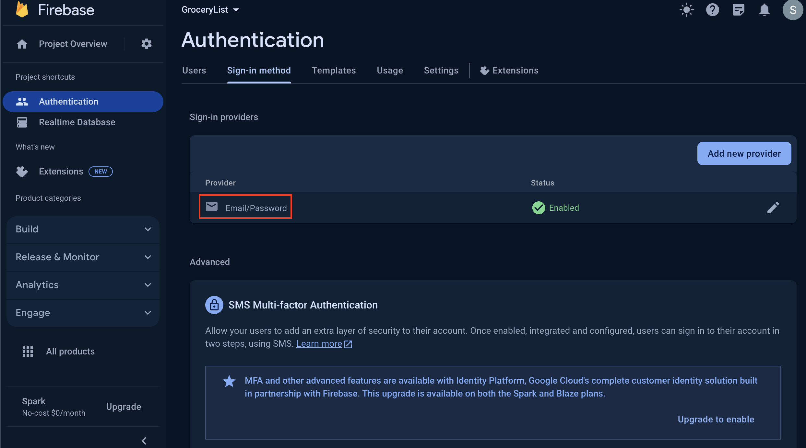
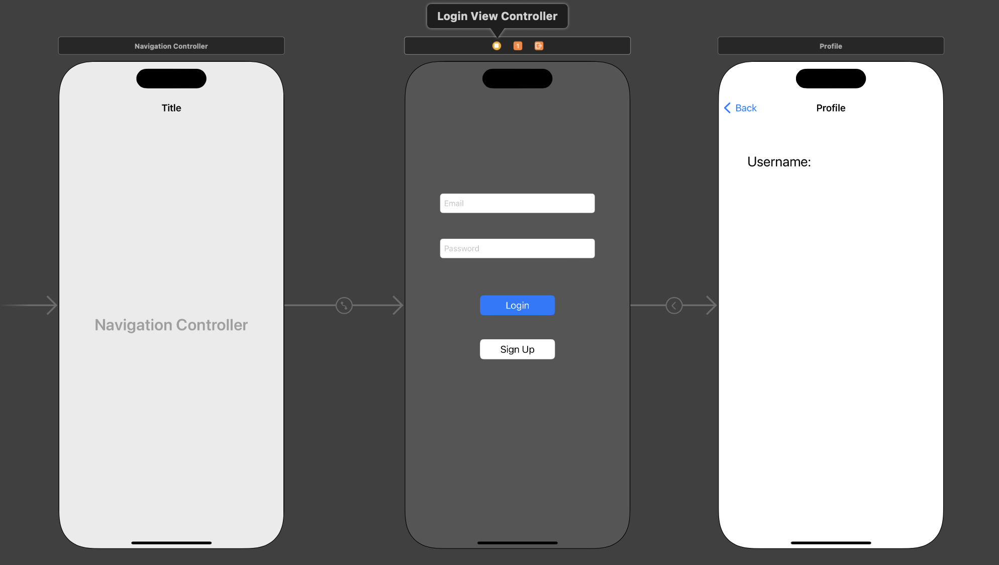
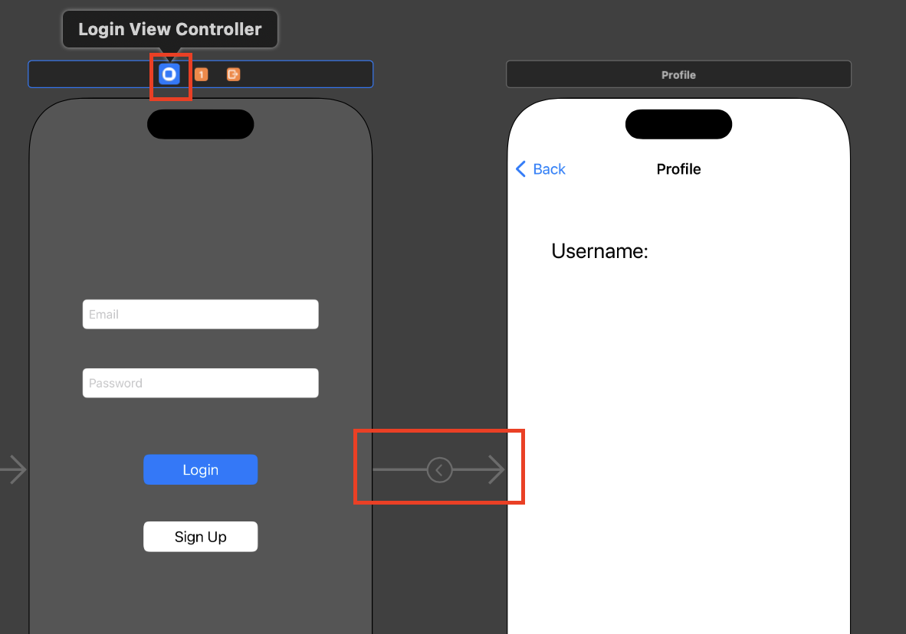
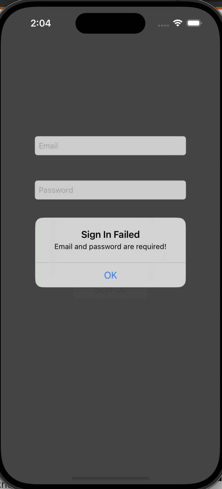
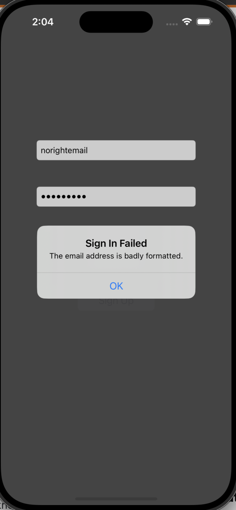
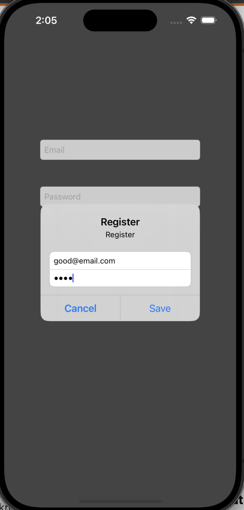
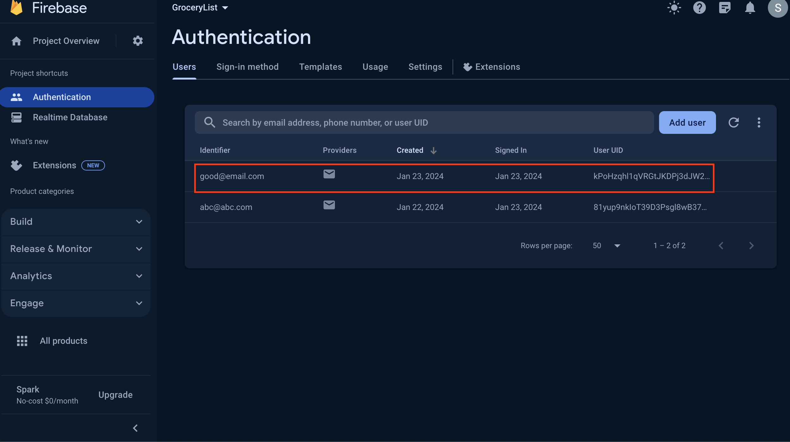
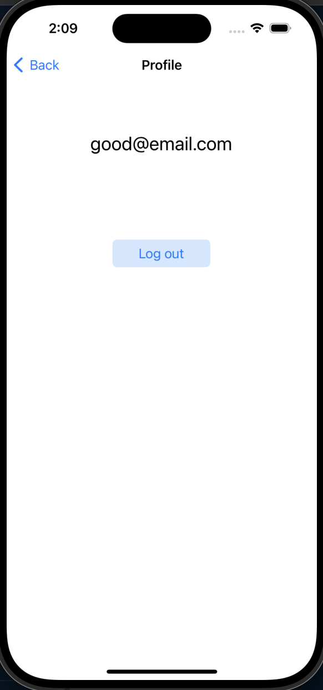

# iOS - Firebase: Authentication

[Back](../../index.md)

- [iOS - Firebase: Authentication](#ios---firebase-authentication)
  - [Configure](#configure)
  - [Requirements](#requirements)
  - [View Design](#view-design)
  - [View Controller](#view-controller)
  - [Build and Run](#build-and-run)

---

## Configure

- Connect your app to Firebase (Create iOS app on Firebase)
- Add Firebase Authentication to your app

  - Add Packages
  - Choose the Firebase Authentication library

- Initialize the Firebase SDK
  - app delegate

```swift
import FirebaseCore
// in the application:didFinishLaunchingWithOptions: method
// Use Firebase library to configure APIs
FirebaseApp.configure()
```

---

- Choose sign in method



---

## Requirements

- Documentation:
  - https://firebase.google.com/docs/auth/ios/start

- User signs up within loginVC
- User login within loginVC
  - success, goes to profileVC to display username.
  - fail, show alert.
- ProfileVC display email
- ProfileVC button to log out.

---

## View Design



- loginVC to profileVC:
  - segue is not on the button but the view controller



---

## View Controller

- LoginViewController

```swift
//
//  ViewController.swift
//  Firebase-Auth
//
//  Created by Simon Fong on 22/01/2024.
//

import UIKit
import FirebaseAuth // import firebase auth package for authentication

class LoginViewController: UIViewController {

    let segueID:String = "toProfile"

    //MARK: - Outlets
    @IBOutlet var tfEmail: UITextField!
    @IBOutlet var tfPWD: UITextField!

    override func viewDidLoad() {
        super.viewDidLoad()
        //MARK: - Check whether a user is logged in
        Auth.auth().addStateDidChangeListener { auth, user in
            if user != nil{
                print("there is a user")
            }else{
                print("There is no active user")
            }
        }
    }

    //MARK: - IBActions for login button
    @IBAction func loginDidTouch(_ sender: AnyObject){
        print("login btn")

        ///validate whether input is empty
        guard let email = tfEmail.text,
              let password = tfPWD.text,
              email.count > 0,
              password.count > 0
        else{
            /// if email and password invalid, show alert
            self.showAlert(title: "Sign In Failed", message: "Email and password are required!")
            return
        }

        /// Do the log in
        Auth.auth().signIn(withEmail: email, password: password) { [self] user, error in

            //MARK: - Check whether auth error is nill
            guard error == nil else{
                //MARK: - If sign in failed, show error alert
                self.showAlert(title: "Sign In Failed", message: error!.localizedDescription)
                return
            }

            //MARK: - Perform segue if not auth error
            performSegue(withIdentifier: segueID, sender: self)
        }
    }

    //MARK: - IBActioin to signup
    @IBAction func signUpDidTouch(_ sender:AnyObject){

        print("signup btn")
        //MARK: - Show signup alert to signup
        self.showSignUpAlert(title: "Register", message: "Register")
    }

    //MARK: - helping function to present info
    func showAlert(title: String, message:String){
        let alert = UIAlertController(title: title, message: message, preferredStyle: .alert)

        ///define action (button)
        alert.addAction(UIAlertAction(title: "OK", style: .default))

        /// present the alert within the current view controller
        self.present(alert, animated: true)
    }

    //MARK: - helping function to signup
    func showSignUpAlert(title: String, message:String){
        let alert = UIAlertController(title: title, message: message, preferredStyle: .alert)

        /// Add textfield in alert
        alert.addTextField{emailField in
            emailField.placeholder = "Enter your email"}

        alert.addTextField{pwdField in
            pwdField.isSecureTextEntry = true
            pwdField.placeholder = "Enter your password"}

        ///add save action to perform sign up
        alert.addAction(UIAlertAction(title: "Save", style: .default, handler: { _ in
            // reference the textFields properties in the alert
            let emailField = alert.textFields![0]
            let pwdField = alert.textFields![1]

            /// Sign up to create a new user
            Auth.auth().createUser(withEmail: emailField.text!, password: pwdField.text!) { user, error in

                ///MARK: - If sign up success, perform a user sign up
                if error == nil{
                    Auth.auth().signIn(withEmail: self.tfEmail.text!, password: self.tfPWD.text!)
                }else{
                    print(error)
                }
            }
        }))

        ///Allow the user to cancel the sign up and go back to main login page
        alert.addAction(UIAlertAction(title:"Cancel", style: .cancel))

        /// present the alert within the current view controller
        self.present(alert, animated: true)
    }
}
```

---

- ProfileViewController

```swift
//
//  ProfileViewController.swift
//  Firebase-Auth
//
//  Created by Simon Fong on 22/01/2024.
//

import UIKit
import FirebaseAuth

class ProfileViewController: UIViewController {
    
    @IBOutlet var lblEmail: UILabel!
    
    override func viewDidLoad() {
        super.viewDidLoad()
        //MARK: - Get a user's profile
        ///Check to see if a user is logged in
        Auth.auth().addStateDidChangeListener { auth, user in
            
            //MARK: - If user auth, display
            if let currentUser = user {
                self.lblEmail.text = currentUser.email
            } else {
                print("There is no active user")
            }
        }
    }
    
    //MARK: - IBAction to sign out
    @IBAction func signoutDidTouch(_ sender: AnyObject){
        do {
            try Auth.auth().signOut()
            // Redirect to the login screen or perform any other necessary actions after sign-out
            navigationController?.popToRootViewController(animated: true)
        } catch let signOutError as NSError {
            print("Error signing out: \(signOutError.localizedDescription)")
            // Handle the sign-out error if needed
        }
    }
}

```

---

## Build and Run

- Validate





- Signin






- Login to profile




---

[TOP](#ios---firebase-authentication)
