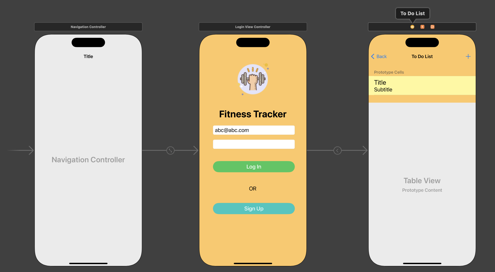

# iOS - Firebase: Real Time Database

[Back](../../index.md)

- [iOS - Firebase: Real Time Database](#ios---firebase-real-time-database)
  - [Configure](#configure)
  - [Firebase Authentication](#firebase-authentication)
  - [Documentation](#documentation)
  - [Lab: Todo App](#lab-todo-app)
    - [Req](#req)
    - [View](#view)
    - [View Controller](#view-controller)
    - [Demo](#demo)

---

## Configure

- Connect your app to Firebase (Create iOS app on Firebase)
- Add Firebase Authentication to your app

  - Add Packages
  - Choose library
    - `FirebaseCore`
    - `FirebaseFirestore`
    - `FirebaseAuth`

- Initialize the Firebase SDK
  - app delegate

```swift
import FirebaseCore
// in the application:didFinishLaunchingWithOptions: method
// Use Firebase library to configure APIs
FirebaseApp.configure()
```

---

## Firebase Authentication

- `import Firebase`

| Code                                                     | Description                               |
| -------------------------------------------------------- | ----------------------------------------- |
| `let todoRef = Database.database().reference(withPath)`  | Reference of db                           |
| `queryOrderedByKey()`                                    | Order results by child keys.              |
| `queryOrderedByValue()`                                  | Order results by child values.            |
| `setValue()`                                             | Overwrites data at the specified location |
| `observe(DataEventType.value, with: { snapshot in })`    | Read data by listening for value events   |
| `try await ref.child("users/\(uid)/username").getData()` | Read data once                            |

---

## Documentation

- https://firebase.google.com/docs/auth/ios/start

---

## Lab: Todo App

### Req

- Login
- list todo items
- add todo item

---

### View



---

### View Controller

- Login View Controller

```swift
//
//  ViewController.swift
//  Firebase-Realtime-Database
//
//  Created by Simon Fong on 24/01/2024.
//


import UIKit
import Firebase

class LoginViewController: UIViewController {

    let segueID:String = "toToDoList"

        //MARK: - Outlets
        @IBOutlet var tfEmail: UITextField!
        @IBOutlet var tfPWD: UITextField!

        override func viewDidLoad() {
            super.viewDidLoad()
            //MARK: - Check whether a user is logged in
            Auth.auth().addStateDidChangeListener { auth, user in
                if user != nil{
                    print("there is a user")
                }else{
                    print("There is no active user")
                }
            }
        }

        //MARK: - IBActions for login button
        @IBAction func loginDidTouch(_ sender: AnyObject){
            print("login btn")

            ///validate whether input is empty
            guard let email = tfEmail.text,
                  let password = tfPWD.text,
                  email.count > 0,
                  password.count > 0
            else{
                /// if email and password invalid, show alert
                self.showAlert(title: "Sign In Failed", message: "Email and password are required!")
                return
            }

            /// Do the log in
            Auth.auth().signIn(withEmail: email, password: password) { [self] user, error in

                //MARK: - Check whether auth error is nill
                guard error == nil else{
                    //MARK: - If sign in failed, show error alert
                    self.showAlert(title: "Sign In Failed", message: error!.localizedDescription)
                    return
                }

                //MARK: - Perform segue if not auth error
                performSegue(withIdentifier: segueID, sender: self)
            }
        }

        //MARK: - IBActioin to signup
        @IBAction func signUpDidTouch(_ sender:AnyObject){

            print("signup btn")
            //MARK: - Show signup alert to signup
            self.showSignUpAlert(title: "Register", message: "Register")
        }

        //MARK: - helping function to present info
        func showAlert(title: String, message:String){
            let alert = UIAlertController(title: title, message: message, preferredStyle: .alert)

            ///define action (button)
            alert.addAction(UIAlertAction(title: "OK", style: .default))

            /// present the alert within the current view controller
            self.present(alert, animated: true)
        }

        //MARK: - helping function to signup
        func showSignUpAlert(title: String, message:String){
            let alert = UIAlertController(title: title, message: message, preferredStyle: .alert)

            /// Add textfield in alert
            alert.addTextField{emailField in
                emailField.placeholder = "Enter your email"}

            alert.addTextField{pwdField in
                pwdField.isSecureTextEntry = true
                pwdField.placeholder = "Enter your password"}

            ///add save action to perform sign up
            alert.addAction(UIAlertAction(title: "Save", style: .default, handler: { _ in
                // reference the textFields properties in the alert
                let emailField = alert.textFields![0]
                let pwdField = alert.textFields![1]

                /// Sign up to create a new user
                Auth.auth().createUser(withEmail: emailField.text!, password: pwdField.text!) { user, error in

                    ///MARK: - If sign up success, perform a user sign up
                    if error == nil{
                        Auth.auth().signIn(withEmail: self.tfEmail.text!, password: self.tfPWD.text!)
                    }else{
                        print(error)
                    }
                }
            }))

            ///Allow the user to cancel the sign up and go back to main login page
            alert.addAction(UIAlertAction(title:"Cancel", style: .cancel))

            /// present the alert within the current view controller
            self.present(alert, animated: true)
        }

}

```

---

- ToDoList View Controller

```swift
//
//  ToDoListTableViewController.swift
//  Firebase-Realtime-Database
//
//  Created by Simon Fong on 24/01/2024.
//

import UIKit
import Firebase

class ToDoListTableViewController: UITableViewController {

    // A reference of todo database with the path, where the todo item will be saved on Firebase.
    let todoRef = Database.database().reference(withPath: "todos")

    var logoutBarButton: UIBarButtonItem! // A reference of bar button for log out.
    var todoItems: [ToDoItem] = []
    var authUserEmail:String?

    override func viewDidLoad() {
        super.viewDidLoad()

        tableView.allowsSelectionDuringEditing = false

        ///Create a button to logout
        logoutBarButton = UIBarButtonItem(title: "Log out", style: .plain, target: self, action: #selector(logout))

        ///Set the bar button item to white
        logoutBarButton.tintColor = .blue

        ///Nav controller will show this userCountBarButtonItem on the left side
        navigationItem.leftBarButtonItem = logoutBarButton

        /// Get the current user
        Auth.auth().addStateDidChangeListener { auth, user in

            /// If user auth, get email
            guard let currentUser = user else {
                return
            }
            self.authUserEmail = currentUser.email!
        }


        //MARK: - Downloading the data from firebase database
        todoRef.queryOrdered(byChild: "completed").observe(.value, with: { snapshot in

            //create an empty array of todo items
            var itemList: [ToDoItem] = []

            // loop all items from snapshot
            for child in snapshot.children {

                // if the current item has a snapshot and create a todo item obj from the snapshot.
                if let itemSnapshot = child as? DataSnapshot,
                   let todoItem = ToDoItem(snapshot: itemSnapshot) {
                    itemList.append(todoItem)
                }
            }
            /// Add items into our table view and reload the table view
            self.todoItems = itemList
            print("reload")
            self.tableView.reloadData()

        })
    }

    // MARK: - Table view data source
    override func numberOfSections(in tableView: UITableView) -> Int {
        return 1
    }

    override func tableView(_ tableView: UITableView, numberOfRowsInSection section: Int) -> Int {
        return todoItems.count
    }

    override func tableView(_ tableView: UITableView, cellForRowAt indexPath: IndexPath) -> UITableViewCell {
        let cell = tableView.dequeueReusableCell(withIdentifier: "cell", for: indexPath)
        let todoItem = todoItems[indexPath.row]
        cell.textLabel!.text = "\(todoItem.name) - \(todoItem.owner)"

        var status: String

        if todoItem.completed {
            status = "Completed"
        } else {
            status = "Incomplete"
        }
        cell.detailTextLabel?.text = status
        return cell
    }


    //MARK: - IBAction for add button to show add item alter.
    @IBAction func addButtonDidTouch(_ sender: AnyObject) {

        guard let ownerEmail = self.authUserEmail else{
            print("Fails: authUserEmail is nil")
            return
        }
        /// call function to create a new item
        showAddItemAlter(owner:ownerEmail)
    }

    //MARK: - Helping function to show an alert to add a todo item.
    func showAddItemAlter(owner:String){

        let alert = UIAlertController(title: "To Do Item", message: "Add an item", preferredStyle: .alert)

        /// Add a text field within the alert.
        alert.addTextField()

        /// Create a "Save" button
        let saveAction = UIAlertAction(title: "Save", style: .default) { _ in

            /// Validate the text field
            guard let textField = alert.textFields?.first,
                  let text = textField.text else {
                return
            }

            /// Create an item locally
            let todoItem = ToDoItem(name: text, owner: owner, completed: false)

            /// Add a child on the Firebase with the textfield's text
            let todoItemRef = self.todoRef.child(text.lowercased())

            ///Set the detail values on the firebase
            todoItemRef.setValue(todoItem.getInfo())

        }

        /// Add a "Cancel" button
        let cancelAction = UIAlertAction(title: "Cancel", style: .cancel)

        /// Add buttons
        alert.addAction(saveAction)
        alert.addAction(cancelAction)

        present(alert, animated: true)
    }

    //MARK: - Helping function to log out.
    @objc func logout(){
        do {
            try Auth.auth().signOut()
            // Redirect to the login screen or perform any other necessary actions after sign-out
            navigationController?.popToRootViewController(animated: true)
        } catch let signOutError as NSError {
            print("Error signing out: \(signOutError.localizedDescription)")
            // Handle the sign-out error if needed
        }
    }
}
```

---

### Demo


---

[TOP](#ios---firebase-real-time-database)
