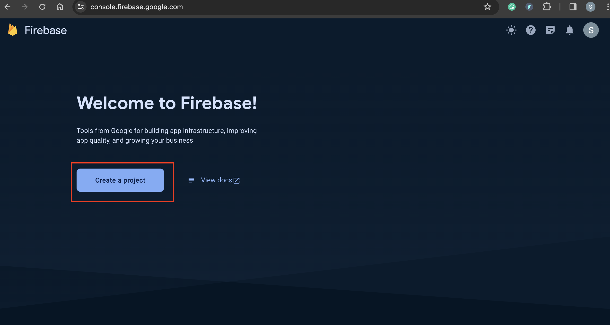
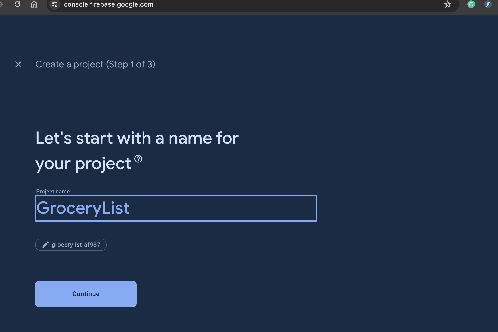
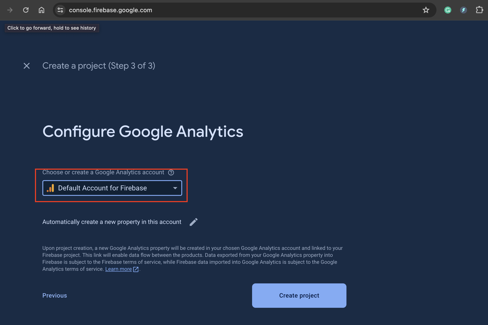
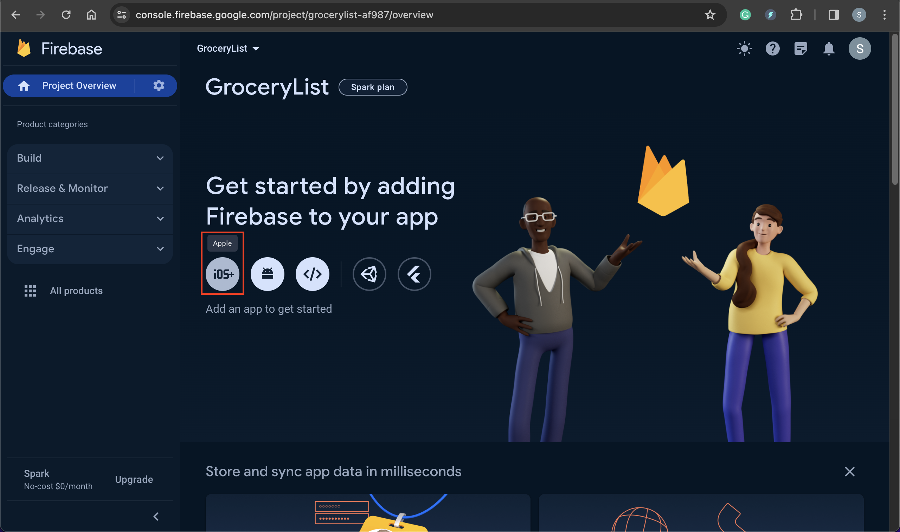

# iOS - Firebase: Start App

[Back](../../index.md)

- [iOS - Firebase: Start App](#ios---firebase-start-app)
  - [Create a project on Firebase](#create-a-project-on-firebase)
  - [Connect iOS app with Firebase project](#connect-ios-app-with-firebase-project)

---

## Create a project on Firebase

- Firebase url:

  - https://firebase.google.com/

- Go to console

- Create project

- Input project name

- Select an account

---

## Connect iOS app with Firebase project

---

[TOP](#ios---firebase-start-app)
