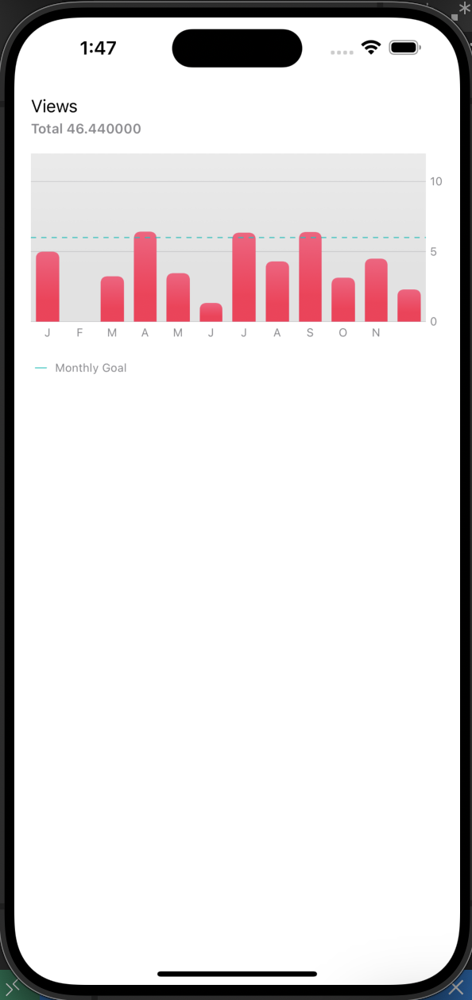

# SwiftUI - Bar Chart using Chart package

[Back](../index.md)

- [SwiftUI - Bar Chart using Chart package](#swiftui---bar-chart-using-chart-package)
  - [Bar Chart using Chart package](#bar-chart-using-chart-package)

---

## Bar Chart using Chart package




```swift

import SwiftUI
import Charts

struct ContentView_Previews: PreviewProvider {
    static var previews: some View {
        ContentView()
    }
}

struct ViewMonth: Identifiable{
    let id = UUID()
    var date:Date
    var viewCount: Double


}

extension Date{
    static func from(year: Int, month:Int, day:Int) -> Date{
        let components = DateComponents(year: year, month: month, day: day)
        return Calendar.current.date(from:components)!
    }
}


struct ContentView: View {
    let viewMonths: [ViewMonth] = [
        .init(date: Date.from(year:2024, month:1, day: 1), viewCount: 5.00),
        .init(date: Date.from(year:2024, month:2, day: 1), viewCount: 0.00),
        .init(date: Date.from(year:2024, month:3, day: 1), viewCount: 3.24),
        .init(date: Date.from(year:2024, month:4, day: 1), viewCount: 6.43),
        .init(date: Date.from(year:2024, month:5, day: 1), viewCount: 3.45),
        .init(date: Date.from(year:2024, month:6, day: 1), viewCount: 1.34),
        .init(date: Date.from(year:2024, month:7, day: 1), viewCount: 6.34),
        .init(date: Date.from(year:2024, month:8, day: 1), viewCount: 4.3),
        .init(date: Date.from(year:2024, month:9, day: 1), viewCount: 6.4),
        .init(date: Date.from(year:2024, month:10, day: 1), viewCount: 3.14),
        .init(date: Date.from(year:2024, month:11, day: 1), viewCount: 4.5),
        .init(date: Date.from(year:2024, month:12, day: 1), viewCount: 2.3),
    ]

    var body: some View{
        VStack(alignment: .leading, spacing: 4) {

            Text("Views")
            // sum using reduce function
            Text("Total \(viewMonths.reduce(0, {$0 + $1.viewCount}))")
                .fontWeight(.semibold)
                .font(.footnote)
                .foregroundColor(.secondary)
                .padding(.bottom, 12)


            Chart{
                // main plot
                ForEach(viewMonths){ viewMonth in
                    // can be LineMark, if line chart is neeeded.
                    BarMark(
                        x: .value("Month", viewMonth.date, unit: .month),
                        y:.value("Views", viewMonth.viewCount)
                    )
                    .foregroundStyle(Color.pink.gradient)
                    .cornerRadius(6)
                }

                // additional components
                RuleMark(y: .value("Goal", 6))
                    .foregroundStyle(Color.mint)
                    .lineStyle(StrokeStyle(lineWidth: 1,dash:[5]))
                // can add annotation for the rulemark
//                    .annotation(alignment:.leading){
//                        Text("Goal")
//                            .font(.caption)
//                            .foregroundColor(.secondary)
//                    }
            }
            .frame(height: 180)
            .chartYScale(domain:0...12)     // Y axis scale
            .chartXAxis{
                AxisMarks(values: viewMonths.map{$0.date}){ date in
//                    AxisGridLine()    // x axis
                    AxisValueLabel(
                        format: .dateTime.month(.narrow),
                        centered: true
                    )
                }
            }
            .chartYAxis{
//                // Y mark to place leading
//                AxisMarks(position: .leading)
                AxisMarks{mark in
                    AxisValueLabel()
                    AxisGridLine()    // x axis
                }
            }
            .padding(.bottom)
            //            .chartXAxis(.hidden)  // hide X Axis
            //            .chartYAxis(.hidden)  // hide Y Axis
            //             customized plot
                        .chartPlotStyle{ plotContent in
                            plotContent
                                .background(Color.SecondaryGray.gradient.opacity(0.3))
                        }

            HStack{
                Image(systemName:"line.diagonal")
                    .rotationEffect(Angle(degrees: 45))
                    .foregroundColor(.mint)

                Text("Monthly Goal")
                    .foregroundColor(.secondary)

            }
            .font(.caption2)
            .padding(.leading,4)

            Spacer()
        }
        .padding()

    }
}
```

---

[TOP](#swiftui---bar-chart-using-chart-package)
