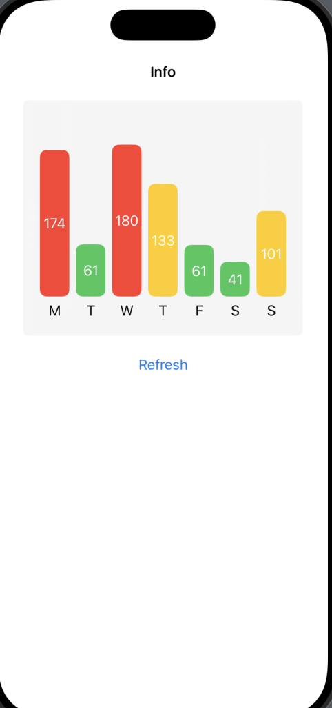

# SwiftUI - Bar Chart

[Back](../index.md)

- [SwiftUI - Bar Chart](#swiftui---bar-chart)
  - [Bar Chart](#bar-chart)

---

## Bar Chart

```swift

import SwiftUI


struct ContentView_Previews: PreviewProvider {
    static var previews: some View {
        ContentView()
    }
}

struct Bar: Identifiable{
    let id = UUID()
    var name:String
    var day: String
    var value: Double
    var color: Color

    static var sampleBars: [Bar]{
        var temBars = [Bar]()
        var color: Color = .green
        let days = ["M","T","W","T","F", "S", "S"]

        for i in 1...7 {
            let rand = Double.random(in: 20...200)
            if rand > 150{
                color = .red
            }else if rand > 75 {
                color = .yellow
            }else{
                color = .green
            }

            let bar = Bar(
                name: "\(i)",
                day: days[i-1],
                value: rand,
                color: color)
            temBars.append(bar)
        }
        return temBars
    }
}


struct ContentView: View {
    @State private var bars = Bar.sampleBars
    @State private var selectedID: UUID = UUID()
    @State private var text = "Info"

    var body: some View{
        VStack{
            Text(text)
                .bold()
                .padding()

            HStack(alignment: .bottom){
                ForEach(bars){bar in
                    VStack {
                        ZStack{
                            Rectangle()
                                .foregroundColor(bar.color)
                                .frame(
                                    width:35,
                                    height: bar.value,
                                    alignment: .bottom
                                )
                                .cornerRadius(8)
                                .opacity(selectedID == bar.id ? 0.5: 1)
                                .onTapGesture {
                                    self.selectedID = bar.id
                                    self.text = "Value: \(Int(bar.value))"
                                }
                            Text("\(Int(bar.value))")
                                .foregroundColor(.white)
                        }
                        Text(bar.day)
                    }
                }
            }
            .frame(height: 240, alignment: .bottom)
            .padding(20)
            .background(.thinMaterial)
            .cornerRadius(6)

            Button("Refresh"){
                withAnimation {
                    self.bars = Bar.sampleBars
                }
            }.padding()
            Spacer()
        }
    }
}
```



---

[TOP](#swiftui---bar-chart)
