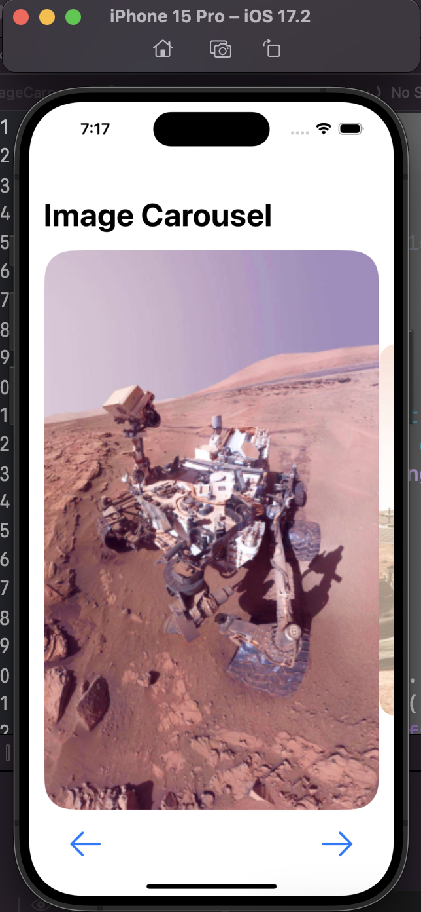
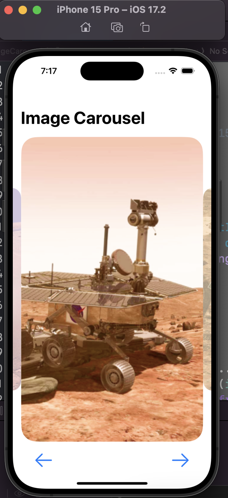
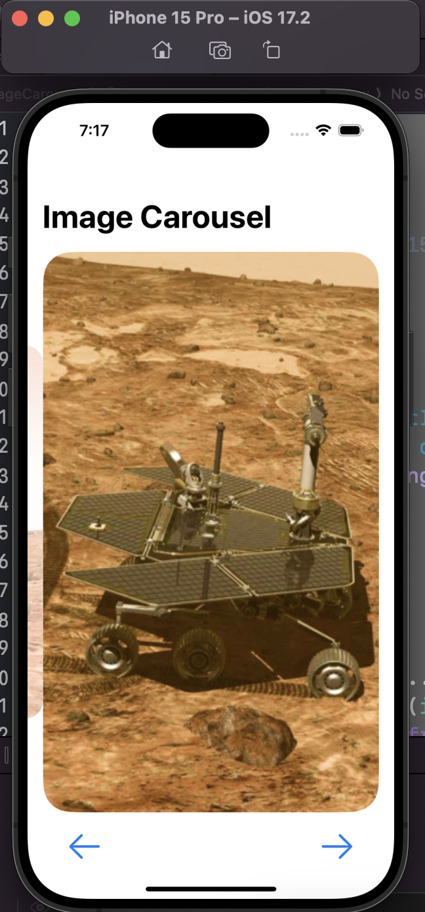

# SwiftUI - Widget: Image Carousel

[Back](../../index.md)

- [SwiftUI - Widget: Image Carousel](#swiftui---widget-image-carousel)
  - [Image Carousel](#image-carousel)

---

## Image Carousel







---

- Import 3 images

```swift
//
//  ContentView.swift
//  ImageCarousel
//
//  Created by Simon Fong on 15/03/2024.
//

import SwiftUI

struct ContentView: View {
    @State private var currentIndex: Int = 0
    @GestureState private var dragOffset: CGFloat = 0
    private let images: [String] = ["Curiosity","Spirit","Opportunity"]


    var body: some View {
        NavigationStack{
            VStack {
                ZStack{
                    ForEach(0..<images.count, id: \.self){index in
                        Image(images[index])
                            .frame(width:300, height:500)
                            .cornerRadius(25)
                            .opacity(
                                currentIndex == index ? 1.0 : 0.5)
                            .scaleEffect(
                                currentIndex == index ? 1.2 : 0.8)
                            .offset(
                                x: CGFloat(index - currentIndex) * 300 + dragOffset,
                                y : 0)
                    }
                }
                .gesture(
                    DragGesture()
                        .onEnded({value in
                            let threshold: CGFloat = 50
                            if value.translation.width > threshold{
                                withAnimation{
                                    currentIndex = max(0, currentIndex - 1)
                                }
                            }else if value.translation.width < -threshold {
                                withAnimation{
                                    currentIndex = min(images.count - 1, currentIndex + 1)
                                }
                            }
                        })
                )
            }
            .navigationTitle("Image Carousel")
            .toolbar{
                ToolbarItem(placement: .bottomBar){
                    HStack{
                        Button{
                            withAnimation{
                                currentIndex = max(0, currentIndex - 1)
                            }
                        } label: {
                            Image(systemName: "arrow.left")
                                .font(.title)
                        }

                        Spacer()

                        Button{
                            print(images[currentIndex])
                        } label:{
                            Text("Select Rover")
                        }

                        Spacer()

                        Button{
                            withAnimation{
                                currentIndex = min(images.count - 1,
                                                   currentIndex + 1 )
                            }
                        } label: {
                            Image(systemName: "arrow.right")
                                .font(.title)
                        }
                    }
                    .padding()
                }
            }
        }
    }
}

struct ContentView_Previews: PreviewProvider{
    static var previews: some View{
        ContentView()
    }
}

```

---

[TOP](#swiftui---widget-image-carousel)
