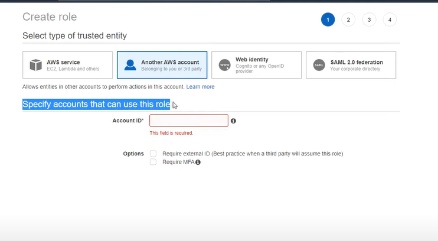
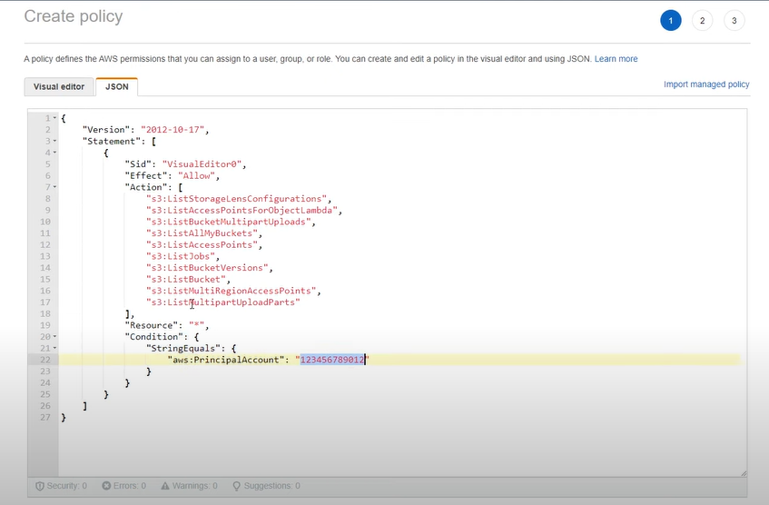
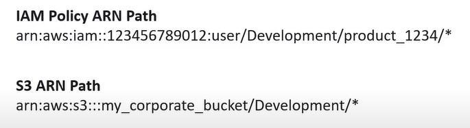
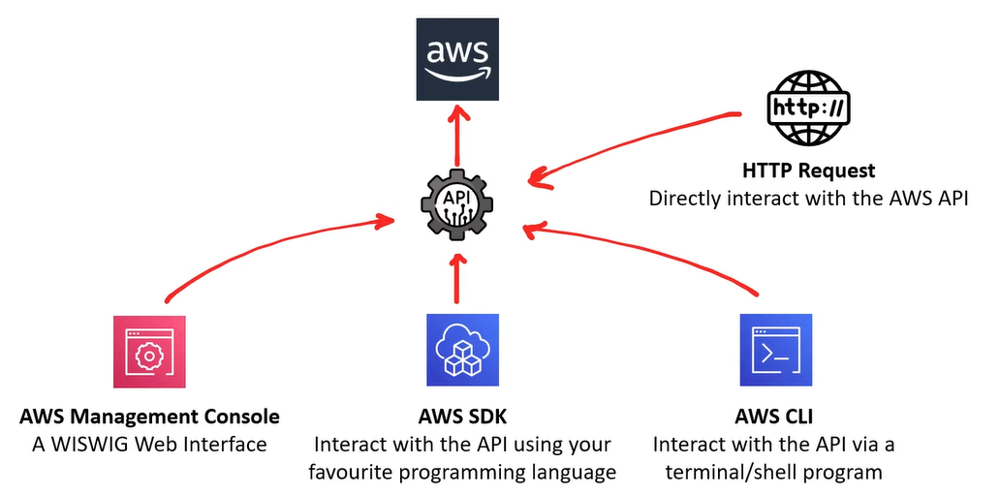
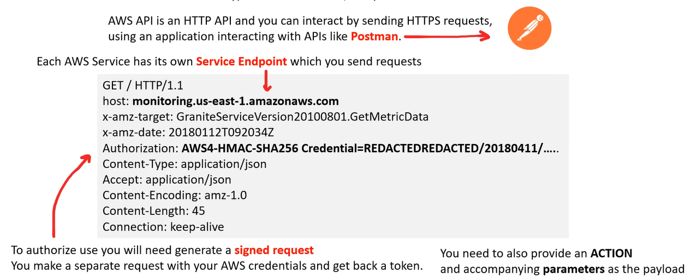
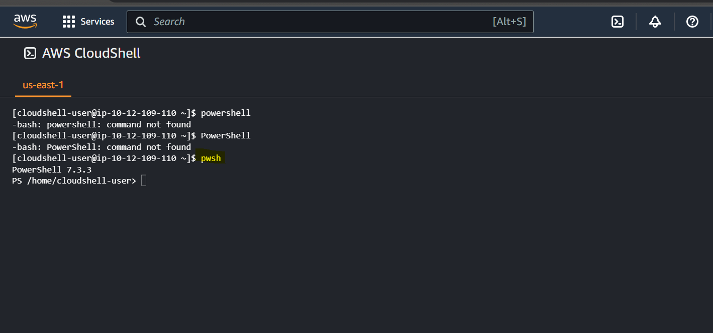

# AWS - Infrastructures Access and Management

[Back](../index.md)

- [AWS - Infrastructures Access and Management](#aws---infrastructures-access-and-management)
  - [AWS Access Fundamental](#aws-access-fundamental)
    - [Account ID](#account-id)
    - [Amazon Resource Name (ARN)](#amazon-resource-name-arn)
    - [AWS Documentation](#aws-documentation)
  - [API](#api)
  - [Access AWS](#access-aws)
    - [`AWS Console`](#aws-console)
    - [`AWS CLI`](#aws-cli)
      - [`AWS CloudShell`](#aws-cloudshell)
      - [AWS Tools for Powershell](#aws-tools-for-powershell)
    - [`AWS SDK`](#aws-sdk)
  - [Manage Infrastructure](#manage-infrastructure)
    - [Infrastructure as Code (IaC)](#infrastructure-as-code-iac)
    - [`CloudFormation` - Free, IaC, template](#cloudformation---free-iac-template)
      - [CloudFormation Templates](#cloudformation-templates)
      - [CloudFormation Stack Designer - 可视化](#cloudformation-stack-designer---可视化)
    - [`Cloud Development Kit (CDK)`- programming language, IaC](#cloud-development-kit-cdk--programming-language-iac)

---

## AWS Access Fundamental

### Account ID

- Every AWS Account has a **unique** Account ID.

- The Account ID can be easily found by dropping down the current user in the Global Navigation.

- The AWS Account ID is composed of **12** digits.

- The AWS Account ID is used:

  - When **logging in** with a **non-root** user account
  - Cross-account roles
  - Support cases

- Example: role
  

- Example: policy
  

---

### Amazon Resource Name (ARN)

- `Amazon Resource Name (ARN)`

  - uniquely identify AWS resources.
  - `ARNs` are required to specify a resource unambiguously across all of AWS.

- ARNs format variations:

  - `arn.partition:service:region:account-id:resource-id`
  - `arn.partition:service:region:account-id:resource-type/resource-id`
  - `arn.partition:service:region:account-id:resource-type:resource-id`

- `Partition`

  - `aws`: AWS Regions
  - `aws-cn`: China Regions
  - `aws-us-gov`: AWS GovCloud (US) Regions

- `Service`: Identifies the service

  - ec2
  - s3
  - iam

- `Region`: which AWS resource

  - us-east-1
  - ca-cetral-1

- `Account ID`

- `Resource ID`: could be a number name or path

  - user: Bob
  - instance name

- Resource ARNs can include a path
- Paths can include a wildcard character, namely an asterisk (`*`)

  

---

### AWS Documentation

- `AWS Documentation`

  - a large collection of technical documentation on how to use AWS Services.

- AWS Documentation: https://docs.aws.amazon.com/

- AWS Labs(examples and tutorial): https://github.com/awslabs

---

## API

- `Application Programming Interface(API)`

  - a software that allows two application/services to talk to each other.
  - The most common type of API is via `HTTP` requests.

- `AWS API`

  - an `HTTP API` and user can interact by sending `HTTPS` requests
  - Rarely do users directly send HTTP requests directly to the AWS API. Its much easier to interact with the API via a variety of Developer Tools.

  

- Example:

  

- List of Service endpoints: https://docs.aws.amazon.com/general/latest/gr/aws-service-information.html

---

## Access AWS

- To access AWS, you have three options:

| Access                             | protected by   |
| ---------------------------------- | -------------- |
| `AWS Management Console`           | password + MFA |
| `AWS Command Line Interface (CLI)` | access keys    |
| `AWS Software Developer Kit (SDK)` | access keys    |

---

### `AWS Console`

- `Management Console`

  - a web-based unified console to build, manage, and monitor resources from simple web apps to complex cloud deployment.

- `Service Console`
  - AWS Service each have their own customized console.
  - User can access these consoles by searching service name.
  - Some AWS Service Consoles contain many AWS Sevices.

---

### `AWS CLI`

- `Command Line Interface (CLI)`

  - processes commands to a computer program **in the form of lines of text**.
  - OS implement a command-line interface **in a shell**.

- `Terminal`

  - a text only interface (input/output environment)

- `Console`

  - a console is a physical computer to physically input information into a terminal.

- `Shell`

  - the command line program that users interact with to input commands.

- `AWS Command Line Interface (CLI)`

  - allow users to programmatically **interact with** the `AWS API` via entering single or multi-line commands into a shell or terminal.
  - a python executable program.
  - Python is required to install AWS CLI.
  - need to be instelled on OS
  - The name of the CLI program is `aws`
  - Important!: CLI is available for a few region.

- About AWS CLI: https://docs.aws.amazon.com/cli/latest/userguide/cli-chap-getting-started.html

---

#### `AWS CloudShell`

- `AWS CloudShell`
  - a **browser based shell** built into the AWS Management Console.
  - is scoped per region
  - **Only available in some regions**
  - same credentials as logged in user
  - Free Service
  - Include 1GB of storage free per AWS region
  - Saved files and settings
    - files saved in home directory are available in future sessions for the same AWS region.
  - Preinstalled Tools
    - AWS CLI, Python, Node.js, git, make,pip, sudo, tar, tmux,vim wget, and zip and more.

---

#### AWS Tools for Powershell

- `Powershell`
  - a task automation and configuration management framework.
  - A command-line shell and a scripting lauguage.
- Unlinke most shells, which accept and return text, PowerShell is built on top of the `.NET` Common Language Runtime (CLR), and accepts and returns `.NET` objects.

- `Cmdlet`

  - a special type of command in PowerShell in the form of capitalized verb-and-noun e.g.`New-S3Bucket`

- `AWS Tools for Powershell` lets user interact with the AWS API via PowerShell `Cmdlets`.

- `pwsh`: Command to Switch to PowerShell in AWS CloudShell

  

- Documentation: https://docs.aws.amazon.com/powershell/index.html

---

### `AWS SDK`

- `Software Developement Kit (SDK)`

  - a collection of **software development tools** in one installable package.

- `AWS SDK`

  - a package used to create, modify, delete or interact with AWS resources.

- AWS SDK for Python: https://aws.amazon.com/sdk-for-python/

- `AWS Cloud9`
  - An AWS cloud **IDE** for writing, running, and debugging code

---

## Manage Infrastructure

### Infrastructure as Code (IaC)

- `Infrastructure as Code (IaC)`

  - user write a configuration script to automate creating, updating or destroying cloud infrastrure.
  - is a blueprint of infrastructure.
  - allow to easily share, version or inventory cloud infrastructure.

- AWS has two offering for writing **Infrastructure as Code**.

  - `AWS CloudFormation (CFN)`: CFN is a Declarative IaC tool
    - Declarative
      - What user see is what user get. Explicit
      - More verbose, but zero chance of mis-configuration
      - Users scripting language. e.g., JSON, YAML, XML
  - `AWS Cloud Development Kit (CDK)`: CDK is an Imperative IaC tool.
    - Imperative
      - User say what user want, and the reset is filled in. Implicit
      - Less verbose, user could end up with misconfiguration
      - Does more than Declarative
      - Users programming languages. e.g., Python, Ruby, JS

---

### `CloudFormation` - Free, IaC, template

- `AWS CloudFormation`

  - allows user to write `Infrastructure as Code (IaC)` as either a `JSON` or `YAML` file.
  - a declarative way of **outlining your AWS Infrastructure**, for any resources (most of them are supported).

- `CloudFormation` is simple but it can lead to large files or is limited in some regard to creating dynamic or repeatable infrastructure compared to CDK.

- `CloudFormation` can be easier for DevOps Engineers who **do not have a background in web programming languages**.

- CloudFormation creates those for you, **in the right order**, with the exact configuration that you specify

- Since CDK generates out `CloudFormation`, it's still important to be able to read and understand `CloudFormation` in order to debug IaC stacks.

- **Benefits**

  - `Infrastructure as code`

    - **No** resources are **manually** created, which is excellent for control
    - **Changes** to the infrastructure are reviewed through code

  - Cost

    - Each resources within the stack is tagged with an identifier so you can **easily see how much a stack costs** you
    - You can estimate the costs of your resources using the CloudFormation **template**
    - Savings strategy: In Dev, you could **automation deletion of templates** at 5 PM and recreated at 8 AM, safely

  - Productivity

    - Ability to destroy and re-create an infrastructure on the cloud on the fly
    - Automated generation of **Diagram** for your templates!
    - Declarative programming (no need to figure out ordering and orchestration)

  - Don’t re-invent the wheel

    - Leverage existing templates on the web!
    - Leverage the documentation

  - Supports (almost) all AWS resources:
    - Everything we’ll see in this course is supported
    - You can use “custom resources” for resources that are not supported

- Create a `CloudFormation` Stack:

  - Cloud9 + CLI
  - CloudFormation console

- AWS CloudFormation: https://aws.amazon.com/cloudformation/

#### CloudFormation Templates

- AWS CloudFormation templates are **JSON or YAML-formatted text files**. - They are **declarations of the AWS resources** that **make up a stack.**

#### CloudFormation Stack Designer - 可视化

- We can see all the resources
- We can see the relations between the components

---

### `Cloud Development Kit (CDK)`- programming language, IaC

- `AWS CDK`

  - allows to user user's favortite programming language to write Infrastructure as Code (IaC)
  - e.g.: TypeScript, Node.js, Python, Java, .NET

- You can therefore **deploy infrastructure and application**
  runtime code together

  - Great for Lambda functions
  - Great for Docker containers in ECS / EKS

- `CDK` is powered by CloudFormation (it generates out CloudFormation templates)

  - The **result** of CDK execution will display in CloudFormation console.

- `CDK Construct`: a large library of reusable cloud components. https://constructs.dev

- `CDK` comes with its own CLI

- `CDK` **Piplines** to quickly setup CI/CD pipelines for CDK projects.

- `CDK` has a **testing** framework for Unit and Integration Testing.

- CDK documentation: https://docs.aws.amazon.com/cdk/api/v2/

- About CDK: https://aws.amazon.com/cdk/

---

[Top](#aws---infrastructures-access-and-management)
