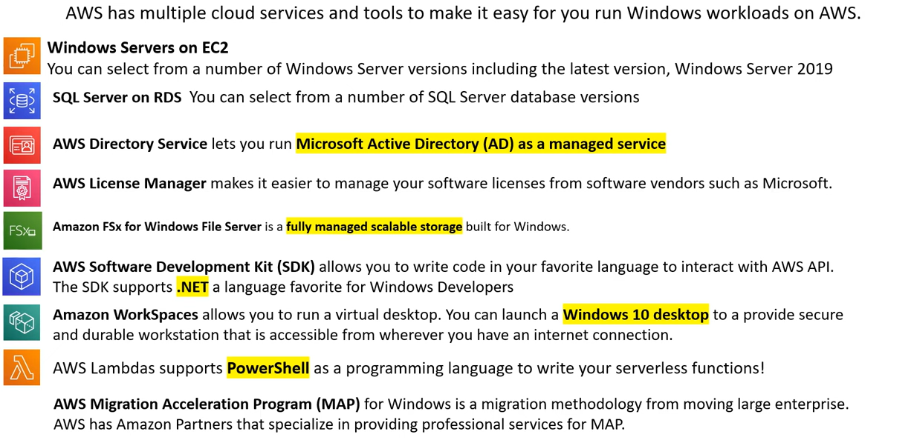

# AWS - Windows

[Back](../index.md)

- [AWS - Windows](#aws---windows)
  - [Windows On AWS](#windows-on-aws)
  - [License Manager](#license-manager)

---

## Windows On AWS

## License Manager

- `Bring-Your-Own-License (BYOL)`

  - The process of reusing an existing software license to run vendor software on a cloud vandor's computing service.
  - BYOL allows companies to save money since they may have purchased the license in bulk or at a time that provided a greater discount then if purchased again.

- `AWS License Manager`

  - a service that makes it easier for user to manage software licenses from software vendors centrally across AWS and on-premises environments.

- For `Microsoft Windows Server` and `Microsoft SQL Server license` user generally need to use a **Dedicated Host**.

---

[TOP](#aws---windows)
