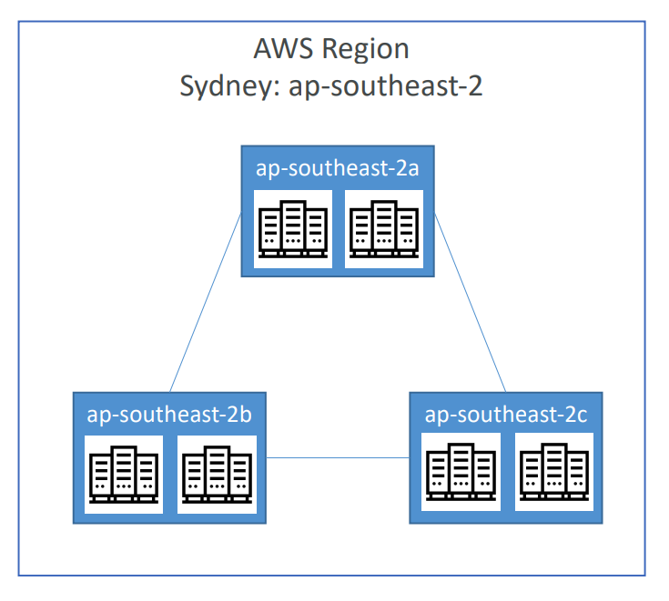

# AWS - Infrastructure

[Back](../index.md)

- [AWS - Infrastructure](#aws---infrastructure)
  - [AWS Global Infrastructure](#aws-global-infrastructure)
    - [AWS Regions](#aws-regions)
    - [AWS Availability Zones](#aws-availability-zones)
    - [AWS Data Centers](#aws-data-centers)
    - [AWS Edge Locations / Points of Presence](#aws-edge-locations--points-of-presence)

---

## AWS Global Infrastructure

### AWS Regions

- `AWS Regions`
  - A cluster of data centers 
   - eg: `us-east-1`, `eu-west-3`
  - Most AWS services are region-scoped.

- Consideration of choosing an AWS Region
   - **Compliance** with data governance and legal requirements: data never leaves a region without explicit permission
   - **Proximity** to customers: reduced latency 
   - **Available services** within a Region: new services and new features aren’t available in every Region
   - **Pricing**: pricing varies region to region and is transparent in the service pricing page

---

- AWS has **Global Services**:
  - Identity and Access Management (IAM)
  - Route 53 (DNS service)
  - CloudFront (Content Delivery Network)
  - WAF (Web Application Firewall)

- Most AWS services are Region-scoped:
  - Amazon EC2 (Infrastructure as a Service)
  - Elastic Beanstalk (Platform as a Service)
  - Lambda (Function as a Service)
  - Rekognition (Software as a Service)

---

### AWS Availability Zones 

- `AWS Availability Zones`
  - Each region has many availability zones

---

### AWS Data Centers

- `AWS Data Centers`
  - Each availability zone (AZ) is one or more discrete **data centers** with redundant power, networking, and connectivity

- They’re separate from each other, so that they’re isolated from disasters
- They’re connected with high bandwidth, ultra-low latency networking

---

### AWS Edge Locations / Points of Presence

- Content is delivered to end users with lower latency

---

[TOP](#aws---infrastructure)
