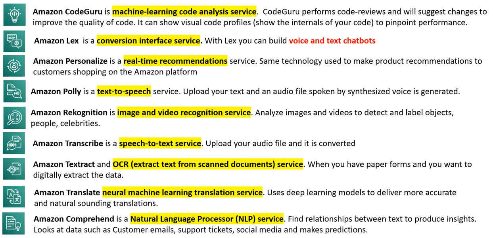
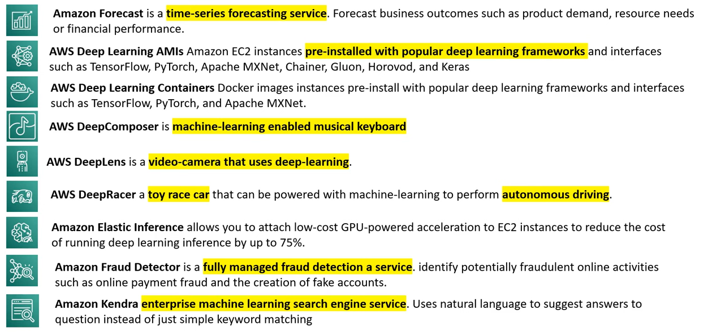
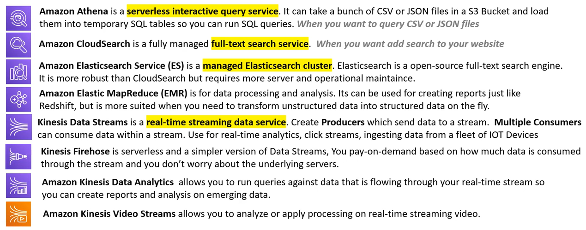
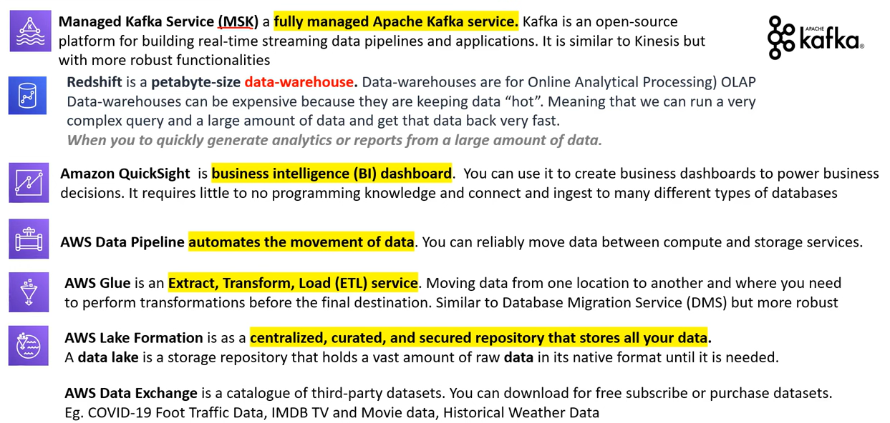
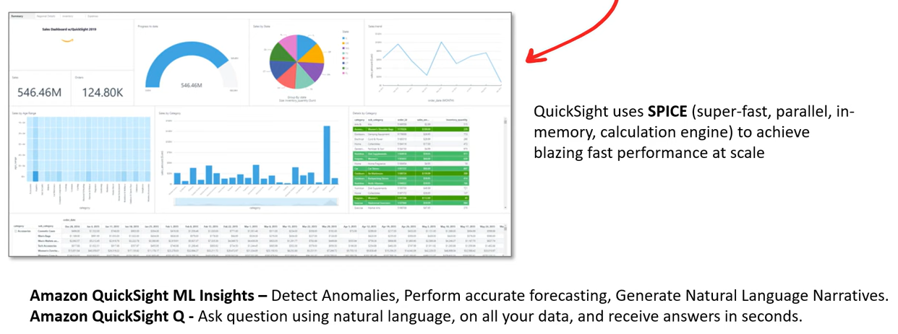

# AWS - ML, AI, And Big Data

[Back](../index.md)

- [AWS - ML, AI, And Big Data](#aws---ml-ai-and-big-data)
  - [Machine Learning and AI Services](#machine-learning-and-ai-services)
  - [ML and AI Services](#ml-and-ai-services)
  - [Big Data and Analytics Services](#big-data-and-analytics-services)
  - [Amazon QuickSight](#amazon-quicksight)

---

## Machine Learning and AI Services

- `Artificial Intelligence (AI)`

  - machines that perform jobs that mimic human behavior.

- `Machine Learning (ML)`

  - machines that get better at a task without explicit programming.

- `Deep Learning (DL)`

  - machines that have an artificial neural network inspired by the human brain to solve complex problems.

- `Amazon SageMaker`

  - a fully managed service to **build, train, and deploy machine learning model** at scale.
    - Apache MXNet on AWS, open-source deep learning framework.
    - TensorFlow on AWS, open-source machine intelligence library.
    - PyTorch on AWS, open-source machine learning framework.

- `Amazon SageMaker Ground Truth`

  - a data-labeling service.
  - label a dataset that will be used to train machine learning models.

- `Amazon Augmented AI`
  - human-intervention review service.
  - When SageMaker's uses machine learning to make a prediction that is not confident it has the right answer queue up the predication for human review.

---

## ML and AI Services

---

## Big Data and Analytics Services

- `Big Data`

  - a term used to describe massive volumes of structured/unstructured data that is so large it is difficult to move and process using traditional database and software techniques.

- `Kafka`

  - an open-source platform for building real-time streaming data pipelines and applications.

- `Data Lake`
  - a storage repository that holds a vast amount of raw data in its native format until it is needed.

---

## Amazon QuickSight

- `Amazon QuickSight`
  - a Business Intelligence (BI) Dashboard that allows to ingest data from various AWS storage or database services to quickly visualize business data with minimal programming or data formula knowledge.

---

[TOP](#aws---ml-ai-and-big-data)
