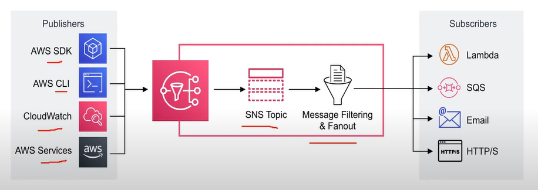
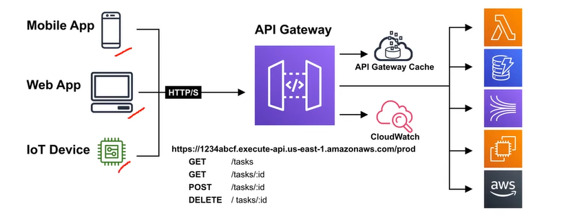
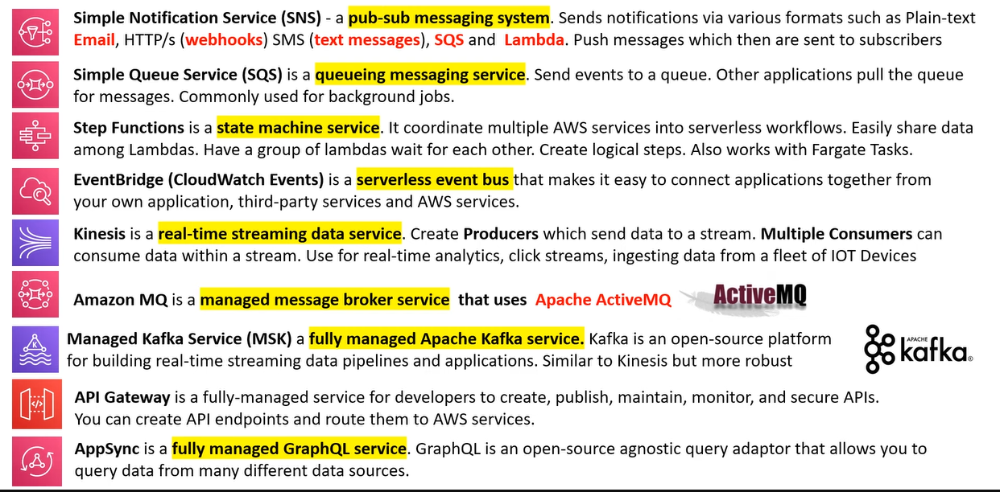

# AWS - Application Integration

[Back](../index.md)

- [AWS - Application Integration](#aws---application-integration)
  - [Application Integration](#application-integration)
  - [Queueing](#queueing)
  - [Streaming](#streaming)
  - [Pub/Sub](#pubsub)
  - [API Gateway](#api-gateway)
  - [State Machine](#state-machine)
  - [Event Bus](#event-bus)
  - [Application Integration Services](#application-integration-services)

---

## Application Integration

- `Application Integration`

  - the process of letting two independent applications to communicate and **work with each other**, commonly facilitated by an intermediate system.

- The common system or design pattern utilized for Application Integration are:
  - Queueing
  - Streaming
  - Pub/Sub
  - API Gateways
  - State Machine
  - Event Bus

---

## Queueing

- `Messaging System`

  - Used to **provide asynchronous communication and decouple processes** via message/events from a sender and receiver (producer and consumer)

- `Queueing System`

  - a message system that generally will delete messages once they are consumed.
  - Simple communication.
  - Not Real-time.
  - Have to pull. Not reactive.

- `Simple Queueing Service (SQS)`
  - Fully managed queueing service that enables user to decouple and scale microservices, distributed system, and serverless applications.
  - Use Case:
    - User need to queue up transaction emails to be sent. e.e. Signup, Reset Password

---

## Streaming

- `Streaming`

  - Multiple consumers **can react to event** (messages)
  - Events live in the stream for long periods of time, so complex operations can be applied.
  - **Real-time**.

- `Amazon Kinesis`

  - the AWS fully managed solution for collecting, processing, and analyzing streaming data in the cloud.

  

---

## Pub/Sub

- `Pub/Sub`

  - **Publish-Subscribe pattern** commonly implement in messaging systems.
  - In a pub/sub system the sender of message (**publishers**) **do not send their messages directly** to receivers.
  - **Publishers** send messages to an event bus that categorizes the messages into groups.
  - **Subscribers** subscribe to these groups.
  - Whenever new messages appear within subscribers subscription the messages are immediately delivered to subscribers.

- Publishers have no knowledge of who their subscribers are.
- Subscribers do not pull for messages.
- Messages are immediately pushed to subscribers.
- Messages and events are interchangable terms in pub/sub.

- Use Case:

  - a real-time chat system.
  - a web-hook system.

- `Simple Notification Service (SNS)`

  - a highly available, durable, secure, fully managed pub/sub messaging service that enables user to decouple miscroservices, distributed system, and serverless applications.

  

---

## API Gateway

- `API Gateway`

  - a program that sits between a single-entry point and multiple backends.
  - allows to throttle, logging, routing logic or formatting of the request and resonse.

- `Amazon API Gateway`

  - a solution for creating secure APIs in cloud environment at any scale.
  - Create APIs that act as a front door for applications to access data, business logic, or functionality from back-end services.

  

---

## State Machine

- `State Machine`

  - an abstract model which decides how one state moves to another based on a series of conditions.
  - Think of a state machine like a flow chart.

- `AWS Step Functions`

  

---

## Event Bus

- `Event Bus`

  - receives events from a source and routes events to a target based on rules.

  

- `EventBridge`

  - a serverless event but service that is used for application integration by streaming real-time data to applications.
  - formerly called `Amazon CloudWatch` Events.

  

---

## Application Integration Services

---

[TOP](#aws---application-integration)
