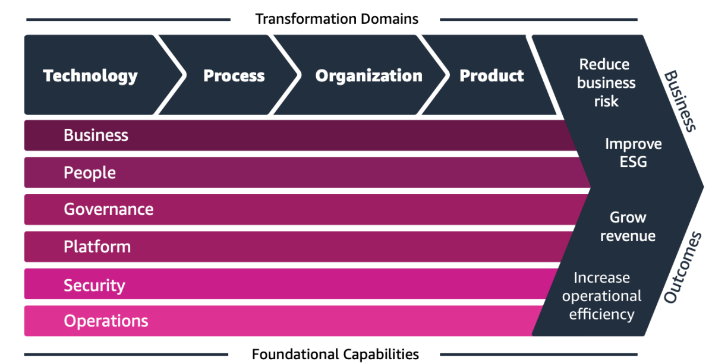

# AWS - AWS Architecting

[Back](../index.md)

- [AWS - AWS Architecting](#aws---aws-architecting)
  - [Well Architected Framework - General Guiding Principles](#well-architected-framework---general-guiding-principles)
  - [AWS Cloud Best Practices – Design Principles](#aws-cloud-best-practices--design-principles)
  - [Well Architected Framework](#well-architected-framework)
    - [1. Operational Excellence](#1-operational-excellence)
      - [AWS Services](#aws-services)
    - [2. Security](#2-security)
      - [AWS Services](#aws-services-1)
    - [3. Reliability](#3-reliability)
      - [AWS Services](#aws-services-2)
    - [4. Performance Efficiency](#4-performance-efficiency)
      - [AWS Services](#aws-services-3)
    - [5. Cost Optimization](#5-cost-optimization)
      - [AWS Services](#aws-services-4)
    - [6. Sustainability](#6-sustainability)
      - [AWS Services](#aws-services-5)
  - [`AWS Well-Architected Tool`](#aws-well-architected-tool)
  - [`AWS Cloud Adoption Framework (AWS CAF)` - digital transformation planning](#aws-cloud-adoption-framework-aws-caf---digital-transformation-planning)
    - [Business Capabilities 必考](#business-capabilities-必考)
    - [Technical Capabilities 必考](#technical-capabilities-必考)
    - [Cloud transformation value chain](#cloud-transformation-value-chain)
    - [Transformation Domains 必考](#transformation-domains-必考)
  - [AWS Right Sizing - guid, start small, lowest possible cost](#aws-right-sizing---guid-start-small-lowest-possible-cost)

---

## Well Architected Framework - General Guiding Principles

- Stop guessing your **capacity needs**
- **Test** systems **at production scale**
- Automate to make architectural **experimentation** easier
- Allow for **evolutionary** architectures
- Design based on **changing requirements**
- Drive architectures **using data**
- Improve through **game days**
- **Simulate** applications for flash sale days

---

## AWS Cloud Best Practices – Design Principles

- **Scalability**: vertical & horizontal
- **Disposable** Resources: servers should be disposable & easily configured
- **Automation**: **Serverless**, Infrastructure as a Service, Auto Scaling…
- Loose **Coupling**:
  - Monolith are applications that do more and more over time, become bigger
  - **Break it down into smaller**, loosely coupled components
- A change or a failure in one component should **not cascade** to other components
- Services, not Servers:
  - Don’t use just EC2
  - Use managed services, databases, **serverless**, etc !

---

## Well Architected Framework

- 6 Pillars

  - 1. Operational Excellence
  - 2. Security
  - 3. Reliability
  - 4. Performance Efficiency
  - 5. Cost Optimization
  - 6. Sustainability

- They are not something to balance, or trade-offs, they’re a **synergy**

---

### 1. Operational Excellence

- Includes the **ability to run and monitor systems to deliver business value** and to continually **improve** supporting processes and procedures

- Design Principles
  - Perform `operations as code`
    - `Infrastructure as code`
  - Annotate **documentation**
    - Automate the creation of annotated documentation after every build
  - Make **frequent, small, reversible changes**
    - So that in case of any failure, you can reverse it
  - **Refine** operations procedures **frequently** And ensure that team members are familiar with it
  - **Anticipate failure**
  - Learn from all operational **failures**

#### AWS Services

- Prepare

  - `AWS CloudFormation`
  - `AWS Config`

- Operate

  - `AWS CloudFormation`
  - `AWS Config`
  - `AWS CloudTrail`
  - `Amazon CloudWatch`
  - `AWS X-Ray`

- Evolve
  - `AWS CloudFormation`
  - `AWS CodeCommit`
  - `AWS CodeBuild`
  - `AWS CodeDeploy`
  - `AWS CodePipeline`

---

### 2. Security

- Includes the **ability to protect** information, systems, and assets while delivering business value through risk assessments and mitigation strategies

- **Design Principles**
  - Implement a strong **identity** foundation
    - Centralize **privilege management** and reduce (or even eliminate) reliance on long-term credentials
    - Principle of least privilege
    - IAM
  - Enable **traceability**
    - Integrate l**ogs and metrics** with systems to automatically respond and take action
  - Apply security at **all layers**
    - Like edge network, VPC, subnet, load balancer, every instance, operating system, and application
  - **Automate** security best practices
  - Protect **data in transit and at rest**
    - Encryption, tokenization, and access control
  - Keep people away from data
    - Reduce or eliminate the need for **direct access** or manual processing of data
  - Prepare for **security events**
    - Run incident response **simulations** and use tools with **automation** to increase your speed for detection, investigation, and recovery
  - Shared Responsibility Model

#### AWS Services

- Identity and Access Management

  - `IAM`
  - `AWS-STS`
  - `MFA token`
  - `AWS Organizations`

- Detective Controls

  - `AWS Config`
  - `AWS CloudTrail`
  - `Amazon CloudWatch`

- Infrastructure Protection

  - `Amazon CloudFront`
  - `Amazon VPC`
  - `AWS Shield`
  - `AWS WAF`
  - `Amazon Inspector`

- Data Protection:

  - `KMS`
  - `S3`
  - `Elastic Load Balancing (ELB)`
  - `Amazon EBS`
  - `Amazon RDS`

- Incident Response

  - `IAM `
  - `AWS CloudFormation `
  - `Amazon CloudWatch Events`

---

### 3. Reliability

- Ability of a system to **recover** from infrastructure or service disruptions, dynamically **acquire computing resources** to meet demand, and **mitigate disruptions** such as misconfigurations or transient network issues

- Design Principles
  - **Test** recovery procedures
    - Use automation to simulate different failures or to recreate scenarios that led to failures before
  - **Automatically recover** from failure
    - Anticipate and remediate failures before they occur
  - **Scale horizontally** to increase aggregate system availability
    - Distribute requests across multiple, smaller resources to ensure that they don't share a common point of failure
  - **Stop guessing capacity**
    - Maintain the **optimal level** to satisfy demand without over or under provisioning
    - Use Auto Scaling
  - Manage **change in automation**
    - Use automation to make changes to infrastructure

#### AWS Services

- Foundations

  - `IAM`
  - `Amazon VPC`
  - `AWS Quotas`
  - `AWS Trusted Advisor`

- Change Management

  - `AWS Auto Scaling`
  - `Amazon CloudWatch`
  - `AWS CloudTrail`
  - `AWS Config`

- Failure Management

  - `Backups`
  - `AWS CloudFormation`
  - `Amazon S3`
  - `Amazon S3`
  - `Glacier`
  - `Amazon Route 53`

---

### 4. Performance Efficiency

- Includes the ability to use computing resources **efficiently to meet system requirements**, and to **maintain that efficiency** as demand changes and technologies **evolve**

- Design Principles
  - Democratize **advanced** technologies
    - Advance technologies become **services** and hence you can focus more on product development
  - **Go global** in minutes
    - Easy deployment in multiple regions
  - Use **serverless** architectures
    - Avoid burden of managing servers
  - **Experiment** more often
    - Easy to carry out comparative testing
  - Mechanical sympathy
    - Be aware of all AWS services

---

#### AWS Services

- Selection

  - `AWS Auto Scaling `
  - `Amazon Elastic Block Store (EBS)`
  - `Amazon Simple Storage Service (S3)`
  - `AWS Lambda Amazon RDS`

- Review

  - `AWS CloudFormation`

- Monitoring

  - `Amazon CloudWatch`
  - `AWS Lambda`

- Tradeoffs

  - `Amazon RDS`
  - `Amazon ElastiCache`
  - `AWS Snowball`
  - `Amazon CloudFront`

---

### 5. Cost Optimization

- Includes the ability to run systems to deliver business value at the lowest price point

- Design Principles
  - **Adopt a consumption mode**
    - Pay only for what you use
  - Measure overall **efficiency**
    - Use CloudWatch
  - **Stop spending money on data center** operations
    - AWS does the infrastructure part and enables customer to focus on organization projects
  - **Analyze** and attribute expenditure
    - Accurate identification of system usage and costs, helps measure return on investment (ROI) - Make sure to use tags
  - Use managed and application level services to **reduce cost of ownership**
    - As managed services operate at cloud scale, they can offer a lower cost per transaction or service

#### AWS Services

- Expenditure **Awareness**

  - `AWS Cost and Usage Report`
  - `AWS Cost Explorer`
  - `AWS Budgets`
  - `Reserved Instance Reporting`

- Cost-Effective Resources

  - `Spot instance`
  - `Reserved instance`
  - `Amazon S3 Glacier`

- Matching supply and demand

  - `AWS Auto Scaling`
  - `AWS Lambda`

- Optimizing Over Time

  - `AWS Trusted Advisor`
  - `AWS Cost and Usage Report`

---

### 6. Sustainability

- The sustainability pillar focuses on **minimizing the environmental impacts** of running cloud workloads.

- Design Principles
  - **Understand** your impact
    - establish performance indicators, evaluate improvements
  - Establish sustainability **goals**
    - Set long-term goals for each workload, model return on investment (ROI)
  - **Maximize** utilization
    - Right size each workload to maximize the energy efficiency of the underlying hardware and minimize idle resources.
  - **Anticipate** and adopt new, more efficient hardware and software offerings and design for flexibility to adopt new technologies over time.
  - Use **managed services**
    - Shared services reduce the amount of infrastructure; Managed services help automate sustainability best practices as moving infrequent accessed data to cold storage and adjusting compute capacity.
  - Reduce the **downstream impact** of your cloud workloads
    - Reduce the amount of energy or resources required to use your services and reduce the need for your customers to upgrade their devices

#### AWS Services

- EC2 Auto Scaling, Serverless Offering (Lambda, Fargate)
- Cost Explorer, AWS Graviton 2, EC2 T instances, @Spot Instances
- EFS-IA, Amazon S3 Glacier, EBS Cold HDD volumes
- S3 Lifecycle Configurations, S3 Intelligent Tiering
- Amazon Data Lifecycle Manager
- Read Local, Write Global: RDS Read Replicas, Aurora Global DB, DynamoDB Global Table, CloudFront

---

## `AWS Well-Architected Tool`

- Free tool to review your architectures against the 6 pillars Well-Architected Framework and adopt architectural best practices
- How does it work?
  - Select your workload and answer questions
  - Review your answers against the 6 pillars
  - Obtain advice: get videos and documentations, generate a report, see the results in a dashboard

---

## `AWS Cloud Adoption Framework (AWS CAF)` - digital transformation planning

- Helps you build and then execute **a comprehensive plan for your digital transformation** through innovative use of AWS
- Created by AWS Professionals by taking advantage of AWS Best Practices and lessons learned from 1000s of customers
- AWS CAF identifies specific **organizational capabilities** that underpin successful cloud transformations
- AWS CAF groups its **capabilities in six perspectives**:
  - Business, People, Governance, Platform, Security, and Operations

### Business Capabilities 必考

- `Business Perspective` helps ensure that your cloud investments accelerate your digital transformation ambitions and **business outcomes**.
- `People Perspective` serves as a **bridge between technology and business**, accelerating the cloud journey to help organizations more rapidly evolve to a culture of continuous growth, **learning**, and where change becomes business-as-normal, with focus on culture, organizational structure, leadership, and workforce.
- `Governance Perspective` helps you orchestrate your cloud initiatives while maximizing organizational benefits and minimizing transformationrelated **risks**.

### Technical Capabilities 必考

- `Platform Perspective` helps you **build** an enterprise-grade, scalable, hybrid cloud platform; modernize existing workloads; and implement new cloud-native solutions.
- `Security Perspective` helps you achieve the confidentiality, integrity, and availability of your **data and cloud workloads**.
- `Operations Perspective` helps ensure that your cloud services are delivered at a level that **meets the needs of your business.**

### Cloud transformation value chain

### Transformation Domains 必考

- **Technology**
  - **using the cloud** to migrate and **modernize legacy** infrastructure, applications, data and analytics platforms…
- **Process**
  - **digitizing, automating, and optimizing** your **business operations**
  - leveraging new data and analytics platforms to **create actionable insights**
  - using machine learning (ML) to **improve your customer service experience…**
- **Organization**
  - Reimagining your **operating model**
  - Organizing your **teams** around products and value streams
  - **Leveraging agile methods** to rapidly iterate and evolve
- **Product**
  - reimagining your **business model** by creating new value propositions (products & services) and revenue models

---

## AWS Right Sizing - guid, start small, lowest possible cost

- EC2 has many instance types, but choosing the most powerful instance type isn’t the best choice, because the cloud is elastic
- `Right sizing` is **the process of matching instance types** and sizes to your **workload performance and capacity requirements** at the **lowest possible cost**
- **Scaling up is easy so always start small**
- It’s also the process of looking at **deployed** instances and identifying opportunities to eliminate or downsize without compromising capacity or other requirements, which results in lower costs
- It’s important to Right Size…
  - before a Cloud **Migration**
  - continuously after the cloud **onboarding process** (requirements change over time)
- CloudWatch, Cost Explorer, Trusted Advisor, 3rd party tools can help

---

[TOP](#aws---aws-architecting--ecosystem)
