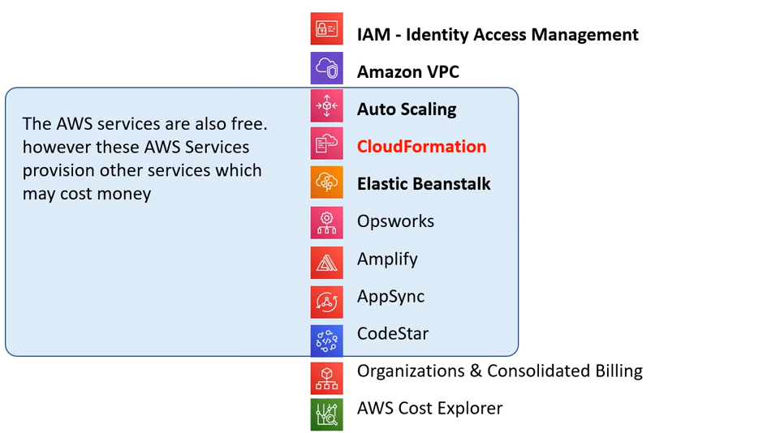
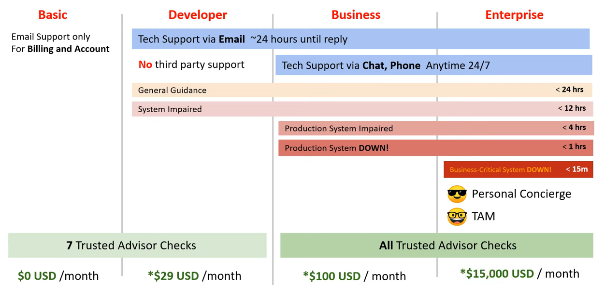
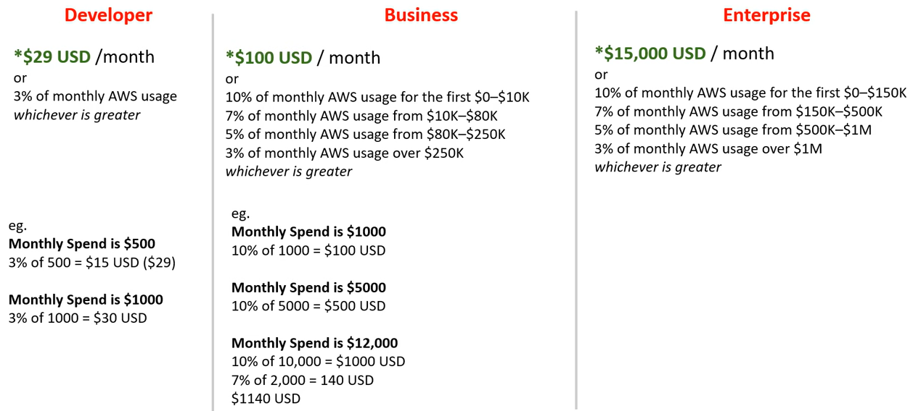
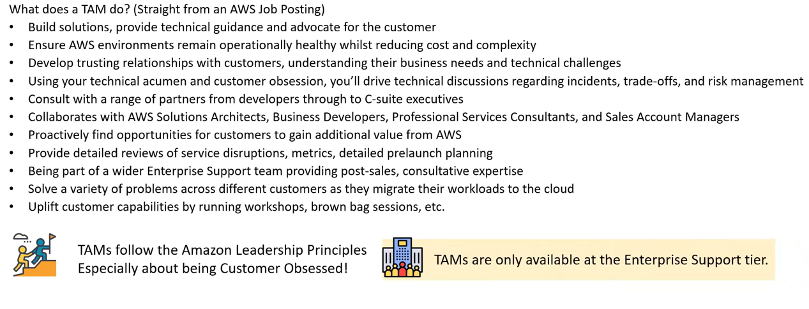
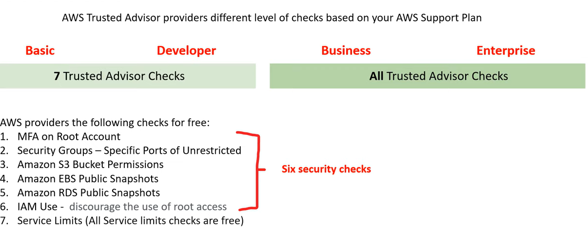
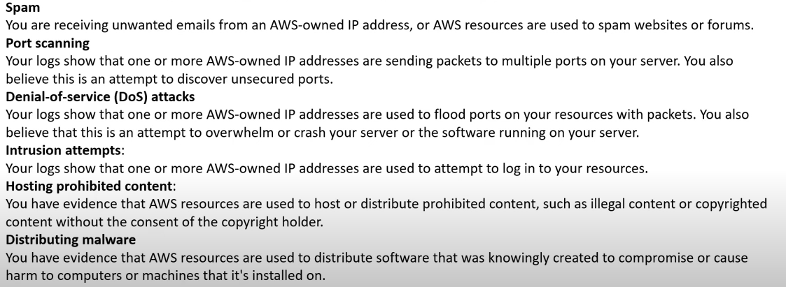

# AWS - Billing

[Back](../index.md)

- [AWS - Billing](#aws---billing)
  - [AWS Free Services](#aws-free-services)
  - [AWS Support Plans (会考)](#aws-support-plans-会考)
  - [Technical Account Manager (TAM)](#technical-account-manager-tam)
  - [AWS Marketplace](#aws-marketplace)
  - [Consolidated Billing](#consolidated-billing)
  - [AWS Trusted Advisor](#aws-trusted-advisor)
  - [Service Level Agreements (SLA)](#service-level-agreements-sla)
  - [Service Health Dashboard](#service-health-dashboard)
  - [Personal Service Health Dashboard](#personal-service-health-dashboard)
  - [AWS Abuse](#aws-abuse)
  - [Free Tier](#free-tier)
  - [AWS Credits](#aws-credits)
  - [AWS Partner Network (APN)](#aws-partner-network-apn)
  - [AWS Budgets](#aws-budgets)
  - [AWS Cost and Usage Reports (CUR)](#aws-cost-and-usage-reports-cur)
  - [Cost Allocation Tags](#cost-allocation-tags)
  - [Billing Alerts/Alarms](#billing-alertsalarms)
  - [AWS Cost Explorer](#aws-cost-explorer)
  - [AWS Pricing API](#aws-pricing-api)

---

## AWS Free Services

- `AWS Free services`
  - are free forever, unlike the 'free-tier', to a point of usage or time.

---

## AWS Support Plans (会考)

- Available for root user and IM user
- Changing of the support only for root user.

---

## Technical Account Manager (TAM)

- `Technical Account Manager (TAM)`

  - provides both procative guidance and reactive support to help user succeed with AWS journey.

---

## AWS Marketplace

- `AWS Marketplace`

  - a curated digital catalogue with thousands of software listing from independent software vendors.

- The product can be free to use or can have an associated charge. The charge becomes part of AWS bill, and once user pays, AWS Marketplace **pays the provider**.

- The sales channel for ISVs and Consulting Partners allow to **sell solutions** to other AWS customers.

---

## Consolidated Billing

- `Consolidated Billing`

  - a feature of AWS Organizations that allows to pay for multiple AWS accounts **with one bill**.
  - AWS treats all the accounts in an organization as if they were one account.

- User can designate one `master account` that **pays the charges** of all the other `member accounts`.

- Consolidated billing is offered at no additional cost.

  - using **Cost Explorer** to visualize usage for consolidated billing.

- User can combine the usage across all accounts in the organization to share the volume pricing discounts.

- `Volume Discounts`
  - the more user use, the more user save.
  - User can take advantage of Volume Discounts.
  - a feature of AWS Organizations.

---

## AWS Trusted Advisor

- `AWS Trusted Advisor`

  - a recommendation tool which automatically and actively monitors AWS account to provide actional recommendations across a series of categories.
  - like an automated checklist of best practices on AWS.

- The 5 categories of AWS Trusted Advisor
  - Cost Optimization, how to save money.
  - Performanace, how to improve performance.
  - Security, how to improve security.
  - Fault Tolerance, how to prevent a disaster or data loss.
  - Service Limits, Whether to hit the maximum limit for a service.

---

## Service Level Agreements (SLA)

- `Service Level Agreements (SLA)`

  - a **formal commitment** about the **expected level of service** between a customer and provider.
  - When a service level is not met and if Customer meets its obligations under the SLA, Customer will be eligible to **receive the compensation**.e.g **Financial or Service Credits**.

- `Service Level Indicator (SLI)`

  - a **metric/measurement** that indicates what measure of performance a customer is receiving at a given time.
  - A SLI metric could be uptime, performance, availability, throughput, latency, error rate, durability, and correctness.

- `Service Level Objective (SLO)`

  - The objective that the provider has agreed to meet.
  - SLOs are represented as a specific **target percentage** over a period of time.

- Example of SLA

  

  

  

---

## Service Health Dashboard

- `Service Health Dashboard`
  - shows the **general status of AWS services**.

---

## Personal Service Health Dashboard

- `Service Health Dashboard`

  - provides **alerts and guidance** for AWS events that might **affect user's evironment**.

- **All AWS customers** can access the Personal Health Dashboard.

- The personal Health Dashboard shows recent events to help user manage active evnets, and shows proactive notifications so user can plan for scheduled activities.

- Use these alerts to get notified about changes that can affect AWS resources, and then follow the guidance to diagnose and resolve issues.

---

## AWS Abuse

- `AWS Trust & Safety`

  - a team that specifically deals with abuses occuring on the AWS platform for the following issues:

  

- AWS Support does not deal with Abuse tickets. User need to contact abuse@amazonaws.com or fill out the Report Amazon AWS abuse form.

---

## Free Tier

- `AWS Free Tier`
  - allows to use AWS resources at no cost for the first 12 months of signup or free usage up to a certain montly limit forever.

---

## AWS Credits

- `AWS Promotional Credit`

  - are the equivalent to USD dollars on the AWS platform.

- AWS Credits can be earned several ways, such as joining the AWS Activate startup program.

- AWS Credits generally have an expiry date attached to them.

- AWS Credits can be used for most services but there are **exceptions** where AWS Credits cannot be used .
  - e.g.: purchasing a domain via Route53.

---

## AWS Partner Network (APN)

- `AWS Partner Network (APN)`
  - a global partner program for AWS.
  - Joining the APN will open user's organization up to business opportunities and allows exclusive trainings and marketing events.

---

## AWS Budgets

- `AWS Budgets`

  - allow to **setup alerts** if AWS Resources exceed or approach user's defined budget.
  - Create Cost, Usage, or Revervation Budgets.
  - Can **track** at the monthly, quarterly, or yearly levels, with customizable start and end dates.
  - can **forecast** costs but is limited, compared to Cost Explorer or analysis with AWS Cost and Usage Reports along with Business Intelligence tool.

- Alerts support EC2, RDS, Redshift, and ElasticCache reservations.

- `Budget Reports`
  - used to create and send daily, weekly, or monthyly reports to monitor the performance of AWS Budget that will be emailed to specific emails.

---

## AWS Cost and Usage Reports (CUR)

- `AWS Cost and Usage Reports (CUR)`

  - generate a detailed spreadsheet, enabling user to better analyze and understand AWS costs.

- Can place the reports into `S3`
- Can use `Athena` to turn the report into a queryable database.
- Can use `QuickSight` to visualize billing data as graphs.

---

## Cost Allocation Tags

- `Cost Allocation Tags`
  - optional metadata that can be attached to AWS resource.
  - Use tags to better analyze data in a Cost and Usage Report.

---

## Billing Alerts/Alarms

- Users can create their own Alarm in `CloudWtch` Alarms, `Billing Alarms`, to monitor spend.

- User first need to turn on Billing Alerts.

---

## AWS Cost Explorer

- `AWS Cost Explorer`
  - used to visualize, understand, and manage AWS costs and usage over time.

---

## AWS Pricing API

- User can programmatically access pricing information to ge the lastest price offering for services.

- Two version of API:

  - Query API: the Pricing Service API via JSON
  - Batch API: the Price List API via HTML

- Can subscribe to `Simple Notification Service (SNS)` to get alerts when prices for the services change.

---

[TOP](#aws---billing)
