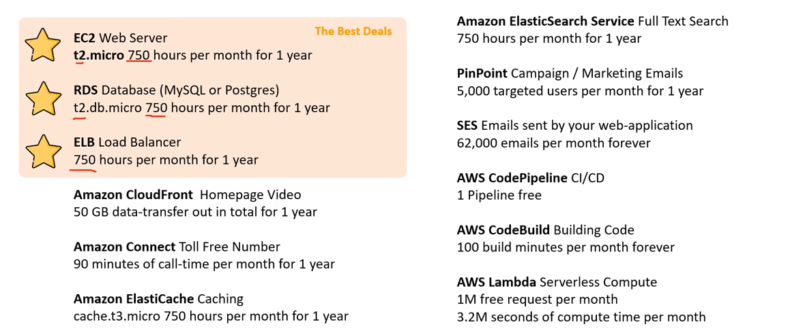

# AWS - Pricing

[Back](../index.md)

- [AWS - Pricing](#aws---pricing)
  - [Free services \& free tier in AWS](#free-services--free-tier-in-aws)
  - [Pricing Models in AWS](#pricing-models-in-aws)
    - [Compute Pricing - EC2](#compute-pricing---ec2)
    - [Compute Pricing – Lambda \& ECS](#compute-pricing--lambda--ecs)
    - [Storage Pricing – S3](#storage-pricing--s3)
    - [Storage Pricing - EBS](#storage-pricing---ebs)
    - [Database Pricing - RDS](#database-pricing---rds)
    - [Content Delivery – CloudFront](#content-delivery--cloudfront)
    - [Networking Costs](#networking-costs)
    - [`Savings Plan` - commitments](#savings-plan---commitments)
  - [`AWS Pricing API` - api, SNS](#aws-pricing-api---api-sns)
  - [`Support Plans` Pricing](#support-plans-pricing)
    - [Basic Support Plan - Free](#basic-support-plan---free)
    - [Developer Support Plan](#developer-support-plan)
    - [Business Support Plan (24/7)](#business-support-plan-247)
    - [Enterprise On-Ramp Support Plan (24/7)](#enterprise-on-ramp-support-plan-247)
    - [Enterprise Support Plan (24/7)](#enterprise-support-plan-247)
  - [`Trusted Advisor` - account assessment 必背](#trusted-advisor---account-assessment-必背)
    - [Trusted Advisor – Support Plans 必背](#trusted-advisor--support-plans-必背)
  - [`Technical Account Manager (TAM)` - Enterprise Support](#technical-account-manager-tam---enterprise-support)

---

## Free services & free tier in AWS

- Free services

  - IAM
  - VPC
  - Consolidated Billing

- You do pay for the resources created

  - Elastic Beanstalk
  - CloudFormation
  - Auto Scaling Groups

- `AWS Free Tier`

  - allows to use AWS resources at no cost for the first 12 months of signup or free usage up to a certain montly limit forever.
  - **EC2 t2.micro** instance for a year
  - S3, EBS, AWS Data transfe
  - ELB

---

## Pricing Models in AWS

- AWS has 4 pricing models:
- **Pay as you go**:

  - pay for **what you use**, remain agile, responsive, meet scale
    demands

- **Save when you reserve**:
  - minimize risks, predictably manage budgets, comply with long-terms requirements
  - Reservations are available for
    - **EC2** Reserved Instances
    - **DynamoDB** Reserved Capacity
    - **ElastiCache** Reserved Nodes
    - **RDS** Reserved Instance
    - **Redshift** Reserved Nodes
- **Pay less by using more**:
  - **volume-based discounts**
- **Pay less as AWS grows**

---

### Compute Pricing - EC2

- Only charged for **what you use**
- **Number** of instances
- Instance **configuration**:
  - Physical capacity
  - Region
  - OS and software
  - Instance type
  - Instance size
- **ELB** running time and amount of data processed
- Detailed **monitoring**

---

- **On-demand instances:**
  - Minimum of 60s
  - Pay per **second (Linux/Windows)** or per hour (other)
- **Reserved instances:**
  - Up to 75% discount compared to On-demand on hourly rate
  - 1- or 3-years commitment
  - All upfront, partial upfront, no upfront
- **Spot instances:**
  - Up to 90% discount compared to On-demand on hourly rate
  - Bid for unused capacity
- **Dedicated Host:**
  - On-demand
  - Reservation for 1 year or 3 years commitment
- **Savings plans** as an alternative to save on sustained usage

---

### Compute Pricing – Lambda & ECS

- **Lambda**:

  - Pay per **call**
  - Pay per **duration**

- **ECS**:

  - EC2 Launch Type Model: No additional fees, you pay for AWS resources stored and created in your application

- **Fargate**:

  - Fargate Launch Type Model: Pay for vCPU and memory resources allocated to your applications in your containers

---

### Storage Pricing – S3

- **Storage class**:

  - S3 Standard,
  - S3 Infrequent Access,
  - S3 One-Zone IA,
  - S3 Intelligent Tiering,
  - S3 Glacier,
  - and S3 Glacier Deep Archive

- **Number and size** of objects: Price can be tiered (based on volume)
- Number and type of **requests**
- Data **transfer OUT** of the S3 region
- S3 Transfer **Acceleration**
- Lifecycle transitions
- Similar service: EFS (pay per use, has infrequent access & lifecycle rules)

---

### Storage Pricing - EBS

- **Volume** type (based on performance)
- Storage volume in GB per month provisionned
- **IOPS**:
  - General Purpose SSD: Included
  - Provisioned IOPS SSD: Provisionned amount in IOPS
  - Magnetic: Number of requests
- **Snapshots**:
  - Added data cost per GB per month
- **Data transfer**:
  - **Outbound** data transfer are tiered for volume discounts
- **Inbound is free**

---

### Database Pricing - RDS

- **Per hour** billing

- Database **characteristics**:

  - Engine
  - Size
  - Memory class

- Purchase type:

  - On-demand
  - Reserved instances (1 or 3 years) with required up-front

- **Backup** Storage: There is **no additional charge** for backup storage up to 100% of your total database storage for a region.

- **Additional storage** (per GB per month)
- Number of input and output **requests** per month
- **Deployment type** (storage and I/O are variable):
  - Single AZ
  - Multiple AZs
- Data transfer:
  - **Outbound data transfer** are tiered for volume discounts
  - Inbound is free

---

### Content Delivery – CloudFront

- Pricing is different across **different geographic** regions
- **Aggregated** for each edge location, then applied to your bill
- Data Transfer **Out** (volume discount)
- Number of HTTP/HTTPS **requests**

---

### Networking Costs

- Use **Private IP** instead of Public IP for good savings and better network performance
- Use **same AZ** for maximum savings (at the cost of high availability)

---

### `Savings Plan` - commitments

- **Commit a certain $ amount per hour** for 1 or 3 years
- Easiest way to setup **long-term commitments** on AWS
- `EC2 Savings Plan` - Commit families
  - Up to 72% discount compared to On-Demand
  - Commit to usage of **individual instance families** in a region (e.g. C5 or M5)
  - Regardless of AZ, size (m5.xl to m5.4xl), OS (Linux/Windows) or tenancy
  - All upfront, partial upfront, no upfront
- `Compute Savings Plan` - Regardless
  - Up to 66% discount compared to On-Demand
  - Regardless of **Family, Region**, size, OS, tenancy, **compute options**
  - **Compute Options**: EC2, Fargate, Lambda
- `Machine Learning Savings Plan`: SageMaker…
- Setup from the `AWS Cost Explorer` console

---

## `AWS Pricing API` - api, SNS

- User can programmatically access pricing information to ge the lastest price offering for services.

- Two version of API:

  - Query API: the Pricing Service API via JSON
  - Batch API: the Price List API via HTML

- Can subscribe to `Simple Notification Service (SNS)` to get alerts when prices for the services change.

---

## `Support Plans` Pricing

- Available for root user and IM user
- Changing of the support only for root user.

### Basic Support Plan - Free

- **Customer Service & Communities**
  - 24x7 access to customer service, documentation, whitepapers, and support forums.
- **AWS Trusted Advisor**
  - Access to the **7 core Trusted Advisor** checks and guidance to provision your resources following best practices to increase performance and improve security.
- **AWS Personal Health Dashboard**
  - A personalized view of the health of AWS services, and alerts when your resources are impacted.

---

### Developer Support Plan

- All Basic Support Plan +
- Business hours **email access** to `Cloud Support Associates`
- Unlimited cases / 1 primary contact
- Case severity / response times:
  - General guidance: < 24 business hours
  - System impaired: < 12 business hours

---

### Business Support Plan (24/7)

- Intended to be used if you have **production workloads**
- **Trusted Advisor**
  - **Full set** of checks + **API** access
- 24x7 **phone**, **email**, and **chat** access to `Cloud Support Engineers`
- Unlimited cases / unlimited contacts
- Access to `Infrastructure Event Management` for additional fee.
- Case severity / response times:
  - General guidance: < 24 business hours
  - System impaired: < 12 business hours
  - **Production system** impaired: < 4 hours
  - **Production system** down: < 1 hour

---

### Enterprise On-Ramp Support Plan (24/7)

- Intended to be used if you have production or business **critical workloads**
- All of Business Support Plan +
- Access to a pool of `Technical Account Managers (TAM)`
- Concierge **Support Team** (for billing and account best practices)
- Infrastructure Event Management, Well-Architected & Operations Reviews
- Case severity / response times:
  - …
  - Production system impaired: < 4 hours
  - Production system down: < 1 hour
  - **Business-critical system** down: < 30 minutes

---

### Enterprise Support Plan (24/7)

- Intended to be used if you have **mission critical workloads**
- All of Business Support Plan +
- Access to a designated `Technical Account Manager (TAM)`
- Concierge **Support Team** (for billing and account best practices)
- Infrastructure Event Management, Well-Architected & Operations Reviews
- Case severity / response times:
  - …
  - Production system impaired: < 4 hours
  - Production system down: < 1 hour
  - **Business-critical system** down: < 15 minutes

---

## `Trusted Advisor` - account assessment 必背

- guidance to help you **provision your resources**
- No need to install anything– high level AWS **account assessment**

- Analyze your AWS accounts and provides recommendation on 5 categories

  - **Cost optimization**
  - **Performance**
  - **Security**
  - **Fault tolerance**
  - **Service limits**

### Trusted Advisor – Support Plans 必背

- **7 CORE CHECKS**: Basic & Developer Support plan

  - **IAM Use** (one IAM user minimum)
  - **Security Groups** – Specific Ports Unrestricted
  - **MFA** on **Root** Account
  - **S3** Bucket **Permissions**
  - **EBS Public Snapshots**
  - **RDS Public Snapshots**
  - **Service Limits**

- **FULL CHECKS**: Business & Enterprise Support plan

  - Full Checks available on the 5 categories
  - Ability to set **CloudWatch alarms** when reaching limits
  - **Programmatic** Access using AWS Support API

---

## `Technical Account Manager (TAM)` - Enterprise Support

- `Technical Account Manager (TAM)`

  - provides both procative guidance and reactive support to help user succeed with AWS journey.

---

[TOP](#aws---pricing)
