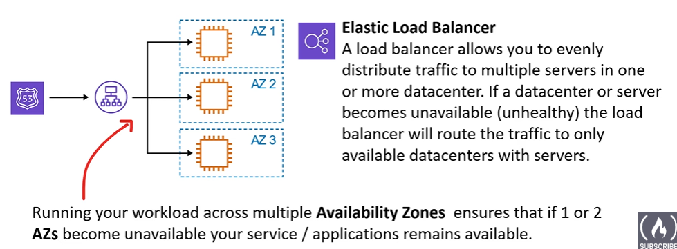
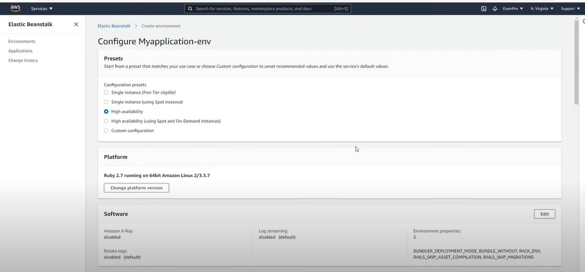
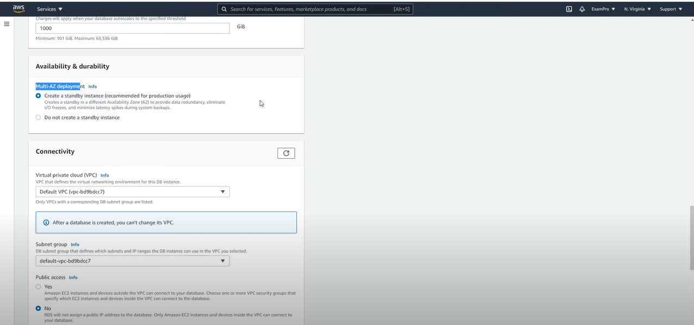
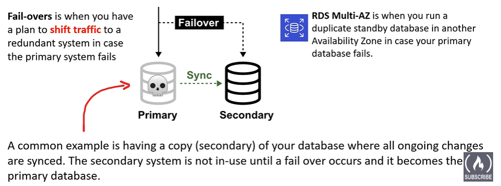
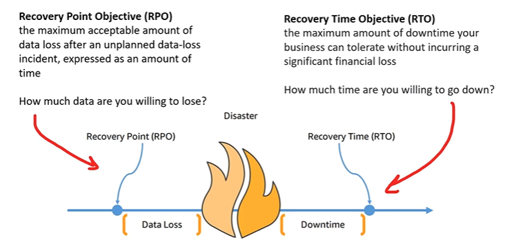
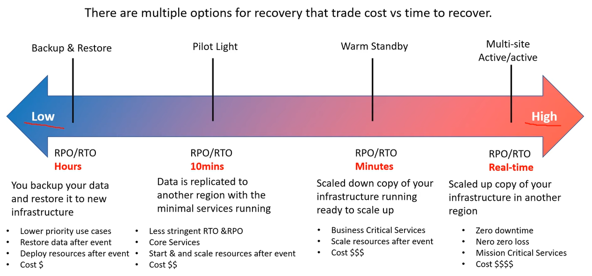
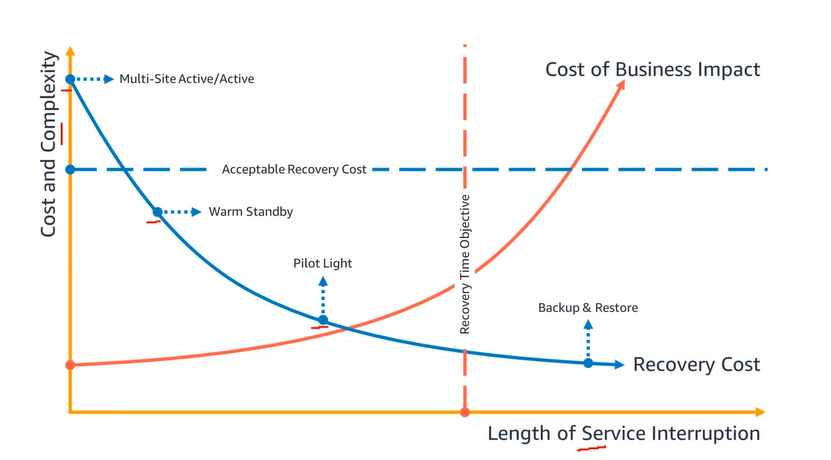
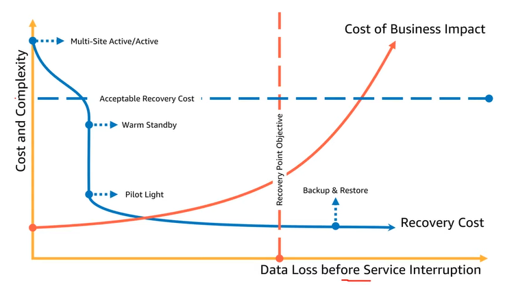

# AWS - Global Infrastructure

[Back](../index.md)

- [AWS - Global Infrastructure](#aws---global-infrastructure)
  - [Terminologies](#terminologies)
  - [High Availability](#high-availability)
    - [`Elastic Load Balancer (ELB)`](#elastic-load-balancer-elb)
  - [High Scalability](#high-scalability)
  - [High Elasticity](#high-elasticity)
    - [`Auto Scaling Groups (ASG)`](#auto-scaling-groups-asg)
  - [Hight Agility](#hight-agility)
  - [Highly Fault Tolerant](#highly-fault-tolerant)
  - [High Durability](#high-durability)
    - [Business Continuity Plan](#business-continuity-plan)
  - [Summary](#summary)
  - [Architectural Diagram Example](#architectural-diagram-example)

---

## Terminologies

- `Solution Architect`:

  - A role in a technical organization that **architects a technical solution** using multiple systems via researching, documentation, experimentation.

- `Cloud Architect`
  - A solution architect that is focused solely on architecting technical solution **using cloud services**.
  - needs to understand the following terms and factor them into their designed architecture based on the business requirement.
    - Availability: The ability to ensure a service remains available. e.g. Highly Available(HA)
    - Scalability: The ability to grow rapidly or unimpeded.
    - Elasticity: The abilibty to shrink and grow to meet the demand.
    - Fault Tolerance: The ability to prevent a failure.
    - Disaster Recovery: The ability to recover from a failure. e.g.Highly Durable(DR)
    - Security: How secure is this solution?
    - Cost: How much is this going to cose.

---

## High Availability

- The ability for the service to **remain available** by ensuring there is **no single point of failure** and/or ensure a certain level of performance.
- **High Availability** usually goes hand in hand with **horizontal scaling**

- High availability means running your application / system in **at least 2 Availability Zones**

- The **goal of high availability** is to **survive a data center loss (disaster)**

- Services:

  - Auto Scaling Group multi AZ
  - Load Balancer multi AZ

- Example: Multiple Availability Zones
  

- Use Case: Beanstalk
  

- Use Case: RDS
  

---

### `Elastic Load Balancer (ELB)`

- `Load Balancing`

  - servers that forward internet traffic to multiple
    servers (EC2 Instances) downstream.

  - Advantages
    - **Spread load** across multiple downstream instances
    - **Expose a single point** of access (DNS) to your application
    - Seamlessly **handle failures** of downstream instances
    - Do regular **health checks** to your instances
    - Provide SSL termination (HTTPS) for your websites
    - **High availability across zones**

- `Elastic Load Balancer (ELB)`

  - A load balancer allows to **evenly distribute traffic to multiple servers** in one or more datacenter.
    - If a datacenter or server becomes unavailable (unhealthy) the load balancer will route the traffic to only available dataceners with servers.

- AWS guarantees that it will be working
- AWS takes care of upgrades, maintenance, high availability
- AWS provides **only a few configuration knobs**
- It **costs less** to setup your own load balancer but it will be a lot more effort on your end (maintenance, integrations)
- 4 kinds of load balancers offered by AWS:
  - `Application Load Balancer` (HTTP / HTTPS only) – Layer 7
  - `Network Load Balancer` (ultra-high performance, allows for TCP) – Layer 4
  - `Gateway Load Balancer` – Layer 3
  - Classic Load Balancer (retired in 2023) – Layer 4 & 7

| Application Load Balancer     | Network Load Balancer                             | Gateway Load Balancer                                           |
| ----------------------------- | ------------------------------------------------- | --------------------------------------------------------------- |
| HTTP / HTTPS / gRPC protocols | TCP / UDP protocols                               | GENEVE Protocol on IP Packets                                   |
| Application Layer 7           | Transport Layer 4                                 | Network Layer 3                                                 |
| HTTP Routing features         | High Performance: millions of request per seconds | Route Traffic to **Firewalls** that you manage on EC2 Instances |
| Static DNS (URL)              | Static IP through Elastic IP                      | ntrusion detection                                              |

---

## High Scalability

- The ablity to **increase the capacity** based on the increasing demand of traffic, memory and computing power.

- ability to accommodate a **larger load** by making the **hardware stronger (scale up)**, or by adding **nodes (scale out)**

- 2 Kinds of Scalability:

  - `Vertical Scaling`:

    - `Scaling Up / Down`
    - increasing/decreasing the **size** of the instance
    - eg.
      - Upgrade to a bigger server.
      - t2.micro -> t2.large
    - very common for non distributed systems, such as increasing the size of a database.
    - There’s usually a limit to how much you can vertically scale (hardware limit)

  - `Horizonal Scaling`: elasticity

    - `Scaling Out / In`:
    - increasing/decreasing the **number** of instances / systems for your application
    - Add more servers of the same size.
    - implies distributed systems
    - very common for web applications / modern applications
    - Services:
      - Auto Scaling Group
      - Load Balancer

---

## High Elasticity

- The ability to **automatically** increase or decrease the capacity based on the current demand of traffic, memory and computing power.

- **“auto-scaling”** so that the system can scale based on the load.

  - This is “cloud-friendly”: **pay-per-use**, **match demand, optimize costs**

- `Horizonal Scaling`

  - `Scaling Out`: Add more servers of the same size.
  - `Scaling In`: Removing underutilized servers of the same size.

- `Vertical Scaling` is generally hard for traditional architecture so user will usually **only see horizontal scaling** described with Elasticity.

---

### `Auto Scaling Groups (ASG)`

- `Auto Scaling Groups (ASG)`

  - an AWS feature that will **automatically add or remove servers** based on scaling rules user define based on metrics.
  - The goal of an Auto Scaling Group (ASG) is to:
    - **Scale out** (add EC2 instances) to match an **increased** load
    - **Scale in** (remove EC2 instances) to match a **decreased** load
    - Ensure we have a minimum and a maximum number of machines running
    - **Automatically register new instances** to **a load balancer**
    - **Replace unhealthy** instances
  - Cost Savings: only **run at an optimal capacity** (principle of the cloud)

- **Scaling Strategies**
  - **Manual Scaling**:
    - Update the size of an ASG **manually**
  - **Dynamic Scaling**: Respond to **changing demand**
    - **Simple / Step Scaling**
      - When a `CloudWatch alarm` is triggered (example CPU > 70%), then add 2 units
      - When a `CloudWatch alarm` is triggered (example CPU < 30%), then remove 1
    - **Target Tracking Scaling**
      - Example: I want the average **ASG CPU** to stay at around 40%
    - **Scheduled Scaling**
      - Anticipate a scaling based on **known usage patterns**
      - Example: increase the min. capacity to 10 at 5 pm on Fridays
    - **Predictive Scaling**
      - Uses **Machine Learning to predict future** traffic ahead of time
      - Automatically provisions the right number of EC2 instances in advance
      - Useful when your load has **predictable time based patterns**

---

## Hight Agility

- `Agility`: (not related to scalability - distractor)
  - new IT resources are only a click away, which means that you **reduce the time** to make those resources available to your developers from weeks to just minutes. 缩短时间

---

## Highly Fault Tolerant

- The ability for the service to ensure there is **no single point of failure**, preventing the chance of failure.

- `Fail-overs`

  - When user have a plan to shift traffic to a redundant system in case the primary system fails.

- Example: RDS Multi-AZ
  

---

## High Durability

- The ability to **recover** from a disaster and to **prevent the loss of data**.

- `Disaster Revocery (DR)`

  - the solution that recover from a disaster.
  - factors to be considered:
    - Do you have a backup?
    - How fast can you restore that backup?
    - Does your backup still work?
    - How do you ensure current live data is not corrupt?

- `CloudEndure Disaster Recovery`
  - continuously replicates user's machines into a low-cost staging area in user's target AWS account and preferred Region enabling fast and reliable recovery in case of IT data center failures.

---

### Business Continuity Plan

- `Business Continuity Plan (BCP)`

  - a document that outlines how a business will continue operating **during an unplanned distruption in services**.

  

- Disaster Recovery Option

  - `Backup & Restore`: backup data and restore them **to new infrastructure**.

    - Lower priority use cases
    - Restore Data after event
    - Deploy resources after event
    - Cost: $

  - `Pilot Light`: data is replicated **to another region** with the minimal services running

    - Less stringent RTO & ROP
    - Core Services
    - Start and scale resources after event
    - Cost: $$

  - `Warm Standby`: scaled down copy of user's infrastructure running ready to scale up.

    - Business Critical Services
    - Scale resources after event
    - Cost: $$$

  - `Multi-site`: Scaled up copy of user's infrastructure **in another region**.
    - Zero downtime
    - Nero zero loss
    - Mission Critical Services
    - Cost: $$$$

  

- `Recoery Time Objective (RTO)`

  - the maximum acceptable delay between the interruption of service and restoration of service.
  - This objective determines what is considered an acceptable time window when service is unavailble and is defined by the organization.

  

- `Recoery Point Objective (RPO)`

  - the maximum acceptable amount of data since the last data recovery point.
  - This objective determines what is considered an acceptable loss of data between the last recovery point and interruption of service and is defined by the organization.

  

---

## Summary

- High **Availability** vs **Scalability** (vertical and horizontal) vs **Elasticity** vs **Agility** in the Cloud
- `Elastic Load Balancers (ELB)`
  - Distribute traffic across backend EC2 instances, can be Multi-AZ
  - Supports health checks
  - 4 types:
    - Classic (old),
    - Application (HTTP – L7),
    - Network (TCP – L4),
    - Gateway (L3)
- `Auto Scaling Groups (ASG)`
  - Implement Elasticity for your application, across multiple AZ
  - Scale EC2 instances based on the demand on your system, replace unhealthy
  - Integrated with the ELB

---

## Architectural Diagram Example

- AWS Architecture Icons: https://aws.amazon.com/architecture/icons/

---

[Top](#aws---global-infrastructure)
