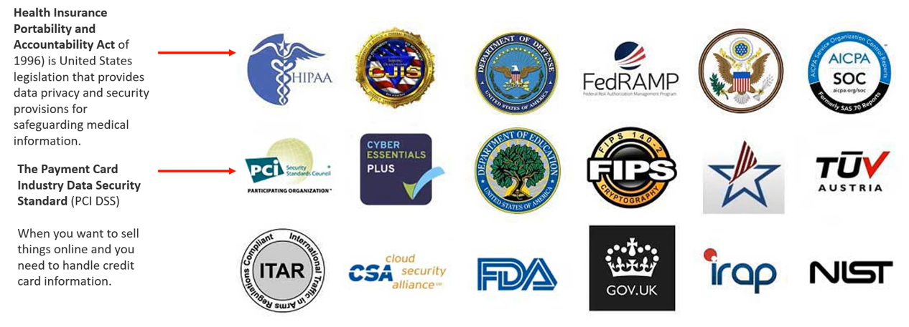
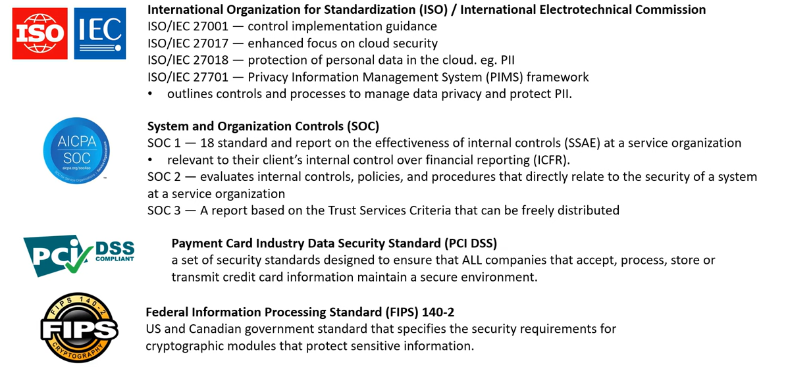
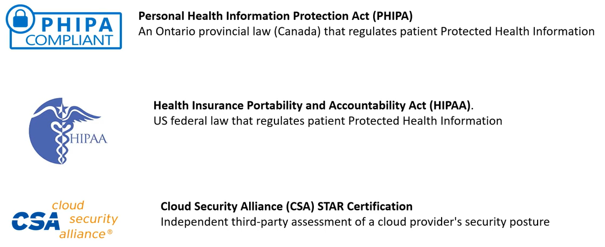

# AWS - Compliance

[Back](../index.md)

- [AWS - Compliance](#aws---compliance)
  - [Compliance](#compliance)
    - [Common Compliance Programs](#common-compliance-programs)
    - [`AWS Artifact` - Compliance Reports, Agreements, internal audit](#aws-artifact---compliance-reports-agreements-internal-audit)
    - [`AWS Config` - audit record AWS resources, per-region/across](#aws-config---audit-record-aws-resources-per-regionacross)
  - [Summary](#summary)

---

## Compliance

### Common Compliance Programs

- `Compliance Programs`

  - a set of internal **policies and procedures** of a company to comply with laws, rules, and regulations or to uphold business reputation.

- AWS Artifact: https://aws.amazon.com/artifact/

- Compliance Programs: https://aws.amazon.com/compliance/programs/

- AWS Compliance: https://aws.amazon.com/compliance/

---

### `AWS Artifact` - Compliance Reports, Agreements, internal audit

- `AWS Artifact`

  - a self-serve portal for on-demand access to **AWS compliance reports**.
  - provides on-demand access to security and compliance reports from AWS

- Portal that provides customers with on-demand access to **AWS compliance Documentation** and **AWS agreements**
- `Artifact Reports`
  - Allows you to **download AWS security and compliance documents** from third-party auditors, like AWS ISO certifications, Payment Card Industry (PCI), and System and Organization Control (SOC) reports
- `Artifact Agreements`
  - Allows you to review, accept, and track the **status of AWS agreements** such as the Business Associate Addendum (**BAA**) or the Health Insurance Portability and Accountability Act (**HIPAA**) for an individual account or in your organization
- Can be used to **support internal audit or compliance**

---

### `AWS Config` - audit record AWS resources, per-region/across

- Helps with auditing and recording compliance of your AWS resources
- Helps record configurations and changes over time
- Possibility of storing the configuration data **into S3 (analyzed by Athena)**
- Questions that can be solved by AWS Config:
  - Is there **unrestricted SSH** access to my security groups?
  - Do my buckets have any **public access**?
  - How has my ALB configuration changed over time?
- You can receive alerts (SNS notifications) for any changes
- AWS Config is a **per-region service**
- Can be aggregated **across regions and accounts**

- View **compliance** of a resource over time
- View **configuration** of a resource over time
- View **CloudTrail API calls** if enabled

---

## Summary

- `Artifact`:
  - Get access to compliance **reports** such as PCI, ISO, etc…
- `Config`:
  - Track config changes and **compliance** against rules

---

[TOP](#aws---compliance)
