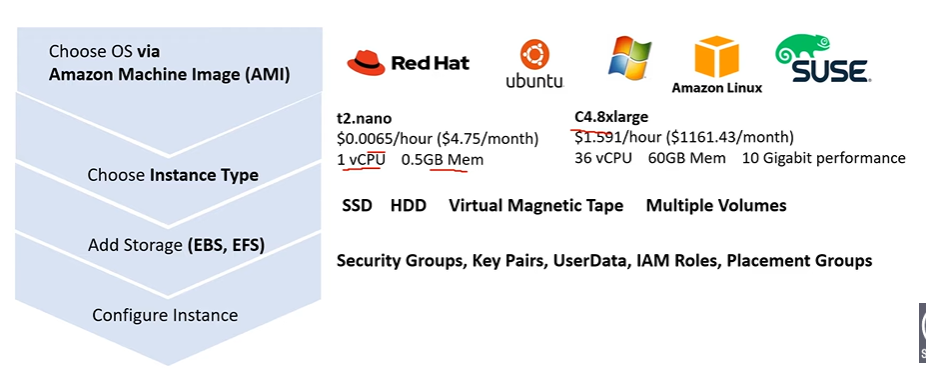
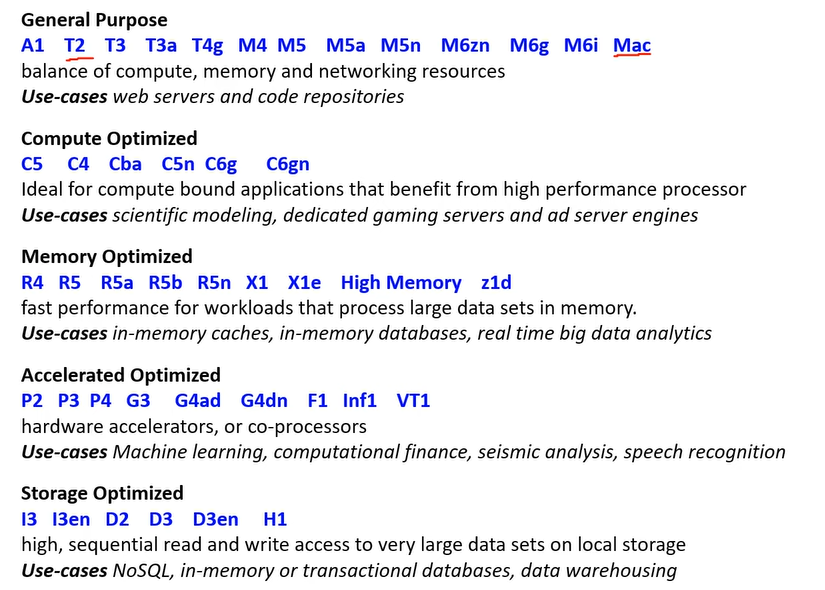
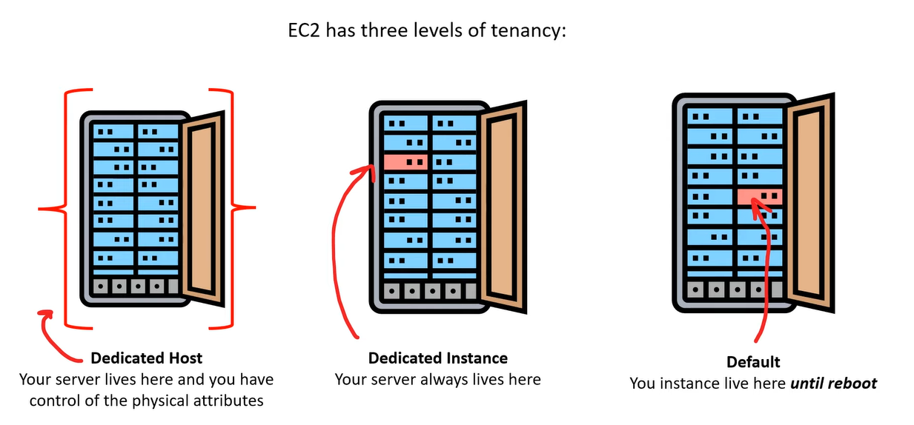
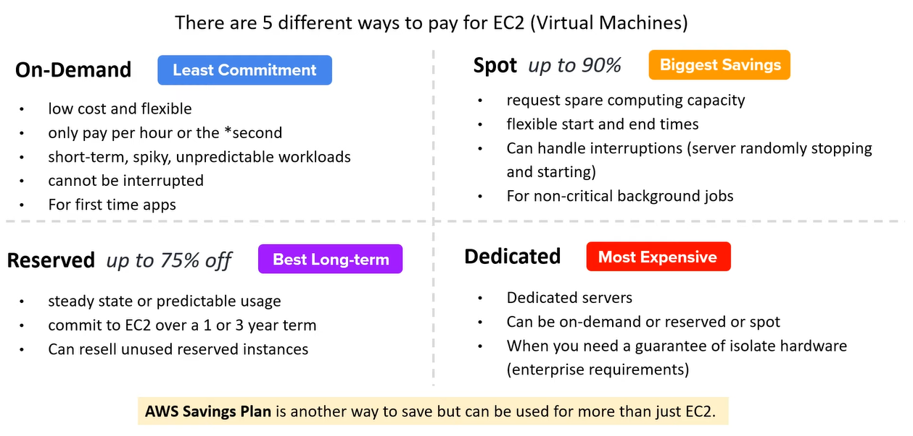
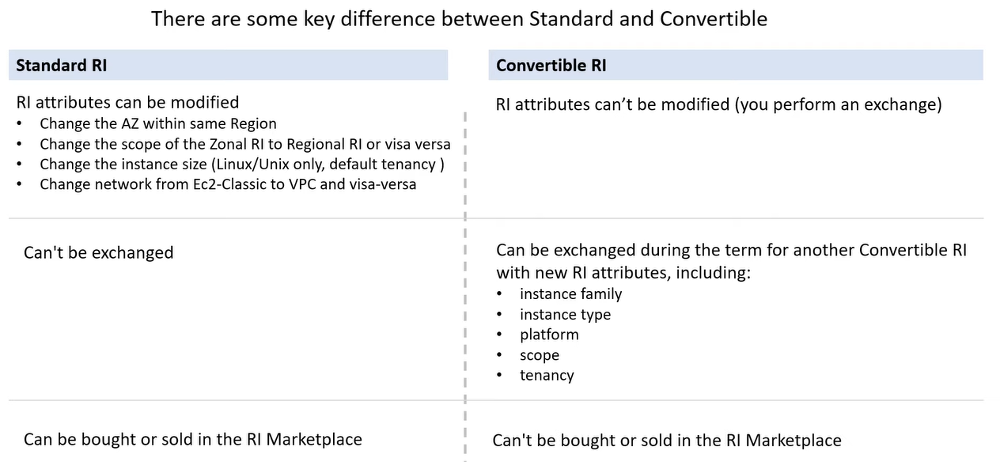
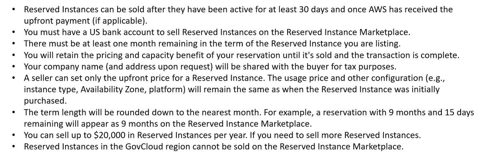
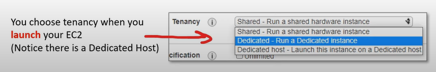
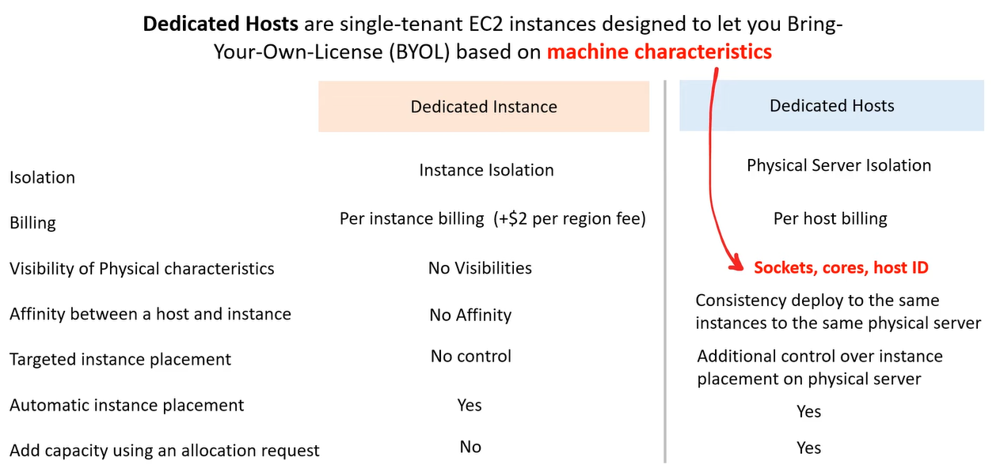
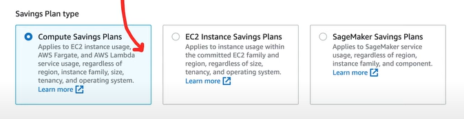
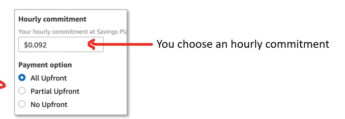

# AWS - EC2

[Back](../index.md)

- [AWS - EC2](#aws---ec2)
  - [EC2](#ec2)
    - [EC2 Instance Families](#ec2-instance-families)
    - [Instance Types](#instance-types)
      - [General Purpose](#general-purpose)
      - [Compute Optimized](#compute-optimized)
      - [Memory Optimized](#memory-optimized)
      - [Storage Optimized](#storage-optimized)
    - [EC2 Tenancy](#ec2-tenancy)
  - [Pricing Models / Purchase Options](#pricing-models--purchase-options)
    - [On-Demand](#on-demand)
    - [Reserved Instances (RI)](#reserved-instances-ri)
      - [Capacity Reservation](#capacity-reservation)
    - [Spot Instances](#spot-instances)
    - [Dedicated Instances](#dedicated-instances)
    - [Dedicated Hosts](#dedicated-hosts)
    - [Saving Plan](#saving-plan)
    - [Summary](#summary)
    - [Shared Responsibility Model for IAM](#shared-responsibility-model-for-iam)
  - [Summary](#summary-1)

---

## EC2

- `Elastic Compute Cloud (EC2)`
  - a highly configuration virtual server
  - resizable compute capacity.
  - takes minutes to launch new instances.
  - Everything on AWS uses EC2 instance underneath.

---

### EC2 Instance Families

- `Instance Families`

  - different combinations of CPU, Memory, Storage, and Networking capacity.
  - allow to choose the appropriate combination of capacity to meet user's application's unique requirements.

---

### Instance Types

- `Instance Types`

  - a combination of **size** and **family**.

- EC2 Instance Sizes generally double in price and key attributes

- can use different types of EC2 instances that are optimised for different use cases (https://aws.amazon.com/ec2/instance-types/)
- AWS has the following **naming convention**:
  `m5.2xlarge`
- m: **instance class**
- 5: **generation** (AWS improves them over time)
- 2xlarge: **size** within the instance class

---

#### General Purpose

- Great for a diversity of workloads such as **web servers** or **code repositories**
  - Balance between:
  - Compute
  - Memory
  - Networking
- `t2.micro`: a General Purpose EC2 instance

---

#### Compute Optimized

- Great for compute-intensive tasks that require **high performance** processors:
  - Batch processing workloads
  - Media transcoding
  - High performance web servers
  - High performance computing (HPC)
  - Scientific modeling & machine learning
  - Dedicated gaming servers

---

#### Memory Optimized

- Fast performance for workloads that **process large data sets in memory**
- Use cases:
  - High performance, **relational/non-relational databases**
  - Distributed web scale cache stores
  - **In-memory databases** optimized for BI (business intelligence)
  - Applications performing real-time processing of big unstructured data

---

#### Storage Optimized

- Great for storage-intensive tasks that **require high, sequential read and write access** to large data sets on local storage
- Use cases:
  - High frequency **online transaction processing (OLTP)** systems
  - Relational & NoSQL databases
  - Cache for in-memory databases (for example, Redis)
  - Data **warehousing** applications
  - Distributed file systems

---

### EC2 Tenancy

- 3 levels of tenancy
  - `Dedicated Host`
    - User has whole server and control of the physical attribute.
  - `Dedicated Instance`
  - `Default`

---

## Pricing Models / Purchase Options

- 5 ways to pay for EC2

---

### On-Demand

- `On-Demand`

  - Pay-As-You-Go (PAYG), where user consumes compute and then pay.

  - Pay for what you use:
    - Linux or Windows - billing per second, after the first minute
    - All other operating systems - billing per hour
  - Has the **highest cost** but no upfront payment
  - **No long-term commitment**
  - **no up-front payment**
  - Recommended:
    - for **short-term** and **un-interrupted workloads**, where you can't predict how the application will behave
    - For users whos have a new app **for deveplopment** or want to run **experiment**.

- It is **by default** using On-Demand pricing when an EC2 is launched.

- EC2s are charged by **per-second** (minumum of 60 seconds) or **per-hour**. When looking up pricing it will always show EC2 pricing is the **hourly rate**.

---

### Reserved Instances (RI)

- `Reserved Instances (RI)`

  - is designed for application that have a steady-state, predictable usage, or require reserved capacity.

  - Up to 72% discount compared to On-demand
  - **reserve a specific instance attributes** (Instance Type, Region, Tenancy, OS)
  - **Reservation Period** (Reserved instances do **not renew automatically**.)
    - 1 year (+discount)
    - 3 years (+++discount)
  - **Payment Options**
    - No Upfront (+)
    - Partial Upfront (++)
    - All Upfront (+++)
  - **Reserved Instance’s Scope**
    - Regional
    - Zonal (reserve capacity in an AZ)
  - **Recommended**:
    - for **steady-state** usage applications (like database)

- can buy and sell in the Reserved Instance Marketplace

- `Convertible Reserved Instance`

  - Can **change** the EC2 instance type, instance family, OS, scope and tenancy
  - Up to 66% discount

- Reduced pricing is based on **Term**, **Class Offering**, **RI Attributes**, and **Payment Option**.

  - The instance will use **On-Demand** with no interruption to service when **expiring**.

- **Class**: The less flexible the greater the savings.

  - **Standard**

    - Up to 75% reduced pricing compared to on-demand.
    - User can modify RI Attributes.

  - **Convertible**

    - Up to 54% reduced pricing compared to on-demand.
    - User can exchange RI based on RI Attributes if greater or equal in value.

- **Payment Option**: The greater upfront the greate the savings

  - **All Upfront**
    - Full payment is made at the start of the term
  - **Partial Upfront**
    - A portion of the cost must be upfront and the remaining hours in the term are billed at a discounted hourly rate.
  - **No Upfront**
    - Users are billed a discounted hourly rate for every hour within the term, regardless of whether the Reserved Instance is being used.

- RI can be **shared between multiple accounts** within an AWS Organization.
- **Unused RIs can be sold** in the Reserved Instance Maketplace.

---

- `RI Attributes / Instance Attributes`

  - are limited based on Class Offering and can affect the final price of an RI Instance.

- There are 4 RI Attributes

  - Instance Type:
    - is composed of the instance family and the instance size.eg. m4.large
  - Region
    - The region in which the reserved instance is purchased.
  - Tenancy
    - Whether instance runs on shared(default) or single-tenant(dedicated) hardware.
  - Platform
    - The Operating System. eg.windows or Linux/Unix.

---

- Regional and Zonal RI

- When purchasing a RI, user determines the scope of the Reserved Instance.
  - The scope does not affect the price.

| Regional RI:purchase for a Region                                                                                                                           | Zonal RI: purchase for an AZ                                                                                      |
| ----------------------------------------------------------------------------------------------------------------------------------------------------------- | ----------------------------------------------------------------------------------------------------------------- |
| does not reserve capacity                                                                                                                                   | reserves capacity in the specified AZ                                                                             |
| RI discount applies to instance usage in any AZ in the Region.                                                                                              | RI discount applies to instance in the selected AZ(No AZ Flexibility)                                             |
| RI discount applies to instance usage within the instance family, regardless of size. Only supported on Amazon Linux Reserved Instances with default tenacy | No instance size flexibility. RI discount applies to instance usage for the specified instance type and size only |
| User can queue purchases for regional RI                                                                                                                    | User cannot queue purchases for zonal RI                                                                          |

---

- `RI Limit`
  - a limit to the number of Reserved Instances that user can purchase per month.
- Per month user can purchase

  - 20 Regional Reserved Instances per Region
  - 20 Zonal Reserved Instances per AZ

- `Regional Limits`

  - The default **On-Demand Instance limit** is 20.
  - User cannot exceed user's running **On-Demand Instance limit** by purchasing regional Reserved Instances.
  - Before purchasing RI user must ensure On-Demand limit is equal to or greater than the RI that user intends to purchase.
  - Regional Limits <= On-Demand = 20

- `Zonal Limits`

  - User can exeed the running On-Demand Instance limit by purchasing zonal Reserved Instances.
  - If user already have 20 running On-Demand Instances, and purchase 20 zonal RIs, user can launch a furhter 20 On-Demand Instance that match the specifications of the zonal RI.

---

- Standard RI vs Convertible RI

---

- RI Marketplace

  - EC2 Reserved Instance Marketplace allows user to sell unused **Standard RI** to recoup RI spend for RI user do not intend or cannot use.

---

#### Capacity Reservation

- `Capacity Reservation`

  - a service of EC2 that allows user to request a reserve of EC2 type **for a specific Region and AZ.**

  - Reserve **On-Demand instances capacity** in a **specific AZ for any duration**
  - You always have access to EC2 capacity when you need it
  - No time commitment (create/cancel anytime),
  - **no billing discounts** 独立无优惠
  - Combine with **Regional Reserved Instances and Savings Plans** to benefit from **billing discounts** 联合有优惠
  - You’re charged at On-Demand rate whether you run instances or not
  - **Suitable**

    - for **short-term**, **uninterrupted** workloads that needs to be **in a specific AZ**

  - EC2 instances are backed by different kind of hardware, and so there is a finite amount of servers available within an AZ per instance type or family.
    - So AWS may have ran out of a specific type of server when user launch an EC2.

- The reserved capacity is charged at the selected instance type's **On-Demand rate** wether an instance is running in it or not.

- User can also use regional RI with Capacity Reservations to benefit from **billing discounts**.

---

### Spot Instances

- `Spot instance` provide a discount of 90% compared to On-Demand Pricing.

  - Instances that you can **“lose”** at any point of time if your max price is **less than the current spot price**
  - The **MOST cost-efficient** instances in AWS
  - Useful for workloads that are **resilient to failure**
    - Batch jobs
    - Data analysis
    - Image processing
    - Any distributed workloads
    - Workloads with a flexible start and end time
  - **Not suitable for critical jobs or databases**

  - can be **terminated** if the computing capacity is needed by other On-Demand customers.
  - AWS has unused compute capacity that they want to maximize the utility of their idle servers.
  - For application that have flexible start and end times or applications that are only feasible at very low compute costs.

- `AWS Batch`

  - a aws service using `Spot Pricing`.

- **Termiantion Conditions**
  - Instance can be terminated by AWS at anytime.
  - If instance is terminated by AWS, user does not get charged for a partial hour of usage.
  - If user termiantes an instance, user will still be charged for any hour that it ran.

---

### Dedicated Instances

- `Dedicated Instances`

  - are designed to meet regulatory requirements.
  - For users who have strict server-bound licening that won't support multi-tenancy or cloud deployments.

- Instances run on hardware that’s dedicated to you
- May share hardware with other instances in same account
- No control over instance placement (can move hardware after Stop / Start)

- Enterprises and Large Organizations may have security concerns or obligations about against sharing the same hardware with other AWS Cutomers.

- `Multi-Tenant`

  - When **multiple customers** are running workloads on the same hardware.
  - **Virtuall Isolation** is what separate customers.

- `Single Tenant`

  - When a single customer has dedicated hardware.
  - **Physical Isolation** is what separates customers.

- Dedicated can be offer for :
  - **On-demand**
  - **Reserved** (up to 60% savings)
  - **Spot** (up to 90% savings)

---

### Dedicated Hosts

- `Dedicated Hosts`

  - A **physical server with EC2 instance** capacity fully dedicated to your use
  - single-tenant EC2 instances designed to let user Bring-Your-Own-License (BYOL) based on machine characteristic.

- Allows you address **compliance requirements** and use your existing server-bound software **licenses** (per-socket, per-core, pe—VM software licenses)
- Purchasing Options:
  - On-demand – pay per second for active Dedicated Host
  - Reserved - 1 or 3 years (No Upfront, Partial Upfront, All Upfront)
- The **most expensive** option
- **Recommanded**:
  - Useful for software that have complicated licensing model (BYOL – Bring Your Own License)
  - Or for companies that have strong regulatory or compliance needs

---

### Saving Plan

- `Saving Plans`

  - offer users the similar disounts as RI but simplify the purchasing process.

  - Commit to a certain type of usage ($10/hour for 1 or 3 years)
  - Usage **beyond** EC2 Savings Plans is billed at the **On-Demand** price
  - **Locked to a specific instance family & AWS region** (e.g., M5 in us-east-1)
  - Flexible across:
    - Instance Size (e.g., m5.xlarge, m5.2xlarge)
    - OS (e.g., Linux, Windows)
    - Tenancy (Host, Dedicated, Default)

- 3 types of saving plans
  - `Compute`:
    - provide the most flexibility and help reduce costs by up to 66%.
    - **automatically** apply to EC2 instance usage, Fargate, and Lambda service usage regardless of instance family, size, AZ, region, OS, or tenancy.
  - `EC2 Instance`:
    - provide the lowest prices, offering savings up to 72% in exchange for commitment to usage of individual instance families in a region.
    - **automatically** reduces cost on the selected family in that region regardless of AZ, size, OS, or tenancy.
    - offer the flexibility to change usage between instances **within a family** in that region.
  - `SageMaker`
    - Help reduce SageMaker costs by up to 64%.
    - **automatically** apply to SageMaker usage regardless of instance family, size, component, or AWS region.

- Terms:

  - 1 Year
  - 3 Year

- Payment Options
  - All Upfront
  - Partial Upfront
  - No Upfront

---

### Summary

| Plan                  | Suiable                                                                                                                           |
| --------------------- | --------------------------------------------------------------------------------------------------------------------------------- |
| On demand             | coming and staying in resort **whenever** we like, we pay the **full price**                                                      |
| Reserved              | like planning ahead and if we plan to **stay for a long time**, we may get a good discount.                                       |
| Savings Plans         | pay a certain amount per hour **for certain period** and stay **in any room type** (e.g., King, Suite, Sea View, …)               |
| Spot instances        | the hotel allows people to bid for the empty rooms and the highest bidder keeps the rooms. You can **get kicked out at any time** |
| Dedicated Hosts       | We book an **entire building** of the resort                                                                                      |
| Capacity Reservations | you book a room for a period with full price e**ven you don’t stay** in it                                                        |

---

### Shared Responsibility Model for IAM

- AWS

  - **Infrastructure** (global network security)
  - **Isolation** on physical hosts
  - **Replacing** faulty hardware
  - **Compliance** validation

- User
  - **Security Groups** rules
  - **Operating-system** patches and updates
  - **Software and utilities** installed on the EC2 instance
  - IAM **Roles** assigned to EC2 & IAM user access management
  - **Data** security on your instance

---

## Summary

- **EC2 Instance**: 
  - AMI (OS) + Instance Size (CPU + RAM) + Storage + security groups + EC2 User Data
- **Security Groups**: **Firewall** attached to the EC2 instance
- **EC2 User Data**: **Script** launched at the first start of an instance
- **SSH**: start a terminal into our EC2 Instances (port 22)
- **EC2 Instance Role**: link to **IAM roles**
- **Purchasing Options**: 
  - On-Demand, 
  - Spot, 
  - Reserved (Standard + Convertible + Scheduled), 
  - Dedicated Host, 
  - Dedicated Instance
  - Saving Plan

---

[TOP](#aws---ec2)
