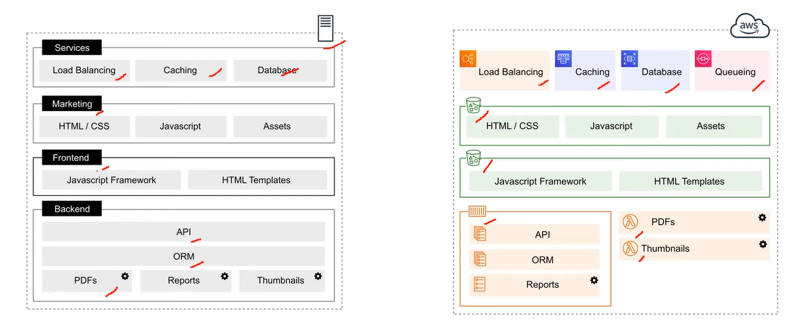
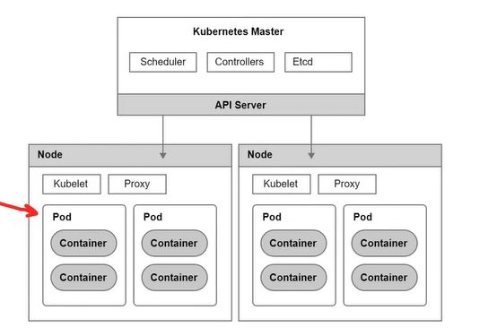
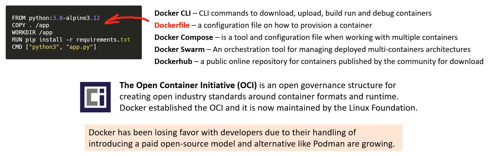
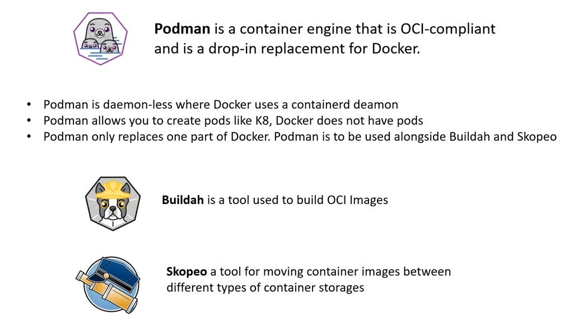
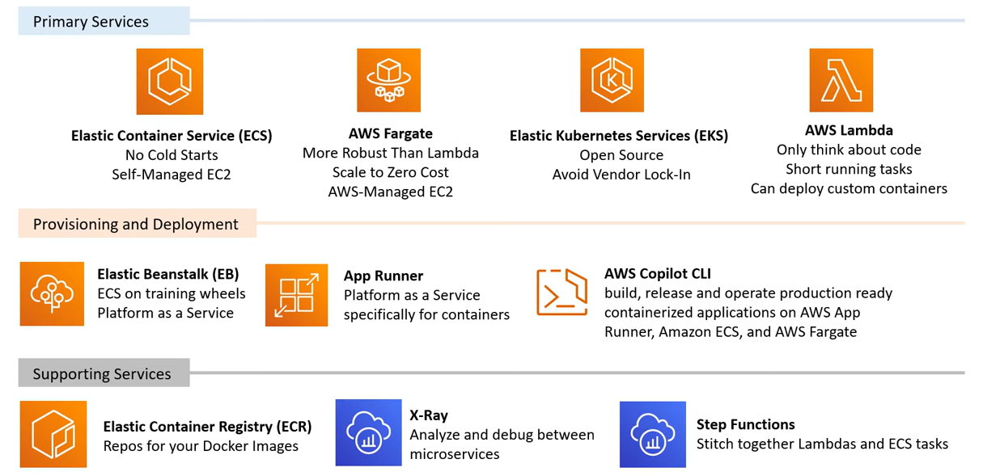

# AWS - Containers

[Back](../index.md)

- [AWS - Containers](#aws---containers)
  - [VMs vs Containers](#vms-vs-containers)
  - [Microservices](#microservices)
  - [Kuberenetes](#kuberenetes)
  - [Docker](#docker)
  - [Podman](#podman)
  - [Container Services](#container-services)

## VMs vs Containers

- `VMs`

  - VMs do **not make best use of space**.
  - Apps are **not isolated** which could cause config conflicts, security problems or resource hogging.

- `Containers`
  - containers allow to run multiple apps which are **virtually isolated** from each other.
  - Launch new containers and configures OS Dependencies per container.

---

## Microservices

- `Monolithic Architecture`

  - **One app** which is resonsible **for everyting** functionality is tightly coupled.

- `Microservices Architecture`
  - Multiple apps which are **each resonsible for one thing functionality** is isolate and stateless.

---

## Kuberenetes

- `Kuberenetes`

  - an open-source container orchestration system for automating deployment, scaling, and management of containers.
  - commonly called `K8`

- The advantage of Kubernetes over Docker is the ability to **run containers distributed** across multiple VMs.

- A unique component of Kubernetes are **Pods**.

  - A pod is a group of one more containers with shared storage, network resources, and other shared settings.

- Kuberenetes is ideally for micro-service architectures where a company has tems to hundreds of services they need to manage.

---

## Docker

- `Docker`
  - a set of Platform as Service (PaaS) products that use OS-level virtualization to deliver software in packages called containers.

---

## Podman

---

## Container Services

---

[TOP](#aws---containers)
