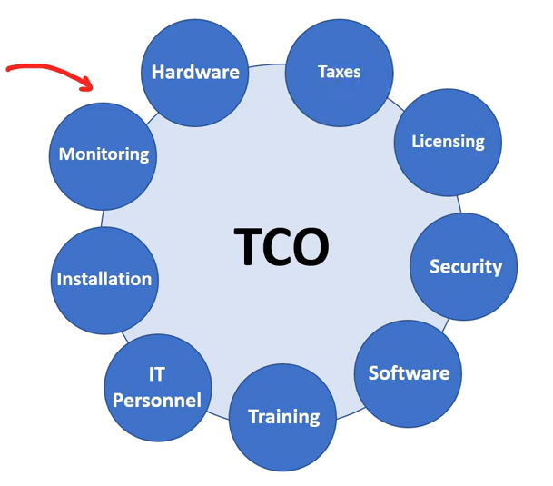
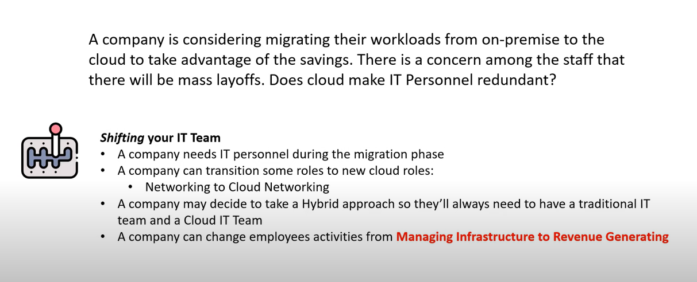
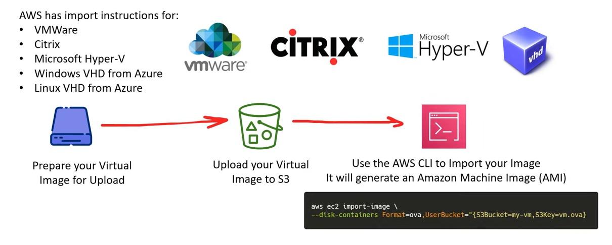
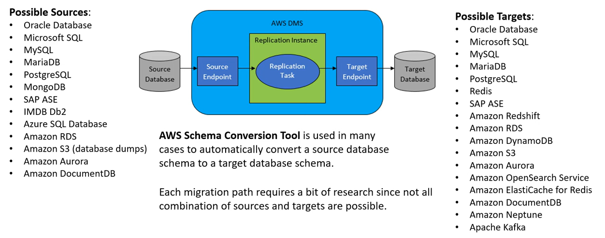
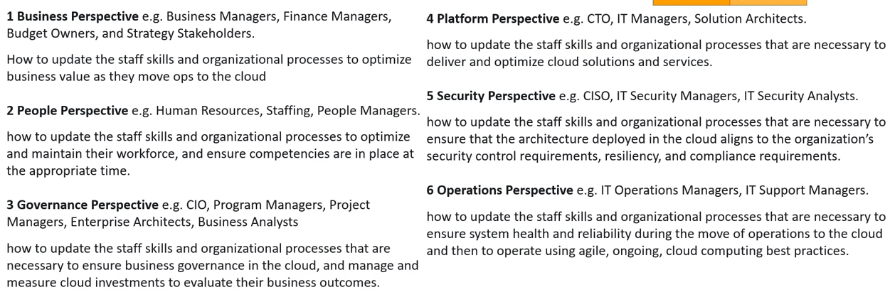

# AWS - Total Cost of Ownership (TCO)

[Back](../index.md)

- [AWS - Total Cost of Ownership (TCO)](#aws---total-cost-of-ownership-tco)
  - [Total Cost of Ownership (TCO)](#total-cost-of-ownership-tco)
  - [Capex vs Opex](#capex-vs-opex)
  - [Shifting-IT Personnel](#shifting-it-personnel)
  - [Pricing Calculator](#pricing-calculator)
  - [Migration Evaluator](#migration-evaluator)
  - [VM Import/Export](#vm-importexport)
  - [Database Migration Service (DMS)](#database-migration-service-dms)
  - [AWS Cloud Adoption Framework (CAF)](#aws-cloud-adoption-framework-caf)

## Total Cost of Ownership (TCO)

- `Total Cost of Ownership (TCO)`

  - a finicial estimate intended to help buyers and owners detemine the direct and indirect costs of a product or service.

- Creating a TCO report is useful when company is looking to migrate from on-premise to cloud.

---

## Capex vs Opex

- `Capital Expenditure (CAPEX)`

  - spending money upfront on physical infrastructure
  - deducting the expense from user's tax bill over tim.
  - Users **have to guess upfront** what they plan to spend.

- `Capex`:

  - Server Costs (computers)
  - Storage Costs (hard drives)
  - Network Costs (Routers, Cables, Switches)
  - Backup and Archive Costs
  - Disaster Recovery Costs
  - Datacenter Costs (Rent, Cooling, Physical Security)
  - Technical Personal

- `Operational Expenditure (OPEX)`

  - The costs associated with an on-premises datacenter that has shifted the cost to the service provider.
  - The customer only has to be concerned with **non-physical costs**.
  - Users can try a product or service **withou investing in equipment**.

- `OPEX`:
  - Leasing Software and Customizing features
  - Training Employees in Cloud Services
  - Paying for Cloud Support
  - Billing based on cloud metrics e.g
    - compute usage
    - storage usage

---

## Shifting-IT Personnel

---

## Pricing Calculator

- `AWS Pricing Calculator`

  - a free cost estimate tool to estimate the cost of various AWS services within web-browser without the need for an AWS Account.

- Website: https://calculator.aws/#/

---

## Migration Evaluator

- `AWS Migration Evaluator`
  - an estimate tool to determine an organization existing on-premise cost so user can compare against AWS Costs for planned cloud migration.

---

## VM Import/Export

- `VM Import/Export`
  - allows users to **import** Virtual Machine images into EC2.

---

## Database Migration Service (DMS)

- `AWS Database Migration Service (DMS)`
  - allows to quickly and securely migrate one database to another.
  - DMS can be used to migrate on-premise database to AWS.

---

## AWS Cloud Adoption Framework (CAF)

- `AWS Cloud Adoption Framework (CAF)`
  - a whitepaper to help user plan migration from on-premise to AWS.

---

[TOP](#aws---total-cost-of-ownership-tco)
