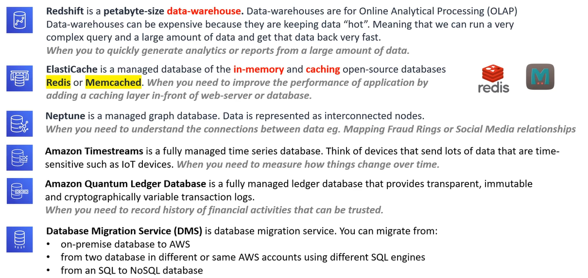

# AWS - Database

[Back](../index.md)

- [AWS - Database](#aws---database)
  - [Database](#database)
  - [Data Warehouse](#data-warehouse)
  - [A Key/Value Store](#a-keyvalue-store)
  - [Document Store](#document-store)
  - [NoSQL Database Services](#nosql-database-services)
  - [Relational Database Services](#relational-database-services)
  - [Other Database Services](#other-database-services)

---

## Database

- `Database`

  - a data-store that stores semi-structed and structured data.
  - is more complex data stotes because it requires using formal design and modeling techniques.

- Categorized as either:

  - `Relational databases`

    - structured data that strongly represents tabular data (table, rows and columns).
    - Row-oriented or Columnar-oriented

  - Non-relational databases
    - Semi-structured that may or may not distantly resemble tabular data.

- Databases have a rich set of functionality:
  - specialized language to query (retrieve data)
  - specialized modeling strategies to optimize retrieval for difference use cases.
  - more fine tune control over the transformation of the data into useful data structures or reports.

---

## Data Warehouse

- `Data Warehouse`

  - A relational datastore designed for analytic workloads, which is generally column-oriented data-store.
  - Companies will have terabytes and millions of rows of data, and they need a fast way to be able to produce analytics reports.

- Data warehouses generally perform aggregation.

  - aggregation is grouping data. eg.total or average.
  - Data warehouses are optimized around columns since they need to quickly aggregate column data.

- Data warehouses are generally designed to be HOT

  - HOT means they can return queries very fast even though they have vast amounts of data.

- Data warehouse are infrequently accessed meaning they are not intended for real=time reporting but once or twice a day or once a week to generate business and user reports.

- Data warehouse needs to consume data from a relational database on a regular basis.

---

## A Key/Value Store

- A key-value database is a type of non-relational databse (NoSQL) that uses a simple key-value method to store data.

  - Key values stores are dumb and fast.
  - generally lack feactures like:
    - relationships
    - indexes
    - Aggregation

---

## Document Store

- `Document Store`
  - a NOSQL database that stores documents as its primary data structure.
  - A document could be an XML but commonly is JSON or JSON-Like
  - Document stores are sub-class of Key/Value stores.

---

## NoSQL Database Services

- `DynamoDB`

  - a serverless NoSQL key/value and document database.
  - It is designed to scale to billions of records with guaranteed consisted data return in at least a second.
  - For users who want a massively scalable database.

- `DocumentDB`

  - a NoSQL document database that is **MongoDB compatible**.
  - For users who want a `MongoDB` database.

- `Amoazon Keyspaces`

  - a fully managed Apache `Cassardra` database.
  - For users who want to use `Apache Cassandra`

- `Cassandra`
  - an open-souce NoSQL key/value database.

---

## Relational Database Services

- `Relational Database Service (RDS)`

  - a relational database service that supports multiple SQL engines. Relational is synonymous with `SQL` and `Online Transactional Processing (OLTP)`.

  - Supported SQL Engine

  

- `Aurora`

  - a fully managed database of either MySQL and PSQL database.
  - For users who want a relational database for Postgres or MySQL.

- `Aurora Severless`

  - the serverless on-demand version of Aurora.
  - For users who want most of the benefits of Aurora but can trade to have cold-starts or don't have lots of traffic demand.

- `RDS on VMware`
  - allow to deploy RDS supported engines to an on-premise data-center.
  - For users who want databases managed by RDS on user's own datacenter.

---

## Other Database Services

- `Redshift`
  - a petabyte-size data-warehouse.
  - Data-warehouses are for Online Analytical Processing (OLAP) and can run a very complex query and a large amount of data and get that data back very fast.
  - For users who want to quickly generate analytics or reports from a large amount of data.

---

[TOP](#aws---database)
