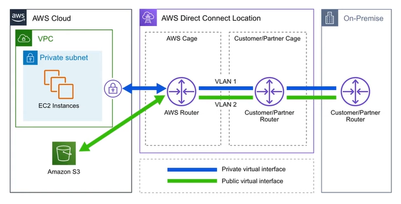

# AWS - Global Infrastructure

[Back](../index.md)

- [AWS - Global Infrastructure](#aws---global-infrastructure)
  - [Regional vs Global Services](#regional-vs-global-services)
  - [Global Infrastructure](#global-infrastructure)
    - [Region](#region)
    - [Availability Zones](#availability-zones)
    - [Global Network](#global-network)
    - [Point of Presence (Pop)](#point-of-presence-pop)
    - [Direct Connection Locations](#direct-connection-locations)
    - [Local Zones](#local-zones)
    - [Wavelength Zones](#wavelength-zones)
    - [AWS Ground Station](#aws-ground-station)
    - [AWS Outposts](#aws-outposts)
  - [AWS Government](#aws-government)
  - [AWS China](#aws-china)
  - [Fault Tolenrance](#fault-tolenrance)
  - [Data Residency](#data-residency)
  - [Sustainability](#sustainability)

---

## Regional vs Global Services

- `Regional Services`

  - AWS scopes AWS Management Console on a selected Region.
  - It will determine where an AWS service will be launched and what will be seen in a console.
  - do not explicitly set the Region for a service at the time of creation.

- `Global Services`

  - some AWS Services operate across multiple regions and the region will be fixed to "Global"
  - e.g.:
    - `Amazon S3` (a single region must be explicitly chosen, such as S3 bucket)
    - `CloudFront` (a group of regions to be chosen, such as CloudFront Distribution)
    - `Route53`
    - `IAM` (has no concept of region)

---

## Global Infrastructure

- `Global Infrastructure`;

  - globally distributed **hardware and datacenters** that are physically network together to act as one large resource for the end customer.

- made up of resources:

  - Launched Regions
  - Availability Zones
  - Direct Connection Locations
  - Point of Presence
  - Local Zone
  - Wavelength Zones

- AWS Global Infrastructure: https://aws.amazon.com/about-aws/global-infrastructure/

---

### Region

- `Region`:

  - **geographically distinct locations** consiting of one or more Availability Zone.

- Featrues:

  - Each region generally has **three `Availability Zones`**. (Some new users are limited to two. eg. US-West)
  - Not all **AWS Services** are available in all regions.
  - The **cost** of AWS services vary per region.
  - **New services** almost always become available first in `US-EAST`
  - All **billing information** appears in `US-EAST-1(North Virginia)`

- Factors to be considered to choose a region

  - Regulatory Compliance that this region meet
  - Cost of AWS services
  - Avaliable AWS services
  - distance or latency to end-users

- Diagram: 使用小旗子标记

  

---

### Availability Zones

- `Availability Zones`:

  - a **physical location** made up of one or more **detacenter**.
  - A region generally contains 3 AZ.

- `Datacenter`:

  - A secured building that contains hundreds of thousand of computers.
  - Datacenters within a region will be isolated from each other, but close enough to provide low-latency.

- It is a common practice to run workloads in at least 3 AZs to ensure services remain available in case one or two datecenters fail.

- Identifier:represented by a Region Code, followed by a letter.

  - e.g.: `us-east-1a`

- A `subnet` is associated with an AZ.

  - When launching a resource, users never choose an AZ, but a subnet which is associate to the AZ.

- Diagram: 虚线方框

  

- Region and Zone
  

---

### Global Network

- `AWS Global Network`:

  - represent the interconnections between AWS Global Infrastructure.
  - aka, `the backbone of AWS`
  - a private expressway, where things can move very fast between datacenters.

- Example services regarding to the Global Network:

  

---

### Point of Presence (Pop)

- `Point of Presence (Pop)`:

  - an **intermediate location** between as `AWS Region` and the `end user`, and this location could be a **datacenter or collection of hardware**.
  - For AWS, a `point of presence` is a **data center owned** by AWS or a trusted partner that is utilized by AWS Services related for content delivery or expediated upload.
  - POP resources are Edge Locations and Regional Edge Caches.

- `Edge Locations`:

  - datacenters that hold cached(copy) on the most popular files(e.g. web pages, images and videos) so that the delivery of distance to the end users are reduce.

- `Regional Edge Location`
  - datacenters that hold much larger caches of less-popular files to reduce a full round trip and also to reduce the cost of transfer fees.

- `Tier 1 Network`

  - a network that can reach every other network on the interest **without purchasing IP transit or paying for peering.**
  - `AWS AZ` are all redundantly connected to multiple tier-1 transit providers.

  

- AWS services using POP for content delivery or expediated upload.
  

---

### Direct Connection Locations

- `AWS Direct Connect`:

  - a private/dedicated connection **between users' datacenter, office, co-location and AWS**.

- Advantages:

  - helps reduce netork costs and increase bandwidth throughtput. (greate for high traffic networks)
  - provides a more consistent network experience than a typical internet-based connection.(reliable and secure)

  

- `Direct Connect Locations` are trusted partnered **datacenters** that you can establish a dedicated high speed, low-latenecy connection from your on-premise to AWS.

- Users would use the `AWS Direct Connect service` to order and establish a connection.

---

### Local Zones

- `Local Zone`:

  - **datacenters** located very close to a densely populated area to provide single-digit millisecond low latency performance for that area.

- Purpose of Local Zone

  - support highly-demanding applications sensitive to latencies

- Example: Los Angeles, California
  - the first Local Zone to be deployed.
  - It is logical extension of the US-West Region
  - The identifier looks like: `us-west-2-lax-1a`
  - Only specific AWS Service have been made available.

---

### Wavelength Zones

- `AWS Wavelength Zones`
  - allows for edge-computing **on 5G networks**.
  - Applications will have ultra-low latency being as close as possible to the users.
  - User creates a Subnet tied to a Wavelength Zone and then can launch Virtual Machine(VMs) to the edge of the targeted 5G Networks.

---

### AWS Ground Station

- `AWS Ground Station`:

  - a fully managed service that lets user control satellite communication.

- Use case:
  

---

### AWS Outposts

- `AWS Outposts`:
  - a fully managed service that offers the same AWS infracture, AWS servicess, APIs, and tools to virtually any datacenter, co-location space, or on-premises facility for a truly consistent hybrid exprience.
  - is **rack of servers** running AWS Infrastructure **on users' physical location**.

---

## AWS Government

- `Public Sector`:

  - include pulic goods and governmental services such as military, law enforcement, infrastructure, public transit, public education, health care, and the government.
  - AWS can be utilized by public sector or organizations developing cloud workloads for the public sector.

- AWS achieves this by meeting regulatory compliance programs along with specific governmence and security controls.

- `Federal Risk and Authorization Management Program (FedRAMP)`

  - a US government-wide program that provides a standardized approach to security assessment, authorization, and continuous monitoring for cloud products and services.

- `GovCloud`:

  - special regions for US regulation.
  - A `Cloud Service Provider (CSP)` generally will offer an isolated region to run `FedRAMP` workloads.

- `AWS GovCloud Regions`
  - allow customers to host sensitive `Controlled Unclassfied Information` and other type of **regulated workloads**.

---

## AWS China

- AWS China is the AWS cloud offerings in Mainland China.
  - is completely isolate from AWS Global
  - domain: amazonaws.cn
  - users need have a Chinese Business License (ICP license)
  - Not all services are available. e.g.: Route53
  - not need to traverse the Great Firewall.

---

## Fault Tolenrance

总体意思:

1. Region 将相互分离是 fault level
2. AZ 分离, 是 fault domain,即 Failure Zone
3. 多 AZ 的 APP 更好保障.

- Terminology:

  - `fault domain`:
    - a section of a **network** that is vulnerable to damage if a critical device or system fails.
    - The purpose of a fault domain is that if a failure occurs it will not cascade outside that domain, limiting the damage possible.
    - Fault domains can be nested inside fault domains.
    - scope of a fault domain is up to Cloud Service Provider(CSPs) to define the boundaries. It could be:
      - specific servers in a rack
      - an entire rack in a datacenter
      - an entire room in a datacenter
      - the entire data center building

- `Fault level`:

  - a collection of fault domains.

  

- Each `Amazon Region` is designed to be **completely isolated** from the other Amazon Regions.
  - This achieves the greatest possible fault tolerance and stability.
- Each `Availability Zone` is isolated, but the Availability Zones in a Region are connected through low-latency links.
- Each `Availability Zone` is designed as an `independent failure zone`.

  - A `Failure Zone` is AWS describing a `Fault Domain`.

- `Failure Zone`:

  - `Availabilty Zones` are physically separated within a typical metropolitan region and are located in lower risk flood plains.
  - descrete uninterruptible power supply (UPS) and onsite backup generation facilities.
  - data centers located in different `Availability Zones` are designed to be supplied by independent substations to reduce the risk of an event on the power grid impacting more than one Availability Zone.
  - Availability Zones are all redundantly connected to multiple tier-1 transit providers.

- **Multi-AZ for Hight Avaliability**
  - if an application is partitioned across AZs, companies are better isolated and protected from issues such as power outages lightning strikes, tornadoes, earthquake and more.

---

## Data Residency

- `Data Residency`:

  - the physical or geographic **location** of where an organization or cloud **resources reside**.

- `Compliance Boundaries`:

  - A **regulatory compliance** (legal requirement) by a government or organization that describes where data and cloud **resources are allowed to reside**.

- `Data Sovereignty`:

  - jurisdictional control or legal authority that can be asserted over data because it's physical location is within jurisdictional boundaries.

- For workloads that need to meet compliance boundaries strictly defining the data residency of data and cloud resources in AWS can be used:
  - `AWS Outposts`
    - **physical rack of servers** that user can put in user's data center.
    - User's data will reside whenever the Outpost Pysically resides.
  - `AWS Config`:
    - a Policy as Code service.
    - User can create rules to continuous check AWS resources configuration. If rules deviate from userss expectations users are alerted or AWS Config can in some cases auto-remediate.
  - `IAM Policies`:
    - can be explicitly deny access to specific AWS regions. A `Service Control Policy` (SCP) are permissions applied organization wide.

---

## Sustainability

- website: https://sustainability.aboutamazon.com/

---

[TOP](#aws---global-infrastructure)
