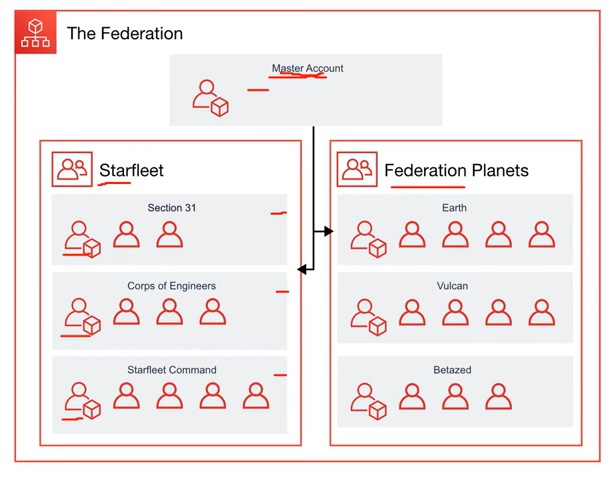
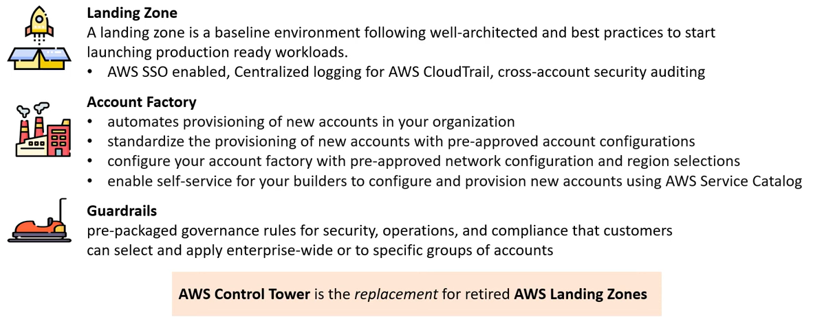
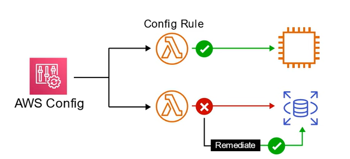
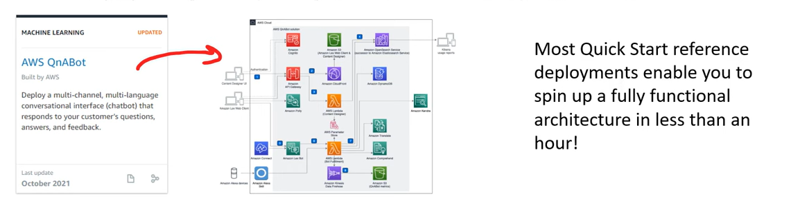
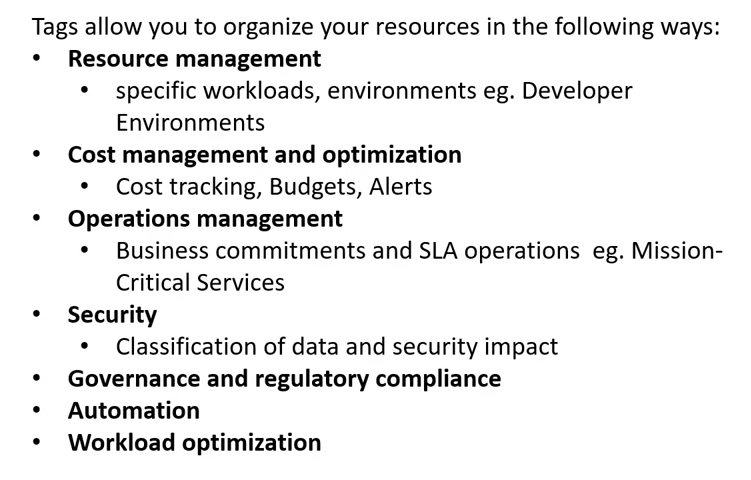
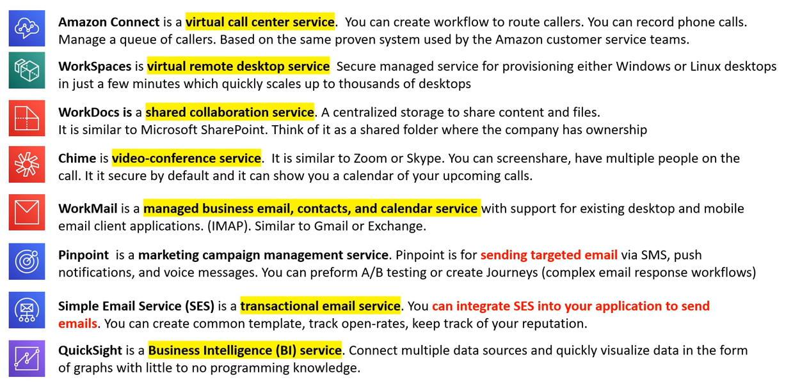

# AWS - Goverance

[Back](../index.md)

- [AWS - Goverance](#aws---goverance)
  - [Organizations And Accounts](#organizations-and-accounts)
  - [AWS Control Tower](#aws-control-tower)
  - [AWS Config](#aws-config)
  - [AWS Quick Starts](#aws-quick-starts)
  - [Tagging](#tagging)
  - [Resource Groups](#resource-groups)
  - [Business Centric Service](#business-centric-service)

---

## Organizations And Accounts

- `AWS Organizations`

  - allow the creation of new AWS accounts.
  - Centrally manage billing, control access, compliance, security, and share resources across AWS accounts.

- `Root Account User`

  - a single sign-in identity that has **complete access to all AWS services and resources** in an account.
  - Each account has a `Root Account User`.

- `Organization Units`

  - a group of AWS accounts within an organization which can also contain other organization units - creating a hierachy.

- `Service Control Policies`

  - give **central control over the allowed permissions** for all accounts in organization, helping ensure accounts stay within organization's guidelines.

- AWS Organizations must be turned on. Once turned it on, it cannot be turned off.

- User can create as many AWS Accounts as user like. One account will be the Master/Root Account.

- `AWS Account` is not the same as a `User Account`.

---

## AWS Control Tower

- `AWS Control Tower`
  - helps Enterprises quickly set-up a secure, AWS multi-account.
  - provides user with a baseline enrvironment to get started with a multi-account archetecture.

---

## AWS Config

- `Change Management`

  - When user has formal process to monitor changes, enforce changes, and remediate changes.

- `Compliance-as-code (Cac)`

  - When user utilizes programming to automate the monitoring, enforcing, and remediating changes to stay compliant with a compliance programs or expected configuration.

- `AWS Config`

  - Compliance-as-Code framework that allows to manage change in AWS accounts on a per region basis.

  

- Use case:
  - When User neeeds resource to stay configured a specific way for compliance.
  - When user needs to keep track of configuration changes to resources.
  - When user needs a list of all resources within a region.
  - When user needs to use anaylyze potential security weaknesses and detailied historical information.

---

## AWS Quick Starts

- `AWS Quick Starts`

  - prebuilt templates by AWS and AWS Partners to help deploy wide range of stacks.

- Composed of 3 parts:
  - A reference architecture for the deployment
  - AWS CloudFormation templates that automate and configure the deployment
  - A deployment guide explaining the architecture and implementation in detail.

---

## Tagging

- `Tag`
  - a key and value pair that user can assign to AWS resources.

---

## Resource Groups

- `Resource Groups`

  - a collection of resources that share one or more tags.
  - helps user organize and consolidate information based on user's project and the resources that user use.

- Resource Groups can display details about a group of resource based on

  - Metrics
  - Alarms
  - Configuration Settings

- At any time, user can modify the settings of user's resource groups to change what resources appear.

---

## Business Centric Service

不考, 但干扰项会出现, 最好了解.

---

[TOP](#aws---goverance)
