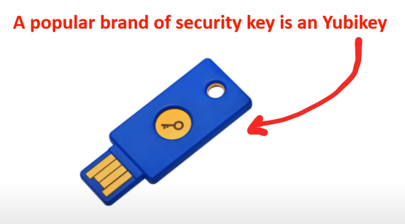

# AWS - Identity

[Back](../index.md)

- [AWS - Identity](#aws---identity)
  - [Zero Trust Model](#zero-trust-model)
    - [Zero Trust on AWS](#zero-trust-on-aws)
    - [Intelligent Zero Trust on AWS: with Third Party.](#intelligent-zero-trust-on-aws-with-third-party)
    - [Identity Providers(IdPs)](#identity-providersidps)
  - [Technologies](#technologies)
    - [Directory Service](#directory-service)
    - [Single-Sign-On (SSO)](#single-sign-on-sso)
    - [LDAP](#ldap)
    - [Multi-Factor-Authenication](#multi-factor-authenication)
    - [Security Keys](#security-keys)
  - [Principle of Least Privilege (PoLP)](#principle-of-least-privilege-polp)
  - [AWS IAM](#aws-iam)
    - [IAM Policy](#iam-policy)
    - [AWS Account Root User](#aws-account-root-user)
    - [AWS IAM Identity Center - SSO](#aws-iam-identity-center---sso)
    - [Access Keys](#access-keys)
    - [IAM Security Tools](#iam-security-tools)
    - [IAM Guidelines \& Best Practices](#iam-guidelines--best-practices)
    - [Shared Responsibility Model for IAM](#shared-responsibility-model-for-iam)
  - [IAM Section – Summary](#iam-section--summary)

---

## Zero Trust Model

- `Network-Centric`: Old-Way

  - Traditional security focused on firewalls and VPNs
    - Since there were few employees or workstations outside the office or they were in specific remote offices.

- `Identity-Centric`: New-Way

  - We have **identity based security controls** like MFA, or providing provisional access based on the level of risk from where, when,and what a user wants to access.
  - Since Bring-your-own-device, remote workstations is much more common, we cannot trust if the employee is a secure location.

- `Primary Security Perimeter`

  - The primary or new security perimeter **defines the first line of defense** and its security controls that protect a company's cloud resources and assets.

- `Zero Trust Model`

  - operates on the principle of trust no one, verify everything.

- In the Zero Trust Model, **Identity** becomes the `primary security perimeter`.

- `Identity-Centric` does not replace but **arguments** `network-centric security`.

---

### Zero Trust on AWS

- `Identity Security Controls`
  - user can implement on AWS to meet the `Zero Trust`.

- AWS does not have a ready-to-use identity controls are intelligent, which is why AWS is considered to not have a true Zero Trust offering for customers, and **third-party services need to be used.**

- A collection of AES services can be setup to intelligent-ish detection concerns but requires expert knowledge.

---

### Intelligent Zero Trust on AWS: with Third Party.

- AWS does technically **implement a Zero Trust Model** but does not allow for intelligent identity security controls.

- 要实现智能, 需要使用第三方.

---

### Identity Providers(IdPs)

- `Identity Provider (IdP)`

  - a system entity that creates, maintains, and manages **identity information** for principals and also **provides authentication services** to applications with a **federation** or distributed network.

- `Federated identity`

  - a method of linking a user's identity across multiple separate identity management systems.

- A trusted provider of user identity lets user use authenticate to access other services.

- Identity Providers: **Facebook, Amazon, Google, Twitter, Github, LinkedIn**.

- Protocol

  

---

## Technologies

### Directory Service

- `Directory Service`

  - maps the names of network resource to their network address.
  - shared information infrastructure for **locating, managing, adminstering, and organizing** resources.
    - Each resource on the network is considered an **object** by the directory server.
    - Information about a particular resource is stored as **collection of attributes** associated with that resource or object.

- A direcotry service is a critical component of a network operating system.

- `directory server (name server)`
  - a server which provides a directory service.

- Active Directory - Windows

  - Used by windows.(了解即可)

  

---

### Single-Sign-On (SSO)

- `Single-Sign-On (SSO)`

  - an authentication scheme that allows a user to log in **with a single ID and password** to **different systems and software**.

- Exmaple: Active Directory

  

---

### LDAP

- `Lightweight Directory Access Protocol (LDAP)`

  - an open, vendor-neutral, industry standard **application protocol** for accessing and maintaining distributed directory information services over an internet Protocol netowork.
  - common use of LDAP is to provide a central place to store usernames and password.

- LDAP enables for SSO.
- SSO allows users to single ID and password, but they have to enter it in every time they want to login.

  

---

### Multi-Factor-Authenication

- `Multi-Factor Authenication (MFA)`

  - a security control where after user fill in username/email and password, user have to use a second device such as a phone to confirm that its logging in.

- MFA protects against people who have stolen user's password.

---

### Security Keys

- `Security Keys`

  - a secondary device used as second step in authentication process to gain access to a device, workstation, or application.

- A security key can resemble a memory stick which will generate an autofill a security token.

---

## Principle of Least Privilege (PoLP)

- `Principle of Least Privilege (PoLP)`

  - the computer security concept of providing a user, role, or application **the least amount of permissions** to perform a operation or action.

- `Just-Enough-Access (JEA)`

  - **permitting only the exact actions** for the identity to perform a task

- `Just-In-Time (JIT)`

  - **permitting the smallest length of duration** an identity can use permissions.

- `Risk-based adaptive policies`

  - Each attempt to access a resource **generate a risk score** of how likely the request is to be from a compromised source.
  - The risk score could be based on many factors. e.g. device, user location, IP address what service is being accessed and when.

- AWS at the time of this recording does not have Risk-based adaptative policies built into IAM.

---

## AWS IAM

- `AWS Identity and Access Management (IAM)`

  - user can create and manage AWS users and groups, and permissions **to allow and deny** access to AWS resources.

- `IAM Policies`

  - **JSON documents which grant permissions** for a specific user, group, or role **to access services**.
  - Policies are attached to IAM Identities.

- `IAM Permission`

  - The API **action that can or cannot be performed**.
  - are represented in the IAM Policy document.

- `IAM Identities`

  - `IAM Users`

    - **End users who log into the console** or interact with AWS resources programmatically or via clicking UI interfaces.

  - `IAM Groups`

    - Group up users who all **share permission levels** of the group.

  - `IAM Roles`
    - Roles grant AWS **resources permissions** to specific **AWS API actions.**
    - Associate policies to Role and assign it to an AWS resource.
    - Some AWS service will need to perform actions on user's behalf.To do so, permissions are need to be assigned to AWS services with `IAM Roles`
      - - Common roles:
        - EC2 Instance Roles
        - Lambda Function Roles
        - Roles for CloudFormation

- 总结:
  - user 是用户, 其 permission 是用户的 action 权限;
  - role 可以是 AWS Servcie, 其其 permission 是该服务的 action 权限.
    - 例如将 role 赋权给 EC2 服务,则该服务有 action 的权限.

---

### IAM Policy

- `IAM Policy`
  - are written in JSON,
  - contains the permission which determin what API actions are allowed or denied.

---

### AWS Account Root User

- `AWS Account`

  - the account which **holds all user's AWS resources**

- `Root User`

  - a special user **who is created** at the time of AWS account creation
  - a special account with **full access** that **cannot be deleted**.

  - **Administrative Task**

  

- `User`

  - a user for common tasks that is assigned permissions.

  |             | Root User               | Regular User           |
  | ----------- | ----------------------- | ---------------------- |
  | Login       | Email + pwd             | Account ID/Alias + PWD |
  | Delete      | Cannot be deleted       | Can                    |
  | Permissions | Full, cannot be limited | Can be denied          |
  | Number      | One per AWS acount      | Many                   |
  | Task        | Specialized tasks       | Daily or common tasks  |
  | Access Keys | Never use               | Recommended            |
  | MFA         | Strongly recommended    | Recommended            |

---

### AWS IAM Identity Center - SSO

- `IAM Identity Center`

  - successor to AWS Single Sign-On
  - helps users securely create or connect your workforce identities and manage their access centrally across AWS accounts and applications.
  - is the recommended approach for workforce authentication and authorization on AWS for organizations of any size and type.

---

### Access Keys

- `Access Keys`

  - a **key** and **secret** required to have **programmatic access to AWS resources** when interacting with the AWS API outside of the AWS Management Console.
  - An Access Key is commonly referred to as `AWS Credentials`

- **Never share** user's access keys
- **Never commit** access keys to a codebase
- An user can have **two** active Access Keys
- An user can **deactivate** Access Keys.
- Access Keys have whatever access a user has to AWS resources.

- Create Access Key

### IAM Security Tools

- `IAM Credentials Report` (account-level)

  - a report that lists all your account's **users and the status** of their various credentials
  - 应用: 检查账号的安全状况

- `IAM Access Advisor` (user-level)
  - Access advisor shows the service **permissions** granted to a user and when those services were **last accessed**.
  - You can use this information to revise your policies.
  - 应用: 列出授权, 然后适用 Principle of Least Privilege

---

### IAM Guidelines & Best Practices

- Don’t use the **root account** except for **AWS account setup**
- **One physical user = One AWS user**
- Assign users to **groups** and assign permissions to groups
- Create a **strong password** policy
- Use and enforce the use of Multi Factor Authentication (**MFA**)
- Create and use **Roles** for giving permissions to AWS **services**
- Use **Access Keys** for **Programmatic Access (CLI / SDK)**
- **Audit** permissions of your account using **IAM Credentials Report & IAM Access Advisor**
- **Never share** IAM users & Access Keys

---

### Shared Responsibility Model for IAM

- AWS

  - **Infrastructure** (global network security)
  - Configuration and **vulnerability** analysis
  - **Compliance** validation

- User
  - **Users, Groups, Roles, Policies** management and monitoring
  - Enable **MFA** on all accounts
  - Rotate all your **keys** often
  - Use IAM tools to apply appropriate **permissions**
  - Analyze **access** patterns & review **permissions**

---

## IAM Section – Summary

- Users:
  - mapped to a **physical user**, has a password for AWS Console
- Groups: contains **users** only
- Policies: JSON document that outlines **permissions for users or groups**
- Roles: for EC2 instances or **AWS services**
- Security: **MFA + Password** Policy
- AWS CLI: **manage your AWS services** using the command-line
- AWS SDK: **manage your AWS services** using a programming language
- Access Keys: access AWS using the **CLI or SDK**
- Audit: IAM **Credential Reports** & IAM **Access Advisor**

---

[TOP](#aws---identity)
